# Auto-retro decision tree

This file is generated from `scripts/auto_retro.py::run` by `python3 scripts/auto_retro.py decision-tree-doc`. Do not edit it by hand; update `run()` and regenerate instead.

```mermaid
flowchart TD
    N001["run(...)"]
    N002["pr = parse_event(...)"]
    N003["if not pr.merged"]
    N004["msg = f'PR #{pr.number} is not merged'"]
    N005["print(...)"]
    N006["_append_summary(...)"]
    N007["return 0"]
    N008["(skip, reason) = should_skip(...)"]
    N009["if skip"]
    N010["print(...)"]
    N011["_append_summary(...)"]
    N012["return 0"]
    N013["existing_items = search_retro_issues(...)"]
    N014["existing = find_existing_retro(...)"]
    N015["if existing is not None"]
    N016["msg = f'existing retro issue #{existing} for PR #{pr.number}'"]
    N017["print(...)"]
    N018["_append_summary(...)"]
    N019["return 0"]
    N020["if pr.title.lstrip().lower().startswith('fix(')"]
    N021["body_without_comments = strip_html_comments(...)"]
    N022["candidate_refs = extract_refs(...)"]
    N023["if candidate_refs"]
    N024["try"]
    N025["titles = fetch_issue_titles(...)"]
    N026["except subprocess.CalledProcessError"]
    N027["print(...)"]
    N028["titles = {}"]
    N029["target = find_target_retro_from_refs(...)"]
    N030["if target is not None"]
    N031["try"]
    N032["(changed, detail) = append_repair_history_row(...)"]
    N033["except subprocess.CalledProcessError"]
    N034["print(...)"]
    N035["_append_summary(...)"]
    N036["return 0"]
    N037["action = 'appended' if changed else 'skip'"]
    N038["print(...)"]
    N039["_append_summary(...)"]
    N040["return 0"]
    N041["try"]
    N042["has_inline_comments = has_review_comments(...)"]
    N043["except subprocess.CalledProcessError"]
    N044["print(...)"]
    N045["has_inline_comments = True"]
    N046["commit_subjects = None"]
    N047["if pr.commits > 1"]
    N048["try"]
    N049["commit_subjects = fetch_pr_commits(...)"]
    N050["except subprocess.CalledProcessError"]
    N051["print(...)"]
    N052["commit_subjects = None"]
    N053["signals = compute_repair_signals(...)"]
    N054["signal_summary = render_repair_signals(...)"]
    N055["if not any(signals.values())"]
    N056["msg = f'no repair signal fired ({signal_summary})'"]
    N057["print(...)"]
    N058["_append_summary(...)"]
    N059["_post_skip_comment_soft(...)"]
    N060["return 0"]
    N061["past_retros = fetch_past_retro_labels(...)"]
    N062["prior = compute_prior_from_labels(...)"]
    N063["(prior_skip, prior_reason) = should_skip_by_prior(...)"]
    N064["if prior_skip"]
    N065["print(...)"]
    N066["_append_summary(...)"]
    N067["_post_skip_comment_soft(...)"]
    N068["return 0"]
    N069["tentative = is_tentative_by_prior(...)"]
    N070["if commit_subjects is None"]
    N071["commit_subjects = fetch_pr_commits(...)"]
    N072["check_runs_unknown = False"]
    N073["try"]
    N074["check_runs = fetch_check_runs(...)"]
    N075["except subprocess.CalledProcessError"]
    N076["print(...)"]
    N077["check_runs = []"]
    N078["check_runs_unknown = True"]
    N079["verification_pairs = extract_verification_pairs(...)"]
    N080["pr_type = (extract_type_scope(pr.title) or '').split('(', 1)[0]"]
    N081["repair_rows = _repair_history_rows(...)"]
    N082["if not check_runs_unknown and (not repair_rows or (not has_inline_comments and _has_only_exempt_policy_artifact_rows(repair_rows)))"]
    N083["if repair_rows"]
    N084["msg = f'only policy-artifact repair rows generated ({signal_summary})'"]
    N085["msg = f'no standalone repair workload ({signal_summary})'"]
    N086["print(...)"]
    N087["_append_summary(...)"]
    N088["_post_skip_comment_soft(...)"]
    N089["return 0"]
    N090["title = build_retro_title(...)"]
    N091["body = build_retro_body(...)"]
    N092["labels = issue_labels(...)"]
    N093["created = create_issue(...)"]
    N094["new_number = get(...)"]
    N095["new_url = created.get('html_url') or ''"]
    N096["back_link_status = 'skipped'"]
    N097["terminal_label_status = 'skipped'"]
    N098["if isinstance(new_number, int)"]
    N099["try"]
    N100["back_link_status = post_back_link_comment(...)"]
    N101["except subprocess.CalledProcessError"]
    N102["print(...)"]
    N103["back_link_status = 'failed'"]
    N104["try"]
    N105["apply_terminal_label(...)"]
    N106["terminal_label_status = 'applied'"]
    N107["except subprocess.CalledProcessError"]
    N108["print(...)"]
    N109["terminal_label_status = 'failed'"]
    N110["msg = f'created retro issue #{new_number} ({new_url}); back-link={back_link_status}; terminal-label={terminal_label_status}'"]
    N111["print(...)"]
    N112["_append_summary(...)"]
    N113["return 0"]
    N001 -->|"start"| N002
    N002 --> N003
    N003 -->|"true"| N004
    N004 --> N005
    N005 --> N006
    N006 --> N007
    N003 -->|"false"| N008
    N008 --> N009
    N009 -->|"true"| N010
    N010 --> N011
    N011 --> N012
    N009 -->|"false"| N013
    N013 --> N014
    N014 --> N015
    N015 -->|"true"| N016
    N016 --> N017
    N017 --> N018
    N018 --> N019
    N015 -->|"false"| N020
    N020 -->|"true"| N021
    N021 --> N022
    N022 --> N023
    N023 -->|"true"| N024
    N024 -->|"try"| N025
    N024 -->|"raises"| N026
    N026 --> N027
    N027 --> N028
    N025 --> N029
    N028 --> N029
    N029 --> N030
    N030 -->|"true"| N031
    N031 -->|"try"| N032
    N031 -->|"raises"| N033
    N033 --> N034
    N034 --> N035
    N035 --> N036
    N032 --> N037
    N037 --> N038
    N038 --> N039
    N039 --> N040
    N030 -->|"false"| N041
    N023 -->|"false"| N041
    N020 -->|"false"| N041
    N041 -->|"try"| N042
    N041 -->|"raises"| N043
    N043 --> N044
    N044 --> N045
    N042 --> N046
    N045 --> N046
    N046 --> N047
    N047 -->|"true"| N048
    N048 -->|"try"| N049
    N048 -->|"raises"| N050
    N050 --> N051
    N051 --> N052
    N049 --> N053
    N052 --> N053
    N047 -->|"false"| N053
    N053 --> N054
    N054 --> N055
    N055 -->|"true"| N056
    N056 --> N057
    N057 --> N058
    N058 --> N059
    N059 --> N060
    N055 -->|"false"| N061
    N061 --> N062
    N062 --> N063
    N063 --> N064
    N064 -->|"true"| N065
    N065 --> N066
    N066 --> N067
    N067 --> N068
    N064 -->|"false"| N069
    N069 --> N070
    N070 -->|"true"| N071
    N071 --> N072
    N070 -->|"false"| N072
    N072 --> N073
    N073 -->|"try"| N074
    N073 -->|"raises"| N075
    N075 --> N076
    N076 --> N077
    N077 --> N078
    N074 --> N079
    N078 --> N079
    N079 --> N080
    N080 --> N081
    N081 --> N082
    N082 -->|"true"| N083
    N083 -->|"true"| N084
    N083 -->|"false"| N085
    N084 --> N086
    N085 --> N086
    N086 --> N087
    N087 --> N088
    N088 --> N089
    N082 -->|"false"| N090
    N090 --> N091
    N091 --> N092
    N092 --> N093
    N093 --> N094
    N094 --> N095
    N095 --> N096
    N096 --> N097
    N097 --> N098
    N098 -->|"true"| N099
    N099 -->|"try"| N100
    N099 -->|"raises"| N101
    N101 --> N102
    N102 --> N103
    N100 --> N104
    N103 --> N104
    N104 -->|"try"| N105
    N105 --> N106
    N104 -->|"raises"| N107
    N107 --> N108
    N108 --> N109
    N106 --> N110
    N109 --> N110
    N098 -->|"false"| N110
    N110 --> N111
    N111 --> N112
    N112 --> N113
```

