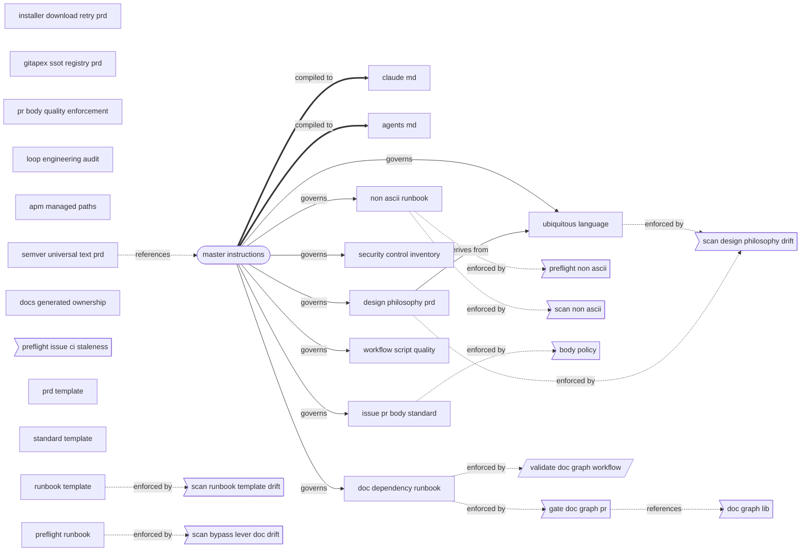

# Document Dependency Graph

Auto-generated from `docs/graph/doc-dependencies.toml`. Do not edit manually.
Source: `python3 scripts/doc_graph_viz.py all-doc`.

Nodes: 31 | Edges: 21 (10 blocking, 11 advisory)

## Legend

### Node shapes

| Shape | Node type |
|---|---|
| `([...])` round | `universal_text` |
| `[...]` rectangle | `prd`, `standard`, `runbook`, `archive` |
| `>[...]` flag | `harness_script` |
| `[/.../]` parallelogram | `harness_workflow` |
| `[...]` rectangle | `compiled_artifact` |

### Edge styles

| Arrow | Edge type | Severity |
|---|---|---|
| `-->\|governs\|` solid | `governs` | blocking |
| `==>\|compiled to\|` double | `compiled_to` | blocking |
| `-->\|derives from\|` solid | `derives_from` | blocking |
| `-.->` dashed | `enforced_by`, `implements`, `references` | advisory |

Blocking edges: co-change required or waived (`doc-graph-waiver: NODE_ID; reason`).
Advisory edges: informational note only.
