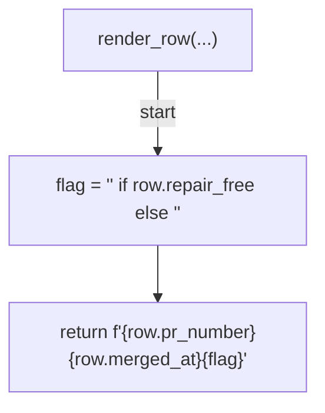
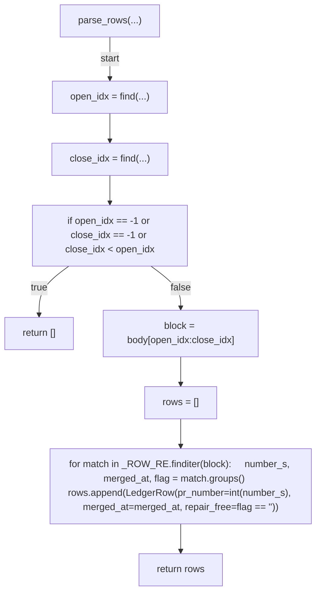
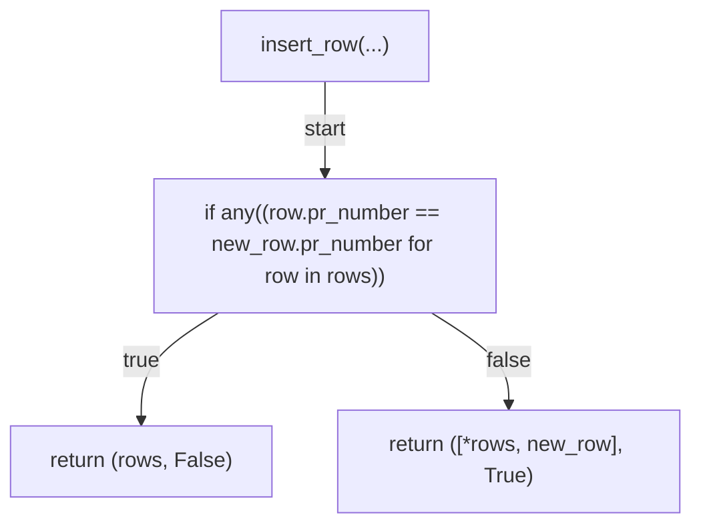
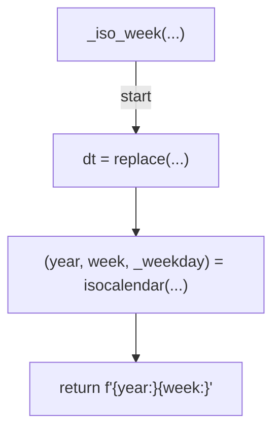
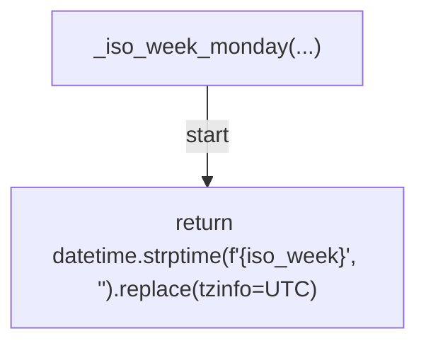
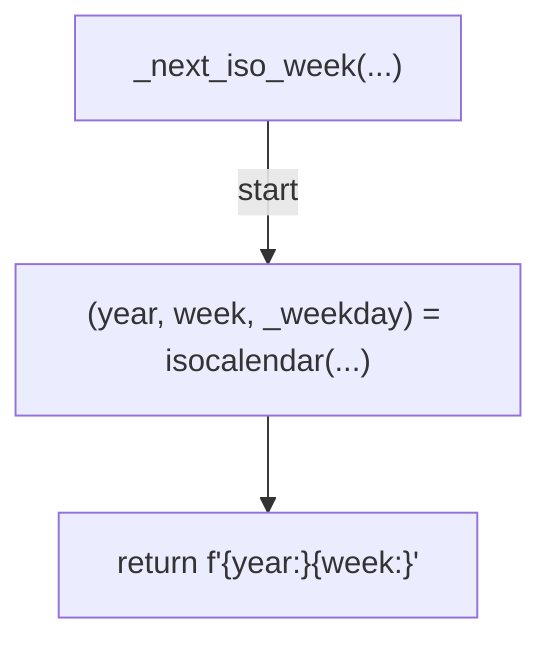
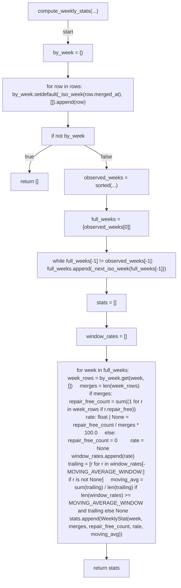
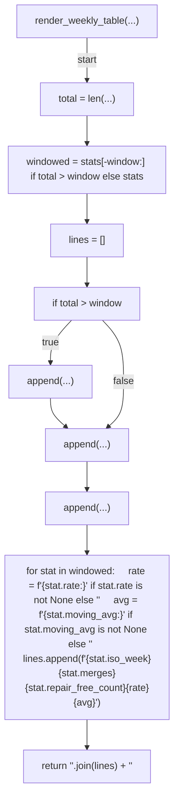
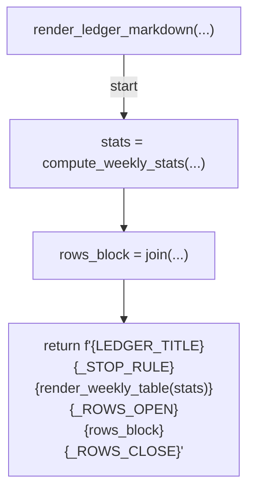
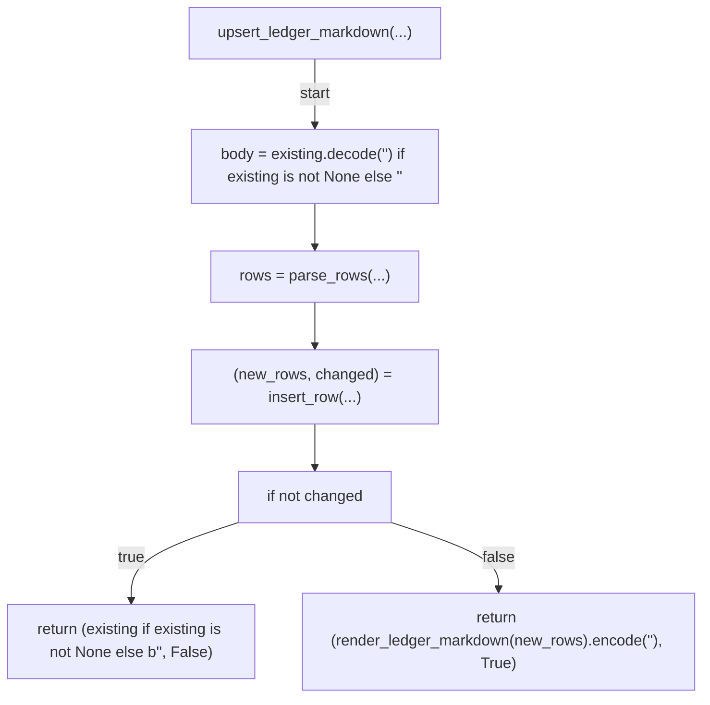

# AST graph: scripts/_auto_retro_ledger.py

This file is generated from `scripts/_auto_retro_ledger.py` by `python3 scripts/script_ast_graph.py all-doc`. Do not edit it by hand: content under `docs/generated/scripts/` is owned by the post-merge automation (refs #1540); update the source script instead.

## render_row(...)

## parse_rows(...)

## insert_row(...)

## _iso_week(...)

## _iso_week_monday(...)

## _next_iso_week(...)

## compute_weekly_stats(...)

## render_weekly_table(...)

## render_ledger_markdown(...)

## upsert_ledger_markdown(...)

