# AST graph: scripts/_auto_retro_parse.py

This file is generated from `scripts/_auto_retro_parse.py` by `python3 scripts/script_ast_graph.py all-doc`. Do not edit it by hand: content under `docs/generated/scripts/` is owned by the post-merge automation (refs #1540); update the source script instead.

## parse_event(...)

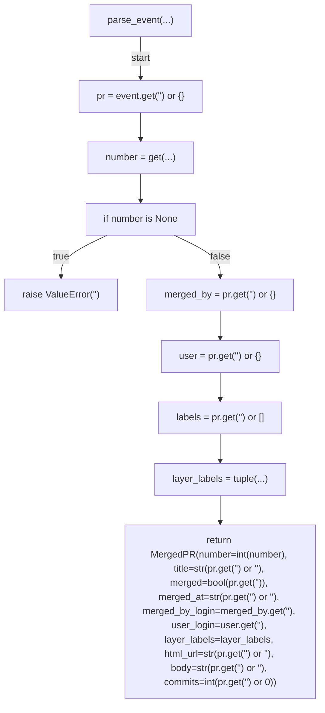

## extract_type_scope(...)

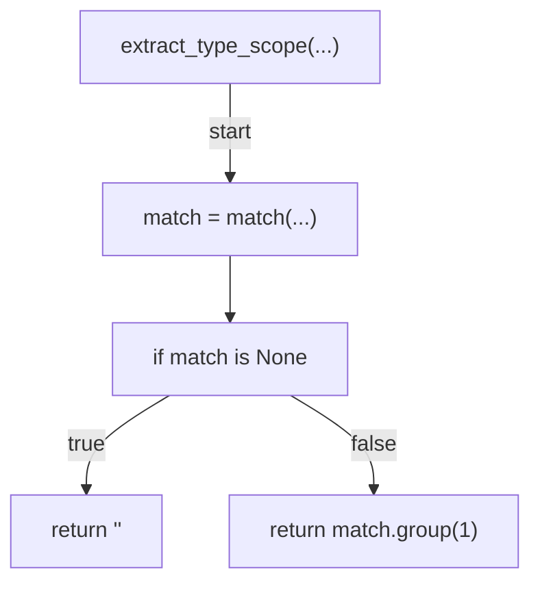

## is_retro_pr(...)

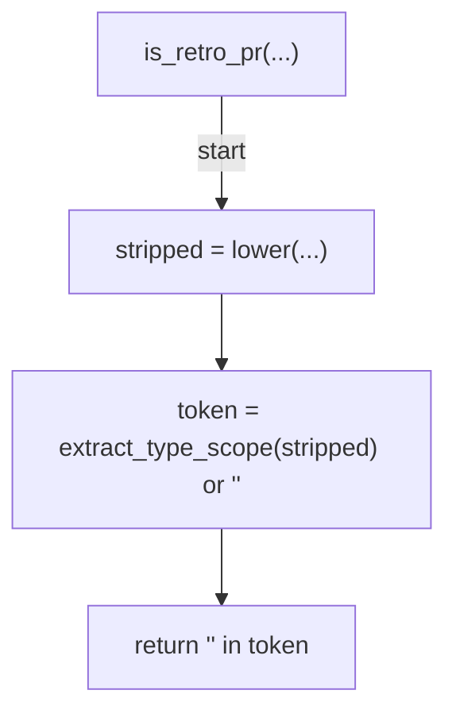

## is_retro_issue_title(...)

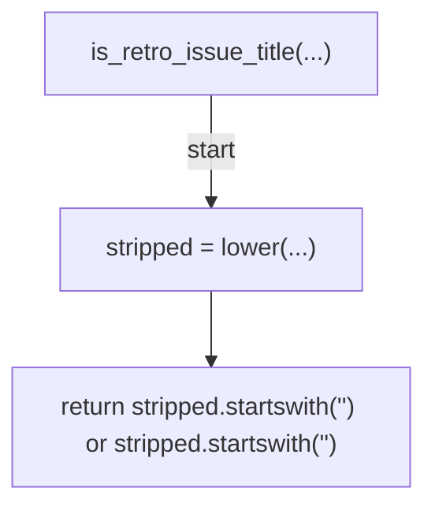

## is_per_pr_retro_title(...)

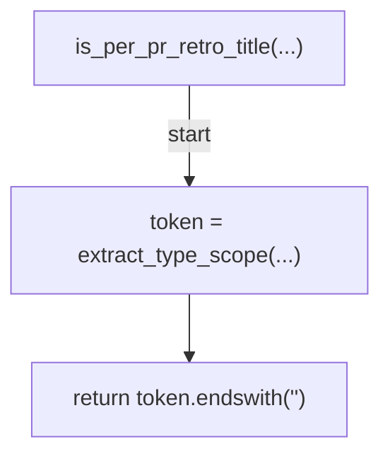

## should_skip(...)

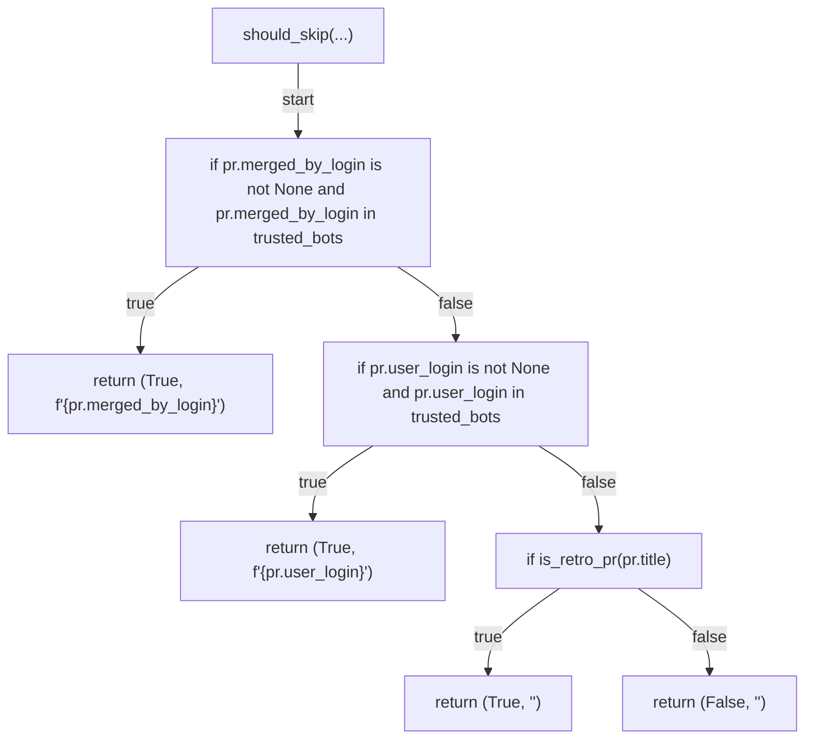

## _count_merge_from_main(...)

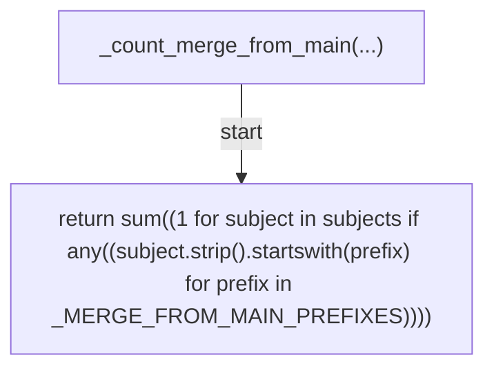

## _is_revert_subject(...)

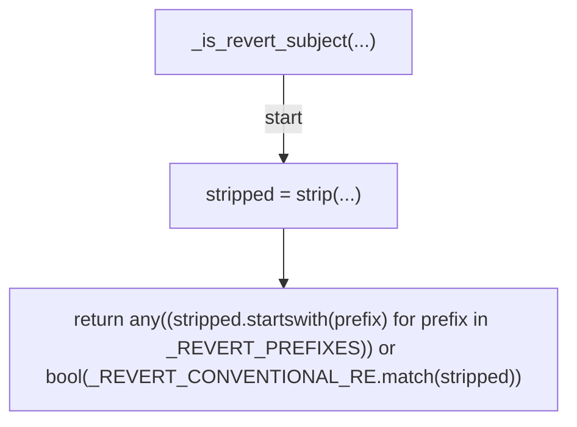

## _count_revert(...)

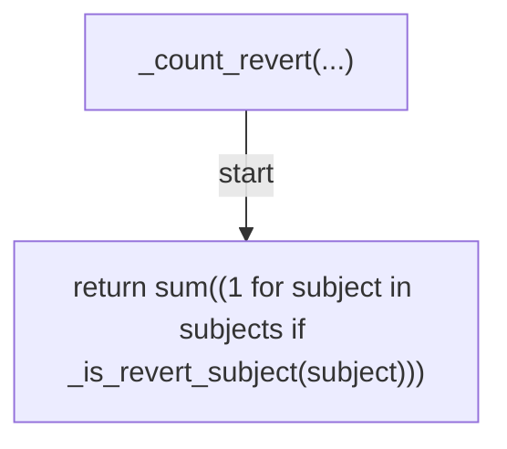

## _slice_section(...)

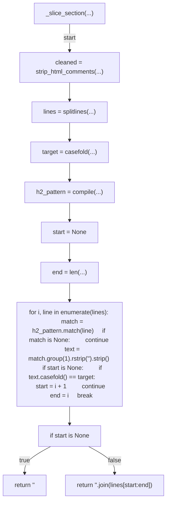

## _result_is_passing(...)

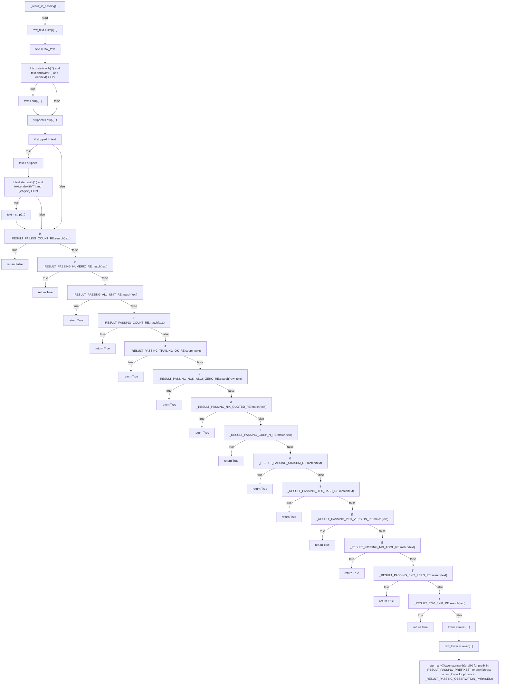

## extract_verification_pairs(...)

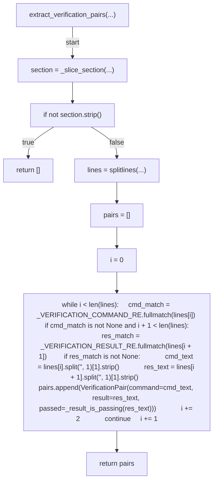

## extract_post_merge_checklist(...)

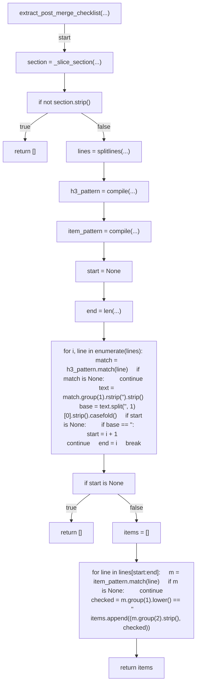

## compute_repair_signals(...)

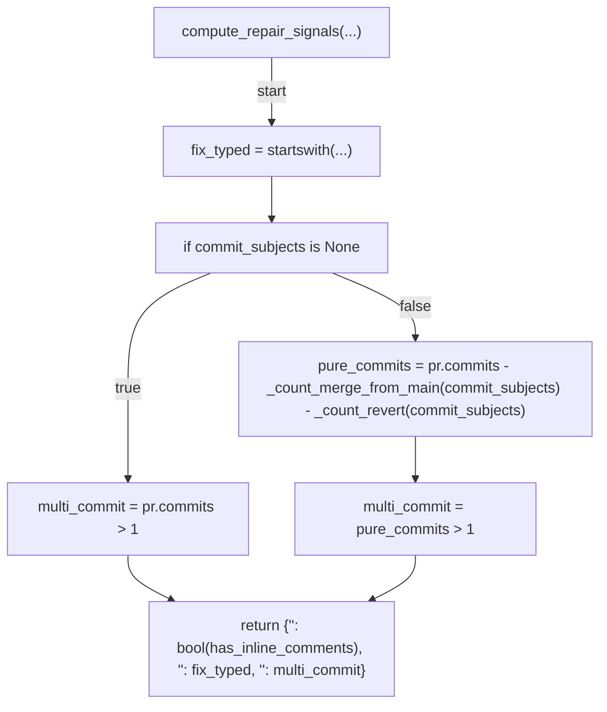

## render_repair_signals(...)

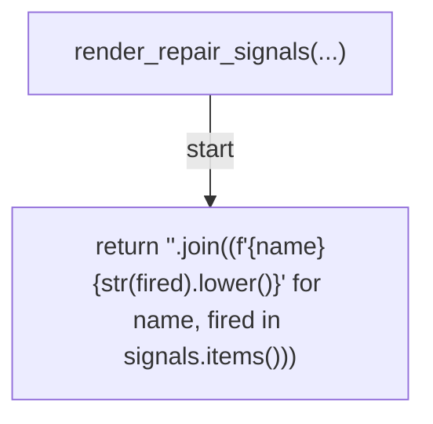

## render_signals_fired_line(...)

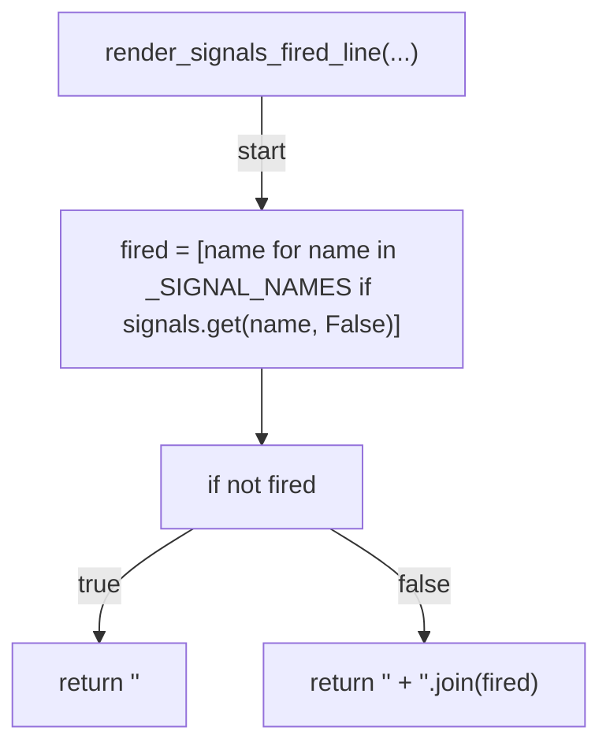

## parse_signals_from_retro_body(...)

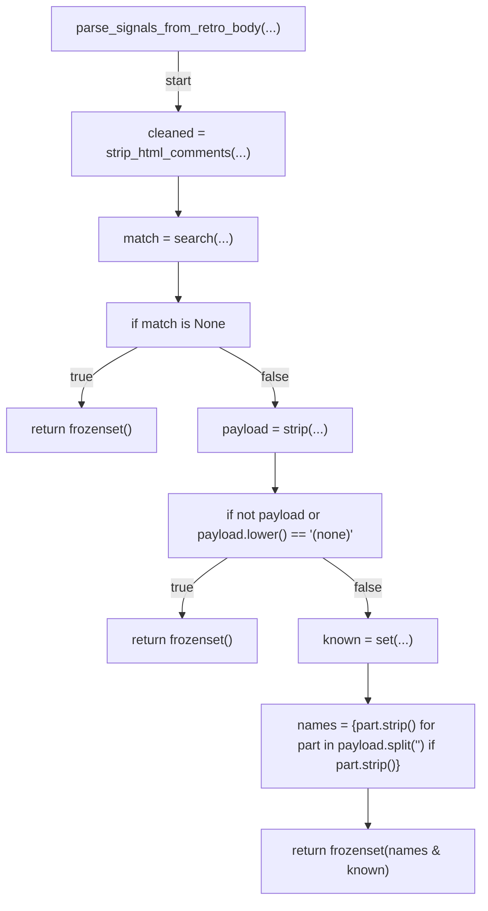
