# AST graph: scripts/_auto_retro_render.py

This file is generated from `scripts/_auto_retro_render.py` by `python3 scripts/script_ast_graph.py all-doc`. Do not edit it by hand: content under `docs/generated/scripts/` is owned by the post-merge automation (refs #1540); update the source script instead.

## build_retro_title(...)

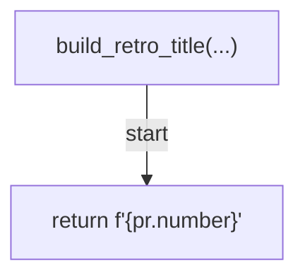

## is_canonical_handoff_retro_title(...)

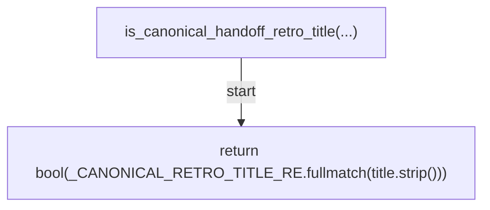

## _escape_table_cell(...)

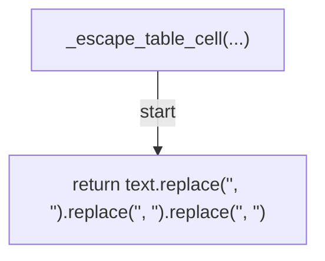

## _repair_history_rows(...)

```mermaid
flowchart TD
    N001["_repair_history_rows(...)"]
    N002["rows = []"]
    N003["rendered_failed = 0"]
    N004["total_failed = 0"]
    N005["for entry in check_runs or []:     conclusion = str(entry.get('<str>') or '<str>')     if conclusion not in _CHECK_RUN_FAIL_CONCLUSIONS:         continue     total_failed += 1     if rendered_failed >= _CHECK_RUN_DISPLAY_CAP:         continue     rendered_failed += 1     name = str(entry.get('<str>') or '<str>')     completed = str(entry.get('<str>') or '<str>')     html_url = str(entry.get('<str>') or '<str>').strip()     summary_raw = entry.get('<str>')     summary = str(summary_raw).strip() if summary_raw else '<str>'     parts = [f'<str>{conclusion}<str>{completed}']     if html_url:         parts.append(f'<str>{html_url}')     if summary:         parts.append(f'<str>{summary}')     detail = '<str>'.join(parts) or _REPAIR_CAUSE_FILL     rows.append(RepairHistoryRow(f'<str>{name}', detail, next_action=_REPAIR_NEXT_ACTION_FILL))"]
    N006["overflow = total_failed - _CHECK_RUN_DISPLAY_CAP"]
    N007["if overflow > 0"]
    N008["append(...)"]
    N009["canonical_fix_index = None"]
    N010["if pr_type == 'fix'"]
    N011["for i, subject in enumerate(commit_subjects):     stripped_i = subject.strip()     if any((stripped_i.startswith(prefix) for prefix in _MERGE_FROM_MAIN_PREFIXES)):         continue     if stripped_i.startswith('<str>'):         canonical_fix_index = i     break"]
    N012["for i, subject in enumerate(commit_subjects):     stripped = subject.strip()     if i == canonical_fix_index:         rows.append(RepairHistoryRow('<str>', f'{_POLICY_ARTIFACT_MARKER}<str>{subject}<str>', policy_artifact=True, next_action='<str>'))         continue     if stripped.startswith('<str>') or stripped.startswith('<str>') or stripped.startswith('<str>'):         rows.append(RepairHistoryRow('<str>', f'{_POLICY_ARTIFACT_MARKER}<str>{subject}<str>', policy_artifact=True, next_action='<str>'))"]
    N013["for subject in commit_subjects:     stripped = subject.strip()     if any((stripped.startswith(prefix) for prefix in _MERGE_FROM_MAIN_PREFIXES)):         rows.append(RepairHistoryRow('<str>', f'{_POLICY_ARTIFACT_MARKER}<str>{subject}<str>', policy_artifact=True, next_action='<str>'))"]
    N014["for subject in commit_subjects:     if _is_revert_subject(subject):         rows.append(RepairHistoryRow('<str>', f'{_POLICY_ARTIFACT_MARKER}<str>{subject}<str>', policy_artifact=True, next_action='<str>'))"]
    N015["if pr_commit_count > 1"]
    N016["append(...)"]
    N017["for pair in verification_pairs or []:     if pair.passed:         continue     rows.append(RepairHistoryRow(f'<str>{pair.command}', f'{_POLICY_ARTIFACT_MARKER}<str>{pair.result}<str>', policy_artifact=True, next_action='<str>'))"]
    N018["return rows"]
    N001 -->|"start"| N002
    N002 --> N003
    N003 --> N004
    N004 --> N005
    N005 --> N006
    N006 --> N007
    N007 -->|"true"| N008
    N008 --> N009
    N007 -->|"false"| N009
    N009 --> N010
    N010 -->|"true"| N011
    N011 --> N012
    N010 -->|"false"| N012
    N012 --> N013
    N013 --> N014
    N014 --> N015
    N015 -->|"true"| N016
    N016 --> N017
    N015 -->|"false"| N017
    N017 --> N018
```

## _has_only_exempt_policy_artifact_rows(...)

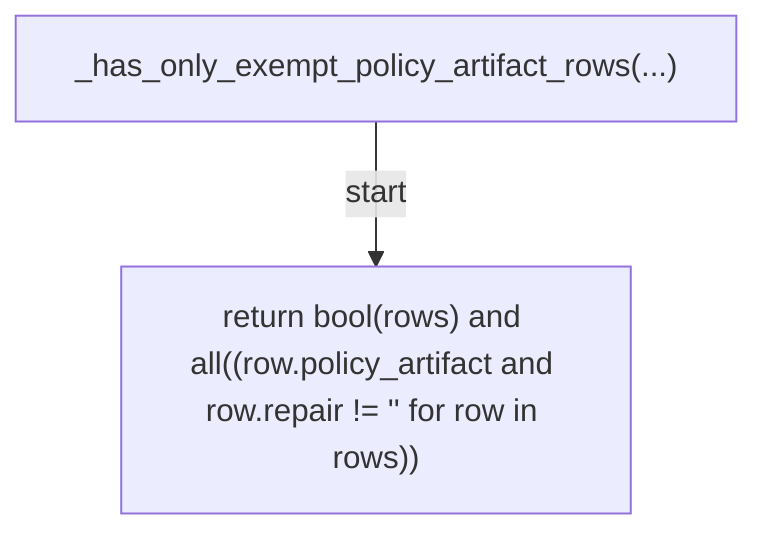

## _build_repair_history_table(...)

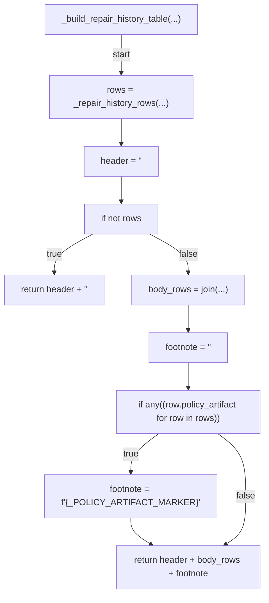

## build_retro_body(...)

```mermaid
flowchart TD
    N001["build_retro_body(...)"]
    N002["type_scope = extract_type_scope(...)"]
    N003["pr_type = type_scope.split('<str>', 1)[0] if type_scope else '<str>'"]
    N004["fallback_note = '<str>'"]
    N005["if not type_scope"]
    N006["fallback_note = '<str>'"]
    N007["layer_str = '<str>'.join(pr.layer_labels) if pr.layer_labels else '<str>'"]
    N008["commits_block = '<str>'.join((f'<str>{subj}' for subj in commit_subjects)) if commit_subjects else '<str>'"]
    N009["repair_table = _build_repair_history_table(...)"]
    N010["triage_date = pr.merged_at[:10] if pr.merged_at else '<str>'"]
    N011["positive_control = '<str>' in repair_table"]
    N012["proposed_work_tail = '<str>'"]
    N013["verification_block = '<str>'"]
    N014["acceptance_block = '<str>'"]
    N015["if positive_control"]
    N016["proposed_work_tail = '<str>'"]
    N017["verification_block = '<str>'"]
    N018["acceptance_block = '<str>'"]
    N019["return f'<str>{pr.number}<str>{pr.title}<str>{pr.number}<str>{pr.title}<str>{pr.html_url}<str>{pr.merged_at}<str>{pr.merged_by_login or '<str>'}<str>{pr.user_login or '<str>'}<str>{layer_str}<str>{render_signals_fired_line(signals or {})}<str>{commits_block}<str>{fallback_note}<str>{repair_table}<str>{proposed_work_tail}<str>{verification_block}<str>{acceptance_block}<str>{pr.number}<str>{triage_date}<str>'"]
    N001 -->|"start"| N002
    N002 --> N003
    N003 --> N004
    N004 --> N005
    N005 -->|"true"| N006
    N006 --> N007
    N005 -->|"false"| N007
    N007 --> N008
    N008 --> N009
    N009 --> N010
    N010 --> N011
    N011 --> N012
    N012 --> N013
    N013 --> N014
    N014 --> N015
    N015 -->|"true"| N016
    N016 --> N017
    N017 --> N018
    N018 --> N019
    N015 -->|"false"| N019
```

## verify_retro_repair_completeness(...)

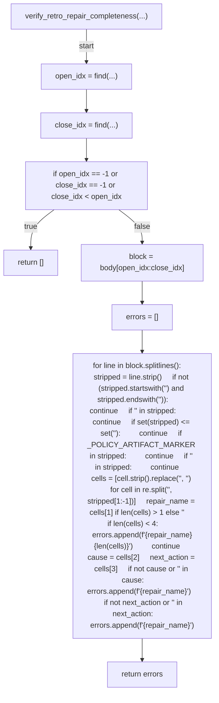

## find_target_retro_from_refs(...)

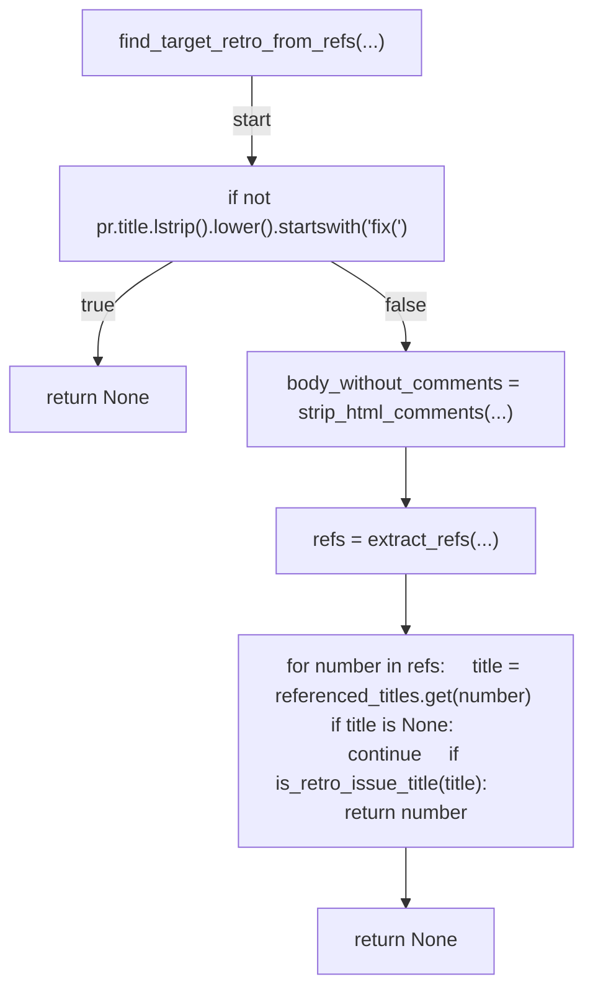

## render_appended_row(...)

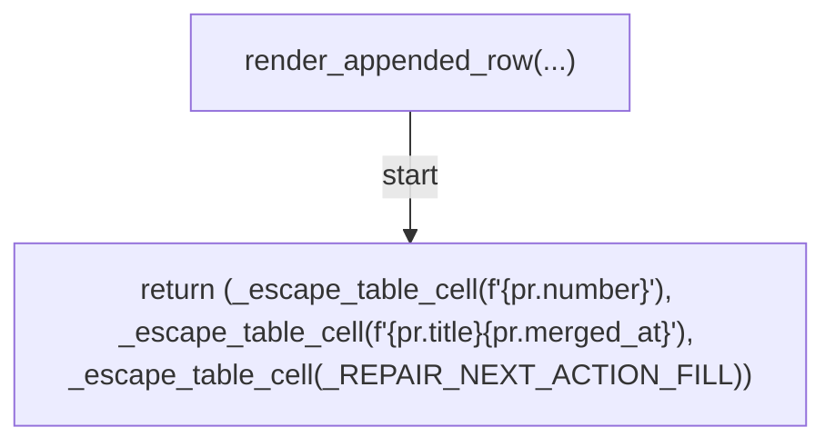

## _next_table_index(...)

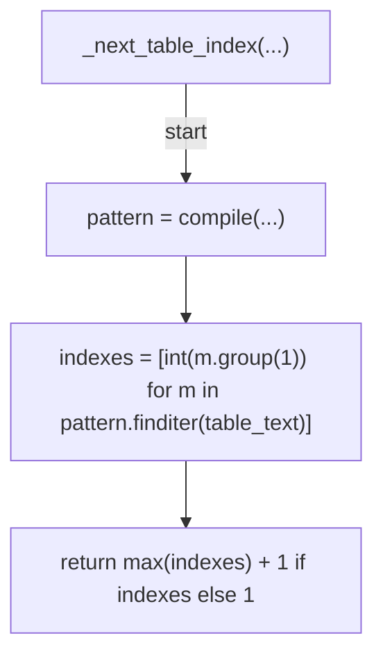

## _insert_appended_row(...)

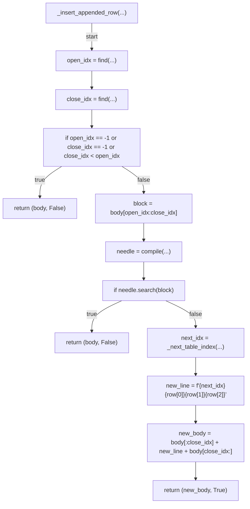

## find_existing_retro(...)

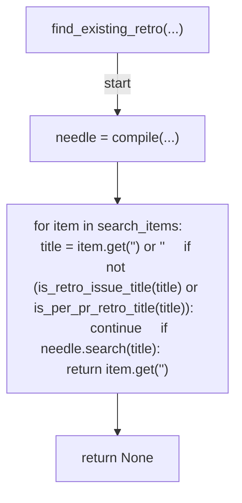

## is_retro_untouched(...)

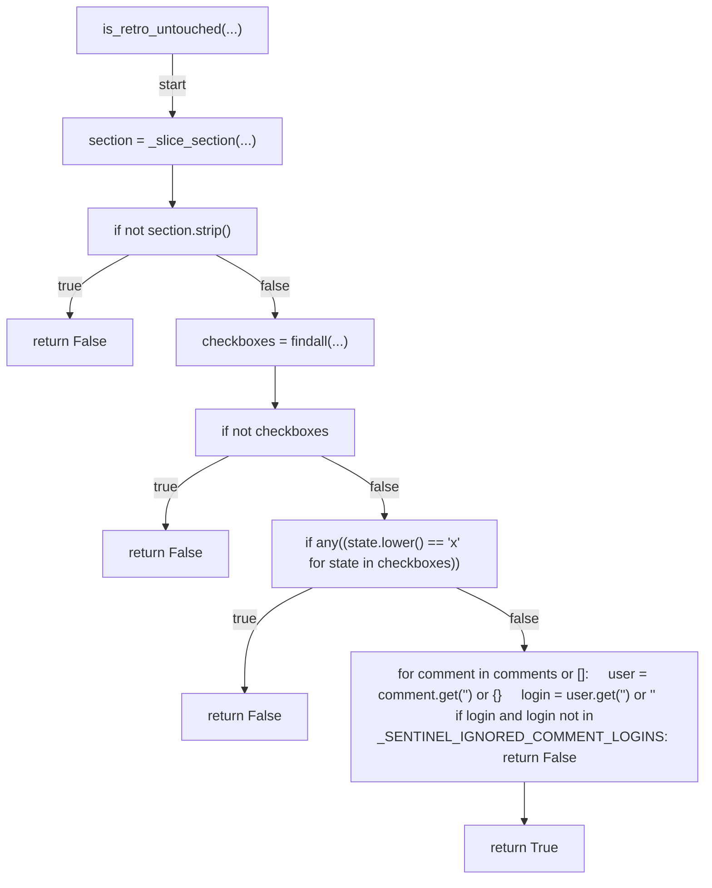

## is_retro_age_exceeded(...)

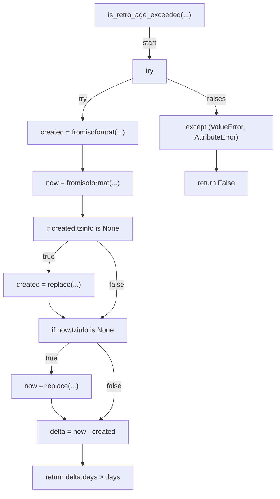

## issue_labels(...)

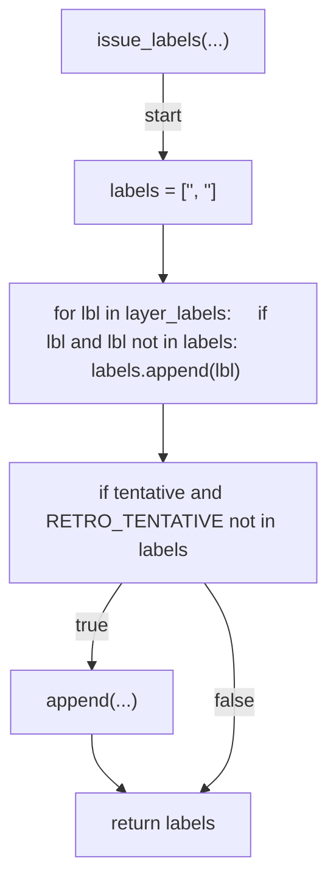
