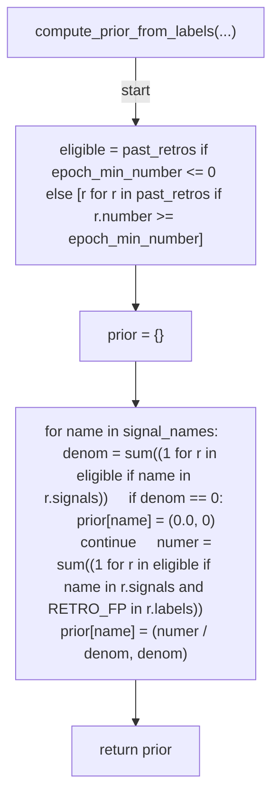
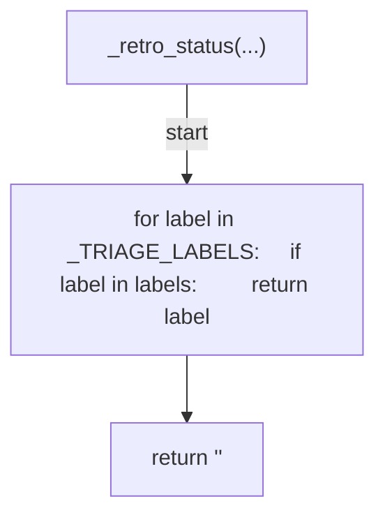
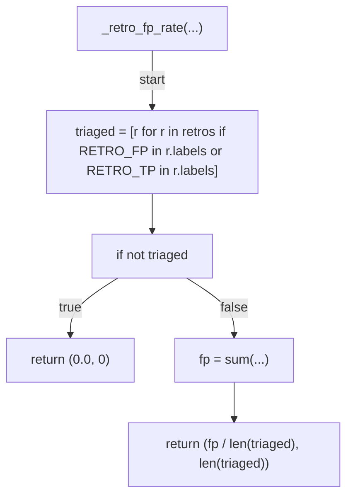
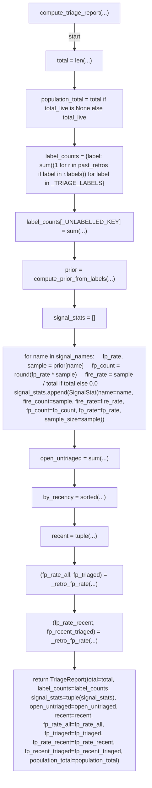
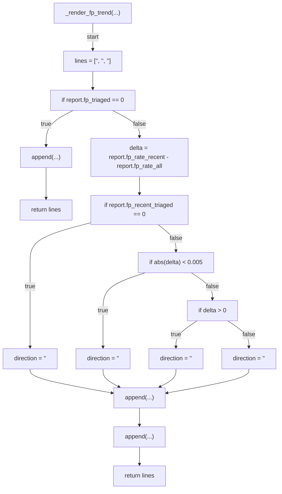
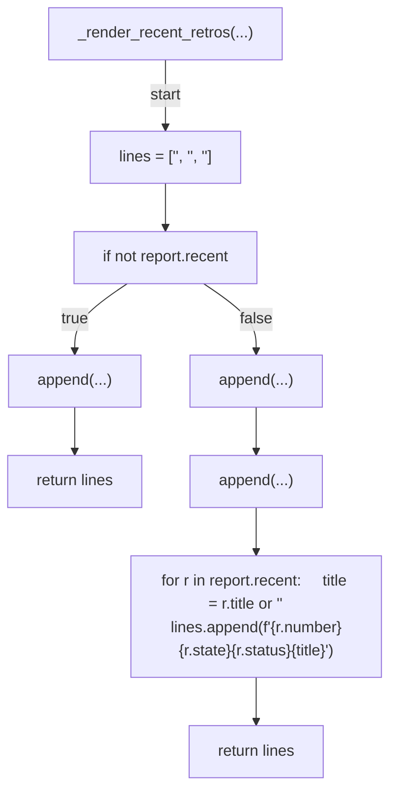
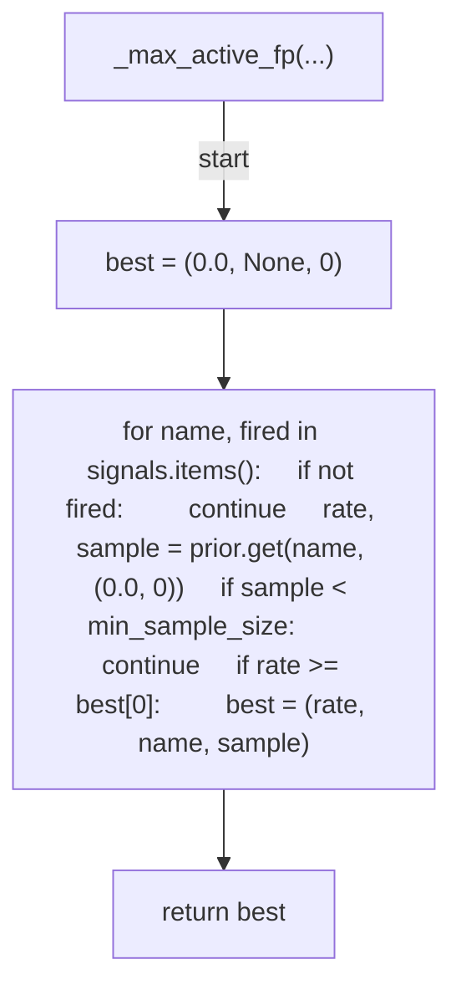
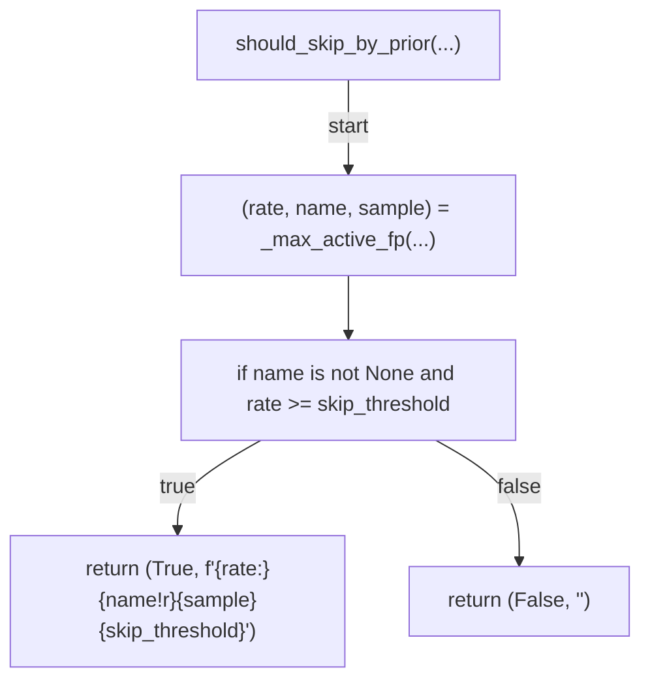
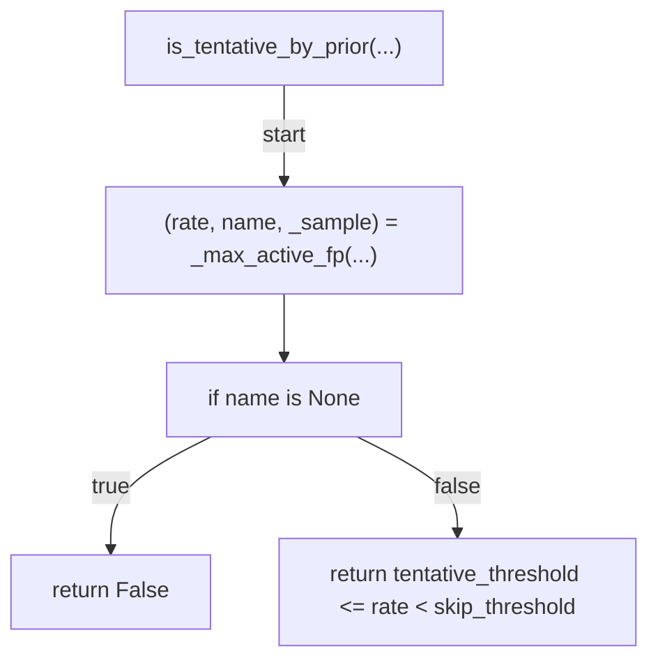

# AST graph: scripts/_auto_retro_triage.py

This file is generated from `scripts/_auto_retro_triage.py` by `python3 scripts/script_ast_graph.py all-doc`. Do not edit it by hand: content under `docs/generated/scripts/` is owned by the post-merge automation (refs #1540); update the source script instead.

## compute_prior_from_labels(...)

## _retro_status(...)

## _retro_fp_rate(...)

## compute_triage_report(...)

## render_triage_report_markdown(...)

```mermaid
flowchart TD
    N001["render_triage_report_markdown(...)"]
    N002["observed_line = f'<str>{report.total}<str>'"]
    N003["if report.truncated"]
    N004["observed_line = f'<str>{report.total}<str>{report.population_total}<str>'"]
    N005["lines = ['<str>', '<str>', '<str>', '<str>', observed_line, '<str>', f'<str>{report.open_untriaged}<str>', '<str>', '<str>', '<str>']"]
    N006["if report.anomalies"]
    N007["append(...)"]
    N008["append(...)"]
    N009["for stat in report.anomalies:     lines.append(f'<str>{stat.name}<str>{stat.fp_rate:<str>}<str>{stat.sample_size}<str>')"]
    N010["append(...)"]
    N011["extend(...)"]
    N012["if report.total == 0"]
    N013["append(...)"]
    N014["append(...)"]
    N015["append(...)"]
    N016["append(...)"]
    N017["for label in (*_TRIAGE_LABELS, _UNLABELLED_KEY):     lines.append(f'<str>{label}<str>{report.label_counts[label]}')"]
    N018["append(...)"]
    N019["extend(...)"]
    N020["for stat in report.signal_stats:     marker = '<str>' if stat.is_anomaly else '<str>'     lines.append(f'<str>{stat.name}<str>{stat.fire_count}<str>{stat.fire_rate:<str>}<str>{stat.fp_count}<str>{stat.fp_rate:<str>}<str>{stat.sample_size}<str>{marker}<str>')"]
    N021["extend(...)"]
    N022["extend(...)"]
    N023["return '<str>'.join(lines) + '<str>'"]
    N001 -->|"start"| N002
    N002 --> N003
    N003 -->|"true"| N004
    N004 --> N005
    N003 -->|"false"| N005
    N005 --> N006
    N006 -->|"true"| N007
    N007 --> N008
    N008 --> N009
    N006 -->|"false"| N010
    N009 --> N011
    N010 --> N011
    N011 --> N012
    N012 -->|"true"| N013
    N012 -->|"false"| N014
    N014 --> N015
    N015 --> N016
    N016 --> N017
    N017 --> N018
    N013 --> N019
    N018 --> N019
    N019 --> N020
    N020 --> N021
    N021 --> N022
    N022 --> N023
```

## _render_fp_trend(...)

## _render_recent_retros(...)

## _max_active_fp(...)

## should_skip_by_prior(...)

## is_tentative_by_prior(...)

