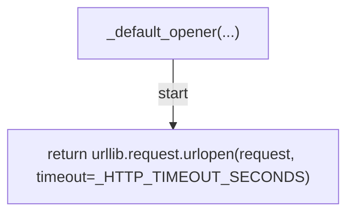
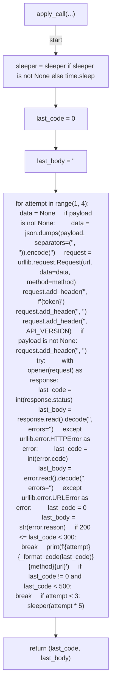
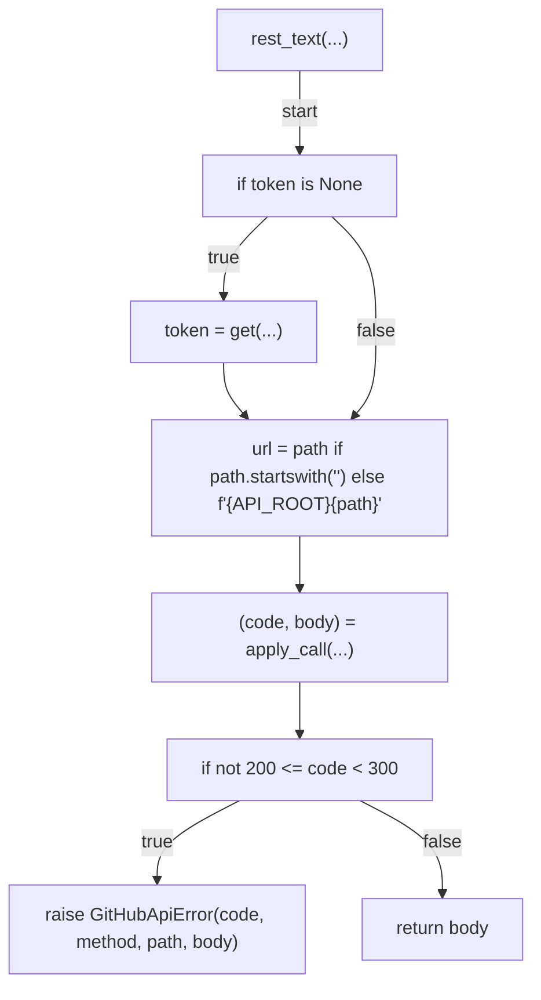
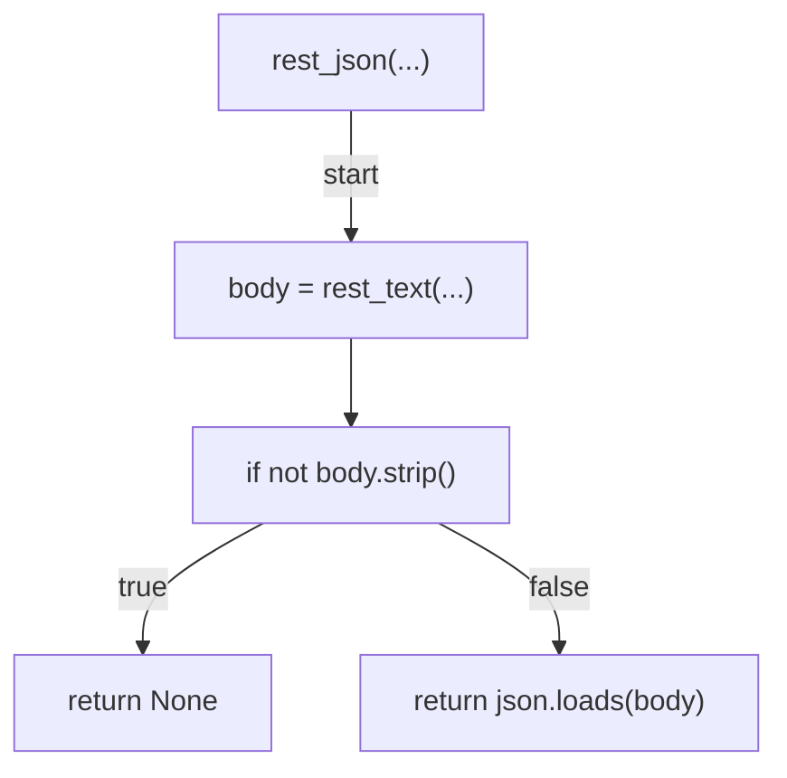
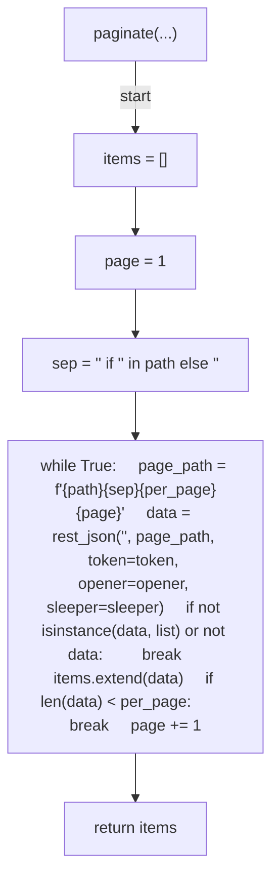
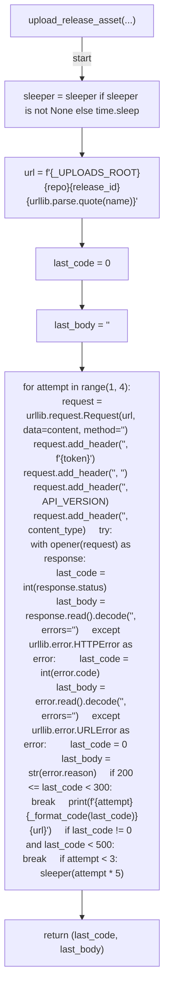
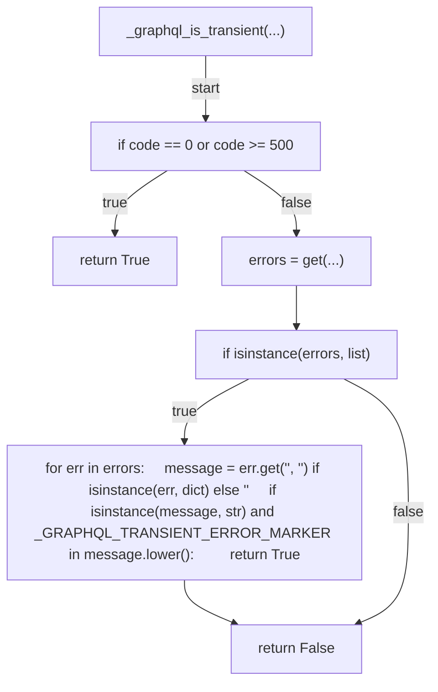
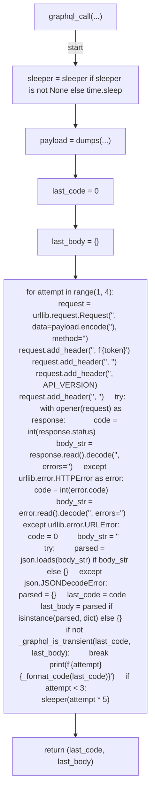
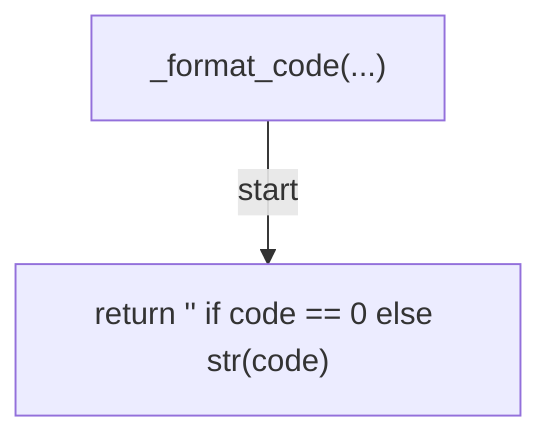

# AST graph: scripts/_github_api.py

This file is generated from `scripts/_github_api.py` by `python3 scripts/script_ast_graph.py all-doc`. Do not edit it by hand: content under `docs/generated/scripts/` is owned by the post-merge automation (refs #1540); update the source script instead.

## _default_opener(...)

## apply_call(...)

## rest_text(...)

## rest_json(...)

## paginate(...)

## upload_release_asset(...)

## _graphql_is_transient(...)

## graphql_call(...)

## _format_code(...)

