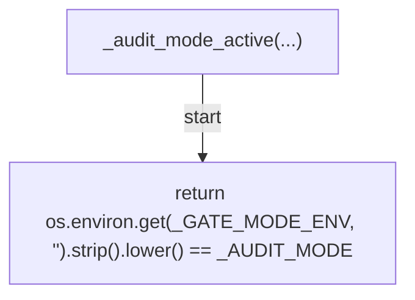
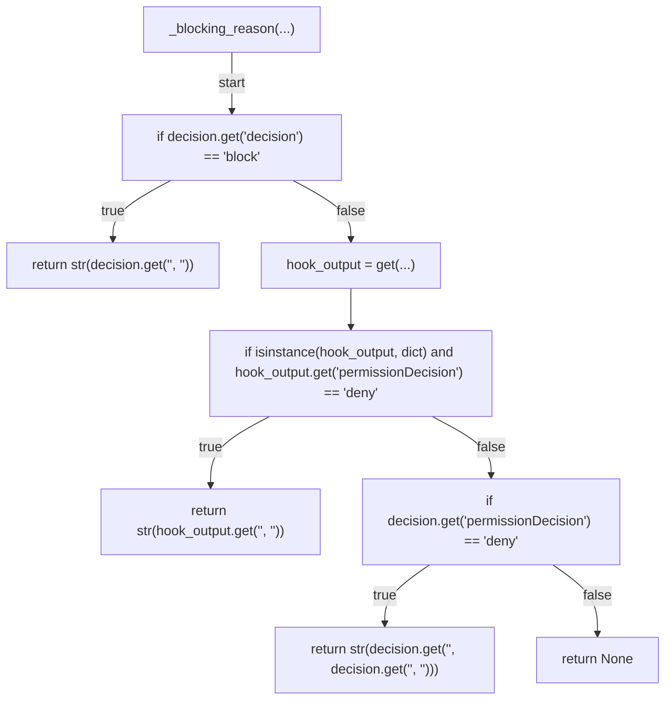
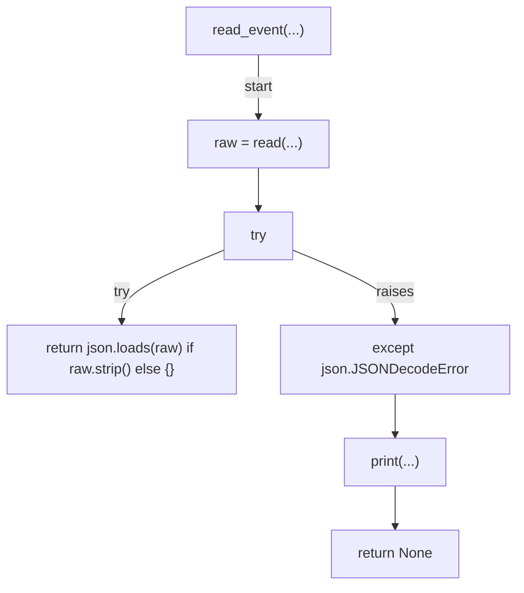
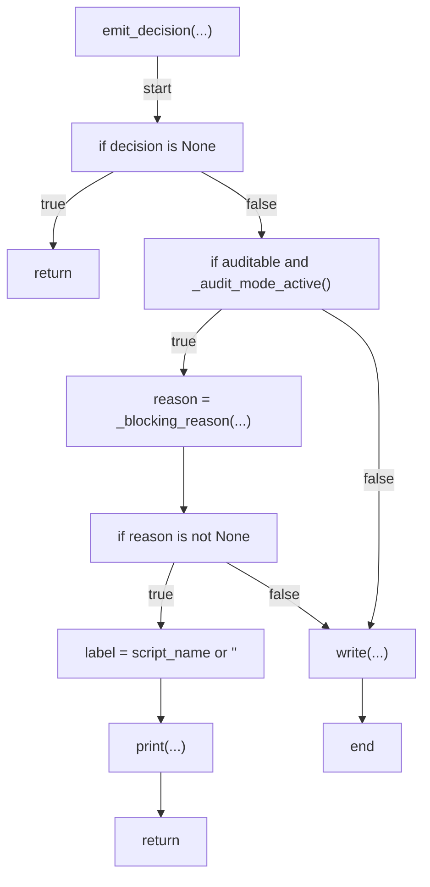
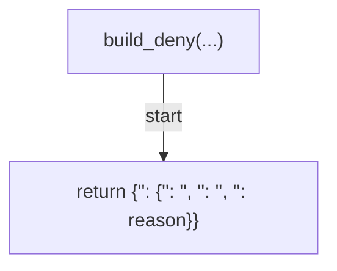
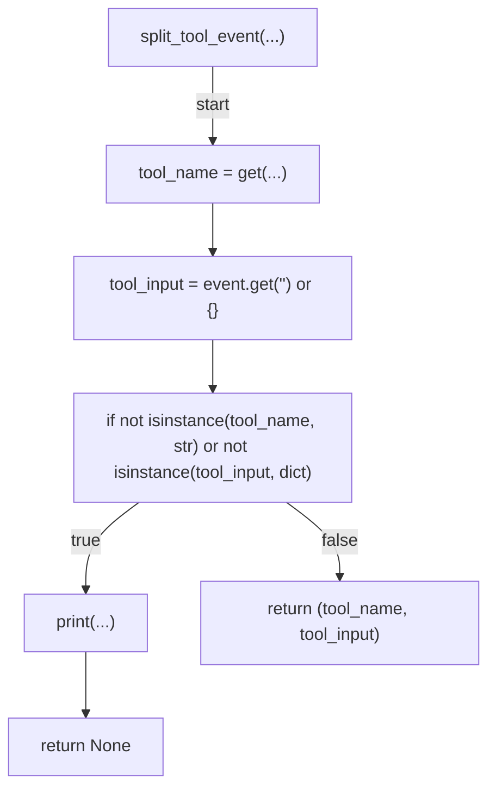
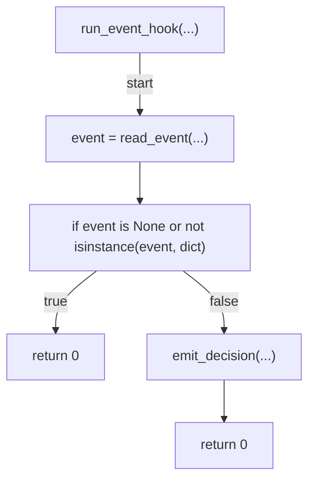
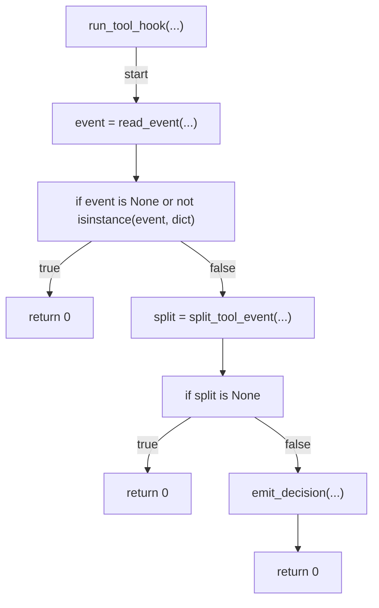

# AST graph: scripts/_hook_runtime.py

This file is generated from `scripts/_hook_runtime.py` by `python3 scripts/script_ast_graph.py all-doc`. Do not edit it by hand: content under `docs/generated/scripts/` is owned by the post-merge automation (refs #1540) -- update the source script instead.

## _audit_mode_active(...)

## _blocking_reason(...)

## read_event(...)

## emit_decision(...)

## build_deny(...)

## split_tool_event(...)

## run_event_hook(...)

## run_tool_hook(...)

