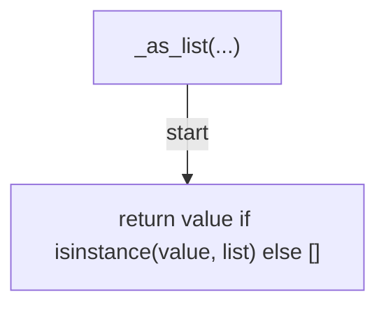
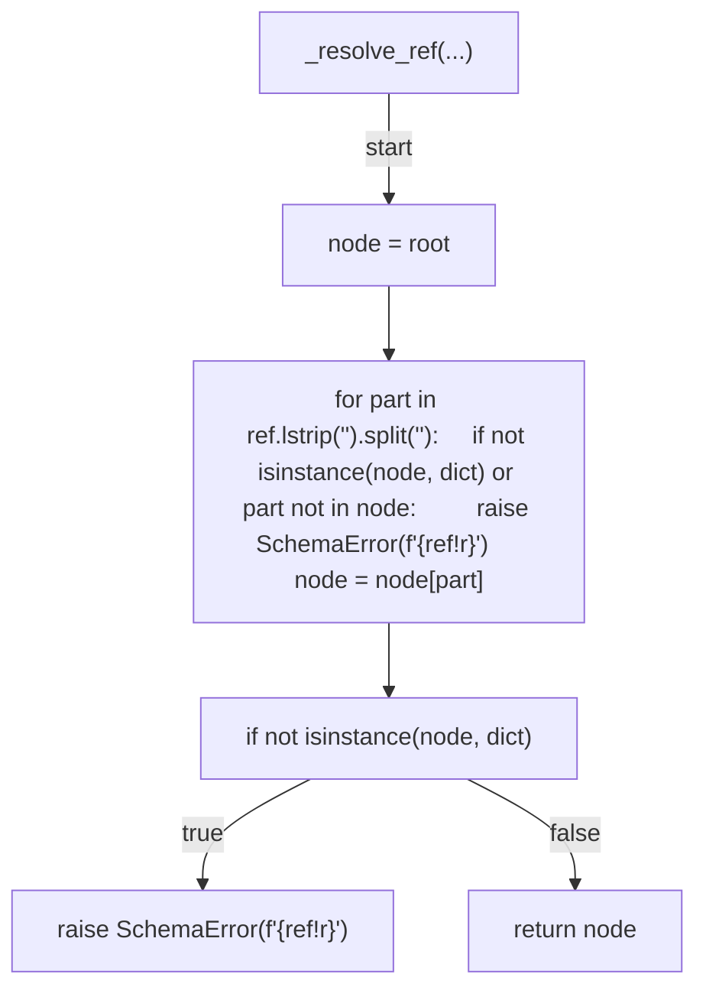
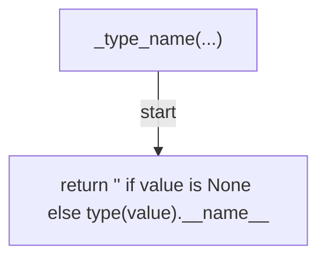
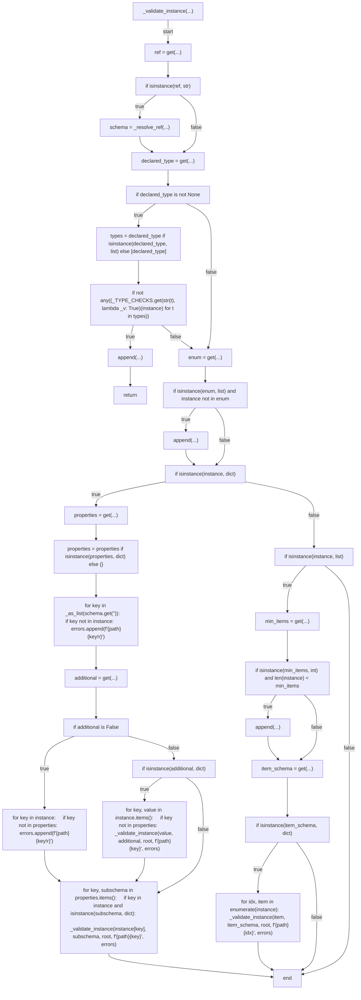
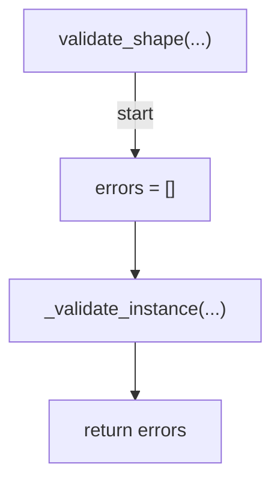

# AST graph: scripts/_json_schema_subset.py

This file is generated from `scripts/_json_schema_subset.py` by `python3 scripts/script_ast_graph.py all-doc`. Do not edit it by hand: content under `docs/generated/scripts/` is owned by the post-merge automation (refs #1540); update the source script instead.

## _as_list(...)

## _resolve_ref(...)

## _type_name(...)

## _validate_instance(...)

## validate_shape(...)

