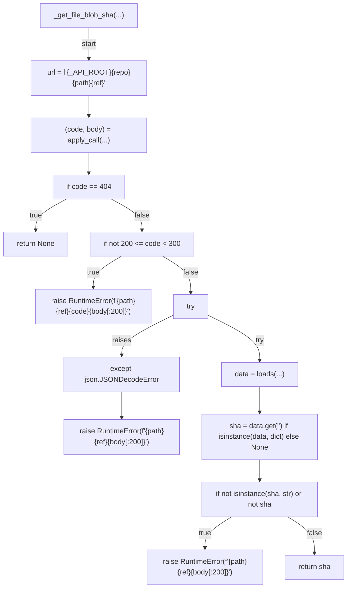
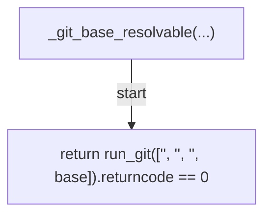
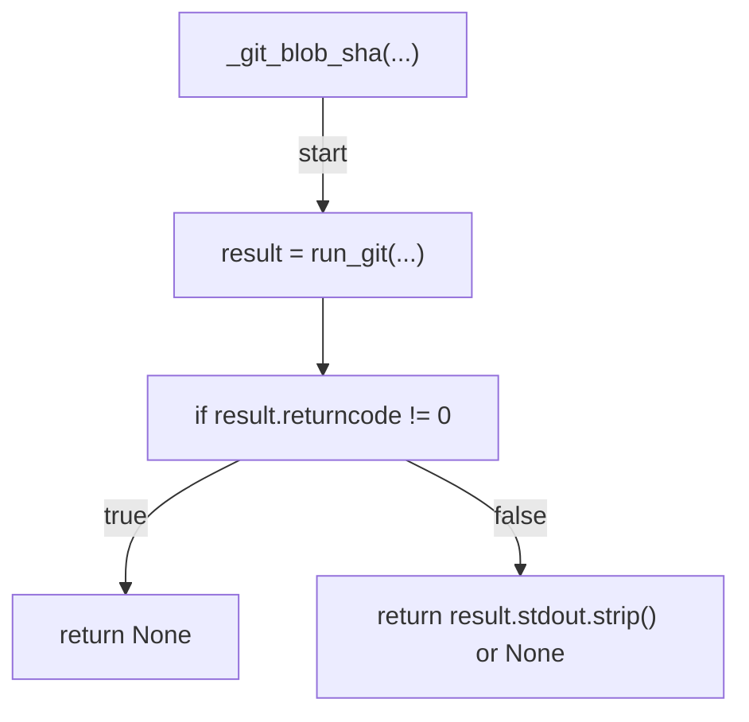
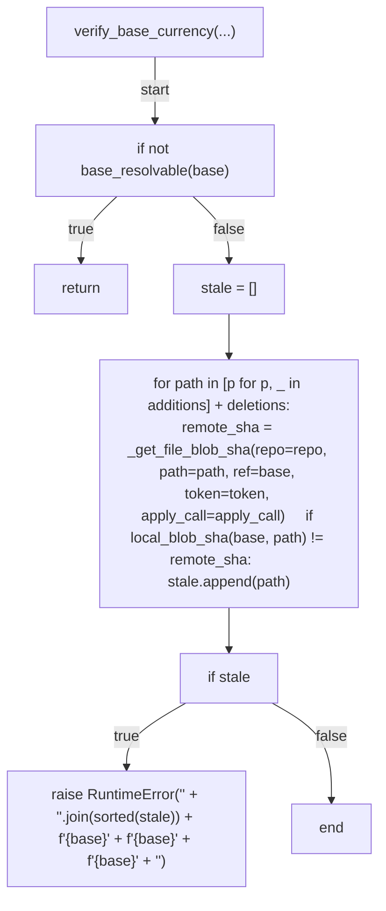

# AST graph: scripts/_pr_base_currency.py

This file is generated from `scripts/_pr_base_currency.py` by `python3 scripts/script_ast_graph.py all-doc`. Do not edit it by hand: content under `docs/generated/scripts/` is owned by the post-merge automation (refs #1540); update the source script instead.

## _get_file_blob_sha(...)

## _git_base_resolvable(...)

## _git_blob_sha(...)

## verify_base_currency(...)

