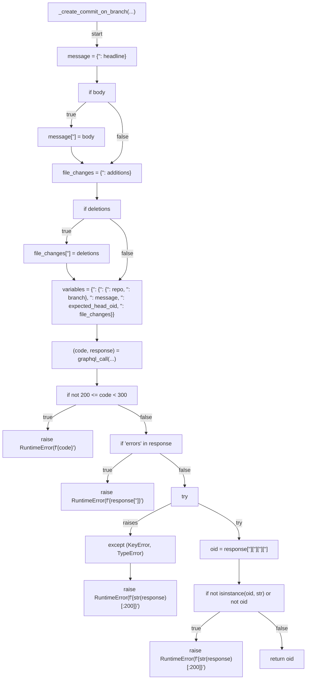
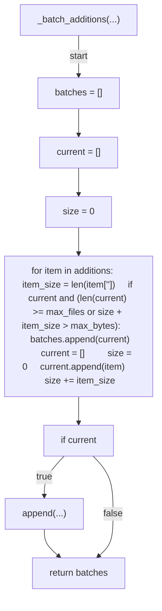
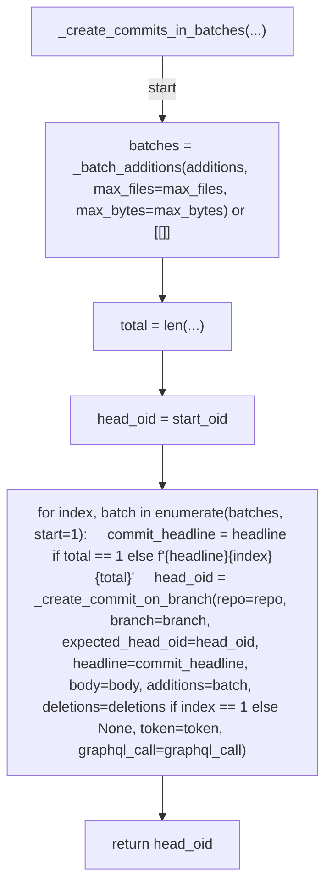

# AST graph: scripts/_pr_commit_batch.py

This file is generated from `scripts/_pr_commit_batch.py` by `python3 scripts/script_ast_graph.py all-doc`. Do not edit it by hand: content under `docs/generated/scripts/` is owned by the post-merge automation (refs #1540) -- update the source script instead.

## _create_commit_on_branch(...)

## _batch_additions(...)

## _create_commits_in_batches(...)

