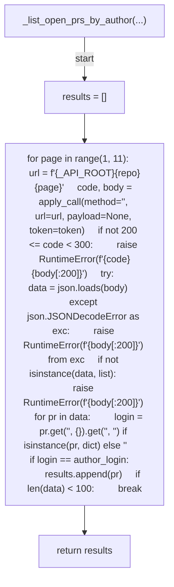
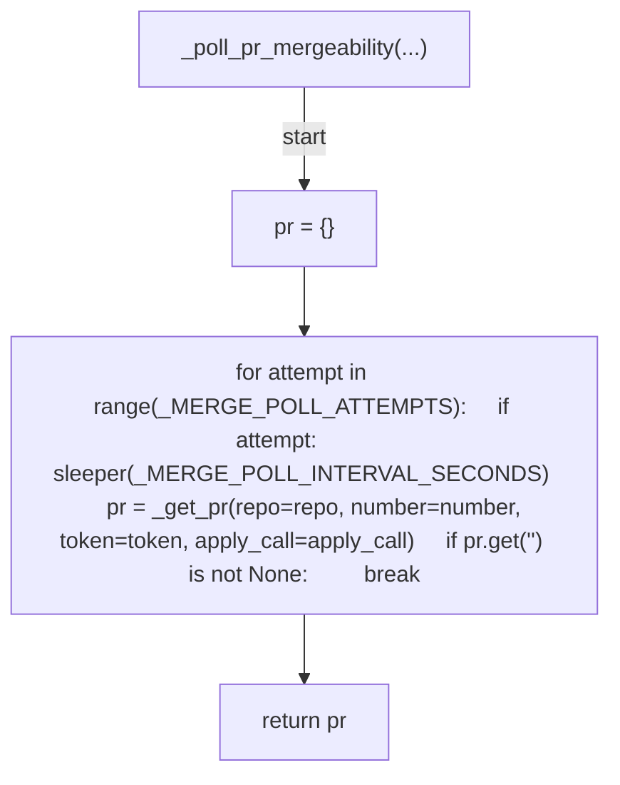
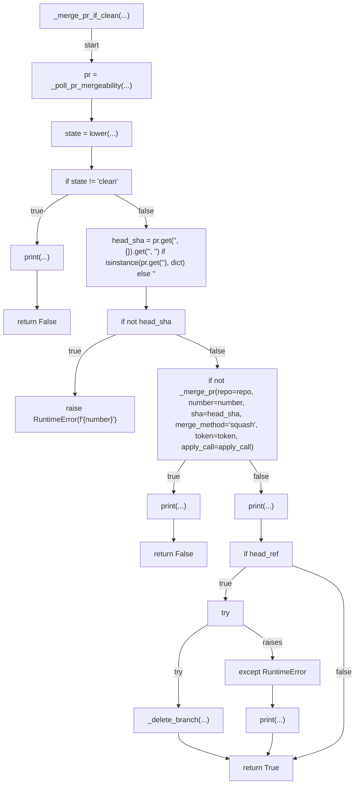

# AST graph: scripts/_pr_merge.py

This file is generated from `scripts/_pr_merge.py` by `python3 scripts/script_ast_graph.py all-doc`. Do not edit it by hand: content under `docs/generated/scripts/` is owned by the post-merge automation (refs #1540) -- update the source script instead.

## _list_open_prs_by_author(...)

## _poll_pr_mergeability(...)

## _merge_pr_if_clean(...)

