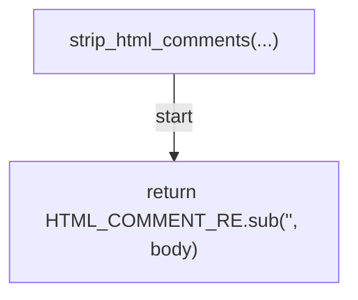
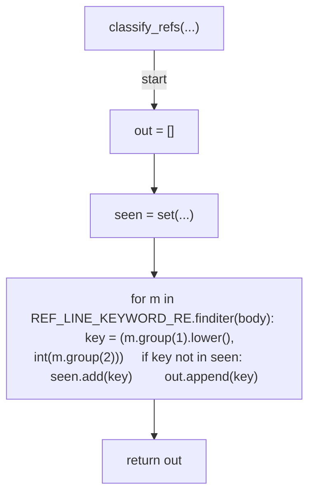
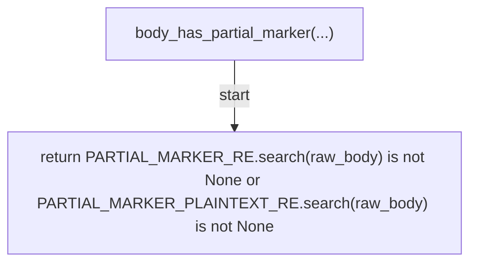
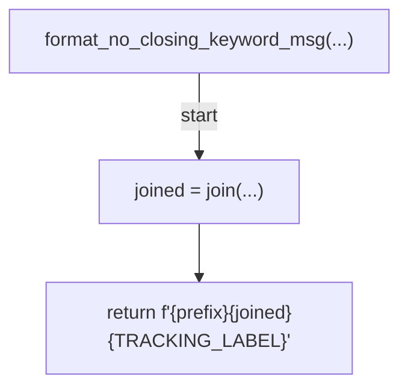

# AST graph: scripts/_ref_classifier.py

This file is generated from `scripts/_ref_classifier.py` by `python3 scripts/script_ast_graph.py all-doc`. Do not edit it by hand: content under `docs/generated/scripts/` is owned by the post-merge automation (refs #1540); update the source script instead.

## strip_html_comments(...)

## classify_refs(...)

## body_has_partial_marker(...)

## format_no_closing_keyword_msg(...)

