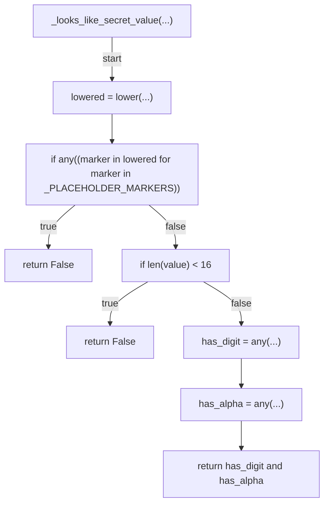
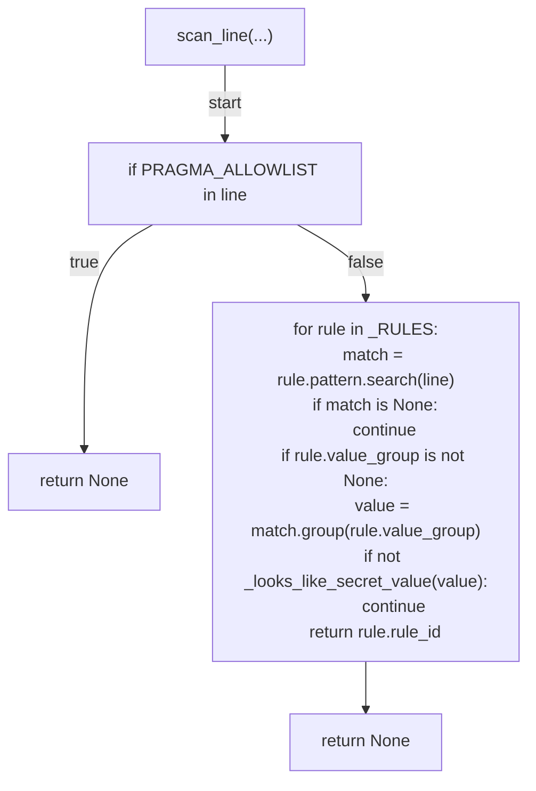
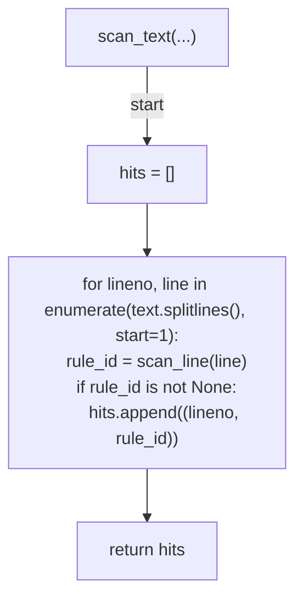

# AST graph: scripts/_secret_patterns.py

This file is generated from `scripts/_secret_patterns.py` by `python3 scripts/script_ast_graph.py all-doc`. Do not edit it by hand: content under `docs/generated/scripts/` is owned by the post-merge automation (refs #1540) -- update the source script instead.

## _looks_like_secret_value(...)

## scan_line(...)

## scan_text(...)

