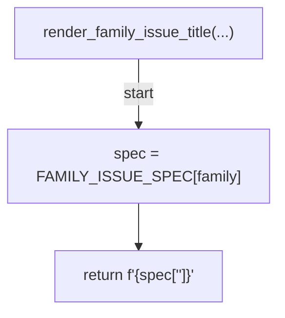
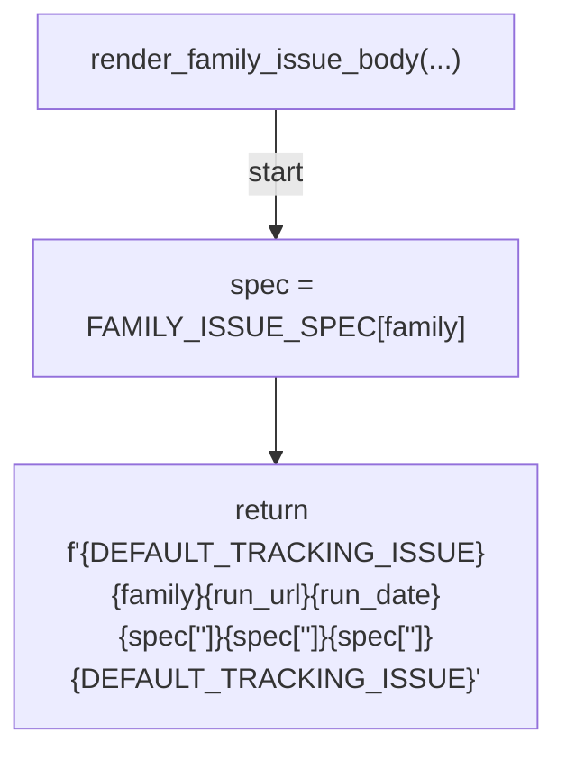
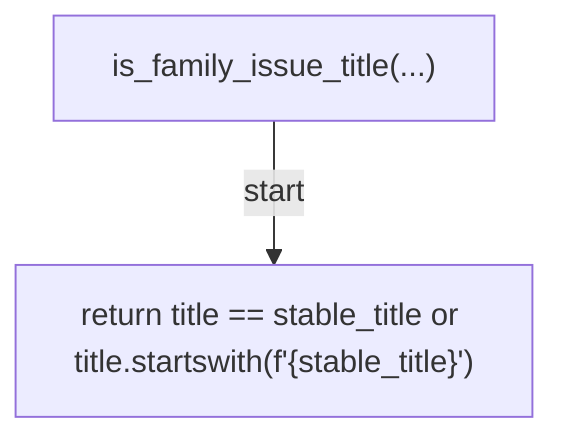
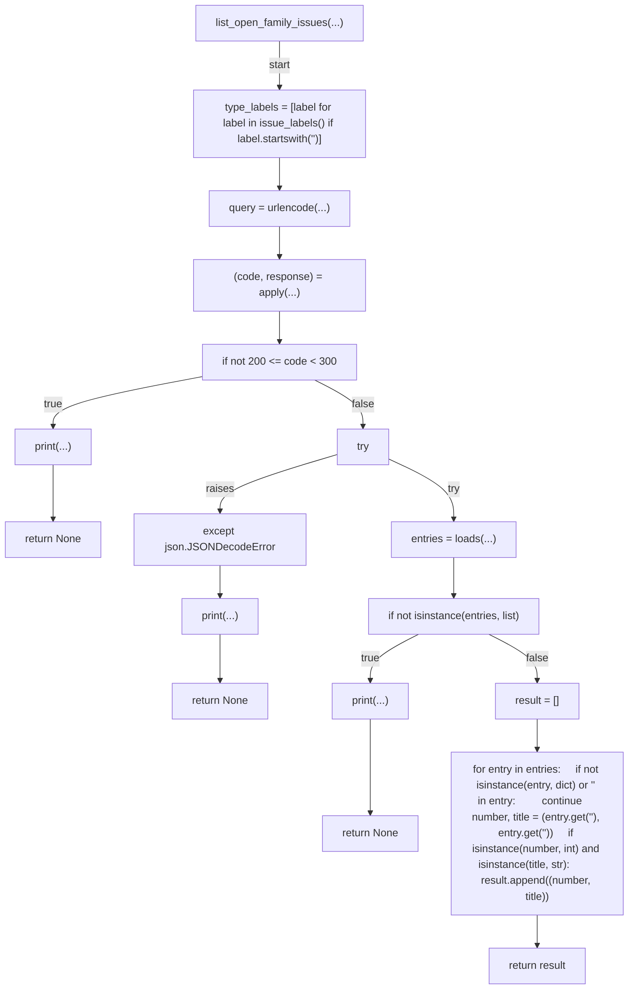
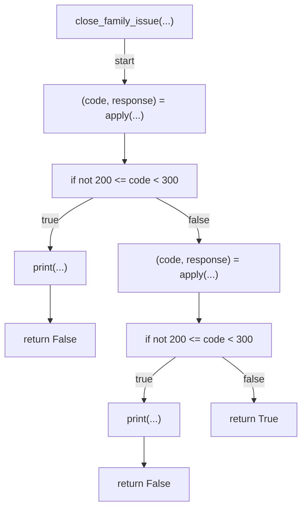
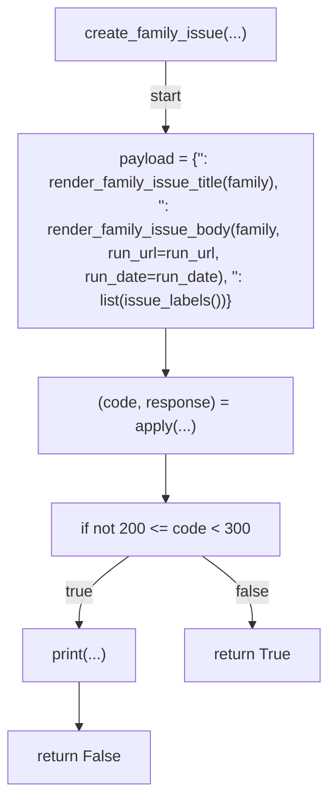
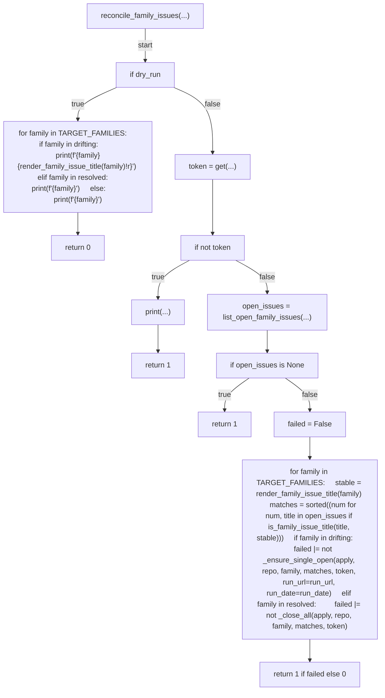
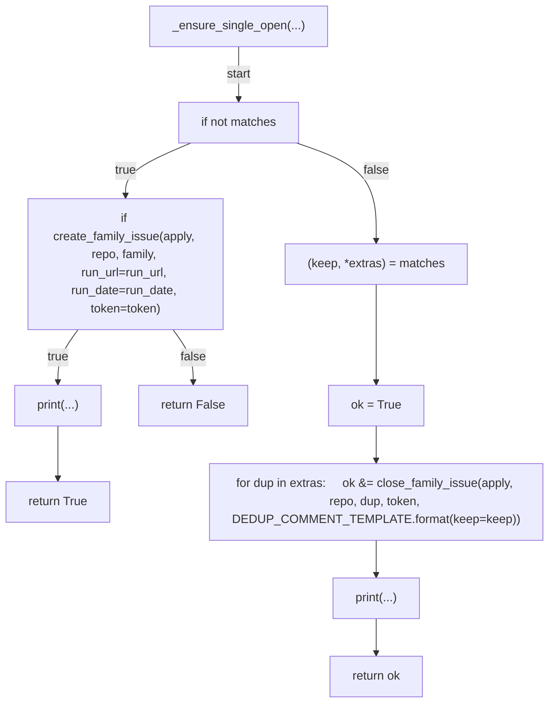
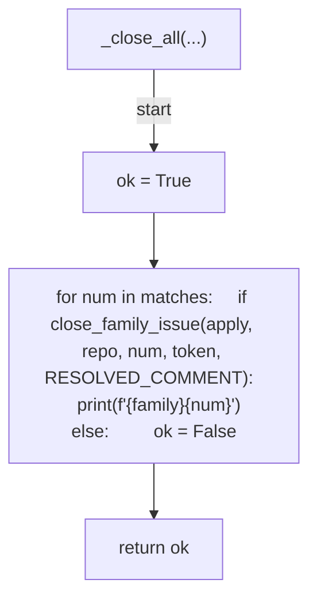

# AST graph: scripts/_security_drift_issues.py

This file is generated from `scripts/_security_drift_issues.py` by `python3 scripts/script_ast_graph.py all-doc`. Do not edit it by hand: content under `docs/generated/scripts/` is owned by the post-merge automation (refs #1540); update the source script instead.

## render_family_issue_title(...)

## render_family_issue_body(...)

## is_family_issue_title(...)

## list_open_family_issues(...)

## close_family_issue(...)

## create_family_issue(...)

## reconcile_family_issues(...)

## _ensure_single_open(...)

## _close_all(...)

