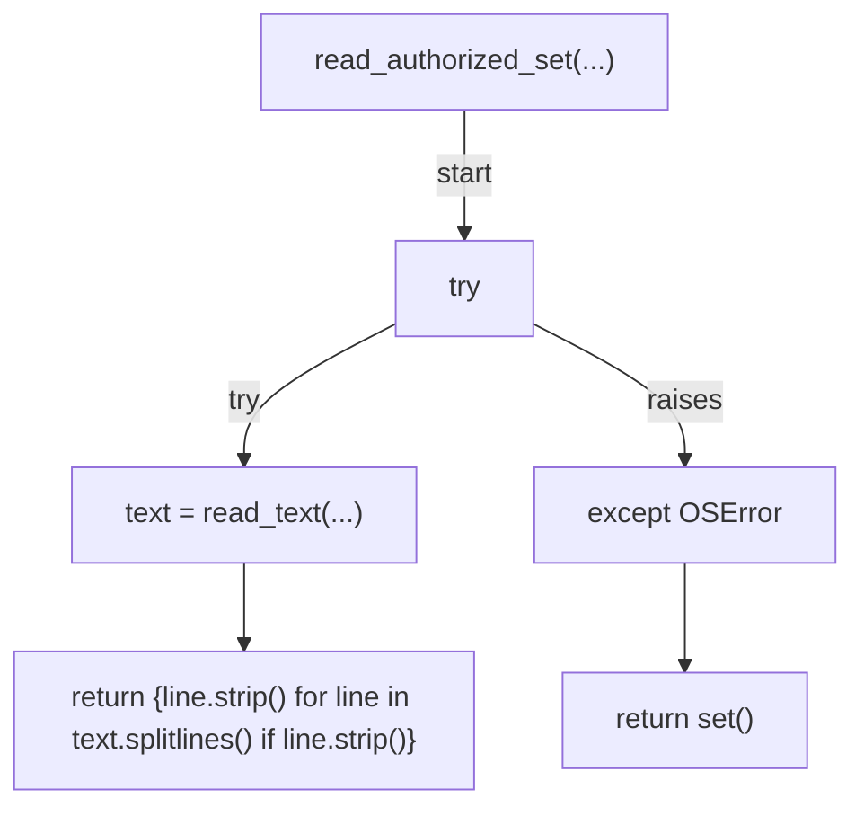
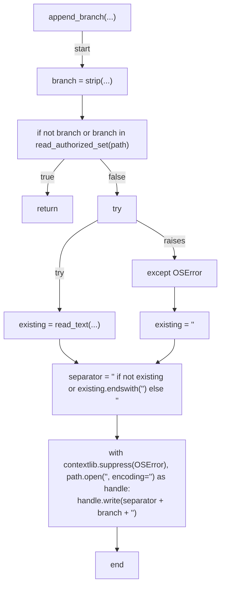
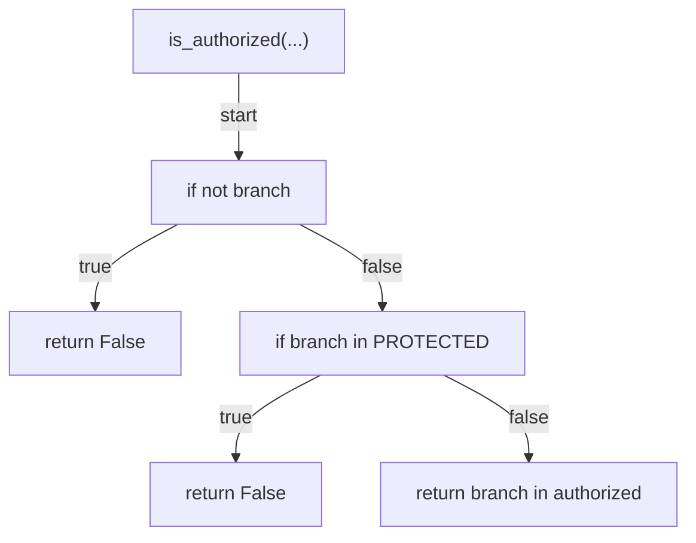

# AST graph: scripts/_session_branches.py

This file is generated from `scripts/_session_branches.py` by `python3 scripts/script_ast_graph.py all-doc`. Do not edit it by hand: content under `docs/generated/scripts/` is owned by the post-merge automation (refs #1540) -- update the source script instead.

## read_authorized_set(...)

## append_branch(...)

## is_authorized(...)

