# AST graph: scripts/analyze_ci_timings.py

This file is generated from `scripts/analyze_ci_timings.py` by `python3 scripts/script_ast_graph.py all-doc`. Do not edit it by hand: content under `docs/generated/scripts/` is owned by the post-merge automation (refs #1540) -- update the source script instead.

## _parse_iso(...)

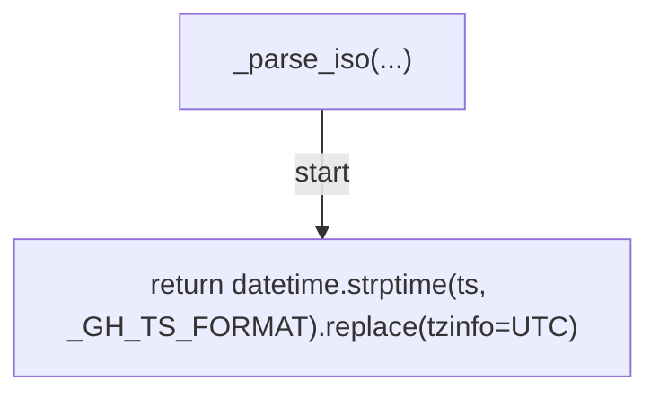

## _duration_seconds(...)

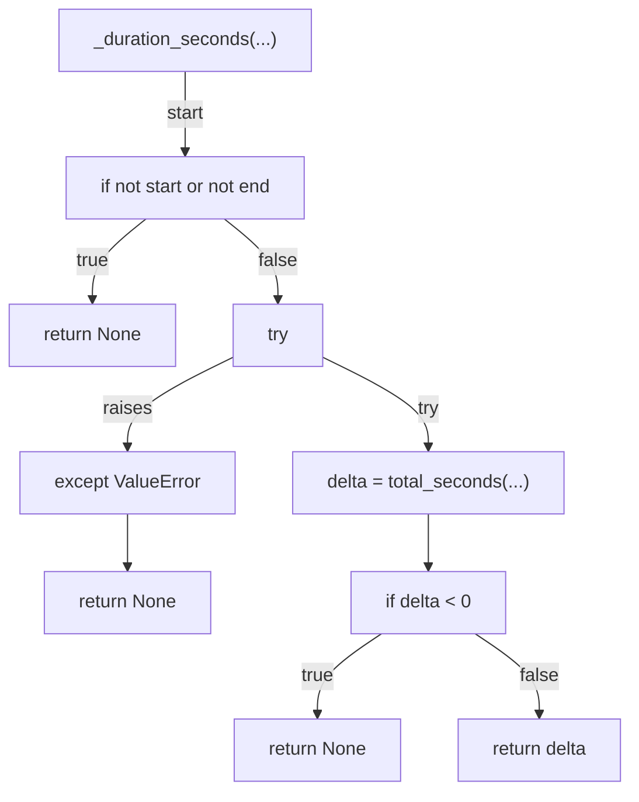

## _percentile(...)

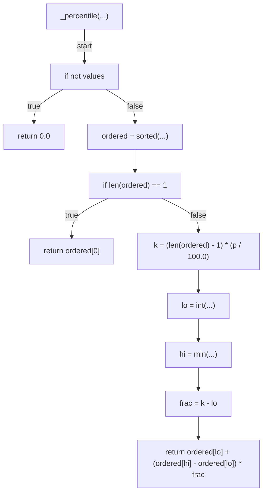

## _trend_arrow(...)

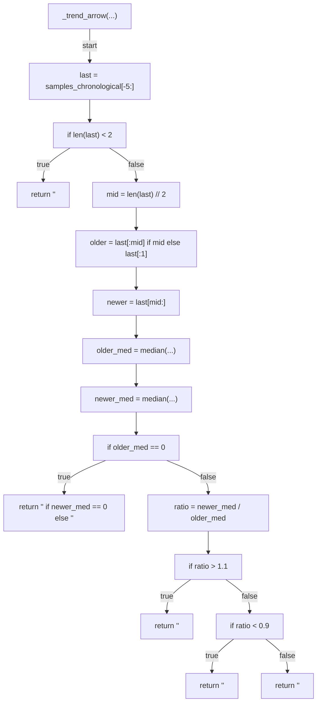

## _expand_paths(...)

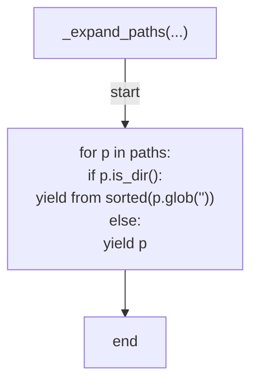

## load_jobs(...)

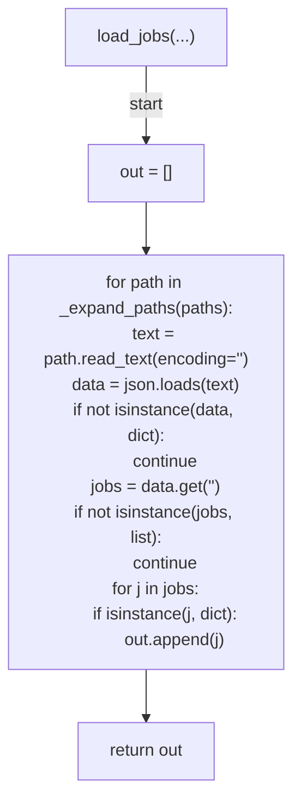

## filter_jobs(...)

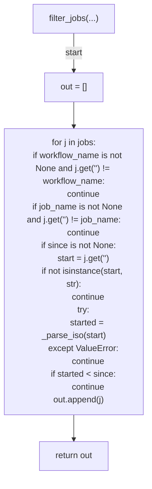

## aggregate_job_durations(...)

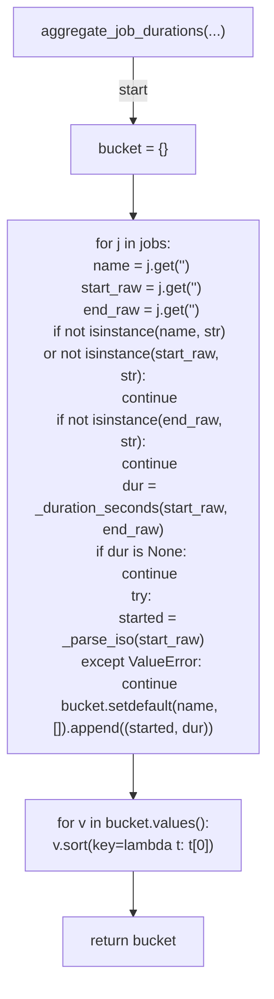

## aggregate_step_durations(...)

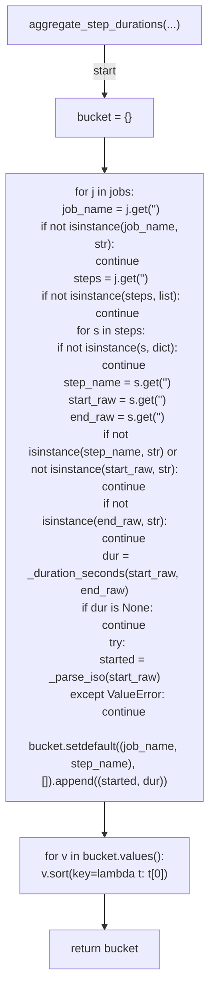

## partition_aggregates_by_cutoff(...)

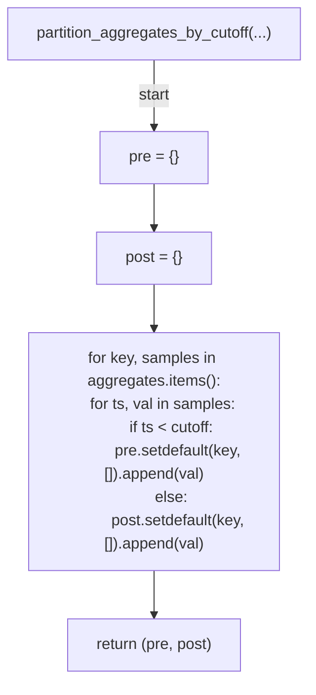

## _delta_p50_marker(...)

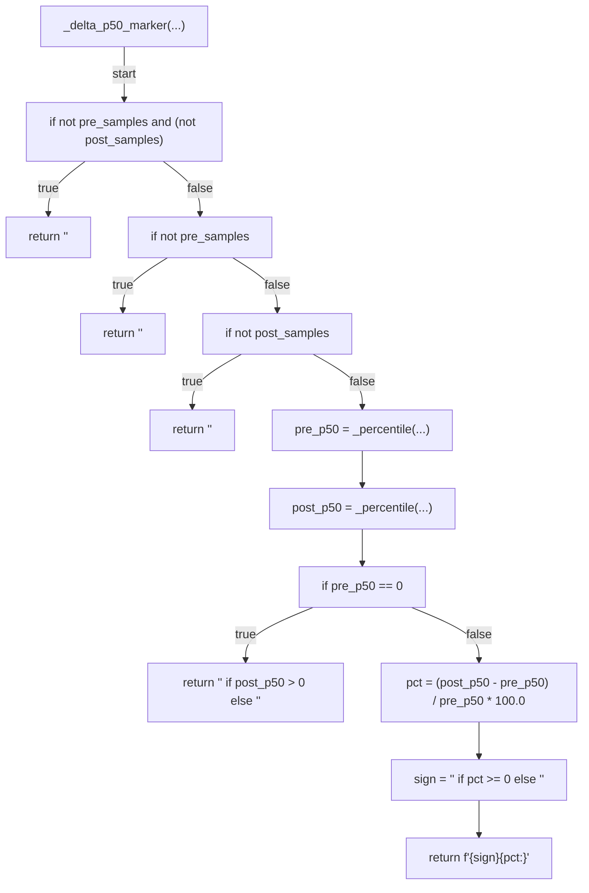

## _fmt_seconds(...)

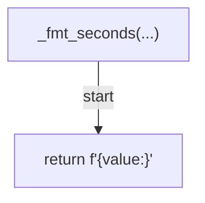

## _render_job_table(...)

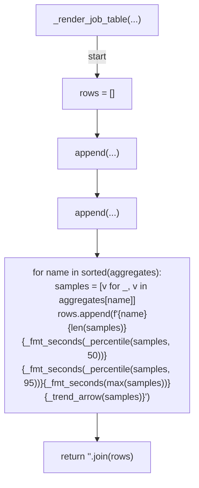

## _render_step_table(...)

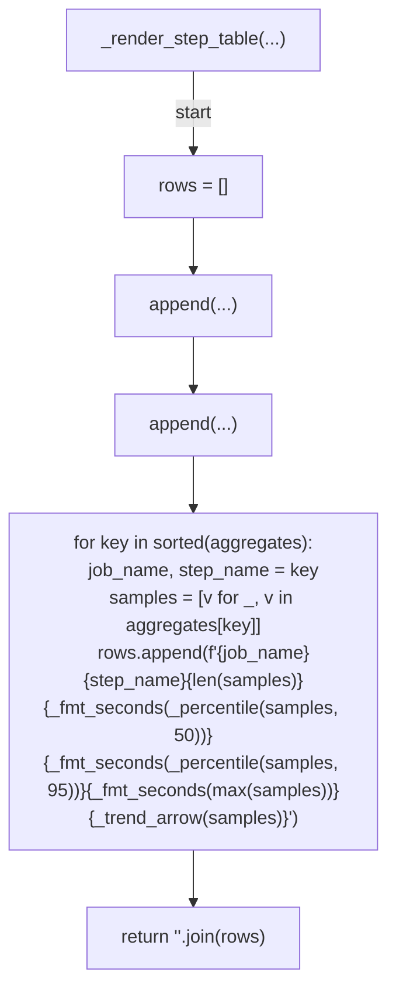

## _render_compare_job_table(...)

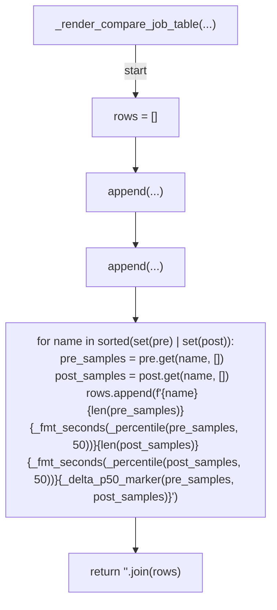

## _render_compare_step_table(...)

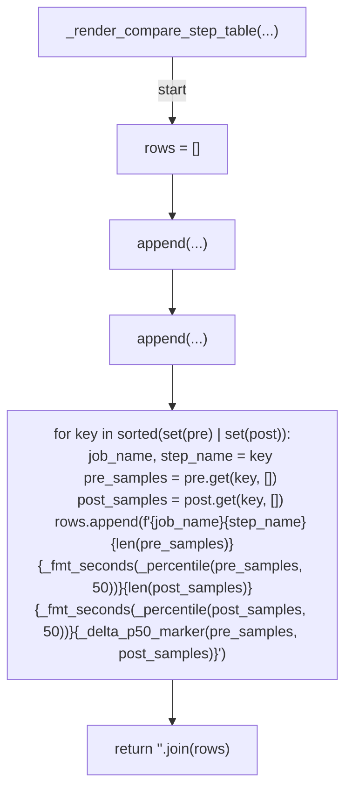

## budget_breaches(...)

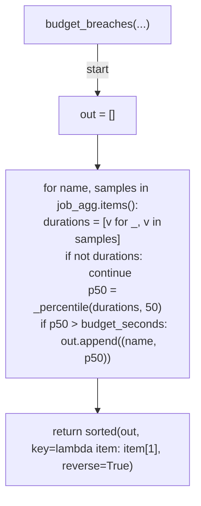

## budget_breach_payload(...)

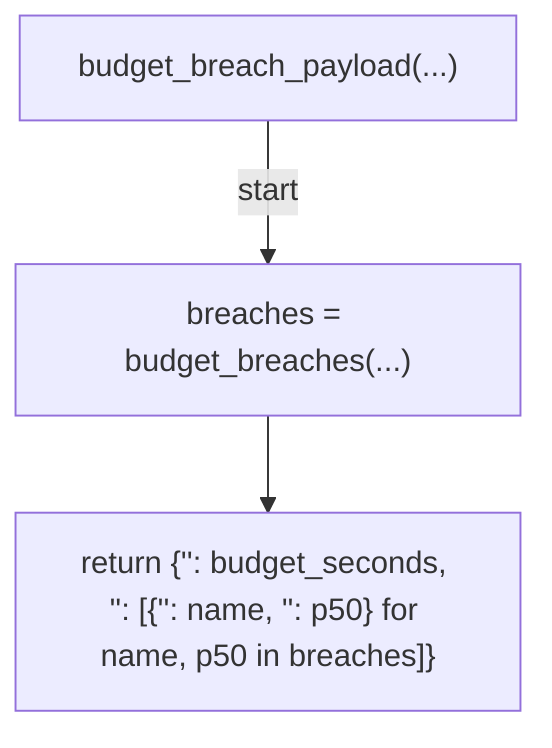

## _render_budget_section(...)

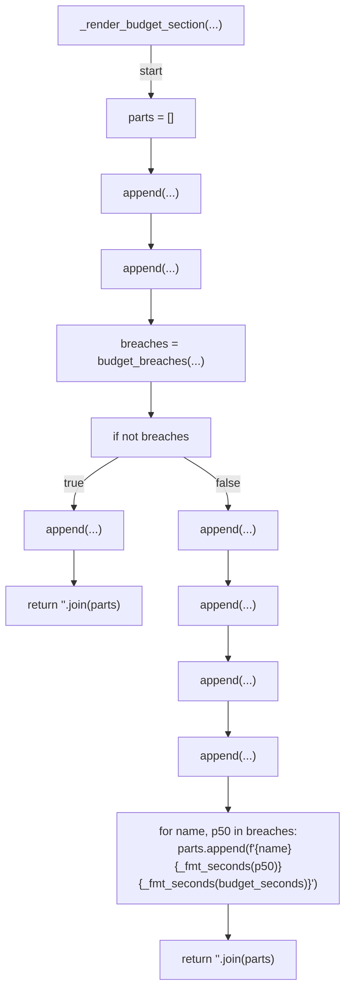

## render_report(...)

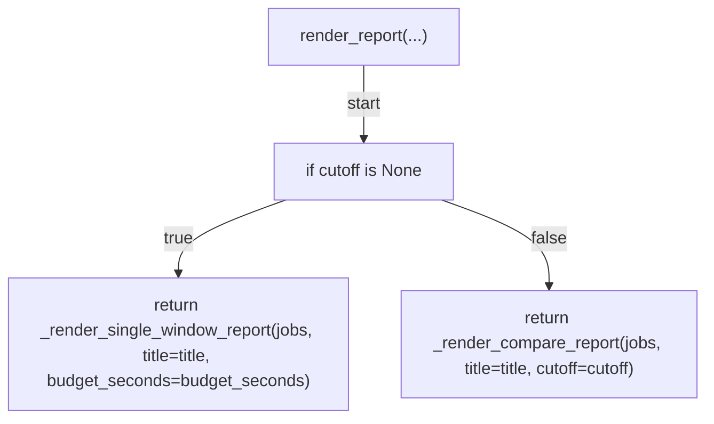

## _render_single_window_report(...)

```mermaid
flowchart TD
    N001["_render_single_window_report(...)"]
    N002["job_agg = aggregate_job_durations(...)"]
    N003["step_agg = aggregate_step_durations(...)"]
    N004["parts = []"]
    N005["append(...)"]
    N006["append(...)"]
    N007["append(...)"]
    N008["append(...)"]
    N009["append(...)"]
    N010["append(...)"]
    N011["if job_agg"]
    N012["append(...)"]
    N013["append(...)"]
    N014["append(...)"]
    N015["append(...)"]
    N016["append(...)"]
    N017["if step_agg"]
    N018["append(...)"]
    N019["append(...)"]
    N020["append(...)"]
    N021["if budget_seconds is not None"]
    N022["append(...)"]
    N023["append(...)"]
    N024["append(...)"]
    N025["return '<str>'.join(parts)"]
    N001 -->|"start"| N002
    N002 --> N003
    N003 --> N004
    N004 --> N005
    N005 --> N006
    N006 --> N007
    N007 --> N008
    N008 --> N009
    N009 --> N010
    N010 --> N011
    N011 -->|"true"| N012
    N011 -->|"false"| N013
    N012 --> N014
    N013 --> N014
    N014 --> N015
    N015 --> N016
    N016 --> N017
    N017 -->|"true"| N018
    N017 -->|"false"| N019
    N018 --> N020
    N019 --> N020
    N020 --> N021
    N021 -->|"true"| N022
    N022 --> N023
    N023 --> N024
    N021 -->|"false"| N024
    N024 --> N025
```

## _render_compare_report(...)

```mermaid
flowchart TD
    N001["_render_compare_report(...)"]
    N002["job_agg = aggregate_job_durations(...)"]
    N003["step_agg = aggregate_step_durations(...)"]
    N004["(pre_jobs, post_jobs) = partition_aggregates_by_cutoff(...)"]
    N005["(pre_steps, post_steps) = partition_aggregates_by_cutoff(...)"]
    N006["pre_total = sum(...)"]
    N007["post_total = sum(...)"]
    N008["cutoff_iso = strftime(...)"]
    N009["parts = []"]
    N010["append(...)"]
    N011["append(...)"]
    N012["append(...)"]
    N013["append(...)"]
    N014["append(...)"]
    N015["append(...)"]
    N016["if pre_jobs or post_jobs"]
    N017["append(...)"]
    N018["append(...)"]
    N019["append(...)"]
    N020["append(...)"]
    N021["append(...)"]
    N022["if pre_steps or post_steps"]
    N023["append(...)"]
    N024["append(...)"]
    N025["append(...)"]
    N026["append(...)"]
    N027["return '<str>'.join(parts)"]
    N001 -->|"start"| N002
    N002 --> N003
    N003 --> N004
    N004 --> N005
    N005 --> N006
    N006 --> N007
    N007 --> N008
    N008 --> N009
    N009 --> N010
    N010 --> N011
    N011 --> N012
    N012 --> N013
    N013 --> N014
    N014 --> N015
    N015 --> N016
    N016 -->|"true"| N017
    N016 -->|"false"| N018
    N017 --> N019
    N018 --> N019
    N019 --> N020
    N020 --> N021
    N021 --> N022
    N022 -->|"true"| N023
    N022 -->|"false"| N024
    N023 --> N025
    N024 --> N025
    N025 --> N026
    N026 --> N027
```

## _parse_since(...)

```mermaid
flowchart TD
    N001["_parse_since(...)"]
    N002["try"]
    N003["return datetime.strptime(value, '<str>').replace(tzinfo=UTC)"]
    N004["except ValueError"]
    N005["raise argparse.ArgumentTypeError(f'<str>{value!r}')"]
    N001 -->|"start"| N002
    N002 -->|"try"| N003
    N002 -->|"raises"| N004
    N004 --> N005
```

## _parse_cutoff(...)

```mermaid
flowchart TD
    N001["_parse_cutoff(...)"]
    N002["try"]
    N003["return datetime.strptime(value, '<str>').replace(tzinfo=UTC)"]
    N004["except ValueError"]
    N005["raise argparse.ArgumentTypeError(f'<str>{value!r}')"]
    N001 -->|"start"| N002
    N002 -->|"try"| N003
    N002 -->|"raises"| N004
    N004 --> N005
```

## main(...)

```mermaid
flowchart TD
    N001["main(...)"]
    N002["parser = ArgumentParser(...)"]
    N003["add_argument(...)"]
    N004["add_argument(...)"]
    N005["add_argument(...)"]
    N006["add_argument(...)"]
    N007["add_argument(...)"]
    N008["add_argument(...)"]
    N009["add_argument(...)"]
    N010["add_argument(...)"]
    N011["args = parse_args(...)"]
    N012["if args.budget_output is not None and args.budget_seconds is None"]
    N013["error(...)"]
    N014["jobs = load_jobs(...)"]
    N015["jobs = filter_jobs(...)"]
    N016["report = render_report(...)"]
    N017["print(...)"]
    N018["if args.budget_output is not None"]
    N019["payload = budget_breach_payload(...)"]
    N020["write_text(...)"]
    N021["return 0"]
    N001 -->|"start"| N002
    N002 --> N003
    N003 --> N004
    N004 --> N005
    N005 --> N006
    N006 --> N007
    N007 --> N008
    N008 --> N009
    N009 --> N010
    N010 --> N011
    N011 --> N012
    N012 -->|"true"| N013
    N013 --> N014
    N012 -->|"false"| N014
    N014 --> N015
    N015 --> N016
    N016 --> N017
    N017 --> N018
    N018 -->|"true"| N019
    N019 --> N020
    N020 --> N021
    N018 -->|"false"| N021
```
