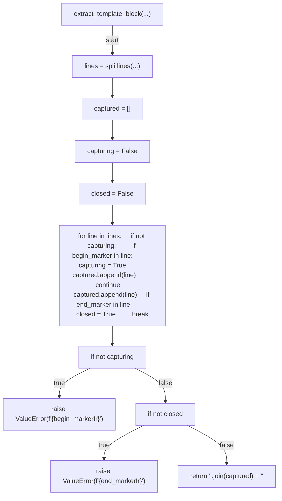
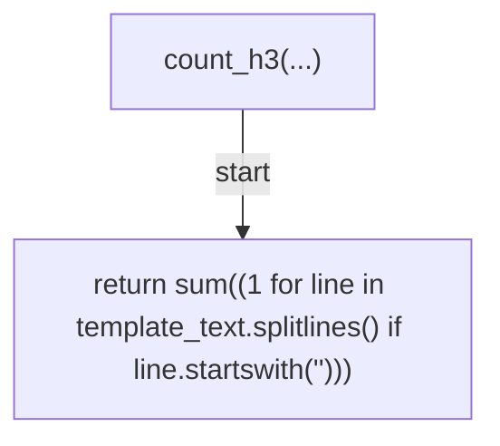
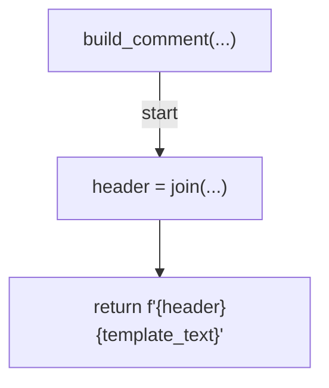
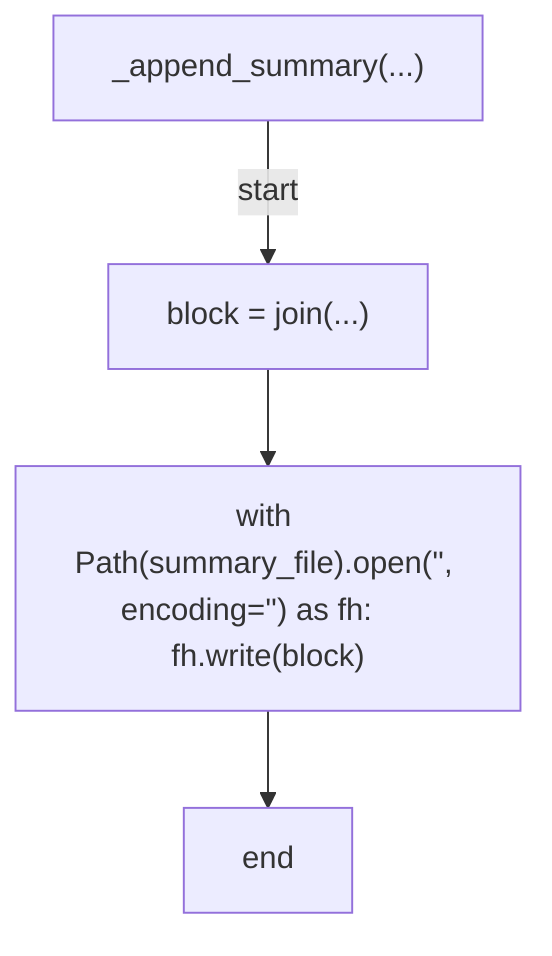
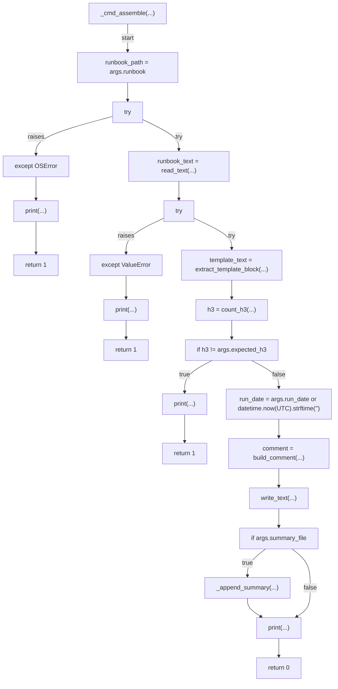
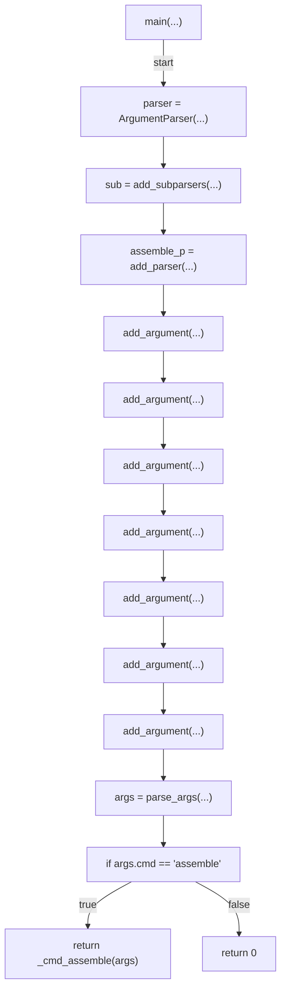

# AST graph: scripts/attack_review_reminder.py

This file is generated from `scripts/attack_review_reminder.py` by `python3 scripts/script_ast_graph.py all-doc`. Do not edit it by hand: content under `docs/generated/scripts/` is owned by the post-merge automation (refs #1540); update the source script instead.

## extract_template_block(...)

## count_h3(...)

## build_comment(...)

## _append_summary(...)

## _cmd_assemble(...)

## main(...)

