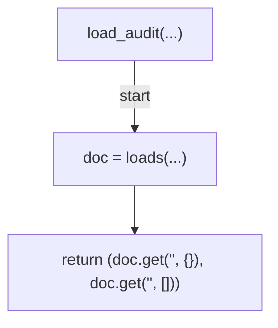
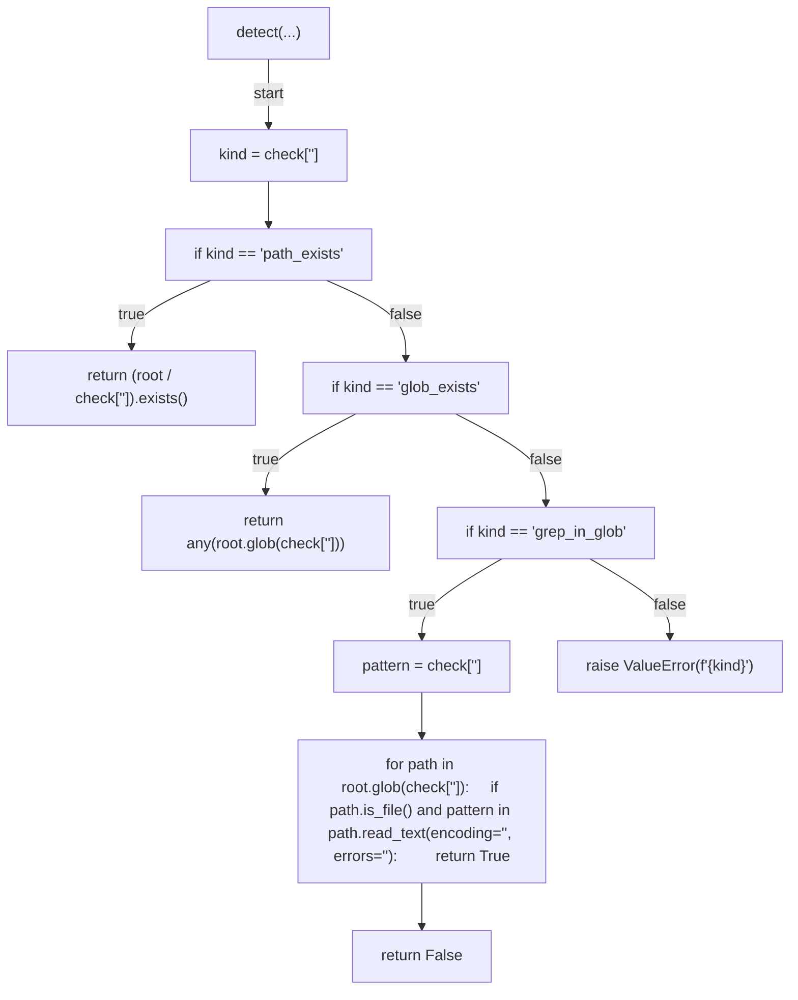
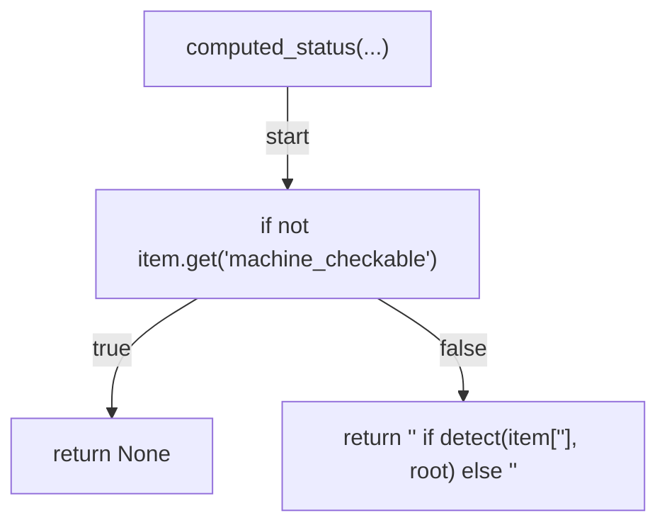
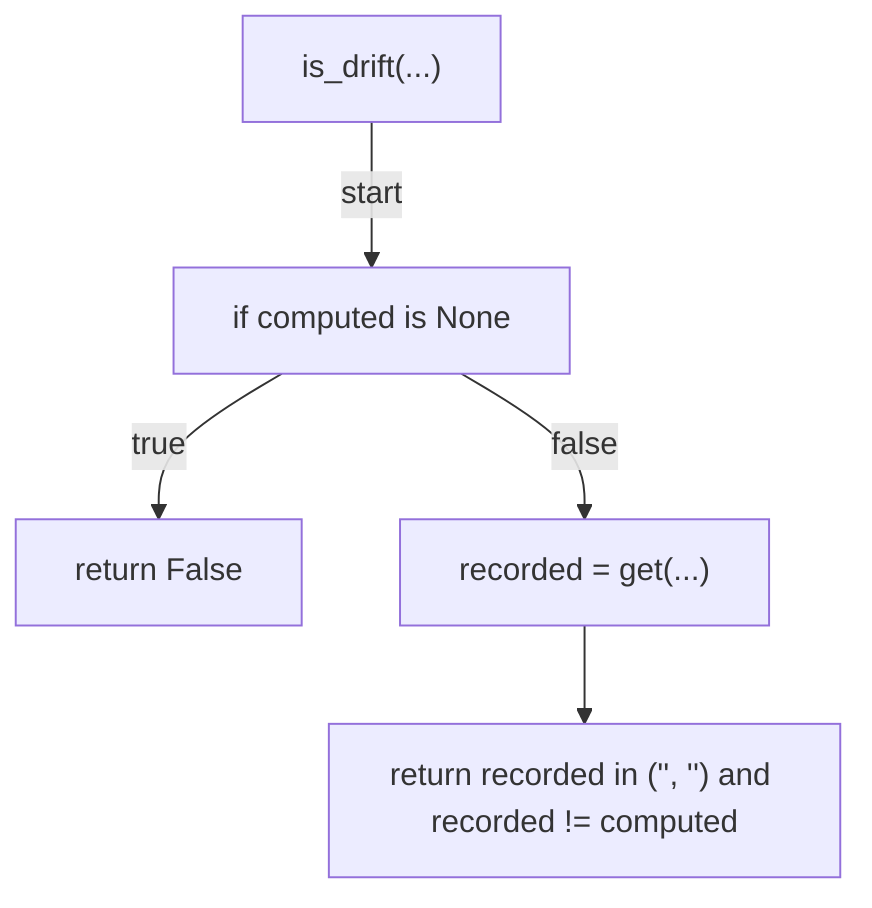
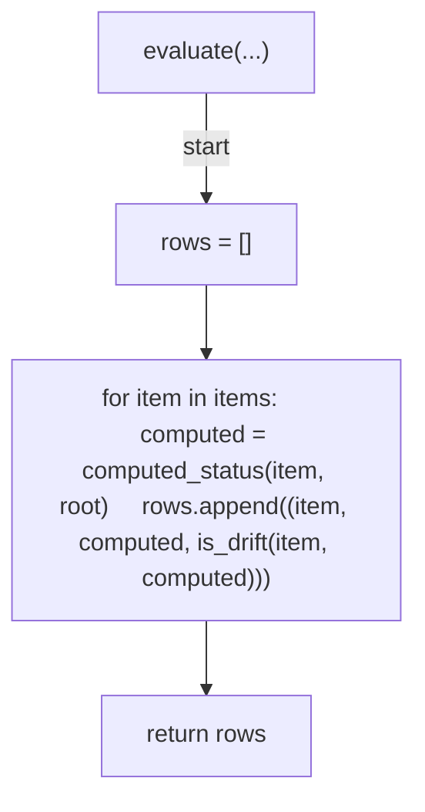
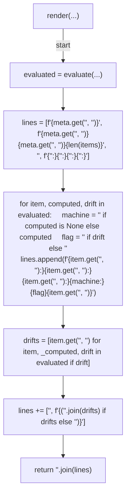
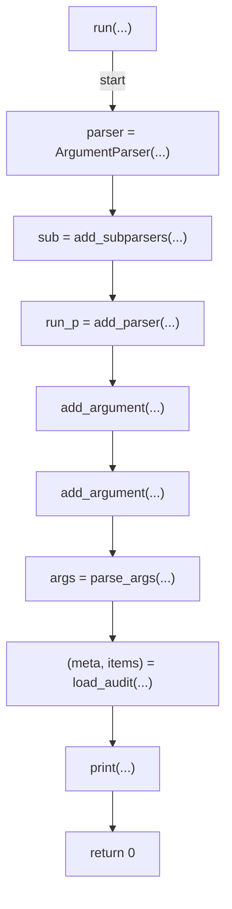

# AST graph: scripts/audit_loop_engineering.py

This file is generated from `scripts/audit_loop_engineering.py` by `python3 scripts/script_ast_graph.py all-doc`. Do not edit it by hand: content under `docs/generated/scripts/` is owned by the post-merge automation (refs #1540); update the source script instead.

## load_audit(...)

## detect(...)

## computed_status(...)

## is_drift(...)

## evaluate(...)

## render(...)

## run(...)

