# AST graph: scripts/auto_retro.py

This file is generated from `scripts/auto_retro.py` by `python3 scripts/script_ast_graph.py all-doc`. Do not edit it by hand: content under `docs/generated/scripts/` is owned by the post-merge automation (refs #1540); update the source script instead.

## auto_retro_decision_tree(...)

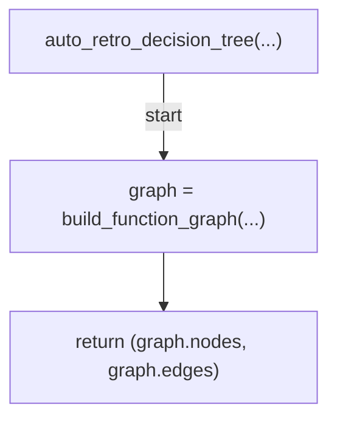

## auto_retro_decision_tree_edges(...)

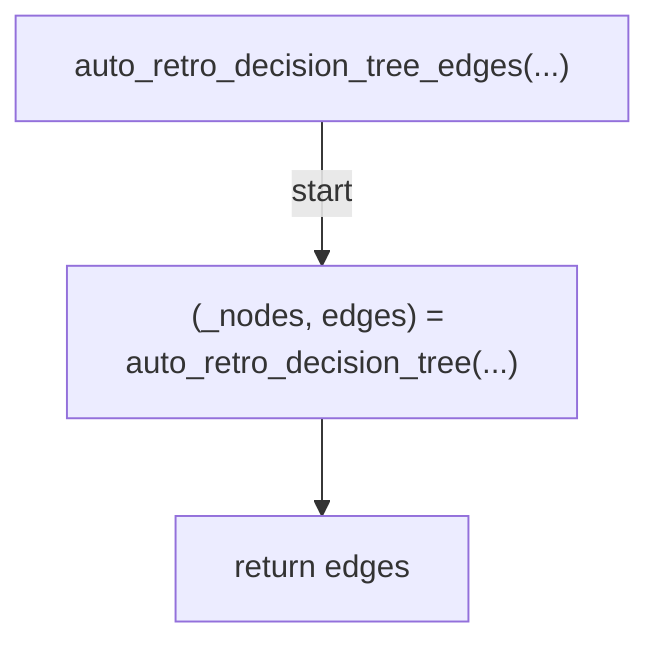

## render_decision_tree_mermaid(...)

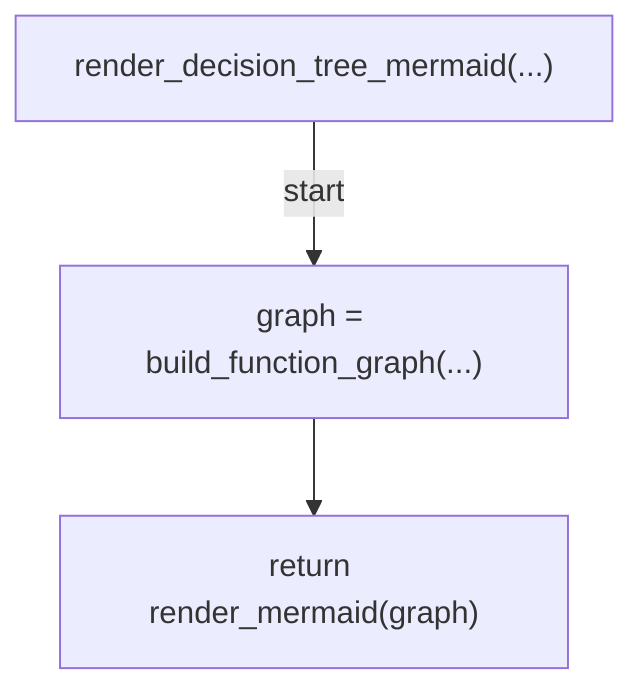

## gh_api(...)

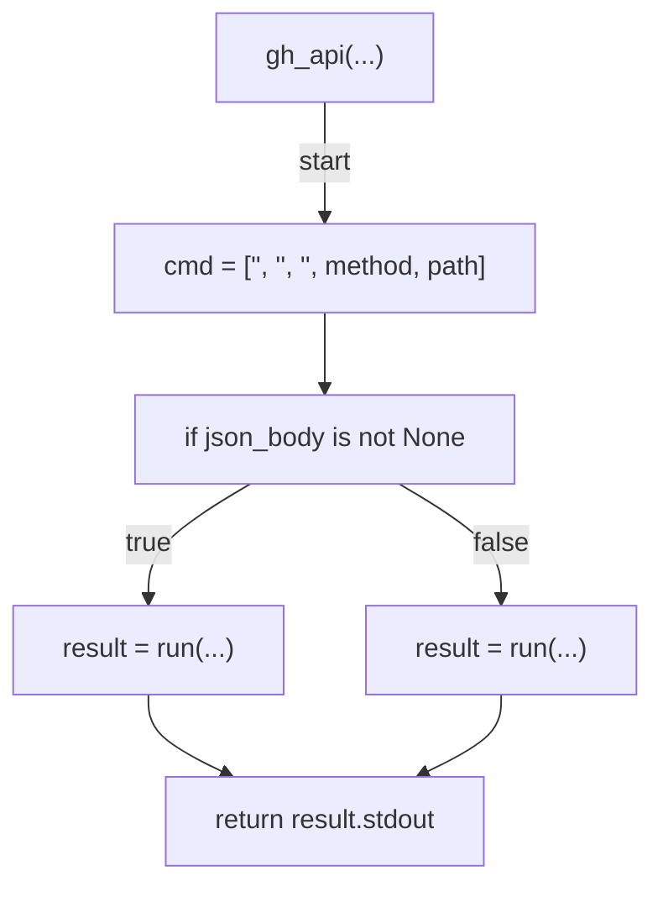

## fetch_pr_commits(...)

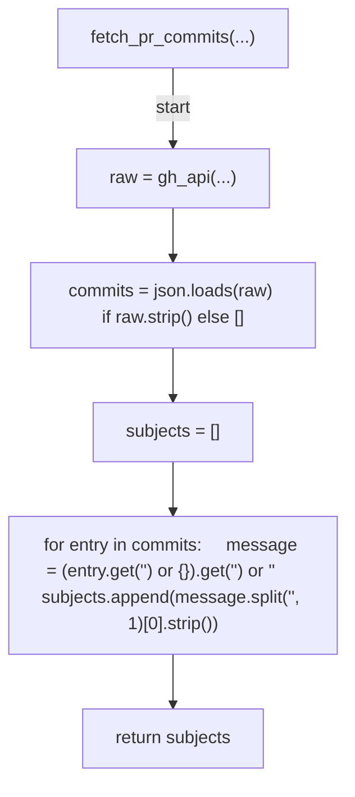

## fetch_check_runs(...)

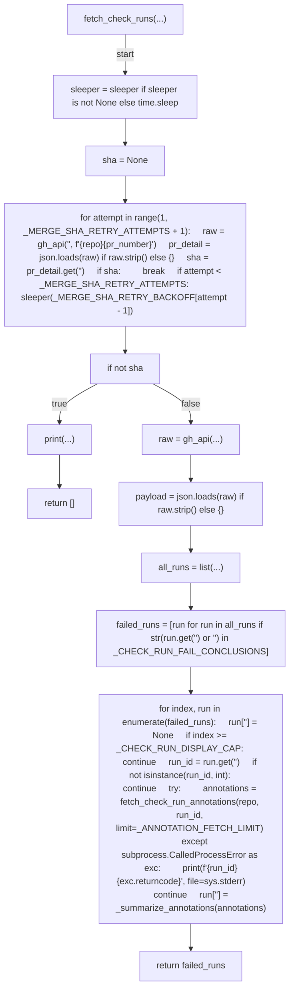

## fetch_check_run_annotations(...)

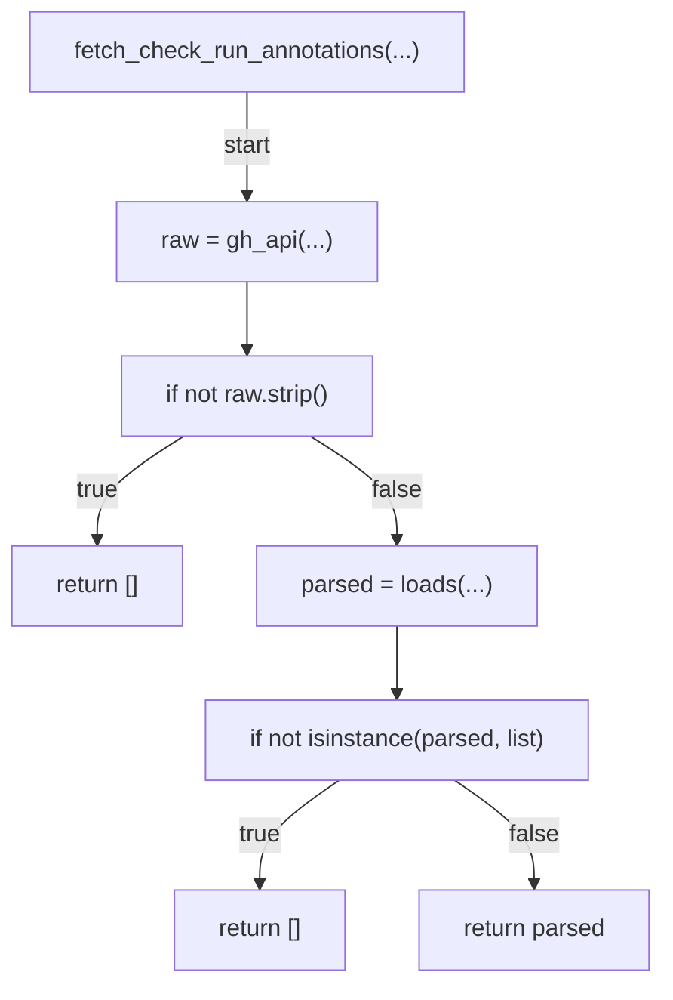

## _summarize_annotations(...)

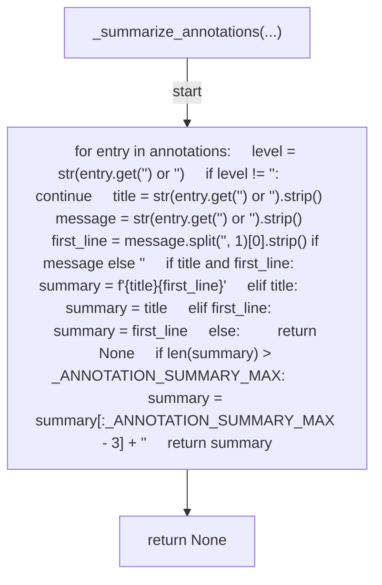

## search_retro_issues(...)

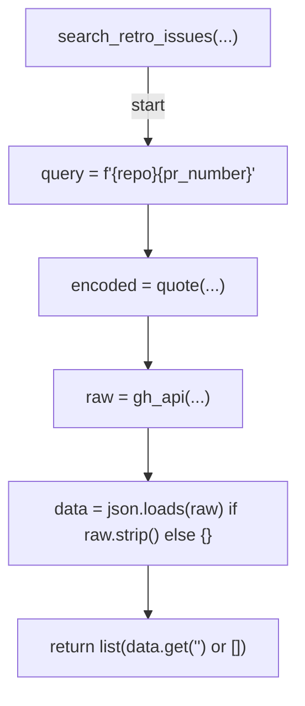

## fetch_past_retro_labels(...)

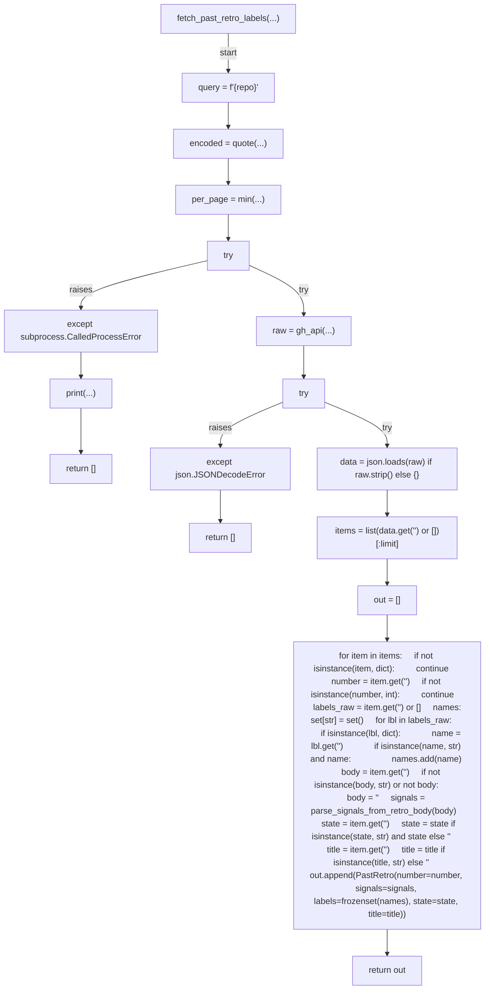

## has_review_comments(...)

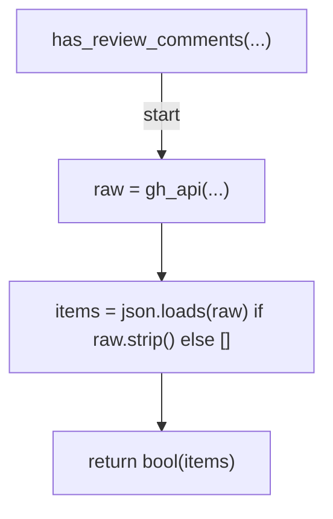

## fetch_issue_titles(...)

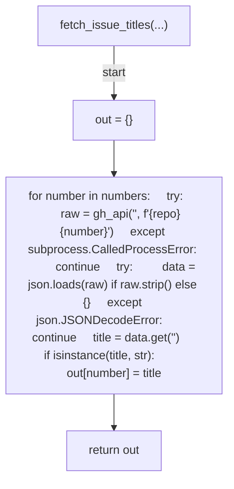

## fetch_issue_body(...)

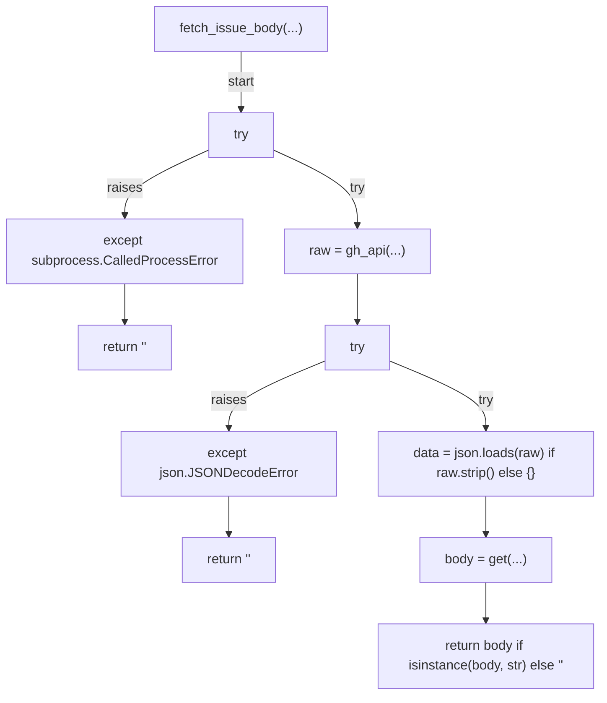

## patch_issue_body(...)

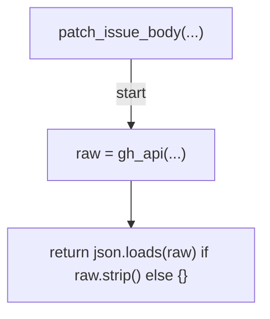

## append_repair_history_row(...)

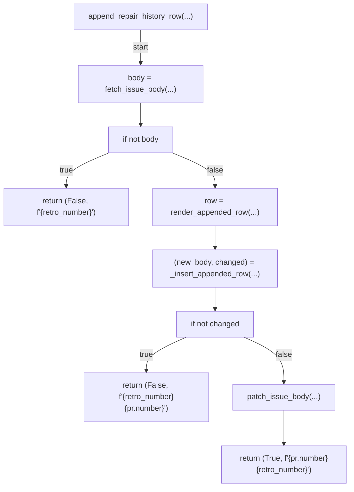

## create_issue(...)

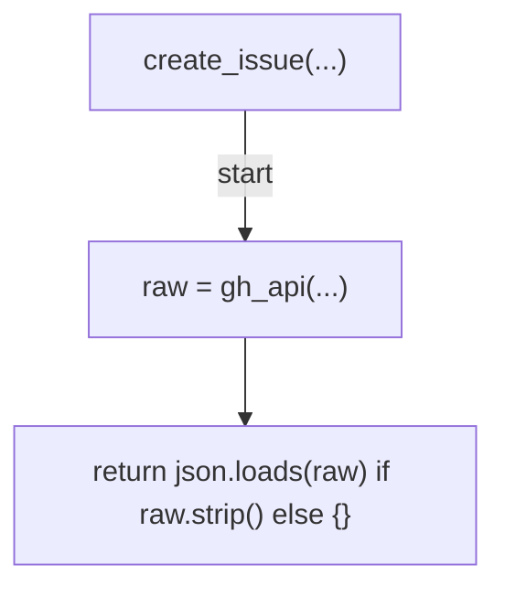

## find_existing_back_link_id(...)

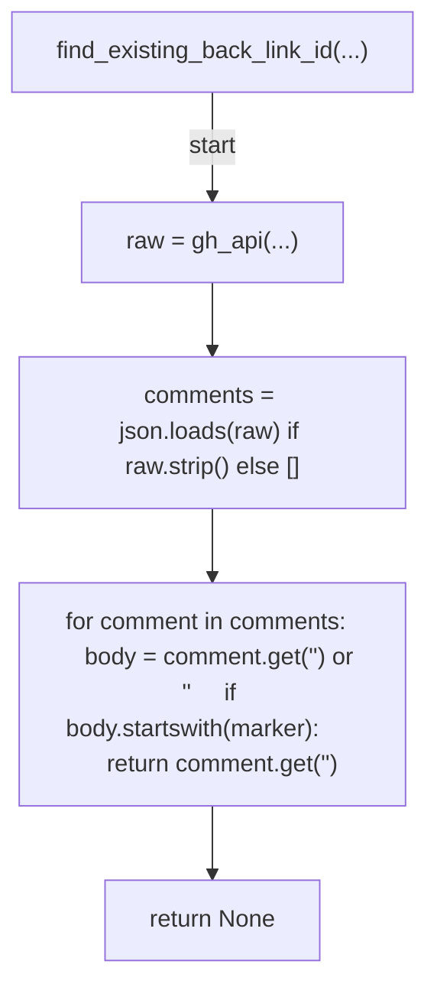

## _pr_comments_enabled(...)

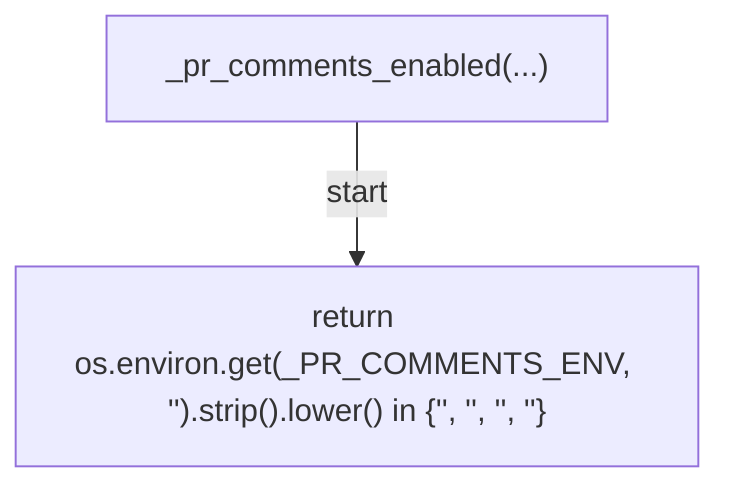

## post_back_link_comment(...)

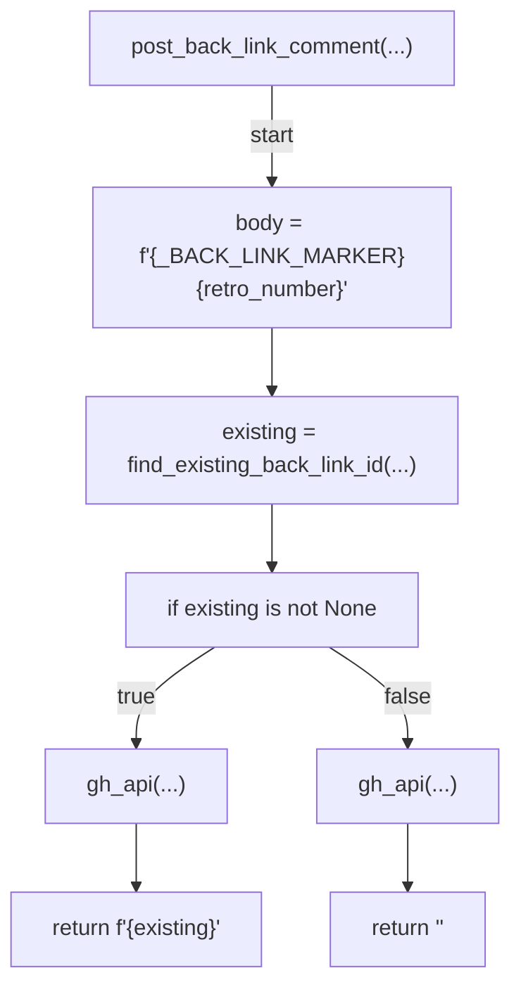

## apply_terminal_label(...)

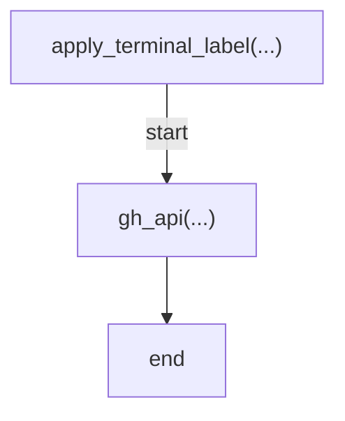

## post_skip_comment(...)

```mermaid
flowchart TD
    N001["post_skip_comment(...)"]
    N002["body = f'{_SKIP_COMMENT_MARKER}<str>{reason}'"]
    N003["existing = find_existing_back_link_id(...)"]
    N004["if existing is not None"]
    N005["gh_api(...)"]
    N006["return f'<str>{existing}'"]
    N007["gh_api(...)"]
    N008["return '<str>'"]
    N001 -->|"start"| N002
    N002 --> N003
    N003 --> N004
    N004 -->|"true"| N005
    N005 --> N006
    N004 -->|"false"| N007
    N007 --> N008
```

## _post_skip_comment_soft(...)

```mermaid
flowchart TD
    N001["_post_skip_comment_soft(...)"]
    N002["if not _pr_comments_enabled()"]
    N003["return"]
    N004["try"]
    N005["post_skip_comment(...)"]
    N006["except subprocess.CalledProcessError"]
    N007["print(...)"]
    N008["end"]
    N001 -->|"start"| N002
    N002 -->|"true"| N003
    N002 -->|"false"| N004
    N004 -->|"try"| N005
    N004 -->|"raises"| N006
    N006 --> N007
    N005 --> N008
    N007 --> N008
```

## search_open_retro_issues(...)

```mermaid
flowchart TD
    N001["search_open_retro_issues(...)"]
    N002["query = f'<str>{repo}<str>'"]
    N003["encoded = quote(...)"]
    N004["raw = gh_api(...)"]
    N005["data = json.loads(raw) if raw.strip() else {}"]
    N006["items = list(...)"]
    N007["out = []"]
    N008["for item in items:     title = item.get('<str>') or '<str>'     if is_retro_issue_title(title):         out.append(item)"]
    N009["return out"]
    N001 -->|"start"| N002
    N002 --> N003
    N003 --> N004
    N004 --> N005
    N005 --> N006
    N006 --> N007
    N007 --> N008
    N008 --> N009
```

## fetch_issue_comments(...)

```mermaid
flowchart TD
    N001["fetch_issue_comments(...)"]
    N002["raw = gh_api(...)"]
    N003["if not raw.strip()"]
    N004["return []"]
    N005["parsed = loads(...)"]
    N006["if not isinstance(parsed, list)"]
    N007["return []"]
    N008["return parsed"]
    N001 -->|"start"| N002
    N002 --> N003
    N003 -->|"true"| N004
    N003 -->|"false"| N005
    N005 --> N006
    N006 -->|"true"| N007
    N006 -->|"false"| N008
```

## has_sentinel_marker(...)

```mermaid
flowchart TD
    N001["has_sentinel_marker(...)"]
    N002["for comment in comments or []:     body = comment.get('<str>') or '<str>'     if _SENTINEL_CLOSE_MARKER in body:         return True"]
    N003["return False"]
    N001 -->|"start"| N002
    N002 --> N003
```

## post_sentinel_comment(...)

```mermaid
flowchart TD
    N001["post_sentinel_comment(...)"]
    N002["body = f'{_SENTINEL_CLOSE_MARKER}<str>{days}<str>'"]
    N003["gh_api(...)"]
    N004["end"]
    N001 -->|"start"| N002
    N002 --> N003
    N003 --> N004
```

## close_issue_as_not_planned(...)

```mermaid
flowchart TD
    N001["close_issue_as_not_planned(...)"]
    N002["gh_api(...)"]
    N003["end"]
    N001 -->|"start"| N002
    N002 --> N003
```

## _append_summary(...)

```mermaid
flowchart TD
    N001["_append_summary(...)"]
    N002["path = get(...)"]
    N003["if not path"]
    N004["return"]
    N005["with Path(path).open('<str>', encoding='<str>') as fp:     fp.write(text)"]
    N006["end"]
    N001 -->|"start"| N002
    N002 --> N003
    N003 -->|"true"| N004
    N003 -->|"false"| N005
    N005 --> N006
```

## _compact_join(...)

```mermaid
flowchart TD
    N001["_compact_join(...)"]
    N002["if not items"]
    N003["return '<str>'"]
    N004["head = items[:cap]"]
    N005["extra = len(items) - len(head)"]
    N006["line = join(...)"]
    N007["if extra > 0"]
    N008["line += f'<str>{extra}<str>'"]
    N009["return line"]
    N001 -->|"start"| N002
    N002 -->|"true"| N003
    N002 -->|"false"| N004
    N004 --> N005
    N005 --> N006
    N006 --> N007
    N007 -->|"true"| N008
    N008 --> N009
    N007 -->|"false"| N009
```

## _build_summary(...)

```mermaid
flowchart TD
    N001["_build_summary(...)"]
    N002["return f'<str>{pr.number}<str>{pr.title}<str>{pr.merged_at}<str>{action}<str>{detail}<str>'"]
    N001 -->|"start"| N002
```

## run(...)

```mermaid
flowchart TD
    N001["run(...)"]
    N002["pr = parse_event(...)"]
    N003["if not pr.merged"]
    N004["msg = f'<str>{pr.number}<str>'"]
    N005["print(...)"]
    N006["_append_summary(...)"]
    N007["return 0"]
    N008["(skip, reason) = should_skip(...)"]
    N009["if skip"]
    N010["print(...)"]
    N011["_append_summary(...)"]
    N012["return 0"]
    N013["existing_items = search_retro_issues(...)"]
    N014["existing = find_existing_retro(...)"]
    N015["if existing is not None"]
    N016["msg = f'<str>{existing}<str>{pr.number}'"]
    N017["print(...)"]
    N018["_append_summary(...)"]
    N019["return 0"]
    N020["if pr.title.lstrip().lower().startswith('fix(')"]
    N021["body_without_comments = strip_html_comments(...)"]
    N022["candidate_refs = extract_refs(...)"]
    N023["if candidate_refs"]
    N024["try"]
    N025["titles = fetch_issue_titles(...)"]
    N026["except subprocess.CalledProcessError"]
    N027["print(...)"]
    N028["titles = {}"]
    N029["target = find_target_retro_from_refs(...)"]
    N030["if target is not None"]
    N031["try"]
    N032["(changed, detail) = append_repair_history_row(...)"]
    N033["except subprocess.CalledProcessError"]
    N034["print(...)"]
    N035["_append_summary(...)"]
    N036["return 0"]
    N037["action = '<str>' if changed else '<str>'"]
    N038["print(...)"]
    N039["_append_summary(...)"]
    N040["return 0"]
    N041["try"]
    N042["has_inline_comments = has_review_comments(...)"]
    N043["except subprocess.CalledProcessError"]
    N044["print(...)"]
    N045["has_inline_comments = True"]
    N046["commit_subjects = None"]
    N047["if pr.commits > 1"]
    N048["try"]
    N049["commit_subjects = fetch_pr_commits(...)"]
    N050["except subprocess.CalledProcessError"]
    N051["print(...)"]
    N052["commit_subjects = None"]
    N053["signals = compute_repair_signals(...)"]
    N054["signal_summary = render_repair_signals(...)"]
    N055["if not any(signals.values())"]
    N056["msg = f'<str>{signal_summary}<str>'"]
    N057["print(...)"]
    N058["_append_summary(...)"]
    N059["_post_skip_comment_soft(...)"]
    N060["return 0"]
    N061["past_retros = fetch_past_retro_labels(...)"]
    N062["prior = compute_prior_from_labels(...)"]
    N063["(prior_skip, prior_reason) = should_skip_by_prior(...)"]
    N064["if prior_skip"]
    N065["print(...)"]
    N066["_append_summary(...)"]
    N067["_post_skip_comment_soft(...)"]
    N068["return 0"]
    N069["tentative = is_tentative_by_prior(...)"]
    N070["if commit_subjects is None"]
    N071["commit_subjects = fetch_pr_commits(...)"]
    N072["check_runs_unknown = False"]
    N073["try"]
    N074["check_runs = fetch_check_runs(...)"]
    N075["except subprocess.CalledProcessError"]
    N076["print(...)"]
    N077["check_runs = []"]
    N078["check_runs_unknown = True"]
    N079["verification_pairs = extract_verification_pairs(...)"]
    N080["pr_type = (extract_type_scope(pr.title) or '<str>').split('<str>', 1)[0]"]
    N081["repair_rows = _repair_history_rows(...)"]
    N082["if not check_runs_unknown and (not repair_rows or (not has_inline_comments and _has_only_exempt_policy_artifact_rows(repair_rows)))"]
    N083["if repair_rows"]
    N084["msg = f'<str>{signal_summary}<str>'"]
    N085["msg = f'<str>{signal_summary}<str>'"]
    N086["print(...)"]
    N087["_append_summary(...)"]
    N088["_post_skip_comment_soft(...)"]
    N089["return 0"]
    N090["title = build_retro_title(...)"]
    N091["body = build_retro_body(...)"]
    N092["labels = issue_labels(...)"]
    N093["created = create_issue(...)"]
    N094["new_number = get(...)"]
    N095["new_url = created.get('<str>') or '<str>'"]
    N096["back_link_status = '<str>'"]
    N097["terminal_label_status = '<str>'"]
    N098["if isinstance(new_number, int)"]
    N099["if not _pr_comments_enabled()"]
    N100["back_link_status = '<str>'"]
    N101["try"]
    N102["back_link_status = post_back_link_comment(...)"]
    N103["except subprocess.CalledProcessError"]
    N104["print(...)"]
    N105["back_link_status = '<str>'"]
    N106["try"]
    N107["apply_terminal_label(...)"]
    N108["terminal_label_status = '<str>'"]
    N109["except subprocess.CalledProcessError"]
    N110["print(...)"]
    N111["terminal_label_status = '<str>'"]
    N112["msg = f'<str>{new_number}<str>{new_url}<str>{back_link_status}<str>{terminal_label_status}'"]
    N113["print(...)"]
    N114["_append_summary(...)"]
    N115["return 0"]
    N001 -->|"start"| N002
    N002 --> N003
    N003 -->|"true"| N004
    N004 --> N005
    N005 --> N006
    N006 --> N007
    N003 -->|"false"| N008
    N008 --> N009
    N009 -->|"true"| N010
    N010 --> N011
    N011 --> N012
    N009 -->|"false"| N013
    N013 --> N014
    N014 --> N015
    N015 -->|"true"| N016
    N016 --> N017
    N017 --> N018
    N018 --> N019
    N015 -->|"false"| N020
    N020 -->|"true"| N021
    N021 --> N022
    N022 --> N023
    N023 -->|"true"| N024
    N024 -->|"try"| N025
    N024 -->|"raises"| N026
    N026 --> N027
    N027 --> N028
    N025 --> N029
    N028 --> N029
    N029 --> N030
    N030 -->|"true"| N031
    N031 -->|"try"| N032
    N031 -->|"raises"| N033
    N033 --> N034
    N034 --> N035
    N035 --> N036
    N032 --> N037
    N037 --> N038
    N038 --> N039
    N039 --> N040
    N030 -->|"false"| N041
    N023 -->|"false"| N041
    N020 -->|"false"| N041
    N041 -->|"try"| N042
    N041 -->|"raises"| N043
    N043 --> N044
    N044 --> N045
    N042 --> N046
    N045 --> N046
    N046 --> N047
    N047 -->|"true"| N048
    N048 -->|"try"| N049
    N048 -->|"raises"| N050
    N050 --> N051
    N051 --> N052
    N049 --> N053
    N052 --> N053
    N047 -->|"false"| N053
    N053 --> N054
    N054 --> N055
    N055 -->|"true"| N056
    N056 --> N057
    N057 --> N058
    N058 --> N059
    N059 --> N060
    N055 -->|"false"| N061
    N061 --> N062
    N062 --> N063
    N063 --> N064
    N064 -->|"true"| N065
    N065 --> N066
    N066 --> N067
    N067 --> N068
    N064 -->|"false"| N069
    N069 --> N070
    N070 -->|"true"| N071
    N071 --> N072
    N070 -->|"false"| N072
    N072 --> N073
    N073 -->|"try"| N074
    N073 -->|"raises"| N075
    N075 --> N076
    N076 --> N077
    N077 --> N078
    N074 --> N079
    N078 --> N079
    N079 --> N080
    N080 --> N081
    N081 --> N082
    N082 -->|"true"| N083
    N083 -->|"true"| N084
    N083 -->|"false"| N085
    N084 --> N086
    N085 --> N086
    N086 --> N087
    N087 --> N088
    N088 --> N089
    N082 -->|"false"| N090
    N090 --> N091
    N091 --> N092
    N092 --> N093
    N093 --> N094
    N094 --> N095
    N095 --> N096
    N096 --> N097
    N097 --> N098
    N098 -->|"true"| N099
    N099 -->|"true"| N100
    N099 -->|"false"| N101
    N101 -->|"try"| N102
    N101 -->|"raises"| N103
    N103 --> N104
    N104 --> N105
    N100 --> N106
    N102 --> N106
    N105 --> N106
    N106 -->|"try"| N107
    N107 --> N108
    N106 -->|"raises"| N109
    N109 --> N110
    N110 --> N111
    N108 --> N112
    N111 --> N112
    N098 -->|"false"| N112
    N112 --> N113
    N113 --> N114
    N114 --> N115
```

## _now_utc_iso(...)

```mermaid
flowchart TD
    N001["_now_utc_iso(...)"]
    N002["return datetime.now(UTC).strftime('<str>')"]
    N001 -->|"start"| N002
```

## _build_sentinel_summary(...)

```mermaid
flowchart TD
    N001["_build_sentinel_summary(...)"]
    N002["closed_line = _compact_join(...)"]
    N003["skipped_line = _compact_join(...)"]
    N004["return f'<str>{days}<str>{len(closed)}<str>{len(skipped)}<str>{closed_line}<str>{skipped_line}<str>'"]
    N001 -->|"start"| N002
    N002 --> N003
    N003 --> N004
```

## sentinel_run(...)

```mermaid
flowchart TD
    N001["sentinel_run(...)"]
    N002["try"]
    N003["items = search_open_retro_issues(...)"]
    N004["except subprocess.CalledProcessError"]
    N005["print(...)"]
    N006["return 0"]
    N007["closed = []"]
    N008["skipped = []"]
    N009["for item in items:     raw_number = item.get('<str>')     if not isinstance(raw_number, int):         continue     number = raw_number     created_at = str(item.get('<str>') or '<str>')     if not is_retro_age_exceeded(created_at, now_iso, days):         skipped.append((number, '<str>'))         continue     try:         comments = fetch_issue_comments(repo, number)     except subprocess.CalledProcessError as exc:         print(f'<str>{number}<str>{exc.returncode}<str>', file=sys.stderr)         skipped.append((number, '<str>'))         continue     if has_sentinel_marker(comments):         skipped.append((number, '<str>'))         continue     body = item.get('<str>') or '<str>'     if not is_retro_untouched(body, comments):         skipped.append((number, '<str>'))         continue     try:         post_sentinel_comment(repo, number, days)     except subprocess.CalledProcessError as exc:         print(f'<str>{number}<str>{exc.returncode}<str>', file=sys.stderr)         skipped.append((number, '<str>'))         continue     try:         close_issue_as_not_planned(repo, number)     except subprocess.CalledProcessError as exc:         print(f'<str>{number}<str>{exc.returncode}<str>', file=sys.stderr)         skipped.append((number, '<str>'))         continue     closed.append(number)     print(f'<str>{number}<str>')"]
    N010["_append_summary(...)"]
    N011["return 0"]
    N001 -->|"start"| N002
    N002 -->|"try"| N003
    N002 -->|"raises"| N004
    N004 --> N005
    N005 --> N006
    N003 --> N007
    N007 --> N008
    N008 --> N009
    N009 --> N010
    N010 --> N011
```

## _hours_between(...)

```mermaid
flowchart TD
    N001["_hours_between(...)"]
    N002["fmt = '<str>'"]
    N003["a = replace(...)"]
    N004["b = replace(...)"]
    N005["return abs((b - a).total_seconds()) / 3600.0"]
    N001 -->|"start"| N002
    N002 --> N003
    N003 --> N004
    N004 --> N005
```

## search_recently_merged_prs(...)

```mermaid
flowchart TD
    N001["search_recently_merged_prs(...)"]
    N002["cutoff = replace(...)"]
    N003["since_ts = cutoff.timestamp() - hours * 3600"]
    N004["since_dt = fromtimestamp(...)"]
    N005["since_str = strftime(...)"]
    N006["query = f'<str>{repo}<str>{since_str}'"]
    N007["encoded = quote(...)"]
    N008["raw = gh_api(...)"]
    N009["data = json.loads(raw) if raw.strip() else {}"]
    N010["return list(data.get('<str>') or [])"]
    N001 -->|"start"| N002
    N002 --> N003
    N003 --> N004
    N004 --> N005
    N005 --> N006
    N006 --> N007
    N007 --> N008
    N008 --> N009
    N009 --> N010
```

## fetch_issue_state(...)

```mermaid
flowchart TD
    N001["fetch_issue_state(...)"]
    N002["try"]
    N003["raw = gh_api(...)"]
    N004["except subprocess.CalledProcessError"]
    N005["return '<str>'"]
    N006["try"]
    N007["data = json.loads(raw) if raw.strip() else {}"]
    N008["except json.JSONDecodeError"]
    N009["return '<str>'"]
    N010["return str(data.get('<str>') or '<str>')"]
    N001 -->|"start"| N002
    N002 -->|"try"| N003
    N002 -->|"raises"| N004
    N004 --> N005
    N003 --> N006
    N006 -->|"try"| N007
    N006 -->|"raises"| N008
    N008 --> N009
    N007 --> N010
```

## search_fix_prs_since(...)

```mermaid
flowchart TD
    N001["search_fix_prs_since(...)"]
    N002["query = f'<str>{repo}<str>{merged_at}<str>{now_iso}'"]
    N003["encoded = quote(...)"]
    N004["try"]
    N005["raw = gh_api(...)"]
    N006["except subprocess.CalledProcessError"]
    N007["return []"]
    N008["data = json.loads(raw) if raw.strip() else {}"]
    N009["items = list(...)"]
    N010["return [item for item in items if (item.get('<str>') or '<str>').lstrip().lower().startswith('<str>')]"]
    N001 -->|"start"| N002
    N002 --> N003
    N003 --> N004
    N004 -->|"try"| N005
    N004 -->|"raises"| N006
    N006 --> N007
    N005 --> N008
    N008 --> N009
    N009 --> N010
```

## fetch_pr_detail(...)

```mermaid
flowchart TD
    N001["fetch_pr_detail(...)"]
    N002["try"]
    N003["raw = gh_api(...)"]
    N004["except subprocess.CalledProcessError"]
    N005["return {}"]
    N006["try"]
    N007["return json.loads(raw) if raw.strip() else {}"]
    N008["except json.JSONDecodeError"]
    N009["return {}"]
    N001 -->|"start"| N002
    N002 -->|"try"| N003
    N002 -->|"raises"| N004
    N004 --> N005
    N003 --> N006
    N006 -->|"try"| N007
    N006 -->|"raises"| N008
    N008 --> N009
```

## verify_post_merge_gates(...)

```mermaid
flowchart TD
    N001["verify_post_merge_gates(...)"]
    N002["items = extract_post_merge_checklist(...)"]
    N003["if not items"]
    N004["return []"]
    N005["results = []"]
    N006["for text, checked in items:     if checked:         continue     lower = text.lower()     if '<str>' in lower:         body_no_comments = strip_html_comments(pr_body or '<str>')         refs = extract_refs(body_no_comments)         if not refs:             results.append(PostMergeGateResult(gate='<str>', satisfied=True, detail='<str>'))             continue         all_closed = True         for ref in refs:             state = fetch_issue_state(repo, ref)             if state != '<str>':                 all_closed = False                 break         results.append(PostMergeGateResult(gate='<str>', satisfied=all_closed, detail=f'<str>{refs}<str>' if all_closed else f'<str>{ref}<str>{state}'))     elif '<str>' in lower:         existing_items = search_retro_issues(repo, pr_number)         existing = find_existing_retro(existing_items, pr_number)         results.append(PostMergeGateResult(gate='<str>', satisfied=existing is not None, detail=f'<str>{existing}<str>' if existing is not None else f'<str>{pr_number}'))     elif '<str>' in lower and '<str>' in lower:         fix_prs = search_fix_prs_since(repo, merged_at, now_iso)         has_followup = len(fix_prs) > 0         results.append(PostMergeGateResult(gate='<str>', satisfied=not has_followup, detail='<str>' if not has_followup else '<str>' + '<str>'.join(('<str>' + str(p.get('<str>', '<str>')) for p in fix_prs))))     else:         results.append(PostMergeGateResult(gate='<str>', satisfied=True, detail=f'<str>{text!r}'))"]
    N007["return results"]
    N001 -->|"start"| N002
    N002 --> N003
    N003 -->|"true"| N004
    N003 -->|"false"| N005
    N005 --> N006
    N006 --> N007
```

## _build_rescan_summary(...)

```mermaid
flowchart TD
    N001["_build_rescan_summary(...)"]
    N002["appended_line = _compact_join(...)"]
    N003["skipped_line = _compact_join(...)"]
    N004["return f'<str>{hours}<str>{len(appended)}<str>{len(skipped)}<str>{appended_line}<str>{skipped_line}<str>'"]
    N001 -->|"start"| N002
    N002 --> N003
    N003 --> N004
```

## post_merge_rescan_run(...)

```mermaid
flowchart TD
    N001["post_merge_rescan_run(...)"]
    N002["try"]
    N003["items = search_recently_merged_prs(...)"]
    N004["except subprocess.CalledProcessError"]
    N005["print(...)"]
    N006["_append_summary(...)"]
    N007["return 0"]
    N008["appended = []"]
    N009["skipped = []"]
    N010["for item in items:     raw_number = item.get('<str>')     if not isinstance(raw_number, int):         continue     pr_number = raw_number     title = str(item.get('<str>') or '<str>')     if is_retro_pr(title):         skipped.append((pr_number, '<str>'))         continue     skip, reason = should_skip(MergedPR(number=pr_number, title=title, merged=True, merged_at='<str>', merged_by_login=(item.get('<str>') or {}).get('<str>'), user_login=(item.get('<str>') or {}).get('<str>'), layer_labels=(), html_url='<str>'))     if skip:         skipped.append((pr_number, reason))         continue     pr_detail = fetch_pr_detail(repo, pr_number)     if not pr_detail:         skipped.append((pr_number, '<str>'))         continue     merged_at = str(pr_detail.get('<str>') or '<str>')     if not merged_at:         skipped.append((pr_number, '<str>'))         continue     age_hours = _hours_between(merged_at, now_iso)     if age_hours < _RESCAN_MIN_AGE_HOURS:         skipped.append((pr_number, f'<str>{age_hours:<str>}<str>{_RESCAN_MIN_AGE_HOURS}<str>'))         continue     pr_body = str(pr_detail.get('<str>') or '<str>')     post_merge_items = extract_post_merge_checklist(pr_body)     if not post_merge_items:         skipped.append((pr_number, '<str>'))         continue     all_checked = all((checked for _, checked in post_merge_items))     if all_checked:         skipped.append((pr_number, '<str>'))         continue     existing_items = search_retro_issues(repo, pr_number)     retro_number = find_existing_retro(existing_items, pr_number)     if retro_number is None:         skipped.append((pr_number, '<str>'))         continue     retro_body = fetch_issue_body(repo, retro_number)     if not retro_body:         skipped.append((pr_number, f'<str>{retro_number}<str>'))         continue     if _RESCAN_MARKER in retro_body:         skipped.append((pr_number, f'<str>{retro_number}<str>'))         continue     gate_results = verify_post_merge_gates(repo, pr_number, pr_body, merged_at, now_iso)     unsatisfied = [g for g in gate_results if not g.satisfied]     if not unsatisfied:         skipped.append((pr_number, '<str>'))         continue     open_idx = retro_body.find(_AUTO_FILLED_OPEN)     close_idx = retro_body.find(_AUTO_FILLED_CLOSE)     if open_idx == -1 or close_idx == -1 or close_idx < open_idx:         skipped.append((pr_number, f'<str>{retro_number}<str>'))         continue     block = retro_body[open_idx:close_idx]     next_idx = _next_table_index(block)     new_rows = '<str>'     for i, gate in enumerate(unsatisfied):         row_idx = next_idx + i         repair = _escape_table_cell(f'<str>{gate.gate}')         detail = _escape_table_cell(gate.detail)         new_rows += f'<str>{row_idx}<str>{repair}<str>{detail}<str>'     new_body = retro_body[:close_idx] + new_rows + retro_body[close_idx:]     rescan_comment = f'<str>{_RESCAN_MARKER}<str>{len(unsatisfied)}<str>{pr_number}<str>'     new_body += rescan_comment     try:         patch_issue_body(repo, retro_number, new_body)     except subprocess.CalledProcessError as exc:         print(f'<str>{retro_number}<str>{exc.returncode}<str>', file=sys.stderr)         skipped.append((pr_number, f'<str>{retro_number}<str>'))         continue     appended.append((pr_number, retro_number))     print(f'<str>{len(unsatisfied)}<str>{pr_number}<str>{retro_number}')"]
    N011["_append_summary(...)"]
    N012["return 0"]
    N001 -->|"start"| N002
    N002 -->|"try"| N003
    N002 -->|"raises"| N004
    N004 --> N005
    N005 --> N006
    N006 --> N007
    N003 --> N008
    N008 --> N009
    N009 --> N010
    N010 --> N011
    N011 --> N012
```

## _cmd_post_merge_rescan(...)

```mermaid
flowchart TD
    N001["_cmd_post_merge_rescan(...)"]
    N002["repo = args.repo or os.environ.get('<str>') or os.environ.get('<str>')"]
    N003["if not repo"]
    N004["print(...)"]
    N005["return 1"]
    N006["hours_raw = args.hours if args.hours is not None else os.environ.get('<str>')"]
    N007["if hours_raw is None"]
    N008["hours = _DEFAULT_RESCAN_HOURS"]
    N009["try"]
    N010["hours = int(...)"]
    N011["except (TypeError, ValueError)"]
    N012["print(...)"]
    N013["return 1"]
    N014["if hours <= 0"]
    N015["print(...)"]
    N016["return 1"]
    N017["return post_merge_rescan_run(repo, _now_utc_iso(), hours)"]
    N001 -->|"start"| N002
    N002 --> N003
    N003 -->|"true"| N004
    N004 --> N005
    N003 -->|"false"| N006
    N006 --> N007
    N007 -->|"true"| N008
    N007 -->|"false"| N009
    N009 -->|"try"| N010
    N009 -->|"raises"| N011
    N011 --> N012
    N012 --> N013
    N010 --> N014
    N014 -->|"true"| N015
    N015 --> N016
    N008 --> N017
    N014 -->|"false"| N017
```

## _cmd_sentinel(...)

```mermaid
flowchart TD
    N001["_cmd_sentinel(...)"]
    N002["repo = args.repo or os.environ.get('<str>') or os.environ.get('<str>')"]
    N003["if not repo"]
    N004["print(...)"]
    N005["return 1"]
    N006["days_raw = args.days if args.days is not None else os.environ.get('<str>')"]
    N007["if days_raw is None"]
    N008["days = _DEFAULT_SENTINEL_DAYS"]
    N009["try"]
    N010["days = int(...)"]
    N011["except (TypeError, ValueError)"]
    N012["print(...)"]
    N013["return 1"]
    N014["if days <= 0"]
    N015["print(...)"]
    N016["return 1"]
    N017["return sentinel_run(repo, _now_utc_iso(), days)"]
    N001 -->|"start"| N002
    N002 --> N003
    N003 -->|"true"| N004
    N004 --> N005
    N003 -->|"false"| N006
    N006 --> N007
    N007 -->|"true"| N008
    N007 -->|"false"| N009
    N009 -->|"try"| N010
    N009 -->|"raises"| N011
    N011 --> N012
    N012 --> N013
    N010 --> N014
    N014 -->|"true"| N015
    N015 --> N016
    N008 --> N017
    N014 -->|"false"| N017
```

## _cmd_run(...)

```mermaid
flowchart TD
    N001["_cmd_run(...)"]
    N002["event_path = args.event_file or os.environ.get('<str>')"]
    N003["repo = args.repo or os.environ.get('<str>') or os.environ.get('<str>')"]
    N004["if not event_path"]
    N005["print(...)"]
    N006["return 1"]
    N007["if not repo"]
    N008["print(...)"]
    N009["return 1"]
    N010["try"]
    N011["event = loads(...)"]
    N012["except (OSError, json.JSONDecodeError)"]
    N013["print(...)"]
    N014["return 1"]
    N015["return run(event, repo)"]
    N001 -->|"start"| N002
    N002 --> N003
    N003 --> N004
    N004 -->|"true"| N005
    N005 --> N006
    N004 -->|"false"| N007
    N007 -->|"true"| N008
    N008 --> N009
    N007 -->|"false"| N010
    N010 -->|"try"| N011
    N010 -->|"raises"| N012
    N012 --> N013
    N013 --> N014
    N011 --> N015
```

## _cmd_decision_tree(...)

```mermaid
flowchart TD
    N001["_cmd_decision_tree(...)"]
    N002["write(...)"]
    N003["return 0"]
    N001 -->|"start"| N002
    N002 --> N003
```

## _cmd_triage_report(...)

```mermaid
flowchart TD
    N001["_cmd_triage_report(...)"]
    N002["repo = args.repo or os.environ.get('<str>') or os.environ.get('<str>')"]
    N003["if not repo"]
    N004["print(...)"]
    N005["return 1"]
    N006["past = fetch_past_retro_labels(...)"]
    N007["report = compute_triage_report(...)"]
    N008["output = Path(...)"]
    N009["mkdir(...)"]
    N010["write_text(...)"]
    N011["return 0"]
    N001 -->|"start"| N002
    N002 --> N003
    N003 -->|"true"| N004
    N004 --> N005
    N003 -->|"false"| N006
    N006 --> N007
    N007 --> N008
    N008 --> N009
    N009 --> N010
    N010 --> N011
```

## _cmd_triage_report_pr(...)

```mermaid
flowchart TD
    N001["_cmd_triage_report_pr(...)"]
    N002["repo = args.repo or os.environ.get('<str>') or os.environ.get('<str>')"]
    N003["if not repo"]
    N004["print(...)"]
    N005["return 1"]
    N006["token = get(...)"]
    N007["if not token"]
    N008["print(...)"]
    N009["return 1"]
    N010["base = args.base or os.environ.get('<str>') or '<str>'"]
    N011["report_path = Path(...)"]
    N012["try"]
    N013["content = read_bytes(...)"]
    N014["except OSError"]
    N015["print(...)"]
    N016["return 1"]
    N017["try"]
    N018["result = upsert_single_file_pr(...)"]
    N019["except RuntimeError"]
    N020["print(...)"]
    N021["return 1"]
    N022["print(...)"]
    N023["return 0"]
    N001 -->|"start"| N002
    N002 --> N003
    N003 -->|"true"| N004
    N004 --> N005
    N003 -->|"false"| N006
    N006 --> N007
    N007 -->|"true"| N008
    N008 --> N009
    N007 -->|"false"| N010
    N010 --> N011
    N011 --> N012
    N012 -->|"try"| N013
    N012 -->|"raises"| N014
    N014 --> N015
    N015 --> N016
    N013 --> N017
    N017 -->|"try"| N018
    N017 -->|"raises"| N019
    N019 --> N020
    N020 --> N021
    N018 --> N022
    N022 --> N023
```

## _cmd_verify_retro_completeness(...)

```mermaid
flowchart TD
    N001["_cmd_verify_retro_completeness(...)"]
    N002["repo = args.repo or os.environ.get('<str>') or os.environ.get('<str>')"]
    N003["if not repo"]
    N004["print(...)"]
    N005["return 1"]
    N006["pr_title = args.pr_title or os.environ.get('<str>') or '<str>'"]
    N007["if not is_retro_pr(pr_title)"]
    N008["print(...)"]
    N009["return 0"]
    N010["if args.pr_body_file"]
    N011["try"]
    N012["pr_body = read_text(...)"]
    N013["except OSError"]
    N014["print(...)"]
    N015["return 1"]
    N016["pr_body = os.environ.get('<str>') or '<str>'"]
    N017["refs = extract_refs(...)"]
    N018["titles = fetch_issue_titles(...)"]
    N019["target = None"]
    N020["for number in refs:     title = titles.get(number)     if title is not None and is_retro_issue_title(title):         target = number         break"]
    N021["if target is None"]
    N022["print(...)"]
    N023["return 0"]
    N024["body = fetch_issue_body(...)"]
    N025["if not body"]
    N026["print(...)"]
    N027["return 0"]
    N028["errors = verify_retro_repair_completeness(...)"]
    N029["if errors"]
    N030["for error in errors:     print(error)"]
    N031["return 1"]
    N032["print(...)"]
    N033["return 0"]
    N001 -->|"start"| N002
    N002 --> N003
    N003 -->|"true"| N004
    N004 --> N005
    N003 -->|"false"| N006
    N006 --> N007
    N007 -->|"true"| N008
    N008 --> N009
    N007 -->|"false"| N010
    N010 -->|"true"| N011
    N011 -->|"try"| N012
    N011 -->|"raises"| N013
    N013 --> N014
    N014 --> N015
    N010 -->|"false"| N016
    N012 --> N017
    N016 --> N017
    N017 --> N018
    N018 --> N019
    N019 --> N020
    N020 --> N021
    N021 -->|"true"| N022
    N022 --> N023
    N021 -->|"false"| N024
    N024 --> N025
    N025 -->|"true"| N026
    N026 --> N027
    N025 -->|"false"| N028
    N028 --> N029
    N029 -->|"true"| N030
    N030 --> N031
    N029 -->|"false"| N032
    N032 --> N033
```

## find_linked_retro_refs(...)

```mermaid
flowchart TD
    N001["find_linked_retro_refs(...)"]
    N002["out = []"]
    N003["for number in extract_refs(strip_html_comments(pr_body)):     title = titles.get(number)     if title is not None and is_retro_issue_title(title):         out.append(number)"]
    N004["return out"]
    N001 -->|"start"| N002
    N002 --> N003
    N003 --> N004
```

## _cmd_verify_no_direct_retro_pr(...)

```mermaid
flowchart TD
    N001["_cmd_verify_no_direct_retro_pr(...)"]
    N002["repo = args.repo or os.environ.get('<str>') or os.environ.get('<str>')"]
    N003["if not repo"]
    N004["print(...)"]
    N005["return 1"]
    N006["pr_title = args.pr_title or os.environ.get('<str>') or '<str>'"]
    N007["if is_retro_pr(pr_title)"]
    N008["print(...)"]
    N009["return 0"]
    N010["if args.pr_body_file"]
    N011["try"]
    N012["pr_body = read_text(...)"]
    N013["except OSError"]
    N014["print(...)"]
    N015["return 1"]
    N016["pr_body = os.environ.get('<str>') or '<str>'"]
    N017["refs = extract_refs(...)"]
    N018["if not refs"]
    N019["print(...)"]
    N020["return 0"]
    N021["titles = fetch_issue_titles(...)"]
    N022["linked = find_linked_retro_refs(...)"]
    N023["if not linked"]
    N024["print(...)"]
    N025["return 0"]
    N026["joined = join(...)"]
    N027["print(...)"]
    N028["return 1"]
    N001 -->|"start"| N002
    N002 --> N003
    N003 -->|"true"| N004
    N004 --> N005
    N003 -->|"false"| N006
    N006 --> N007
    N007 -->|"true"| N008
    N008 --> N009
    N007 -->|"false"| N010
    N010 -->|"true"| N011
    N011 -->|"try"| N012
    N011 -->|"raises"| N013
    N013 --> N014
    N014 --> N015
    N010 -->|"false"| N016
    N012 --> N017
    N016 --> N017
    N017 --> N018
    N018 -->|"true"| N019
    N019 --> N020
    N018 -->|"false"| N021
    N021 --> N022
    N022 --> N023
    N023 -->|"true"| N024
    N024 --> N025
    N023 -->|"false"| N026
    N026 --> N027
    N027 --> N028
```

## main(...)

```mermaid
flowchart TD
    N001["main(...)"]
    N002["parser = ArgumentParser(...)"]
    N003["sub = add_subparsers(...)"]
    N004["p_run = add_parser(...)"]
    N005["add_argument(...)"]
    N006["add_argument(...)"]
    N007["set_defaults(...)"]
    N008["p_sentinel = add_parser(...)"]
    N009["add_argument(...)"]
    N010["add_argument(...)"]
    N011["set_defaults(...)"]
    N012["p_rescan = add_parser(...)"]
    N013["add_argument(...)"]
    N014["add_argument(...)"]
    N015["set_defaults(...)"]
    N016["p_decision_tree = add_parser(...)"]
    N017["set_defaults(...)"]
    N018["p_triage = add_parser(...)"]
    N019["add_argument(...)"]
    N020["add_argument(...)"]
    N021["add_argument(...)"]
    N022["set_defaults(...)"]
    N023["p_triage_pr = add_parser(...)"]
    N024["add_argument(...)"]
    N025["add_argument(...)"]
    N026["add_argument(...)"]
    N027["set_defaults(...)"]
    N028["p_verify = add_parser(...)"]
    N029["add_argument(...)"]
    N030["add_argument(...)"]
    N031["add_argument(...)"]
    N032["set_defaults(...)"]
    N033["p_no_direct = add_parser(...)"]
    N034["add_argument(...)"]
    N035["add_argument(...)"]
    N036["add_argument(...)"]
    N037["set_defaults(...)"]
    N038["args = parse_args(...)"]
    N039["try"]
    N040["return args.func(args)"]
    N041["except ValueError"]
    N042["print(...)"]
    N043["return 1"]
    N044["except subprocess.CalledProcessError"]
    N045["print(...)"]
    N046["return 1"]
    N001 -->|"start"| N002
    N002 --> N003
    N003 --> N004
    N004 --> N005
    N005 --> N006
    N006 --> N007
    N007 --> N008
    N008 --> N009
    N009 --> N010
    N010 --> N011
    N011 --> N012
    N012 --> N013
    N013 --> N014
    N014 --> N015
    N015 --> N016
    N016 --> N017
    N017 --> N018
    N018 --> N019
    N019 --> N020
    N020 --> N021
    N021 --> N022
    N022 --> N023
    N023 --> N024
    N024 --> N025
    N025 --> N026
    N026 --> N027
    N027 --> N028
    N028 --> N029
    N029 --> N030
    N030 --> N031
    N031 --> N032
    N032 --> N033
    N033 --> N034
    N034 --> N035
    N035 --> N036
    N036 --> N037
    N037 --> N038
    N038 --> N039
    N039 -->|"try"| N040
    N039 -->|"raises"| N041
    N041 --> N042
    N042 --> N043
    N039 -->|"raises"| N044
    N044 --> N045
    N045 --> N046
```
