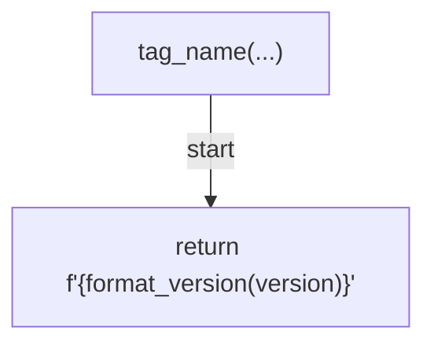
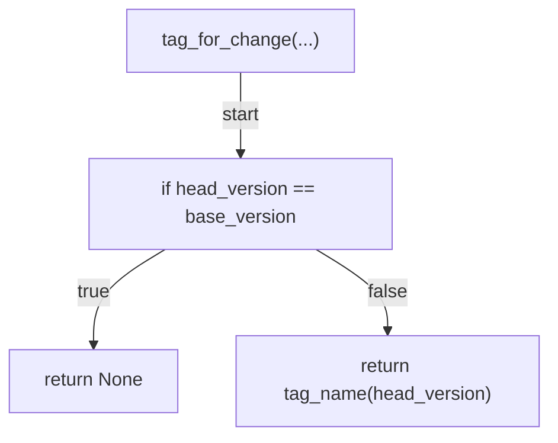
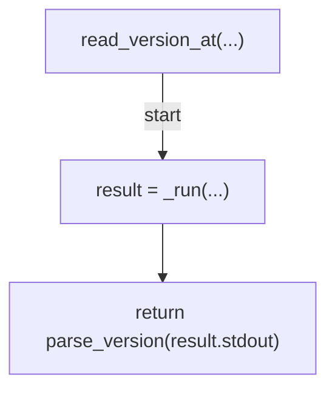
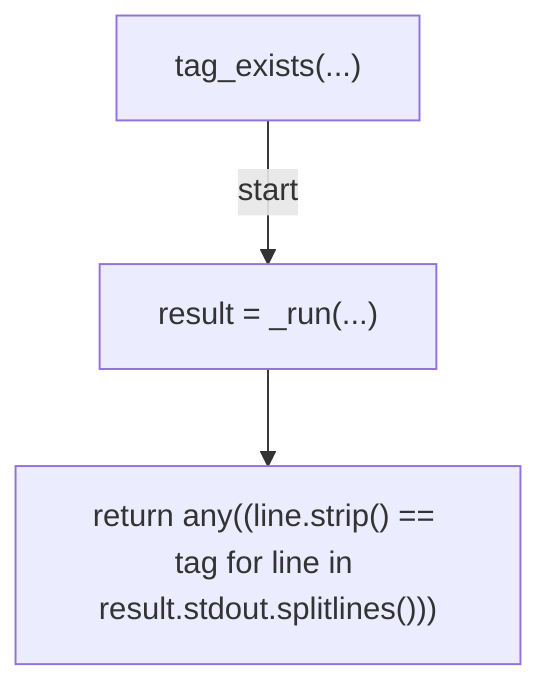
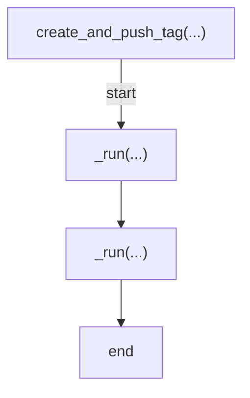
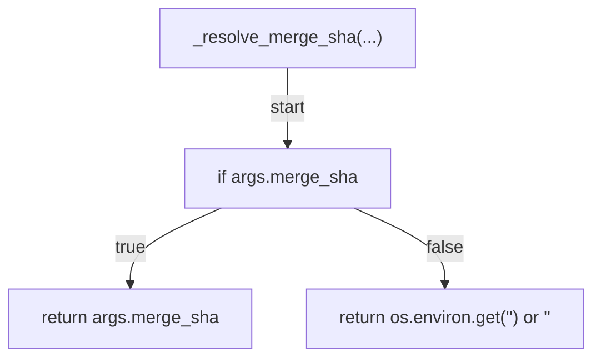
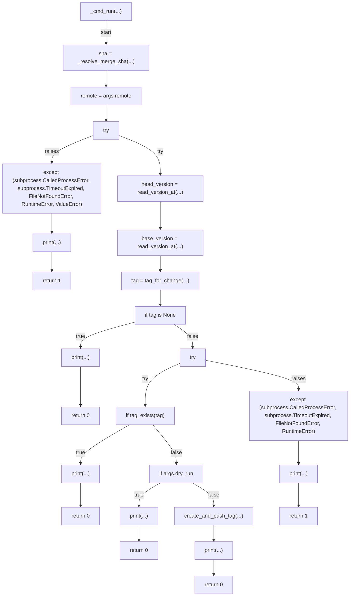
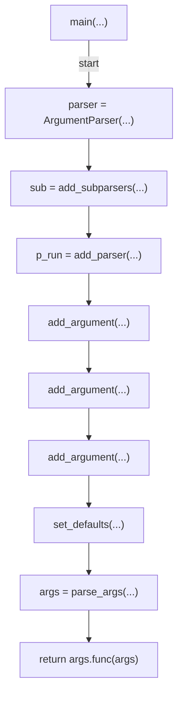
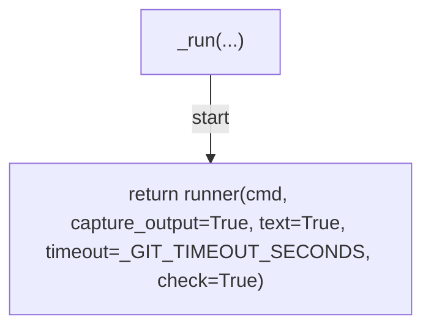

# AST graph: scripts/auto_tag_version.py

This file is generated from `scripts/auto_tag_version.py` by `python3 scripts/script_ast_graph.py all-doc`. Do not edit it by hand: content under `docs/generated/scripts/` is owned by the post-merge automation (refs #1540); update the source script instead.

## tag_name(...)

## tag_for_change(...)

## read_version_at(...)

## tag_exists(...)

## create_and_push_tag(...)

## _resolve_merge_sha(...)

## _cmd_run(...)

## main(...)

## _run(...)

