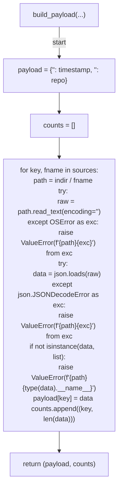
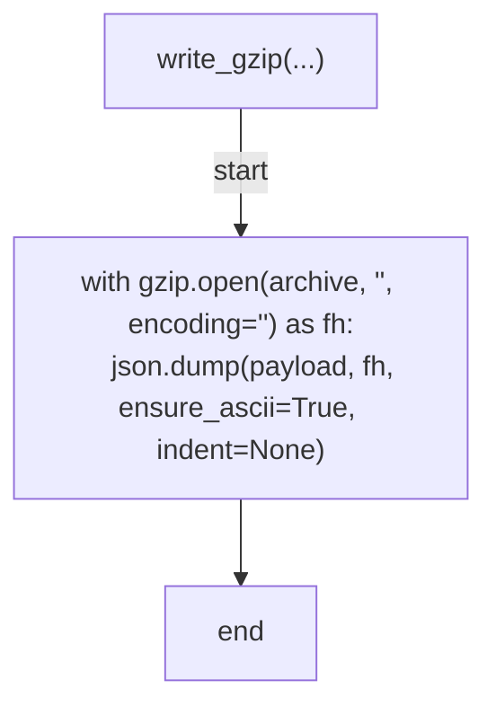
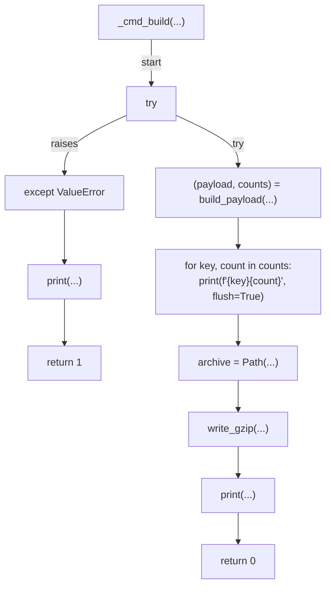
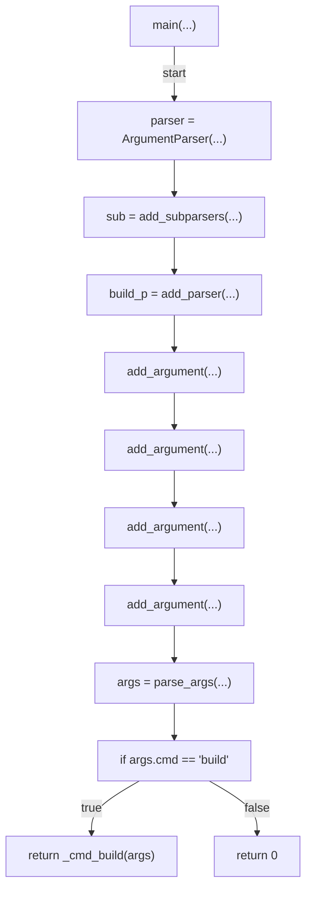

# AST graph: scripts/backup_archive.py

This file is generated from `scripts/backup_archive.py` by `python3 scripts/script_ast_graph.py all-doc`. Do not edit it by hand: content under `docs/generated/scripts/` is owned by the post-merge automation (refs #1540) -- update the source script instead.

## build_payload(...)

## write_gzip(...)

## _cmd_build(...)

## main(...)

