# AST graph: scripts/backup_non_ascii.py

This file is generated from `scripts/backup_non_ascii.py` by `python3 scripts/script_ast_graph.py all-doc`. Do not edit it by hand: content under `docs/generated/scripts/` is owned by the post-merge automation (refs #1540); update the source script instead.

## _parent_number_from_url(...)

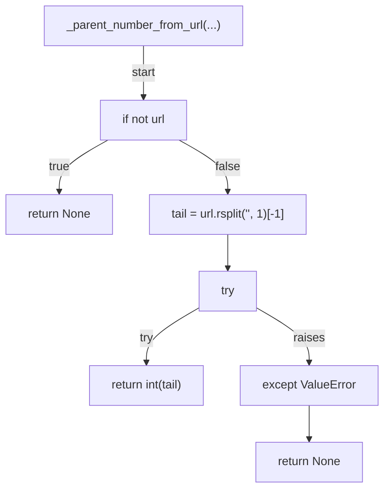

## _normalise_issue_or_pr(...)

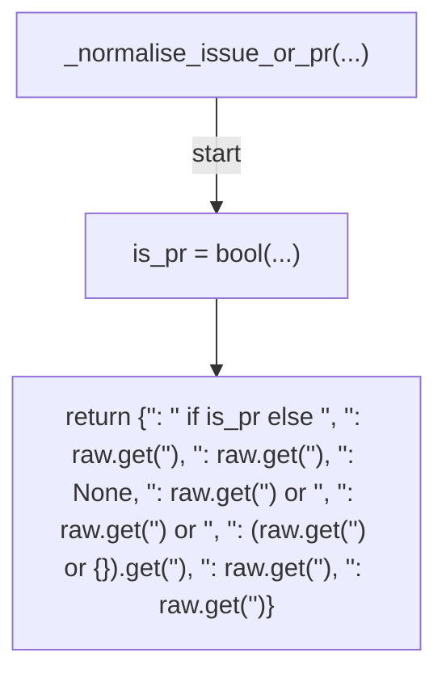

## _normalise_issue_comment(...)

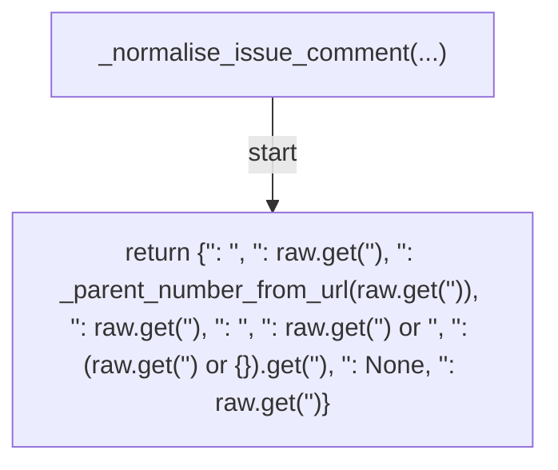

## _normalise_pr_review_comment(...)

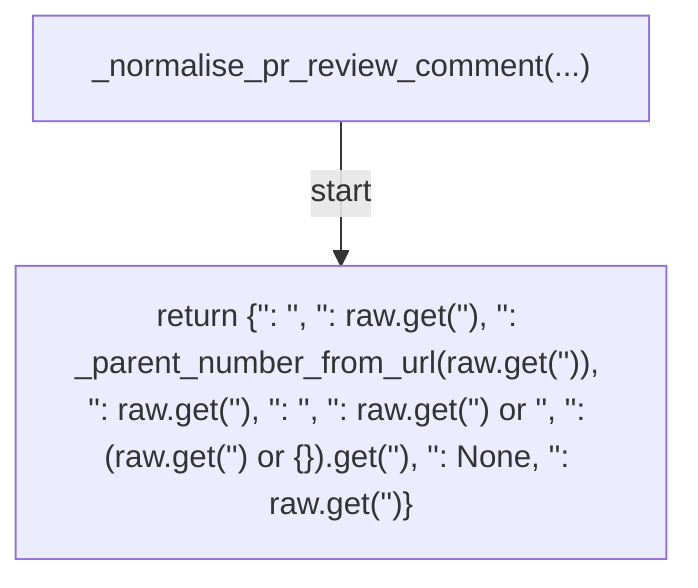

## normalise_items(...)

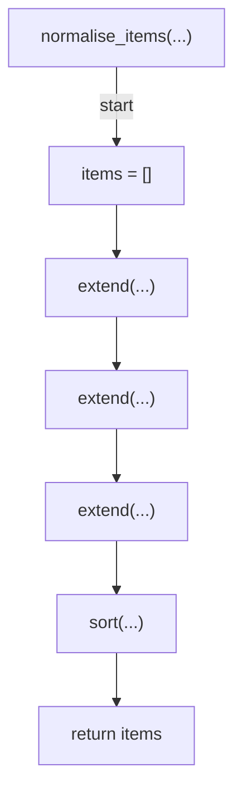

## build_payload(...)

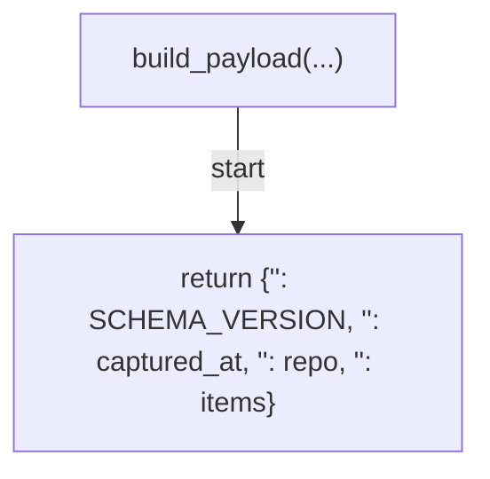

## serialise_payload(...)

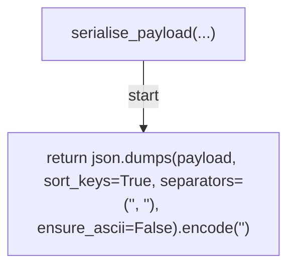

## gzip_bytes(...)

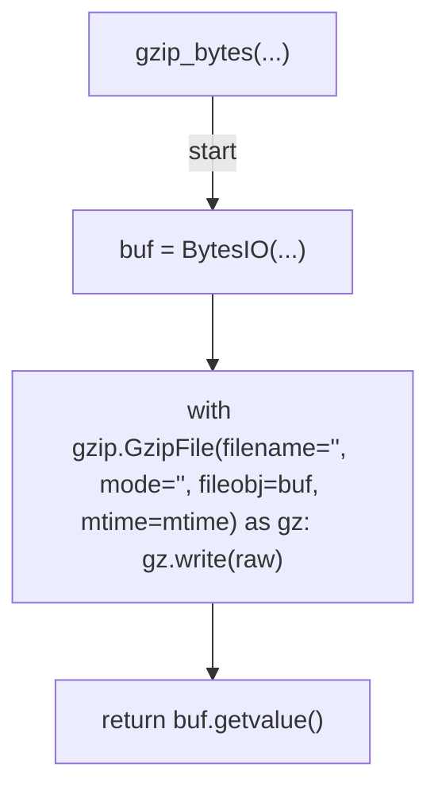

## sha256_hex(...)

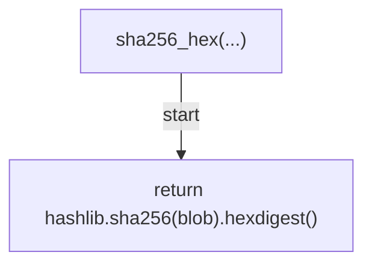

## _now_iso(...)

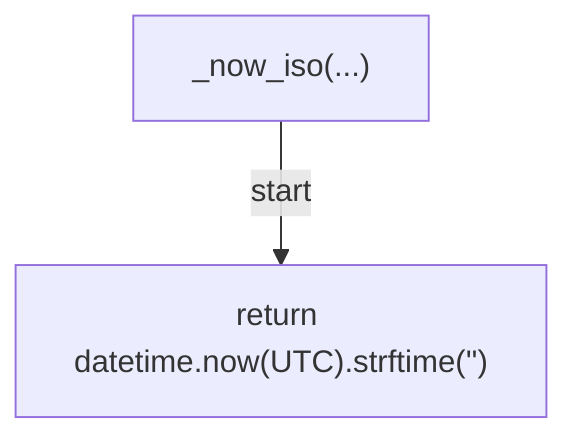

## gh_paginate(...)

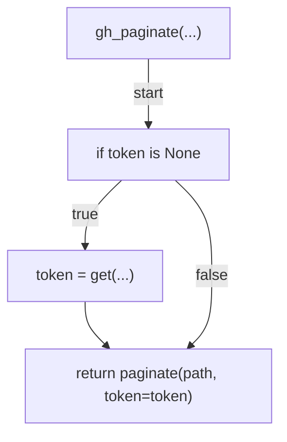

## cmd_capture(...)

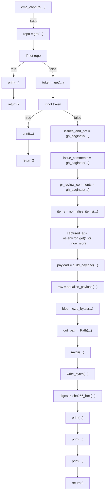

## cmd_sha256(...)

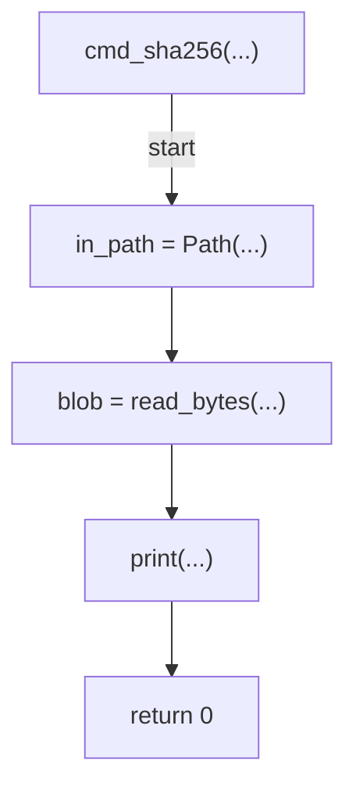

## build_parser(...)

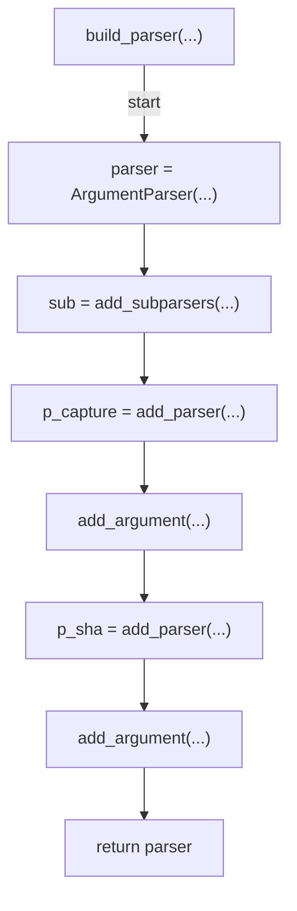

## main(...)

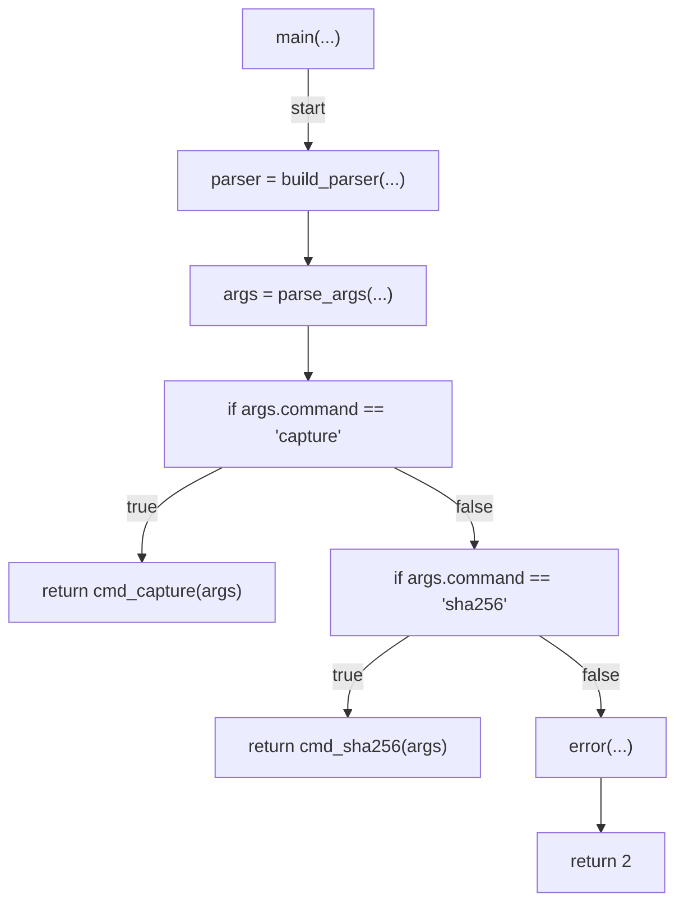
