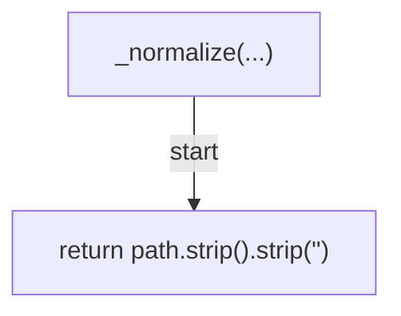
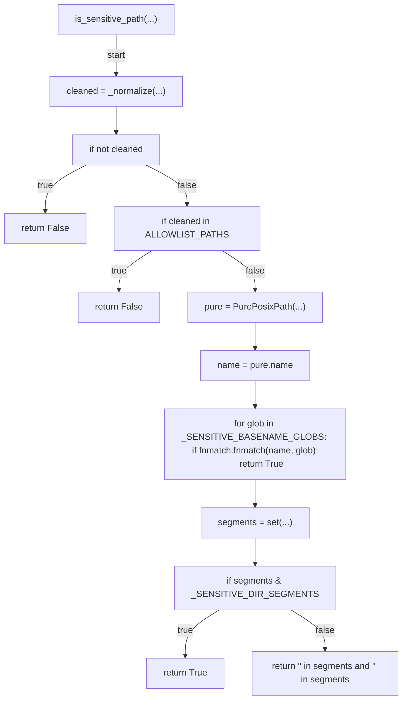
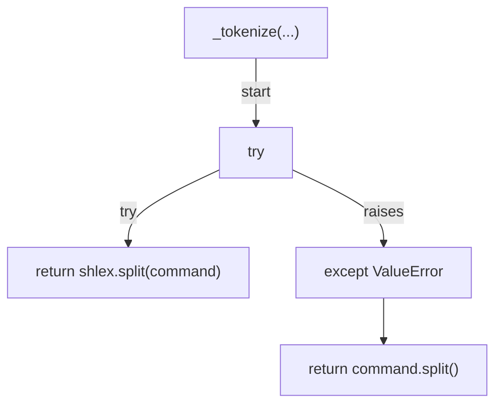
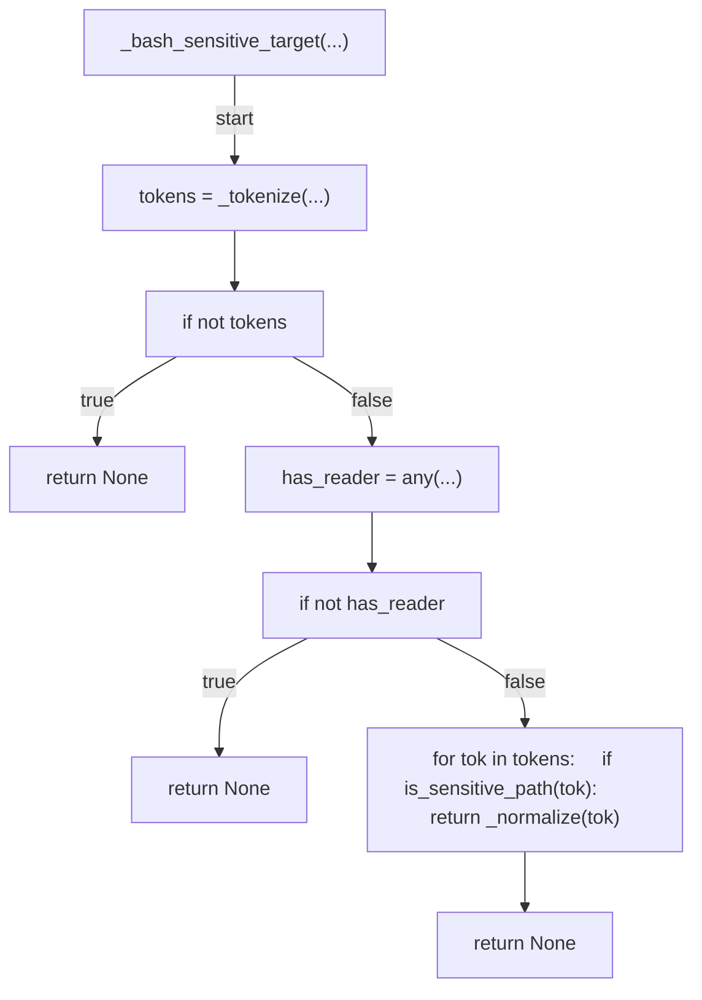
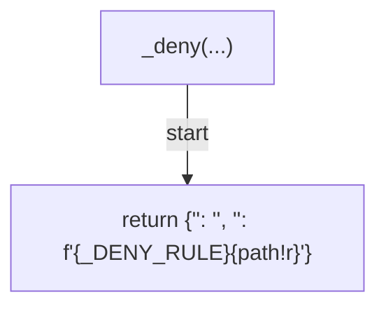
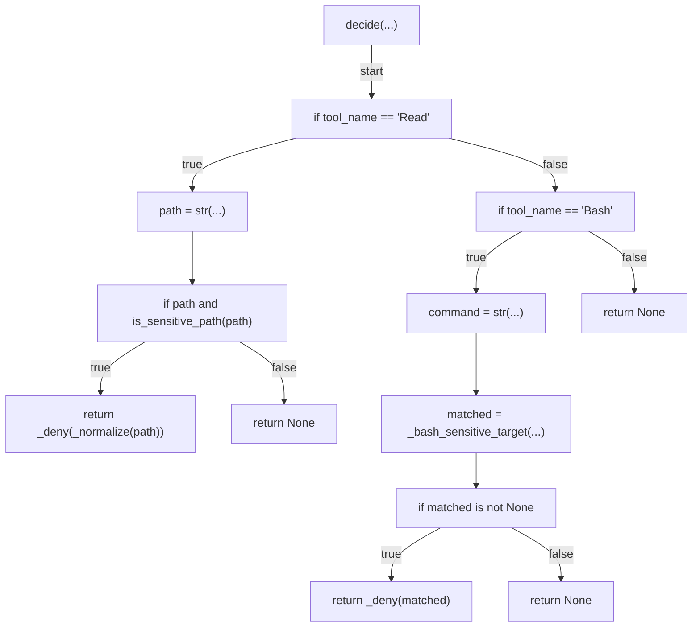
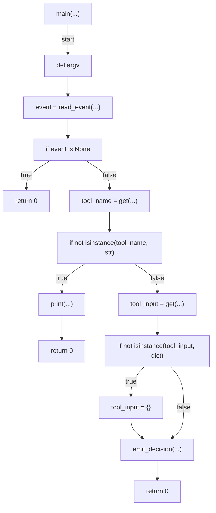

# AST graph: scripts/block_sensitive_reads.py

This file is generated from `scripts/block_sensitive_reads.py` by `python3 scripts/script_ast_graph.py all-doc`. Do not edit it by hand: content under `docs/generated/scripts/` is owned by the post-merge automation (refs #1540) -- update the source script instead.

## _normalize(...)

## is_sensitive_path(...)

## _tokenize(...)

## _bash_sensitive_target(...)

## _deny(...)

## decide(...)

## main(...)

