# AST graph: scripts/body_policy.py

This file is generated from `scripts/body_policy.py` by `python3 scripts/script_ast_graph.py all-doc`. Do not edit it by hand: content under `docs/generated/scripts/` is owned by the post-merge automation (refs #1540) -- update the source script instead.

## extract_headings(...)

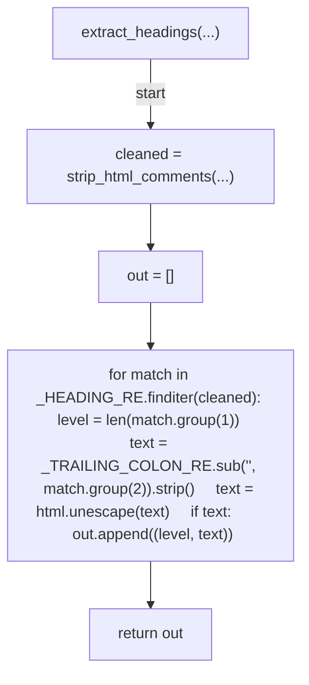
```mermaid
flowchart TD
    N001["extract_headings(...)"]
    N002["cleaned = strip_html_comments(...)"]
    N003["out = []"]
    N004["for match in _HEADING_RE.finditer(cleaned):     level = len(match.group(1))     text = _TRAILING_COLON_RE.sub('<str>', match.group(2)).strip()     text = html.unescape(text)     if text:         out.append((level, text))"]
    N005["return out"]
    N001 -->|"start"| N002
    N002 --> N003
    N003 --> N004
    N004 --> N005
```

## required_sections(...)

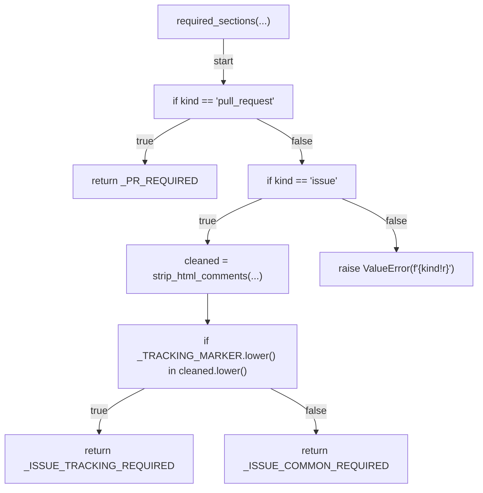
```mermaid
flowchart TD
    N001["required_sections(...)"]
    N002["if kind == 'pull_request'"]
    N003["return _PR_REQUIRED"]
    N004["if kind == 'issue'"]
    N005["cleaned = strip_html_comments(...)"]
    N006["if _TRACKING_MARKER.lower() in cleaned.lower()"]
    N007["return _ISSUE_TRACKING_REQUIRED"]
    N008["return _ISSUE_COMMON_REQUIRED"]
    N009["raise ValueError(f'<str>{kind!r}')"]
    N001 -->|"start"| N002
    N002 -->|"true"| N003
    N002 -->|"false"| N004
    N004 -->|"true"| N005
    N005 --> N006
    N006 -->|"true"| N007
    N006 -->|"false"| N008
    N004 -->|"false"| N009
```

## _normalize_heading(...)

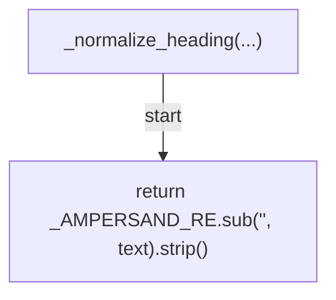
```mermaid
flowchart TD
    N001["_normalize_heading(...)"]
    N002["return _AMPERSAND_RE.sub('<str>', text).strip()"]
    N001 -->|"start"| N002
```

## missing_sections(...)

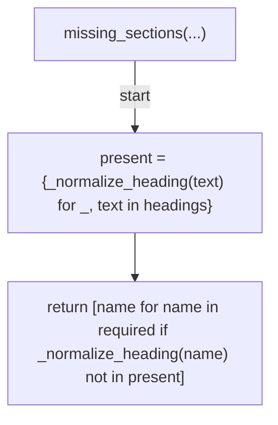
```mermaid
flowchart TD
    N001["missing_sections(...)"]
    N002["present = {_normalize_heading(text) for _, text in headings}"]
    N003["return [name for name in required if _normalize_heading(name) not in present]"]
    N001 -->|"start"| N002
    N002 --> N003
```

## unexpected_pr_sections(...)

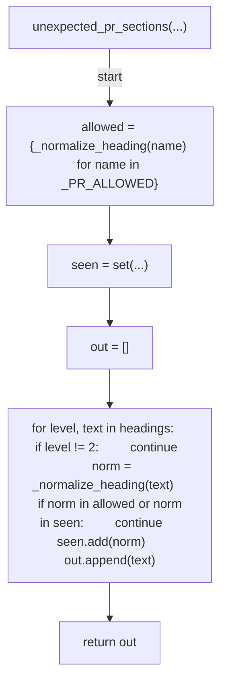
```mermaid
flowchart TD
    N001["unexpected_pr_sections(...)"]
    N002["allowed = {_normalize_heading(name) for name in _PR_ALLOWED}"]
    N003["seen = set(...)"]
    N004["out = []"]
    N005["for level, text in headings:     if level != 2:         continue     norm = _normalize_heading(text)     if norm in allowed or norm in seen:         continue     seen.add(norm)     out.append(text)"]
    N006["return out"]
    N001 -->|"start"| N002
    N002 --> N003
    N003 --> N004
    N004 --> N005
    N005 --> N006
```

## verify_pr_allowed_sections(...)

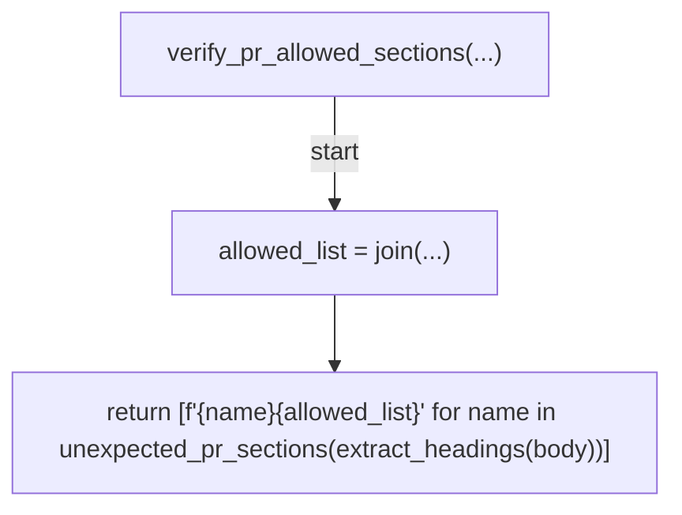
```mermaid
flowchart TD
    N001["verify_pr_allowed_sections(...)"]
    N002["allowed_list = join(...)"]
    N003["return [f'<str>{name}<str>{allowed_list}<str>' for name in unexpected_pr_sections(extract_headings(body))]"]
    N001 -->|"start"| N002
    N002 --> N003
```

## extract_section_body(...)

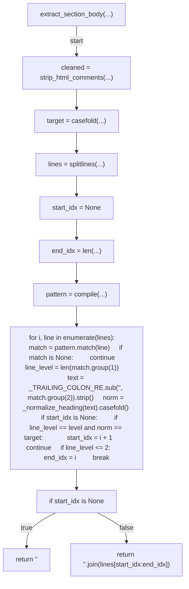
```mermaid
flowchart TD
    N001["extract_section_body(...)"]
    N002["cleaned = strip_html_comments(...)"]
    N003["target = casefold(...)"]
    N004["lines = splitlines(...)"]
    N005["start_idx = None"]
    N006["end_idx = len(...)"]
    N007["pattern = compile(...)"]
    N008["for i, line in enumerate(lines):     match = pattern.match(line)     if match is None:         continue     line_level = len(match.group(1))     text = _TRAILING_COLON_RE.sub('<str>', match.group(2)).strip()     norm = _normalize_heading(text).casefold()     if start_idx is None:         if line_level == level and norm == target:             start_idx = i + 1         continue     if line_level <= 2:         end_idx = i         break"]
    N009["if start_idx is None"]
    N010["return '<str>'"]
    N011["return '<str>'.join(lines[start_idx:end_idx])"]
    N001 -->|"start"| N002
    N002 --> N003
    N003 --> N004
    N004 --> N005
    N005 --> N006
    N006 --> N007
    N007 --> N008
    N008 --> N009
    N009 -->|"true"| N010
    N009 -->|"false"| N011
```

## verify_pr_verification_pairs(...)

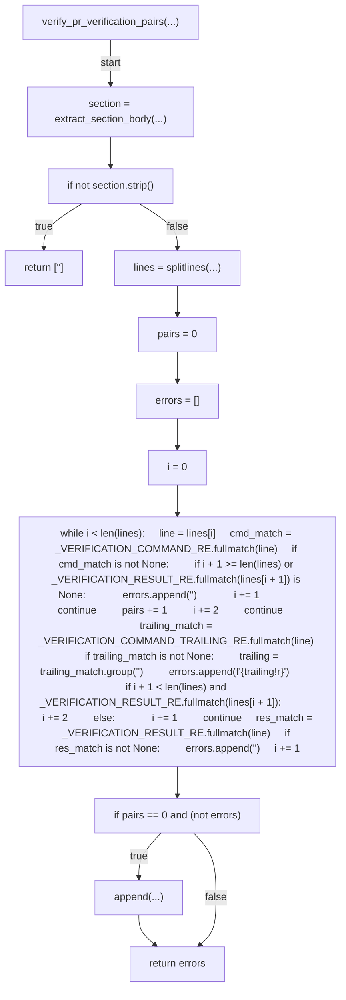
```mermaid
flowchart TD
    N001["verify_pr_verification_pairs(...)"]
    N002["section = extract_section_body(...)"]
    N003["if not section.strip()"]
    N004["return ['<str>']"]
    N005["lines = splitlines(...)"]
    N006["pairs = 0"]
    N007["errors = []"]
    N008["i = 0"]
    N009["while i < len(lines):     line = lines[i]     cmd_match = _VERIFICATION_COMMAND_RE.fullmatch(line)     if cmd_match is not None:         if i + 1 >= len(lines) or _VERIFICATION_RESULT_RE.fullmatch(lines[i + 1]) is None:             errors.append('<str>')             i += 1             continue         pairs += 1         i += 2         continue     trailing_match = _VERIFICATION_COMMAND_TRAILING_RE.fullmatch(line)     if trailing_match is not None:         trailing = trailing_match.group('<str>')         errors.append(f'<str>{trailing!r}<str>')         if i + 1 < len(lines) and _VERIFICATION_RESULT_RE.fullmatch(lines[i + 1]):             i += 2         else:             i += 1         continue     res_match = _VERIFICATION_RESULT_RE.fullmatch(line)     if res_match is not None:         errors.append('<str>')     i += 1"]
    N010["if pairs == 0 and (not errors)"]
    N011["append(...)"]
    N012["return errors"]
    N001 -->|"start"| N002
    N002 --> N003
    N003 -->|"true"| N004
    N003 -->|"false"| N005
    N005 --> N006
    N006 --> N007
    N007 --> N008
    N008 --> N009
    N009 --> N010
    N010 -->|"true"| N011
    N011 --> N012
    N010 -->|"false"| N012
```

## verify_pr_checklist_subsections(...)

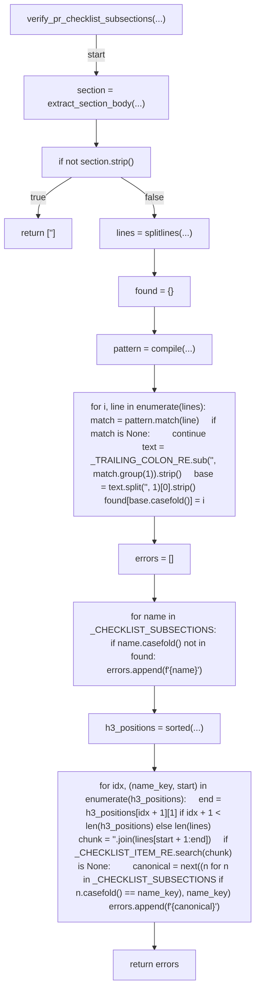
```mermaid
flowchart TD
    N001["verify_pr_checklist_subsections(...)"]
    N002["section = extract_section_body(...)"]
    N003["if not section.strip()"]
    N004["return ['<str>']"]
    N005["lines = splitlines(...)"]
    N006["found = {}"]
    N007["pattern = compile(...)"]
    N008["for i, line in enumerate(lines):     match = pattern.match(line)     if match is None:         continue     text = _TRAILING_COLON_RE.sub('<str>', match.group(1)).strip()     base = text.split('<str>', 1)[0].strip()     found[base.casefold()] = i"]
    N009["errors = []"]
    N010["for name in _CHECKLIST_SUBSECTIONS:     if name.casefold() not in found:         errors.append(f'<str>{name}<str>')"]
    N011["h3_positions = sorted(...)"]
    N012["for idx, (name_key, start) in enumerate(h3_positions):     end = h3_positions[idx + 1][1] if idx + 1 < len(h3_positions) else len(lines)     chunk = '<str>'.join(lines[start + 1:end])     if _CHECKLIST_ITEM_RE.search(chunk) is None:         canonical = next((n for n in _CHECKLIST_SUBSECTIONS if n.casefold() == name_key), name_key)         errors.append(f'<str>{canonical}<str>')"]
    N013["return errors"]
    N001 -->|"start"| N002
    N002 --> N003
    N003 -->|"true"| N004
    N003 -->|"false"| N005
    N005 --> N006
    N006 --> N007
    N007 --> N008
    N008 --> N009
    N009 --> N010
    N010 --> N011
    N011 --> N012
    N012 --> N013
```

## verify_pr_agent_attribution_footer(...)

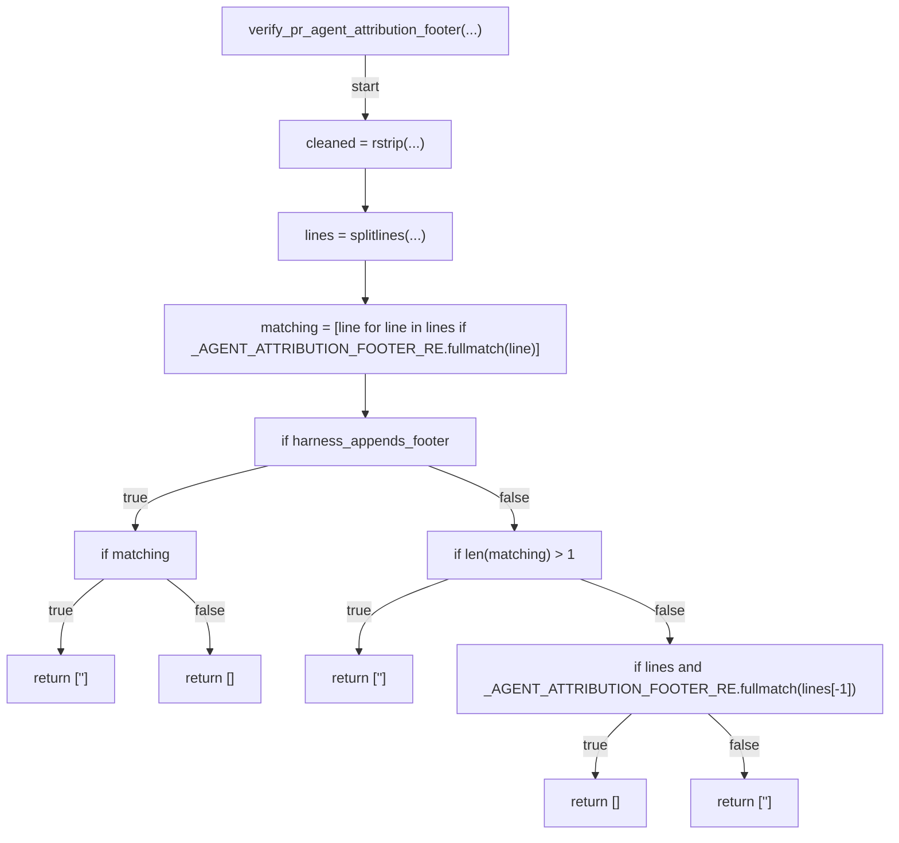
```mermaid
flowchart TD
    N001["verify_pr_agent_attribution_footer(...)"]
    N002["cleaned = rstrip(...)"]
    N003["lines = splitlines(...)"]
    N004["matching = [line for line in lines if _AGENT_ATTRIBUTION_FOOTER_RE.fullmatch(line)]"]
    N005["if harness_appends_footer"]
    N006["if matching"]
    N007["return ['<str>']"]
    N008["return []"]
    N009["if len(matching) > 1"]
    N010["return ['<str>']"]
    N011["if lines and _AGENT_ATTRIBUTION_FOOTER_RE.fullmatch(lines[-1])"]
    N012["return []"]
    N013["return ['<str>']"]
    N001 -->|"start"| N002
    N002 --> N003
    N003 --> N004
    N004 --> N005
    N005 -->|"true"| N006
    N006 -->|"true"| N007
    N006 -->|"false"| N008
    N005 -->|"false"| N009
    N009 -->|"true"| N010
    N009 -->|"false"| N011
    N011 -->|"true"| N012
    N011 -->|"false"| N013
```

## collapse_duplicate_footer(...)

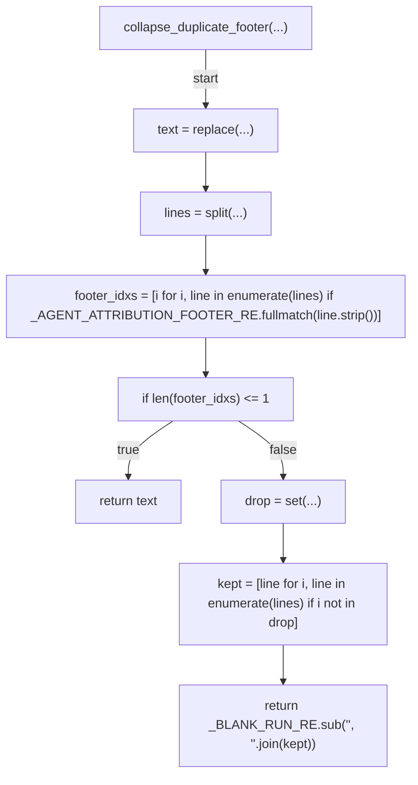
```mermaid
flowchart TD
    N001["collapse_duplicate_footer(...)"]
    N002["text = replace(...)"]
    N003["lines = split(...)"]
    N004["footer_idxs = [i for i, line in enumerate(lines) if _AGENT_ATTRIBUTION_FOOTER_RE.fullmatch(line.strip())]"]
    N005["if len(footer_idxs) <= 1"]
    N006["return text"]
    N007["drop = set(...)"]
    N008["kept = [line for i, line in enumerate(lines) if i not in drop]"]
    N009["return _BLANK_RUN_RE.sub('<str>', '<str>'.join(kept))"]
    N001 -->|"start"| N002
    N002 --> N003
    N003 --> N004
    N004 --> N005
    N005 -->|"true"| N006
    N005 -->|"false"| N007
    N007 --> N008
    N008 --> N009
```

## normalize_pr_body(...)

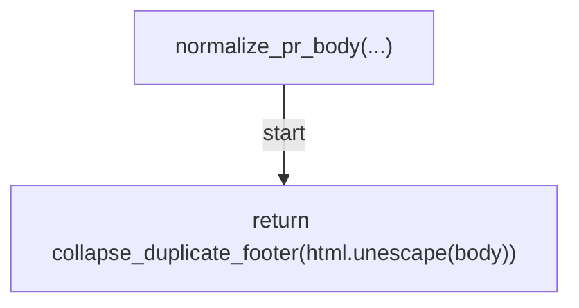
```mermaid
flowchart TD
    N001["normalize_pr_body(...)"]
    N002["return collapse_duplicate_footer(html.unescape(body))"]
    N001 -->|"start"| N002
```

## detect_dropped_angle_tokens(...)

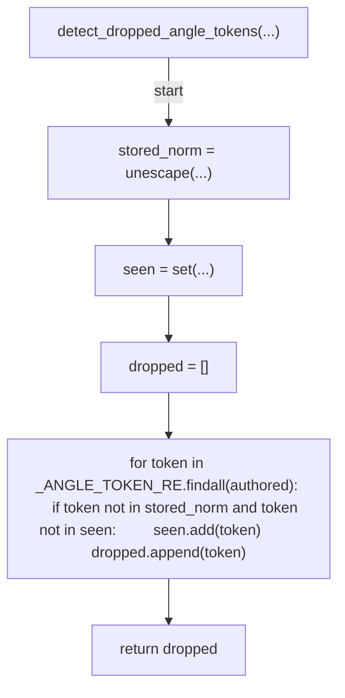
```mermaid
flowchart TD
    N001["detect_dropped_angle_tokens(...)"]
    N002["stored_norm = unescape(...)"]
    N003["seen = set(...)"]
    N004["dropped = []"]
    N005["for token in _ANGLE_TOKEN_RE.findall(authored):     if token not in stored_norm and token not in seen:         seen.add(token)         dropped.append(token)"]
    N006["return dropped"]
    N001 -->|"start"| N002
    N002 --> N003
    N003 --> N004
    N004 --> N005
    N005 --> N006
```

## build_codex_attribution_footer(...)

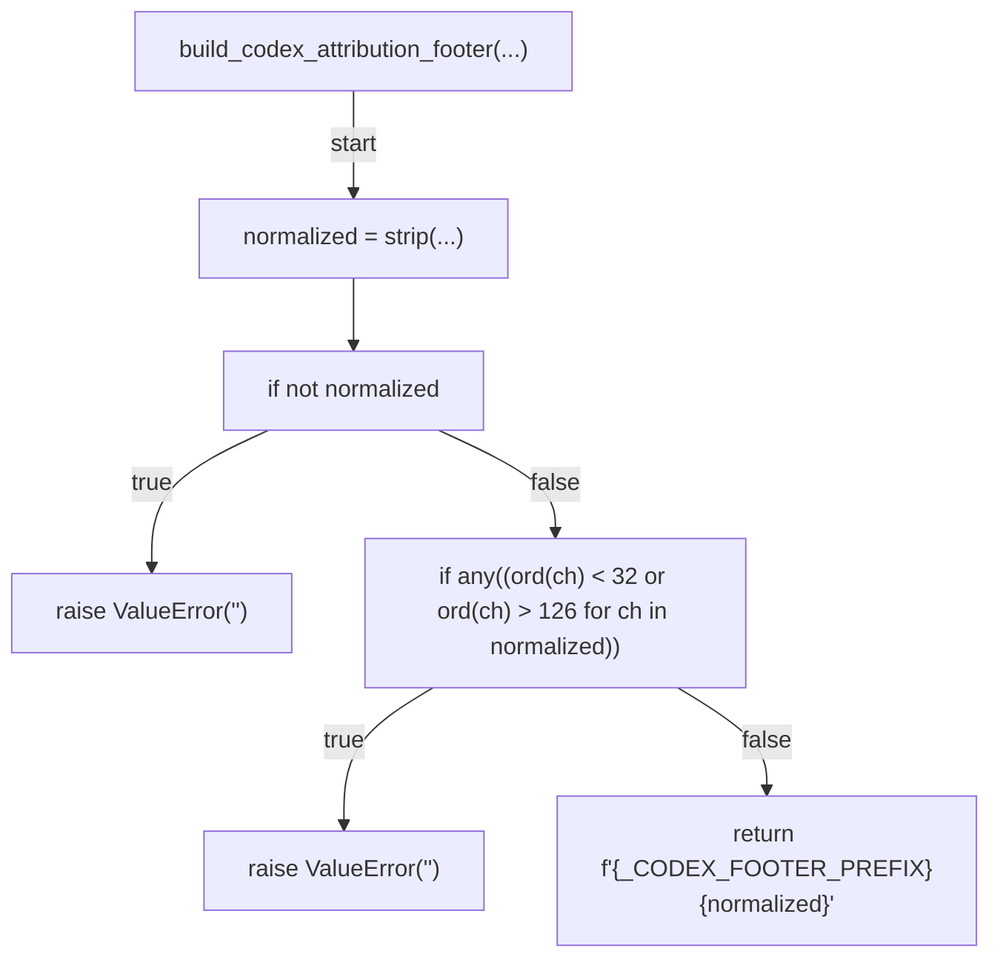
```mermaid
flowchart TD
    N001["build_codex_attribution_footer(...)"]
    N002["normalized = strip(...)"]
    N003["if not normalized"]
    N004["raise ValueError('<str>')"]
    N005["if any((ord(ch) < 32 or ord(ch) > 126 for ch in normalized))"]
    N006["raise ValueError('<str>')"]
    N007["return f'{_CODEX_FOOTER_PREFIX}{normalized}<str>'"]
    N001 -->|"start"| N002
    N002 --> N003
    N003 -->|"true"| N004
    N003 -->|"false"| N005
    N005 -->|"true"| N006
    N005 -->|"false"| N007
```

## verify_codex_attribution_footer(...)

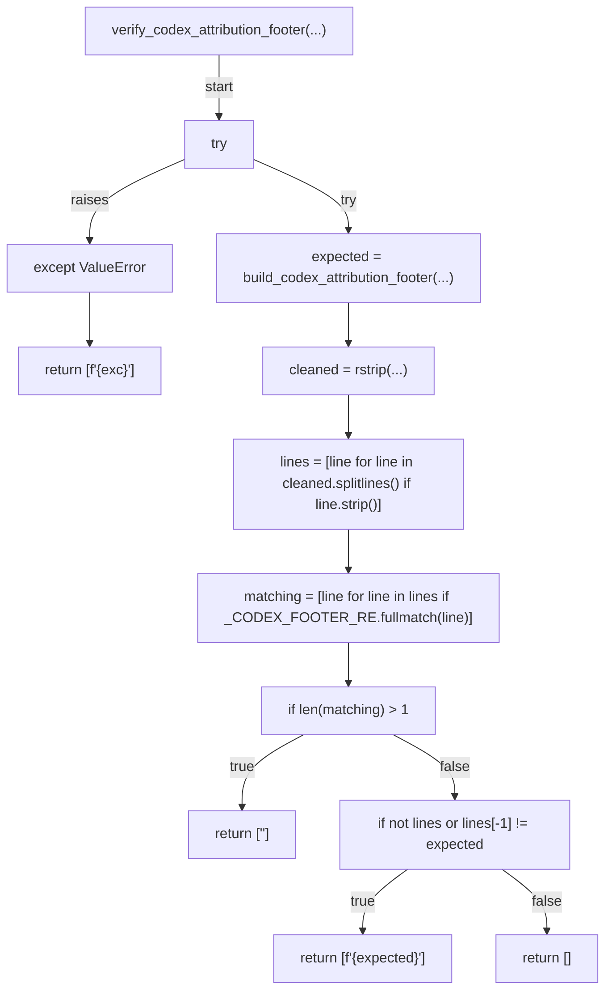
```mermaid
flowchart TD
    N001["verify_codex_attribution_footer(...)"]
    N002["try"]
    N003["expected = build_codex_attribution_footer(...)"]
    N004["except ValueError"]
    N005["return [f'<str>{exc}<str>']"]
    N006["cleaned = rstrip(...)"]
    N007["lines = [line for line in cleaned.splitlines() if line.strip()]"]
    N008["matching = [line for line in lines if _CODEX_FOOTER_RE.fullmatch(line)]"]
    N009["if len(matching) > 1"]
    N010["return ['<str>']"]
    N011["if not lines or lines[-1] != expected"]
    N012["return [f'<str>{expected}']"]
    N013["return []"]
    N001 -->|"start"| N002
    N002 -->|"try"| N003
    N002 -->|"raises"| N004
    N004 --> N005
    N003 --> N006
    N006 --> N007
    N007 --> N008
    N008 --> N009
    N009 -->|"true"| N010
    N009 -->|"false"| N011
    N011 -->|"true"| N012
    N011 -->|"false"| N013
```

## _parse_iso(...)

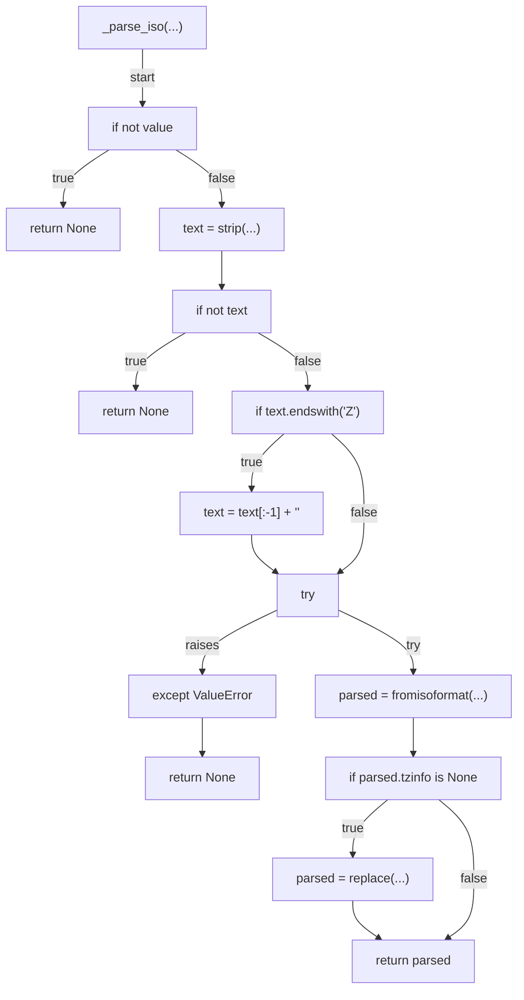
```mermaid
flowchart TD
    N001["_parse_iso(...)"]
    N002["if not value"]
    N003["return None"]
    N004["text = strip(...)"]
    N005["if not text"]
    N006["return None"]
    N007["if text.endswith('Z')"]
    N008["text = text[:-1] + '<str>'"]
    N009["try"]
    N010["parsed = fromisoformat(...)"]
    N011["except ValueError"]
    N012["return None"]
    N013["if parsed.tzinfo is None"]
    N014["parsed = replace(...)"]
    N015["return parsed"]
    N001 -->|"start"| N002
    N002 -->|"true"| N003
    N002 -->|"false"| N004
    N004 --> N005
    N005 -->|"true"| N006
    N005 -->|"false"| N007
    N007 -->|"true"| N008
    N008 --> N009
    N007 -->|"false"| N009
    N009 -->|"try"| N010
    N009 -->|"raises"| N011
    N011 --> N012
    N010 --> N013
    N013 -->|"true"| N014
    N014 --> N015
    N013 -->|"false"| N015
```

## is_within_gate_window(...)

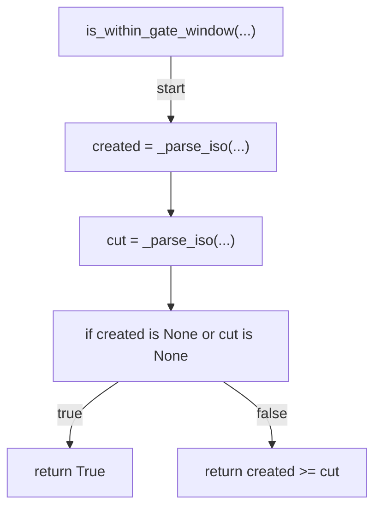
```mermaid
flowchart TD
    N001["is_within_gate_window(...)"]
    N002["created = _parse_iso(...)"]
    N003["cut = _parse_iso(...)"]
    N004["if created is None or cut is None"]
    N005["return True"]
    N006["return created >= cut"]
    N001 -->|"start"| N002
    N002 --> N003
    N003 --> N004
    N004 -->|"true"| N005
    N004 -->|"false"| N006
```

## _verify(...)

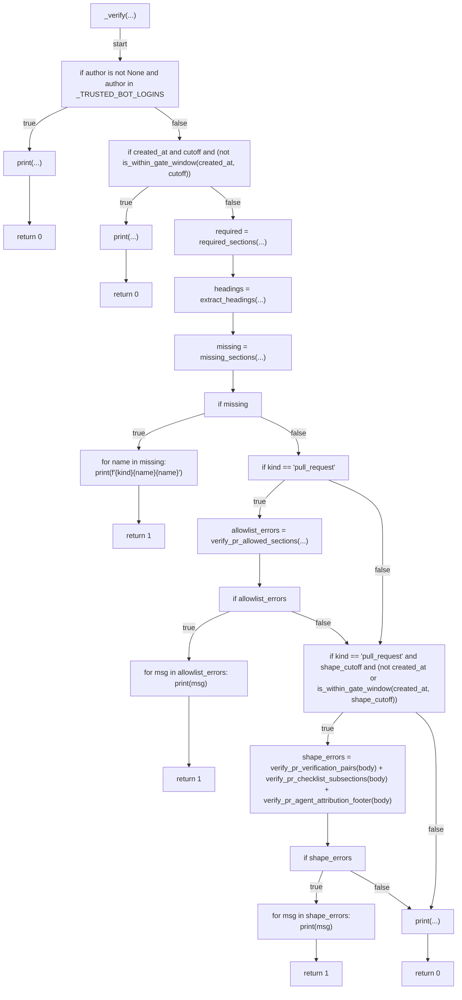
```mermaid
flowchart TD
    N001["_verify(...)"]
    N002["if author is not None and author in _TRUSTED_BOT_LOGINS"]
    N003["print(...)"]
    N004["return 0"]
    N005["if created_at and cutoff and (not is_within_gate_window(created_at, cutoff))"]
    N006["print(...)"]
    N007["return 0"]
    N008["required = required_sections(...)"]
    N009["headings = extract_headings(...)"]
    N010["missing = missing_sections(...)"]
    N011["if missing"]
    N012["for name in missing:     print(f'<str>{kind}<str>{name}<str>{name}<str>')"]
    N013["return 1"]
    N014["if kind == 'pull_request'"]
    N015["allowlist_errors = verify_pr_allowed_sections(...)"]
    N016["if allowlist_errors"]
    N017["for msg in allowlist_errors:     print(msg)"]
    N018["return 1"]
    N019["if kind == 'pull_request' and shape_cutoff and (not created_at or is_within_gate_window(created_at, shape_cutoff))"]
    N020["shape_errors = verify_pr_verification_pairs(body) + verify_pr_checklist_subsections(body) + verify_pr_agent_attribution_footer(body)"]
    N021["if shape_errors"]
    N022["for msg in shape_errors:     print(msg)"]
    N023["return 1"]
    N024["print(...)"]
    N025["return 0"]
    N001 -->|"start"| N002
    N002 -->|"true"| N003
    N003 --> N004
    N002 -->|"false"| N005
    N005 -->|"true"| N006
    N006 --> N007
    N005 -->|"false"| N008
    N008 --> N009
    N009 --> N010
    N010 --> N011
    N011 -->|"true"| N012
    N012 --> N013
    N011 -->|"false"| N014
    N014 -->|"true"| N015
    N015 --> N016
    N016 -->|"true"| N017
    N017 --> N018
    N016 -->|"false"| N019
    N014 -->|"false"| N019
    N019 -->|"true"| N020
    N020 --> N021
    N021 -->|"true"| N022
    N022 --> N023
    N021 -->|"false"| N024
    N019 -->|"false"| N024
    N024 --> N025
```

## _resolve_body(...)

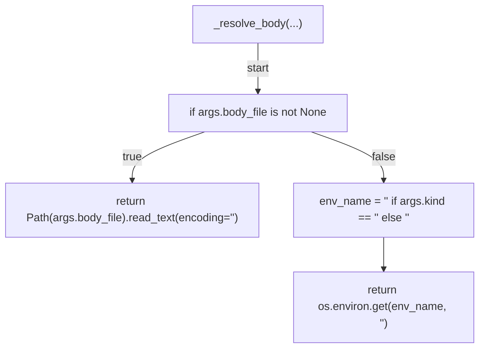
```mermaid
flowchart TD
    N001["_resolve_body(...)"]
    N002["if args.body_file is not None"]
    N003["return Path(args.body_file).read_text(encoding='<str>')"]
    N004["env_name = '<str>' if args.kind == '<str>' else '<str>'"]
    N005["return os.environ.get(env_name, '<str>')"]
    N001 -->|"start"| N002
    N002 -->|"true"| N003
    N002 -->|"false"| N004
    N004 --> N005
```

## _resolve_author(...)

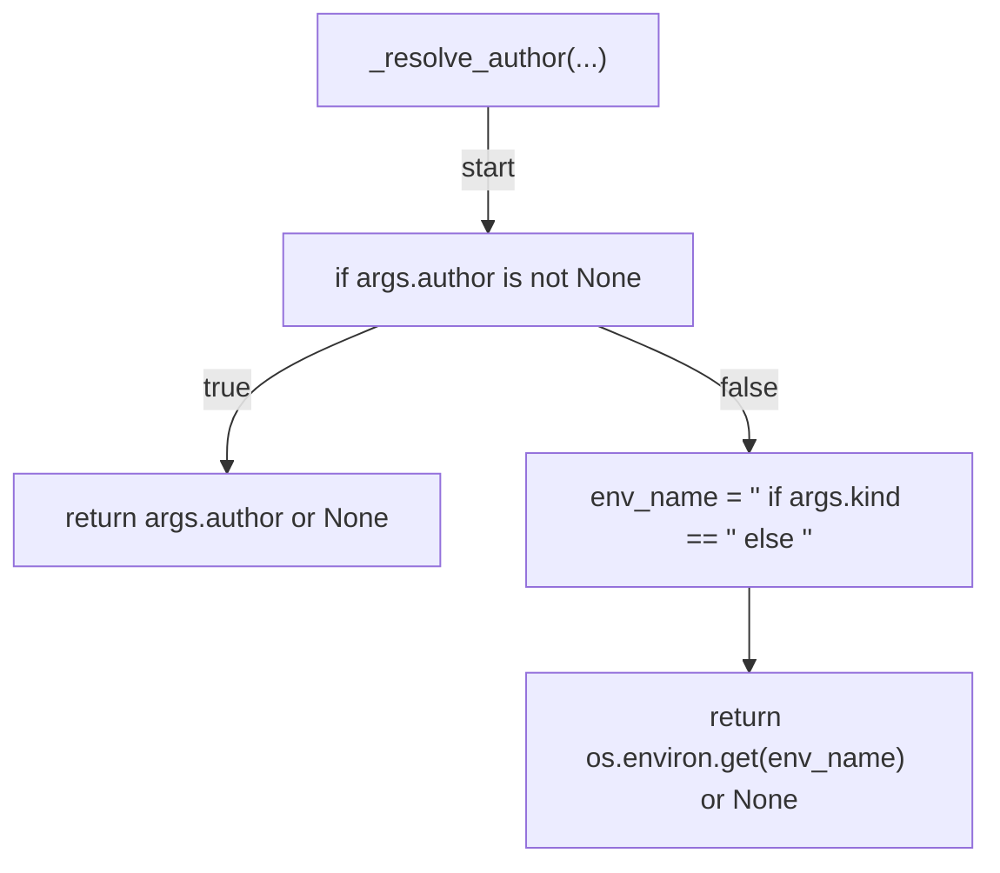
```mermaid
flowchart TD
    N001["_resolve_author(...)"]
    N002["if args.author is not None"]
    N003["return args.author or None"]
    N004["env_name = '<str>' if args.kind == '<str>' else '<str>'"]
    N005["return os.environ.get(env_name) or None"]
    N001 -->|"start"| N002
    N002 -->|"true"| N003
    N002 -->|"false"| N004
    N004 --> N005
```

## _resolve_created_at(...)

```mermaid
flowchart TD
    N001["_resolve_created_at(...)"]
    N002["if args.created_at is not None"]
    N003["return args.created_at"]
    N004["env_name = '<str>' if args.kind == '<str>' else '<str>'"]
    N005["return os.environ.get(env_name, '<str>')"]
    N001 -->|"start"| N002
    N002 -->|"true"| N003
    N002 -->|"false"| N004
    N004 --> N005
```

## _resolve_cutoff(...)

```mermaid
flowchart TD
    N001["_resolve_cutoff(...)"]
    N002["if args.cutoff is not None"]
    N003["return args.cutoff"]
    N004["return os.environ.get('<str>', '<str>')"]
    N001 -->|"start"| N002
    N002 -->|"true"| N003
    N002 -->|"false"| N004
```

## _resolve_shape_cutoff(...)

```mermaid
flowchart TD
    N001["_resolve_shape_cutoff(...)"]
    N002["if args.shape_cutoff is not None"]
    N003["return args.shape_cutoff"]
    N004["return os.environ.get('<str>', '<str>')"]
    N001 -->|"start"| N002
    N002 -->|"true"| N003
    N002 -->|"false"| N004
```

## _cmd_verify(...)

```mermaid
flowchart TD
    N001["_cmd_verify(...)"]
    N002["body = _resolve_body(...)"]
    N003["author = _resolve_author(...)"]
    N004["created_at = _resolve_created_at(...)"]
    N005["cutoff = _resolve_cutoff(...)"]
    N006["shape_cutoff = _resolve_shape_cutoff(...)"]
    N007["return _verify(args.kind, body, author=author, created_at=created_at, cutoff=cutoff, shape_cutoff=shape_cutoff)"]
    N001 -->|"start"| N002
    N002 --> N003
    N003 --> N004
    N004 --> N005
    N005 --> N006
    N006 --> N007
```

## main(...)

```mermaid
flowchart TD
    N001["main(...)"]
    N002["parser = ArgumentParser(...)"]
    N003["sub = add_subparsers(...)"]
    N004["p_verify = add_parser(...)"]
    N005["add_argument(...)"]
    N006["add_argument(...)"]
    N007["add_argument(...)"]
    N008["add_argument(...)"]
    N009["add_argument(...)"]
    N010["add_argument(...)"]
    N011["set_defaults(...)"]
    N012["args = parse_args(...)"]
    N013["try"]
    N014["return args.func(args)"]
    N015["except ValueError"]
    N016["print(...)"]
    N017["return 1"]
    N001 -->|"start"| N002
    N002 --> N003
    N003 --> N004
    N004 --> N005
    N005 --> N006
    N006 --> N007
    N007 --> N008
    N008 --> N009
    N009 --> N010
    N010 --> N011
    N011 --> N012
    N012 --> N013
    N013 -->|"try"| N014
    N013 -->|"raises"| N015
    N015 --> N016
    N016 --> N017
```
