# AST graph: scripts/branch_cleanup.py

This file is generated from `scripts/branch_cleanup.py` by `python3 scripts/script_ast_graph.py all-doc`. Do not edit it by hand: content under `docs/generated/scripts/` is owned by the post-merge automation (refs #1540) -- update the source script instead.

## parse_dry_run(...)

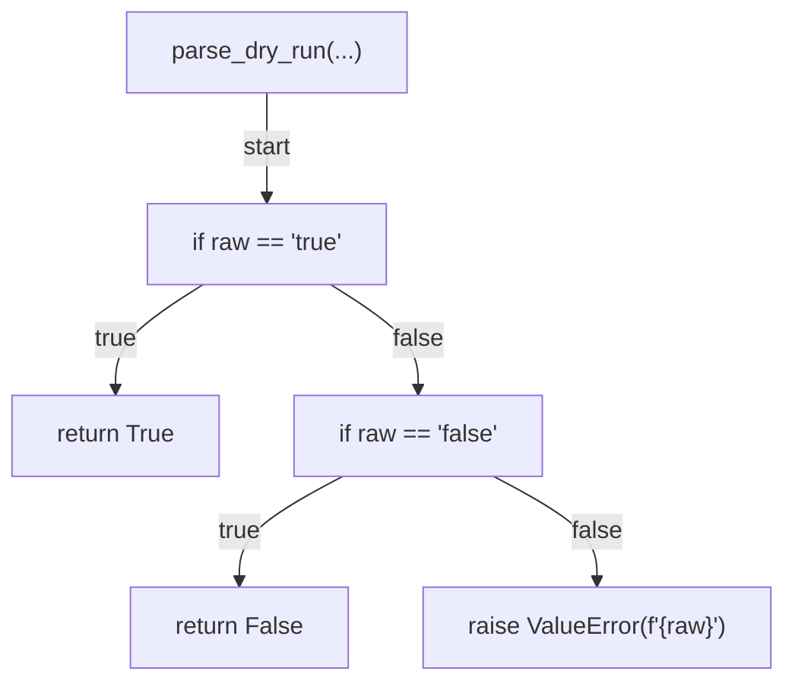

## parse_min_age_days(...)

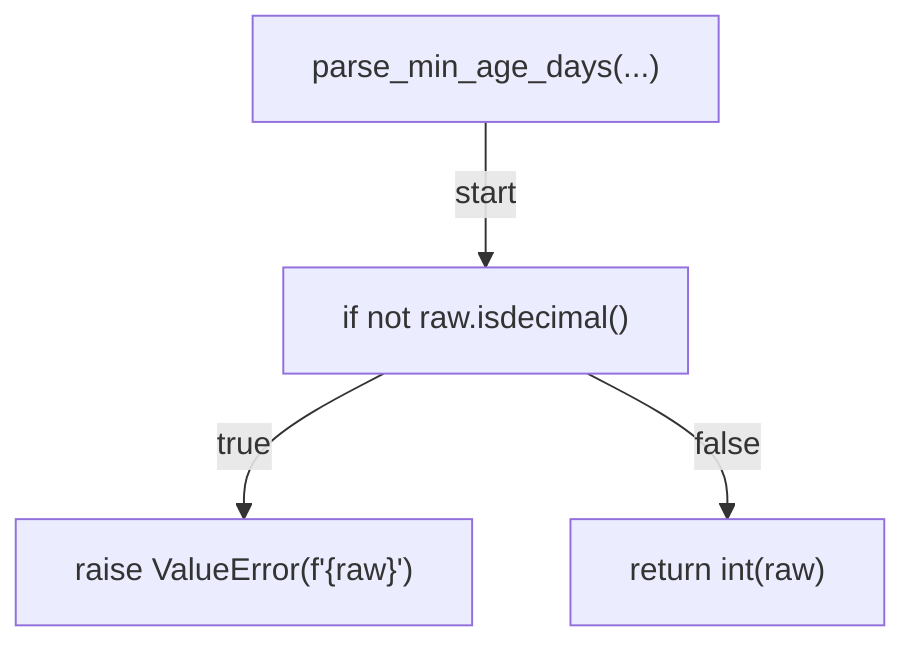

## is_candidate(...)

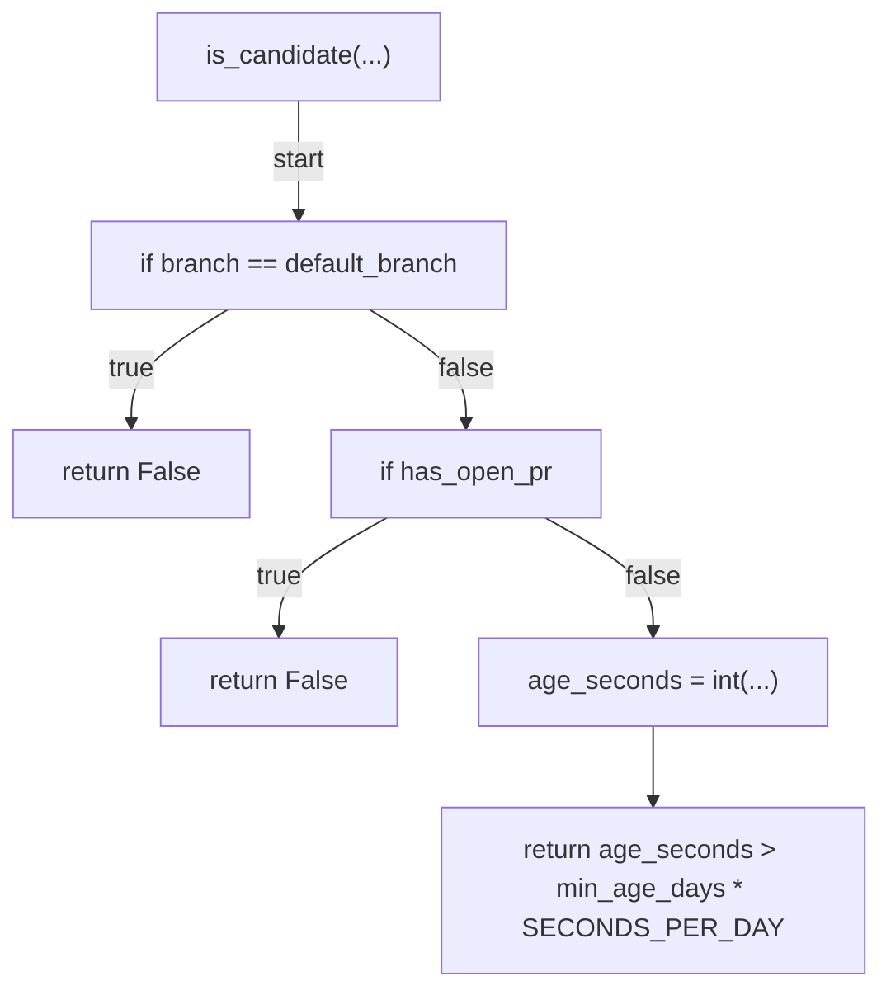

## format_summary_row(...)

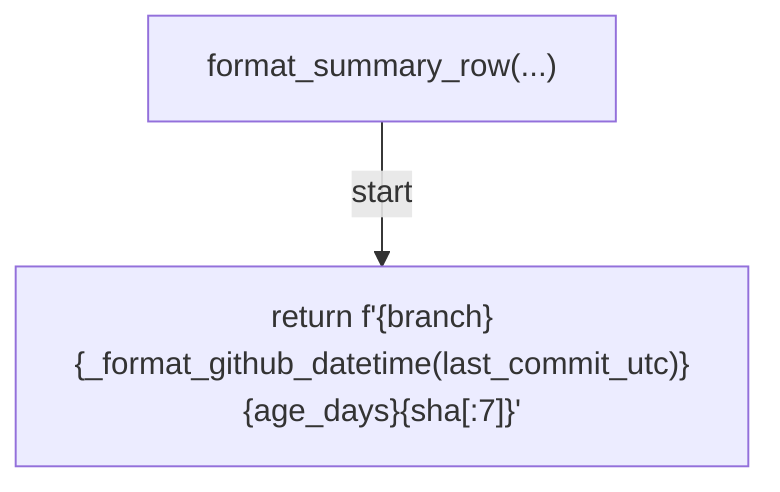

## decide_issue_action(...)

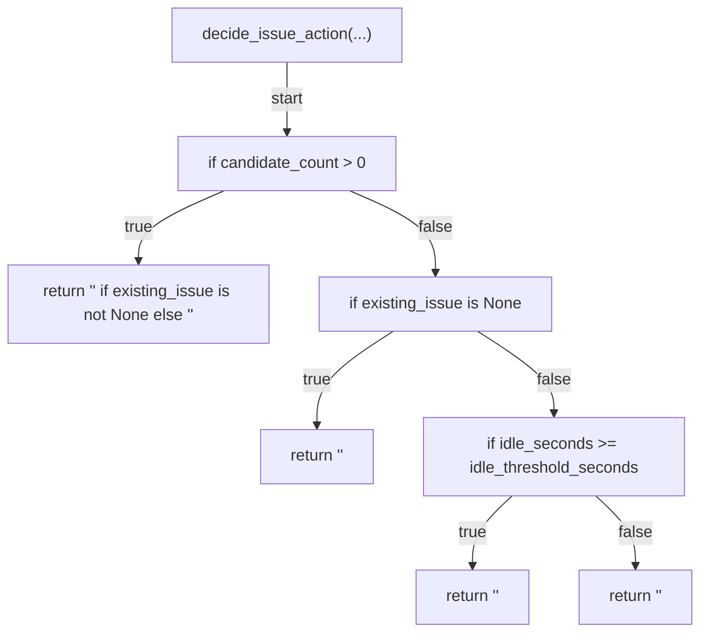

## list_branches(...)

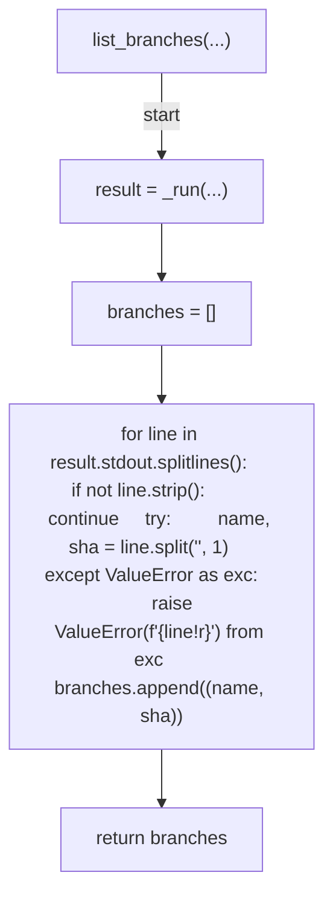

## get_last_commit_date(...)

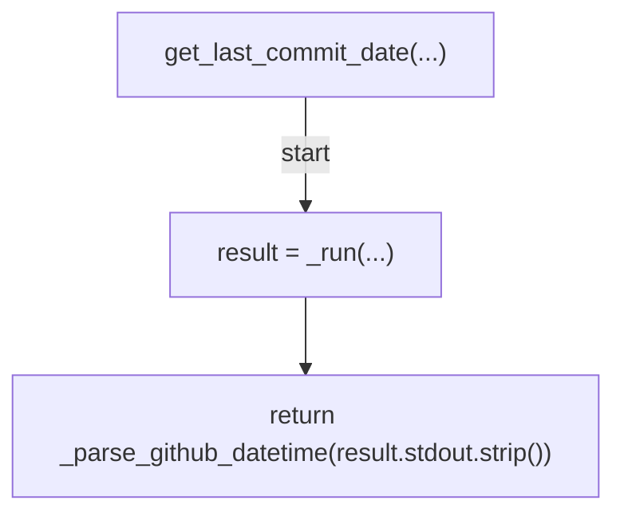

## count_open_prs_for_head(...)

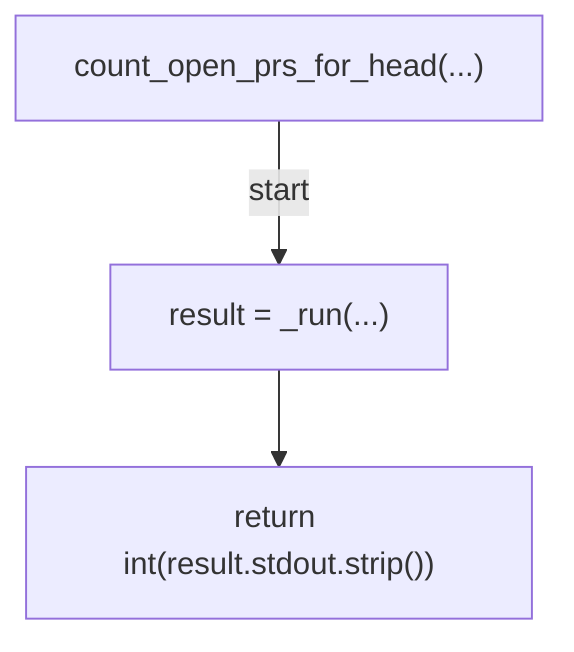

## find_rolling_issue(...)

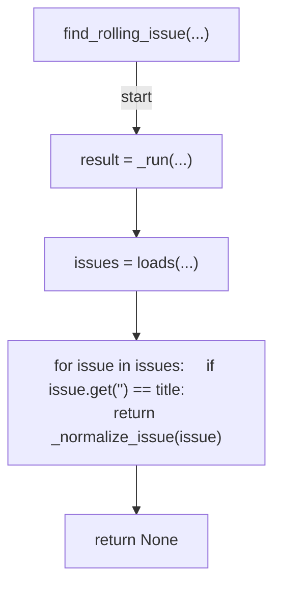

## comment_on_issue(...)

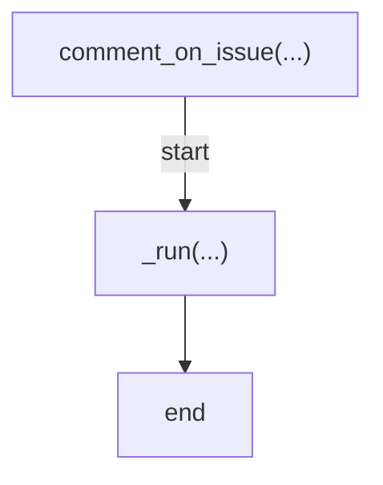

## create_issue(...)

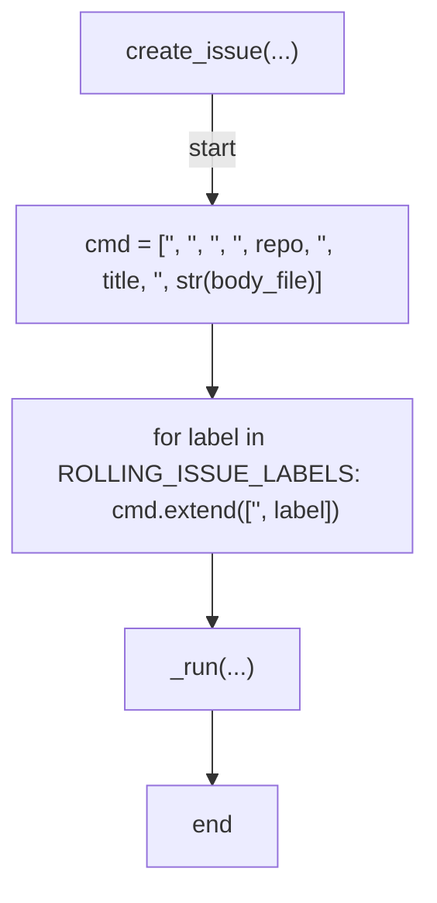

## close_issue_with_comment(...)

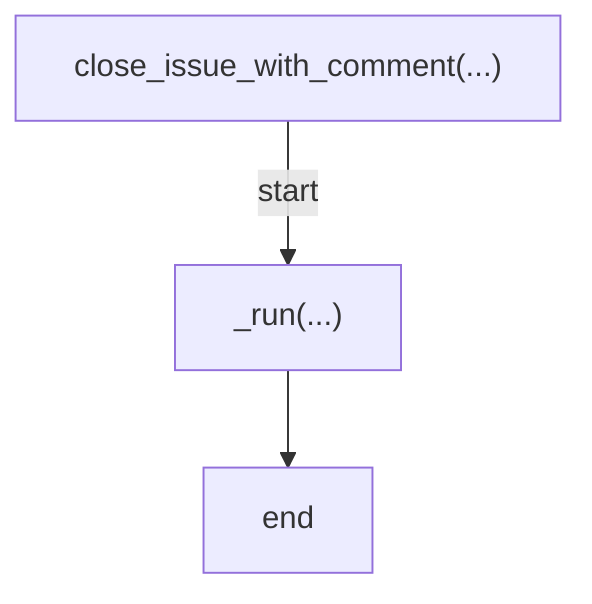

## fetch_issue_last_activity(...)

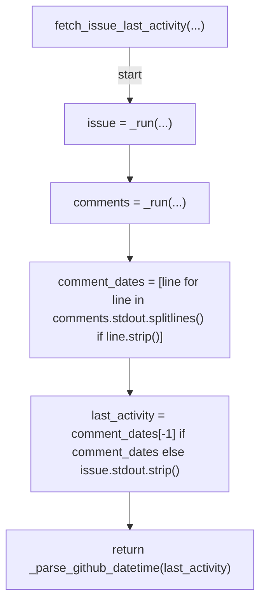

## render_survey(...)

```mermaid
flowchart TD
    N001["render_survey(...)"]
    N002["dry_run = parse_dry_run(...)"]
    N003["min_age_days = parse_min_age_days(...)"]
    N004["branches = list_branches(...)"]
    N005["rows = []"]
    N006["for branch, sha in branches:     if branch == default_branch:         continue     last_commit = get_last_commit_date(repo, sha, runner=runner)     age_seconds = int((now_utc - last_commit).total_seconds())     if age_seconds <= min_age_days * SECONDS_PER_DAY:         continue     has_open_pr = count_open_prs_for_head(repo, branch, runner=runner) > 0     if not is_candidate(branch=branch, default_branch=default_branch, last_commit_utc=last_commit, now_utc=now_utc, min_age_days=min_age_days, has_open_pr=has_open_pr):         continue     age_days = age_seconds // SECONDS_PER_DAY     rows.append(format_summary_row(branch, last_commit, age_days, sha))"]
    N007["summary_lines = _survey_header(...)"]
    N008["comment_lines = _comment_header(...)"]
    N009["if rows"]
    N010["extend(...)"]
    N011["extend(...)"]
    N012["append(...)"]
    N013["footer = f'<str>{len(rows)}<str>'"]
    N014["extend(...)"]
    N015["comment = None"]
    N016["if rows"]
    N017["extend(...)"]
    N018["comment = '<str>'.join(comment_lines) + '<str>'"]
    N019["extend(...)"]
    N020["return ('<str>'.join(summary_lines) + '<str>', comment, len(rows))"]
    N001 -->|"start"| N002
    N002 --> N003
    N003 --> N004
    N004 --> N005
    N005 --> N006
    N006 --> N007
    N007 --> N008
    N008 --> N009
    N009 -->|"true"| N010
    N010 --> N011
    N009 -->|"false"| N012
    N011 --> N013
    N012 --> N013
    N013 --> N014
    N014 --> N015
    N015 --> N016
    N016 -->|"true"| N017
    N017 --> N018
    N016 -->|"false"| N019
    N018 --> N020
    N019 --> N020
```

## _cmd_survey(...)

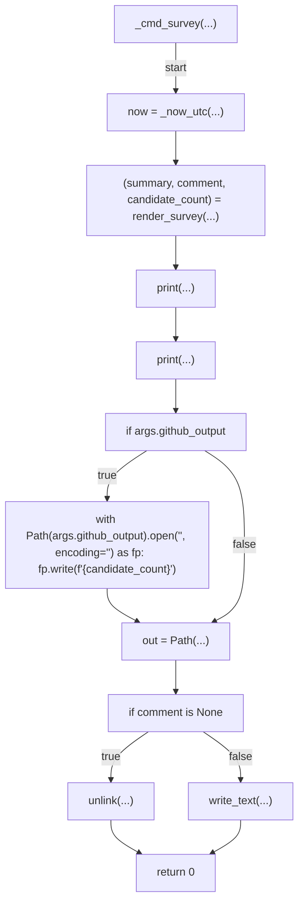

## _cmd_reconcile(...)

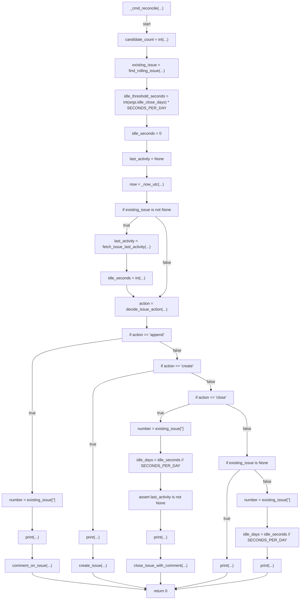

## _survey_header(...)

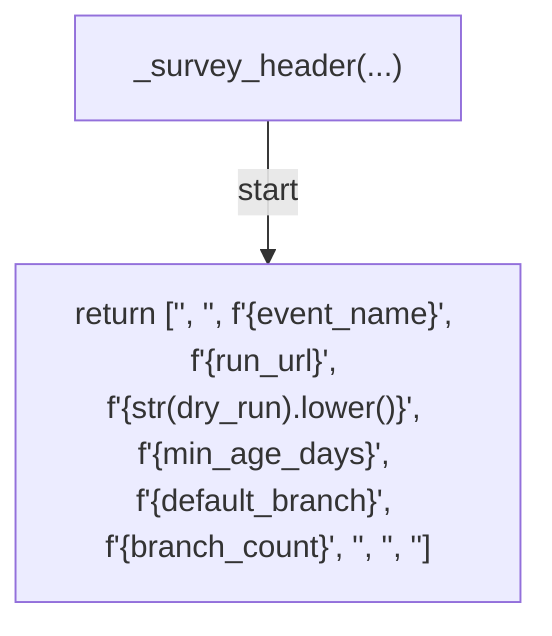

## _comment_header(...)

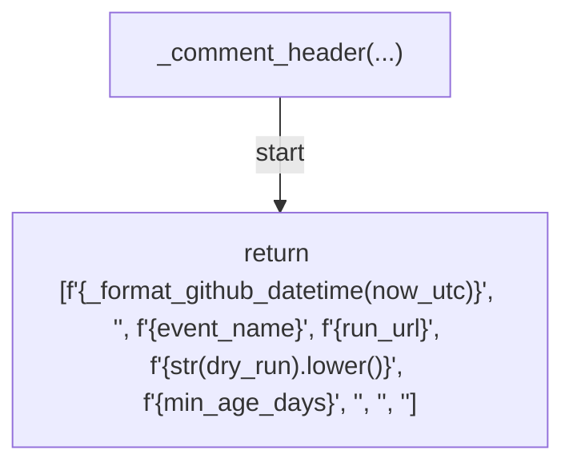

## _close_comment(...)

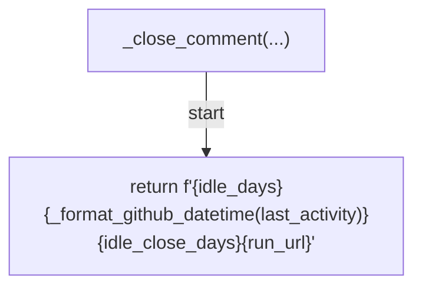

## _run(...)

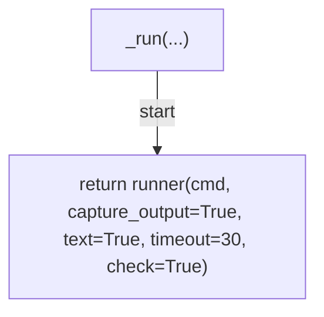

## _parse_github_datetime(...)

```mermaid
flowchart TD
    N001["_parse_github_datetime(...)"]
    N002["try"]
    N003["parsed = fromisoformat(...)"]
    N004["except ValueError"]
    N005["raise ValueError(f'<str>{raw!r}')"]
    N006["if parsed.tzinfo is None"]
    N007["raise ValueError(f'<str>{raw!r}')"]
    N008["return parsed.astimezone(UTC)"]
    N001 -->|"start"| N002
    N002 -->|"try"| N003
    N002 -->|"raises"| N004
    N004 --> N005
    N003 --> N006
    N006 -->|"true"| N007
    N006 -->|"false"| N008
```

## _format_github_datetime(...)

```mermaid
flowchart TD
    N001["_format_github_datetime(...)"]
    N002["return value.astimezone(UTC).isoformat().replace('<str>', '<str>')"]
    N001 -->|"start"| N002
```

## _normalize_issue(...)

```mermaid
flowchart TD
    N001["_normalize_issue(...)"]
    N002["normalized = dict(...)"]
    N003["if 'createdAt' in normalized"]
    N004["normalized['<str>'] = pop(...)"]
    N005["return normalized"]
    N001 -->|"start"| N002
    N002 --> N003
    N003 -->|"true"| N004
    N004 --> N005
    N003 -->|"false"| N005
```

## _now_utc(...)

```mermaid
flowchart TD
    N001["_now_utc(...)"]
    N002["return datetime.now(UTC)"]
    N001 -->|"start"| N002
```

## main(...)

```mermaid
flowchart TD
    N001["main(...)"]
    N002["parser = ArgumentParser(...)"]
    N003["sub = add_subparsers(...)"]
    N004["p_survey = add_parser(...)"]
    N005["add_argument(...)"]
    N006["add_argument(...)"]
    N007["add_argument(...)"]
    N008["add_argument(...)"]
    N009["add_argument(...)"]
    N010["add_argument(...)"]
    N011["add_argument(...)"]
    N012["add_argument(...)"]
    N013["set_defaults(...)"]
    N014["p_reconcile = add_parser(...)"]
    N015["add_argument(...)"]
    N016["add_argument(...)"]
    N017["add_argument(...)"]
    N018["add_argument(...)"]
    N019["add_argument(...)"]
    N020["add_argument(...)"]
    N021["set_defaults(...)"]
    N022["args = parse_args(...)"]
    N023["try"]
    N024["return args.func(args)"]
    N025["except (subprocess.CalledProcessError, ValueError)"]
    N026["print(...)"]
    N027["return 1"]
    N001 -->|"start"| N002
    N002 --> N003
    N003 --> N004
    N004 --> N005
    N005 --> N006
    N006 --> N007
    N007 --> N008
    N008 --> N009
    N009 --> N010
    N010 --> N011
    N011 --> N012
    N012 --> N013
    N013 --> N014
    N014 --> N015
    N015 --> N016
    N016 --> N017
    N017 --> N018
    N018 --> N019
    N019 --> N020
    N020 --> N021
    N021 --> N022
    N022 --> N023
    N023 -->|"try"| N024
    N023 -->|"raises"| N025
    N025 --> N026
    N026 --> N027
```
