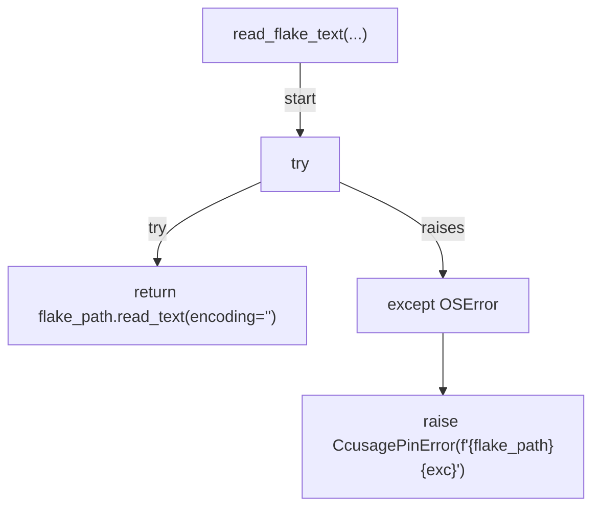
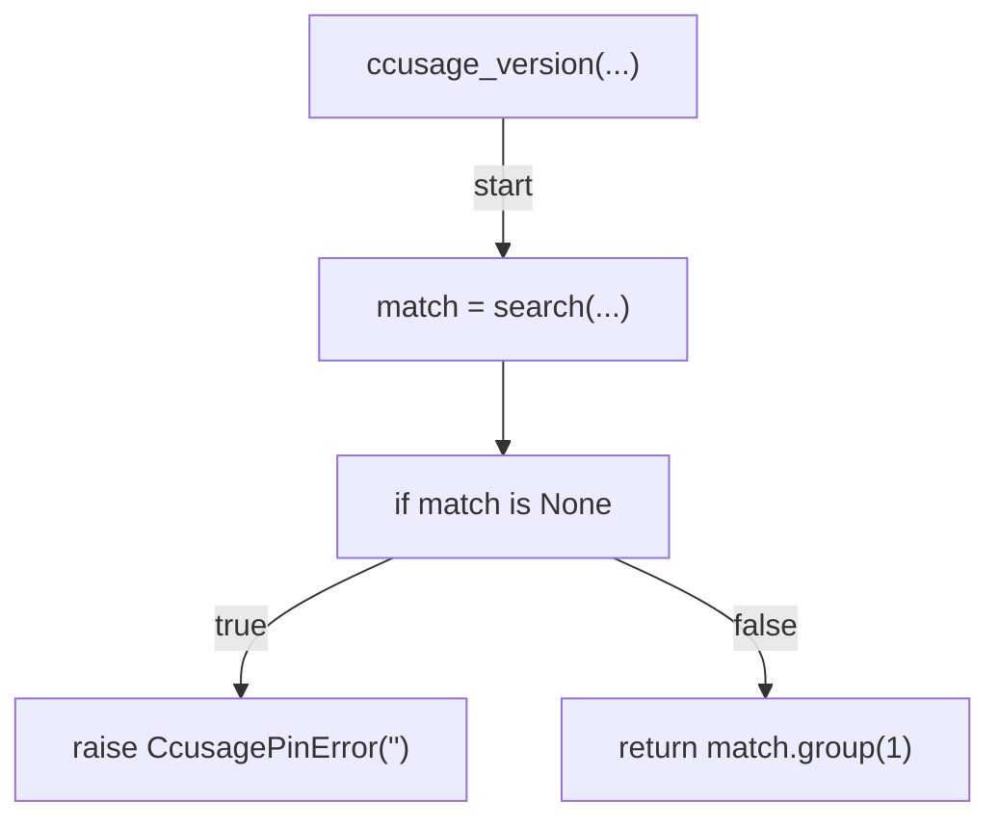
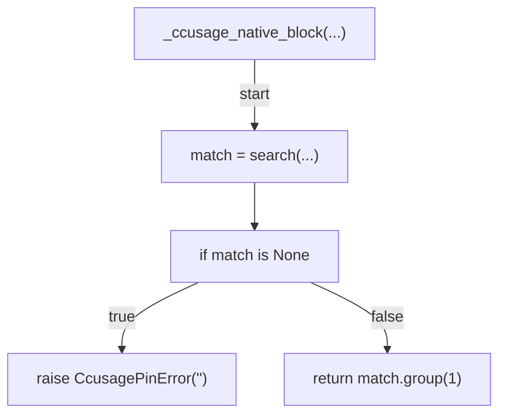
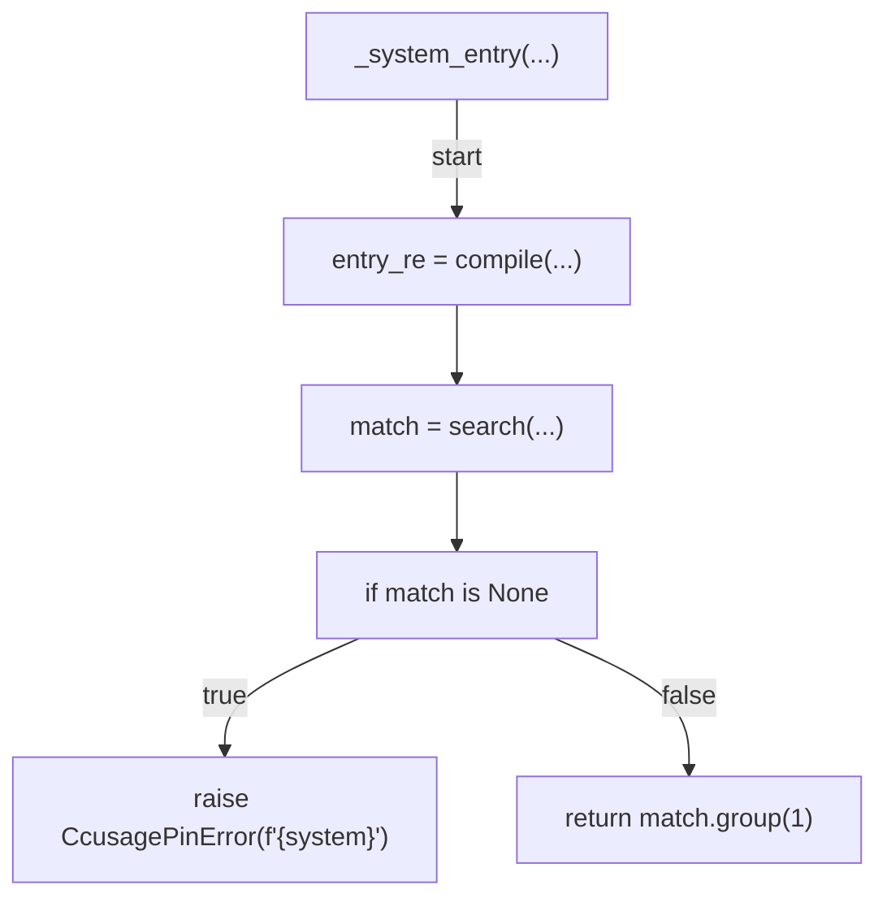
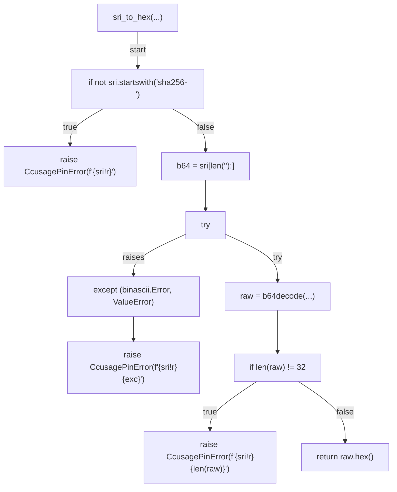
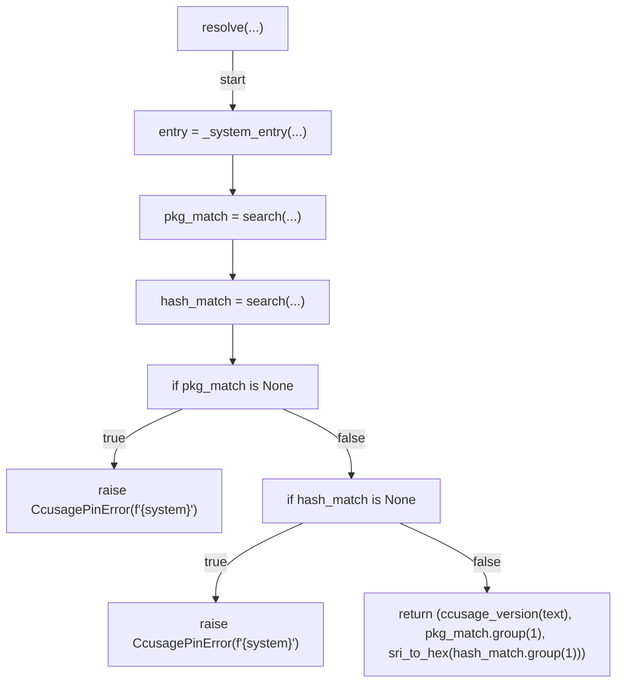
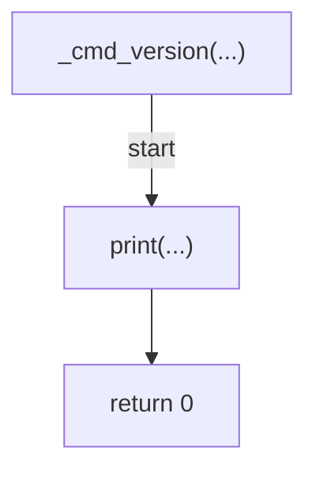
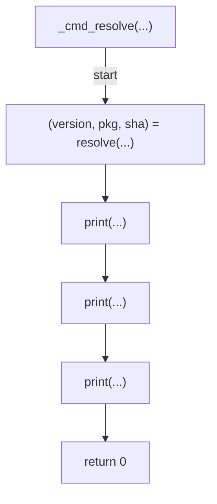
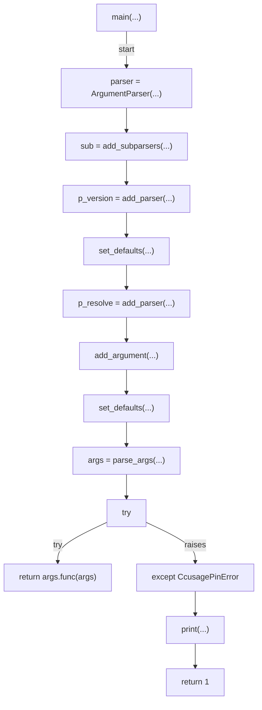

# AST graph: scripts/ccusage_pin.py

This file is generated from `scripts/ccusage_pin.py` by `python3 scripts/script_ast_graph.py all-doc`. Do not edit it by hand: content under `docs/generated/scripts/` is owned by the post-merge automation (refs #1540) -- update the source script instead.

## read_flake_text(...)

## ccusage_version(...)

## _ccusage_native_block(...)

## _system_entry(...)

## sri_to_hex(...)

## resolve(...)

## _cmd_version(...)

## _cmd_resolve(...)

## main(...)

