# AST graph: scripts/check_commit_signing_ready.py

This file is generated from `scripts/check_commit_signing_ready.py` by `python3 scripts/script_ast_graph.py all-doc`. Do not edit it by hand: content under `docs/generated/scripts/` is owned by the post-merge automation (refs #1540); update the source script instead.

## _command_runs_git_commit(...)

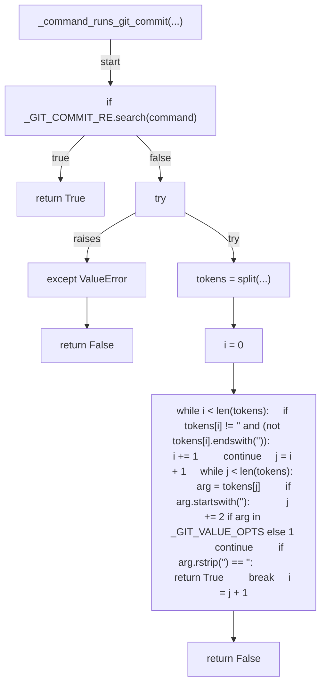

## _is_remote(...)

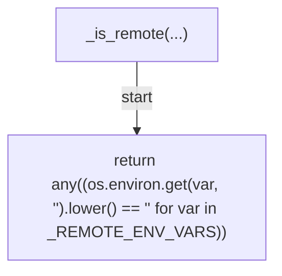

## _git_config_get(...)

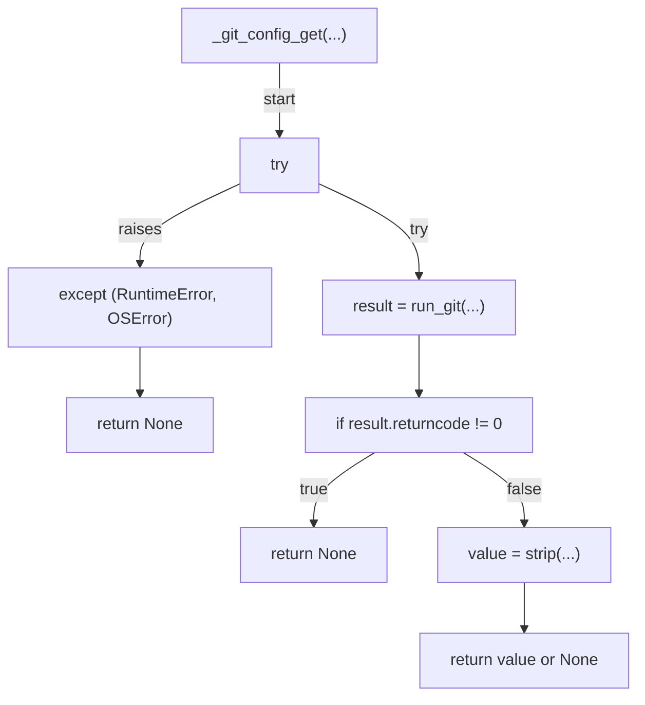

## signing_required(...)

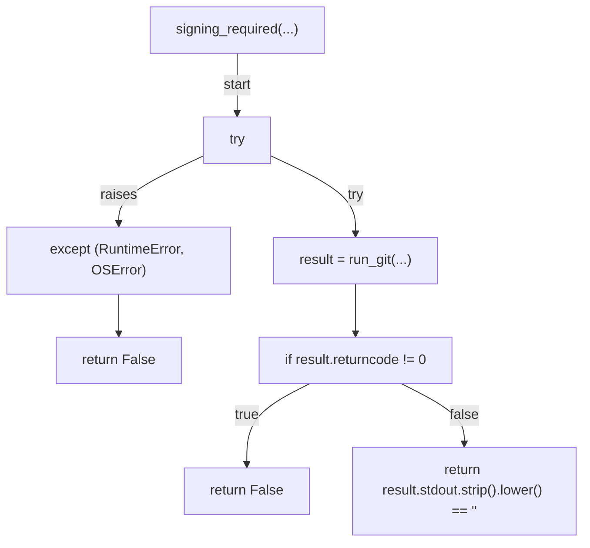

## probe_sign_status(...)

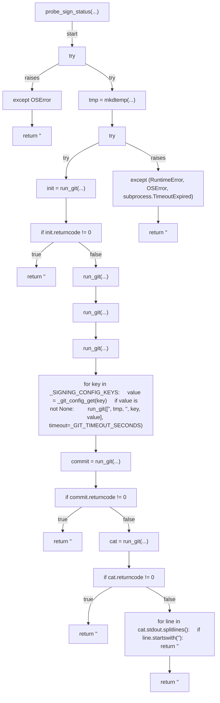

## _build_warning(...)

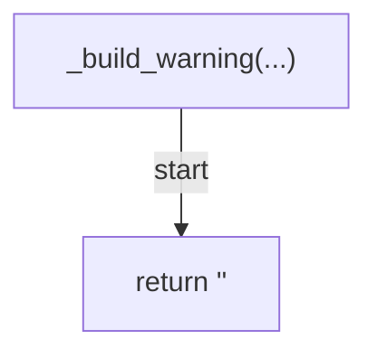

## _build_deny_reason(...)

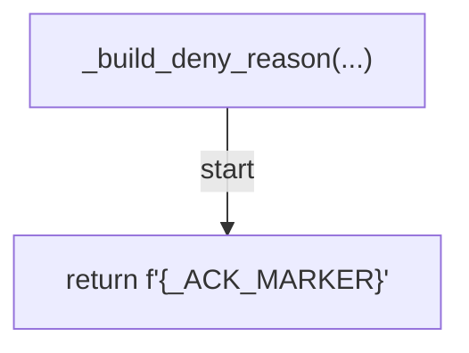

## _emit_context(...)

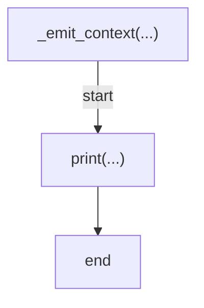

## cmd_session_start(...)

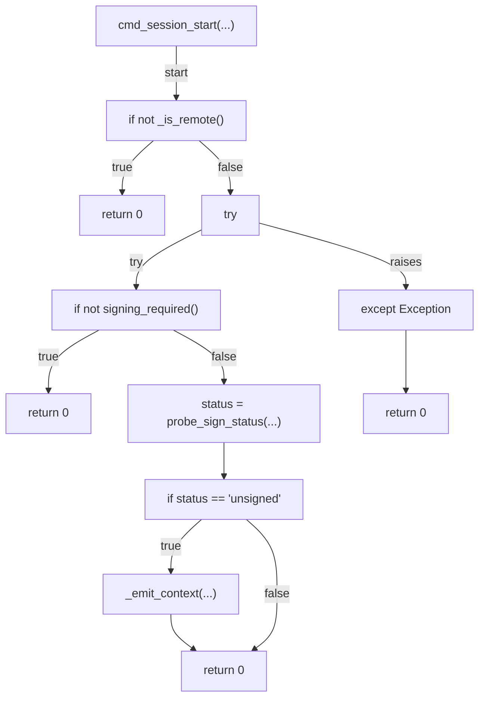

## decide(...)

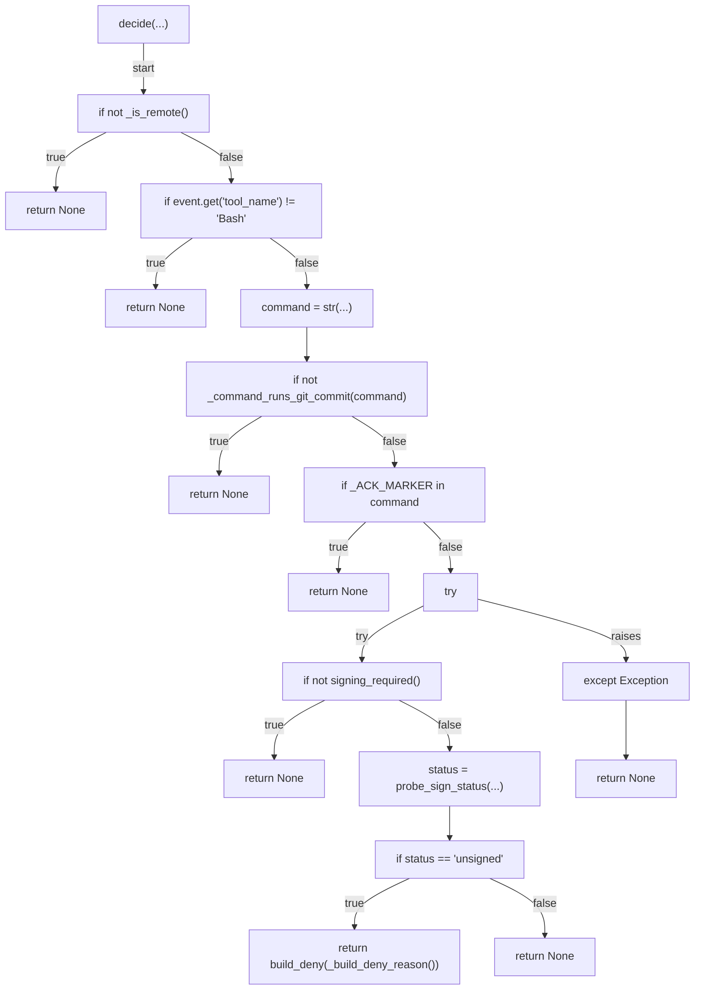

## cmd_check(...)

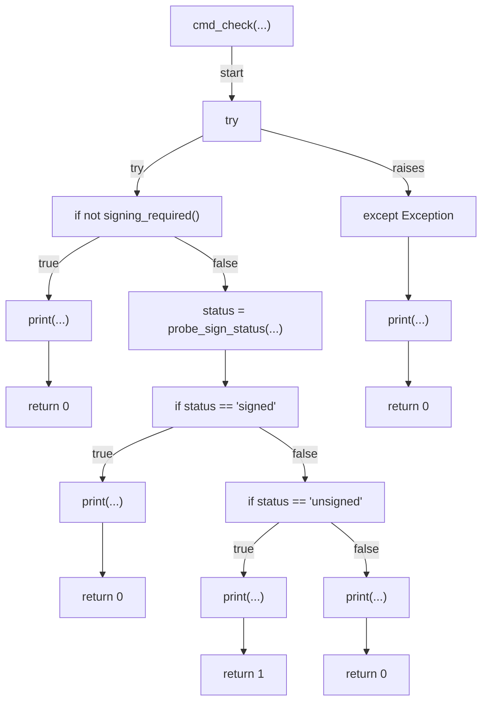

## main(...)

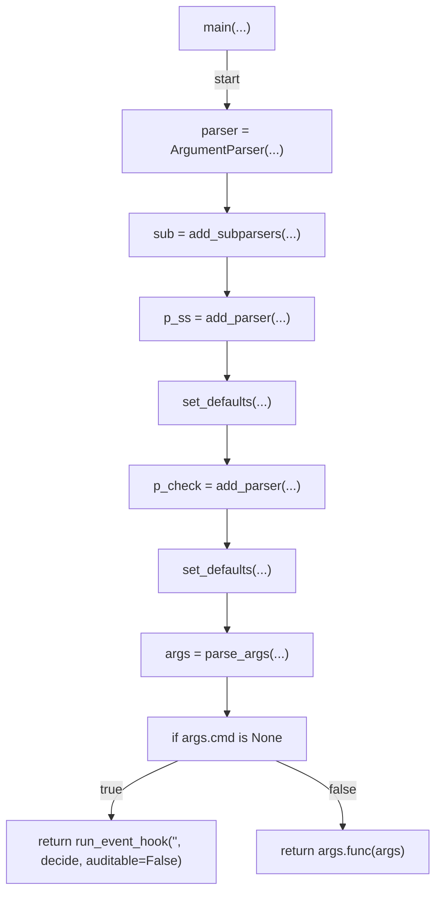
