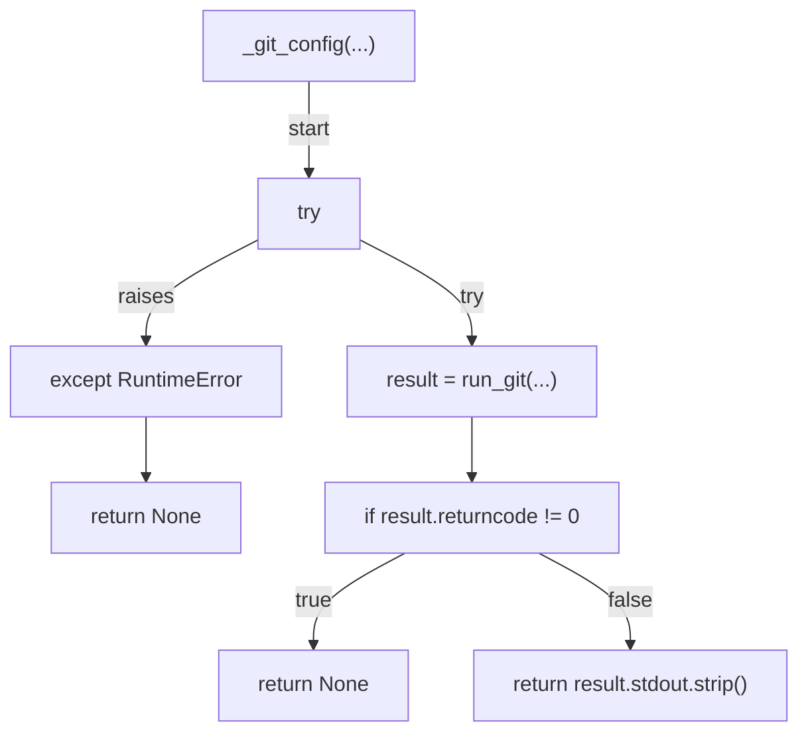
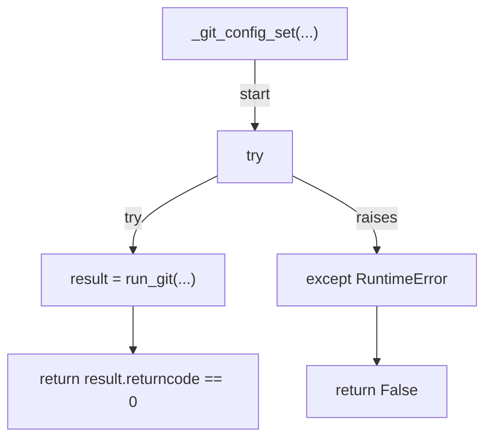
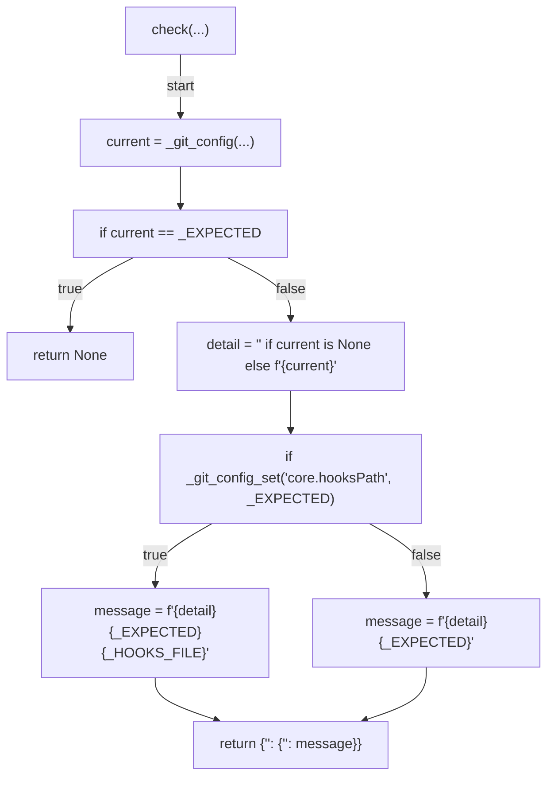
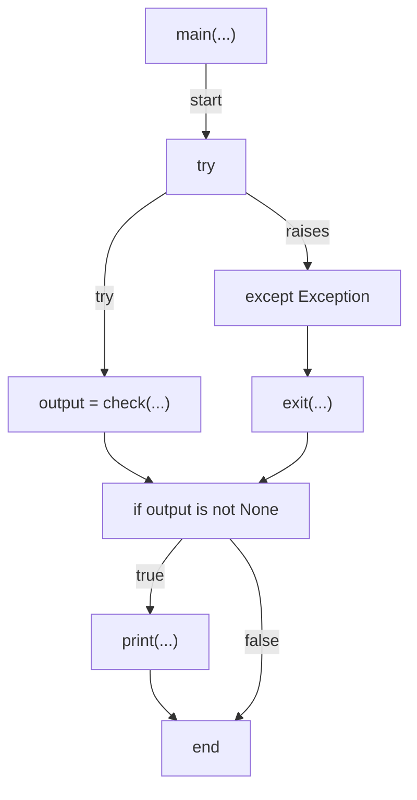

# AST graph: scripts/check_hooks_path.py

This file is generated from `scripts/check_hooks_path.py` by `python3 scripts/script_ast_graph.py all-doc`. Do not edit it by hand: content under `docs/generated/scripts/` is owned by the post-merge automation (refs #1540) -- update the source script instead.

## _git_config(...)

## _git_config_set(...)

## check(...)

## main(...)

