# AST graph: scripts/check_pr_mergeability.py

This file is generated from `scripts/check_pr_mergeability.py` by `python3 scripts/script_ast_graph.py all-doc`. Do not edit it by hand: content under `docs/generated/scripts/` is owned by the post-merge automation (refs #1540); update the source script instead.

## _get_token(...)

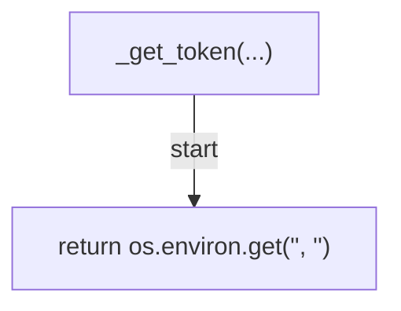

## _rest_get(...)

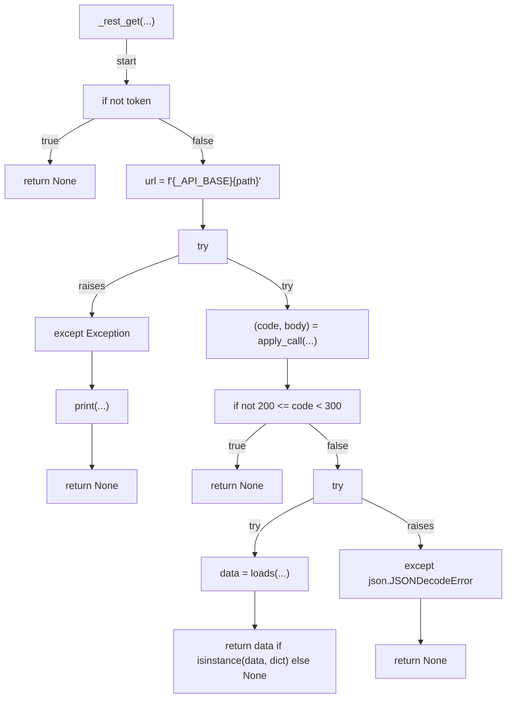

## _rest_get_list(...)

## _detect_repo(...)

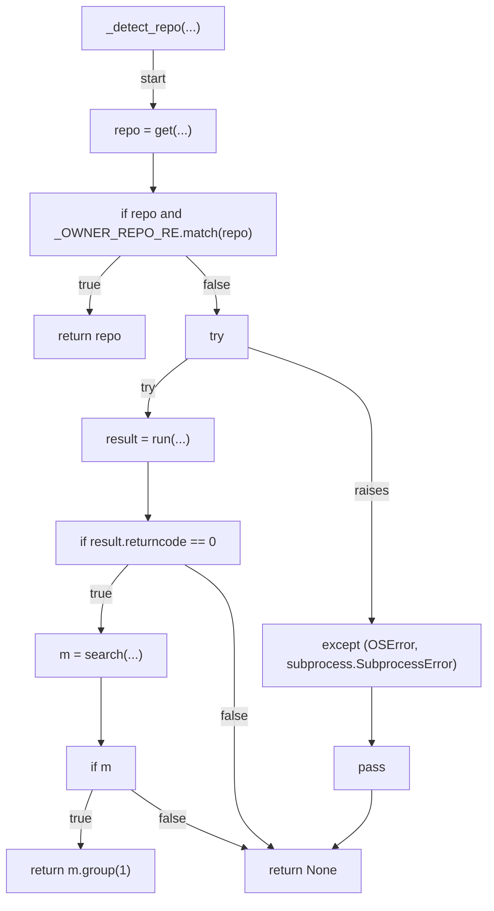

## _walk(...)

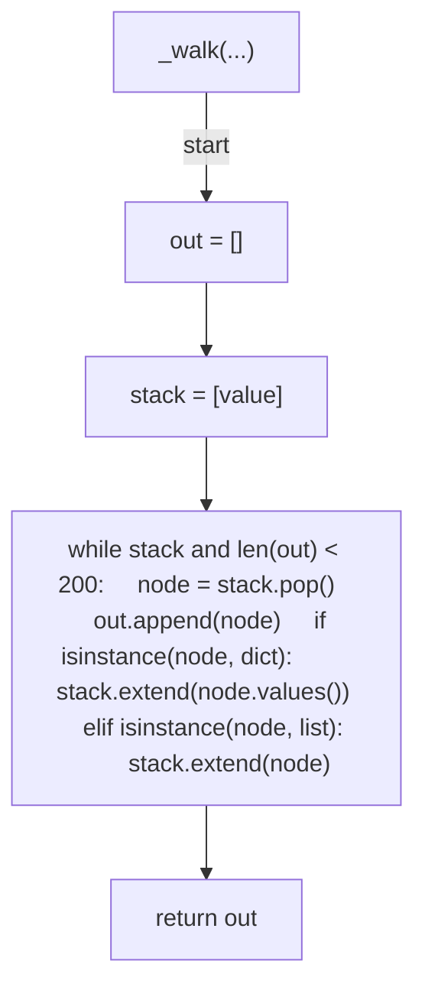

## _extract_pr_info(...)

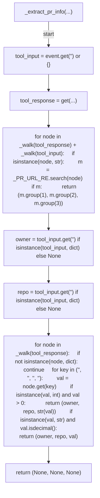

## _poll_mergeability(...)

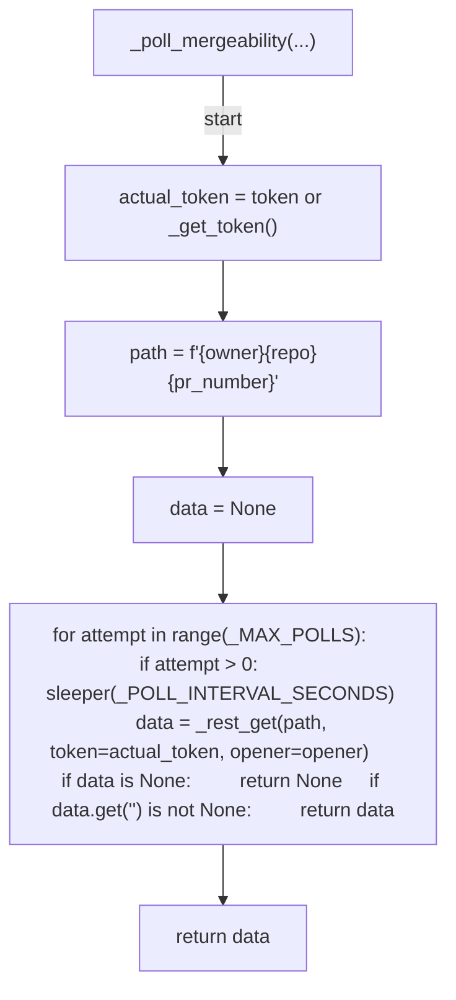

## _build_context(...)

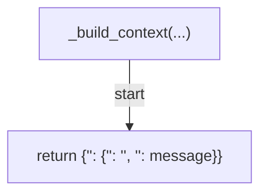

## decide_post_tool_use(...)

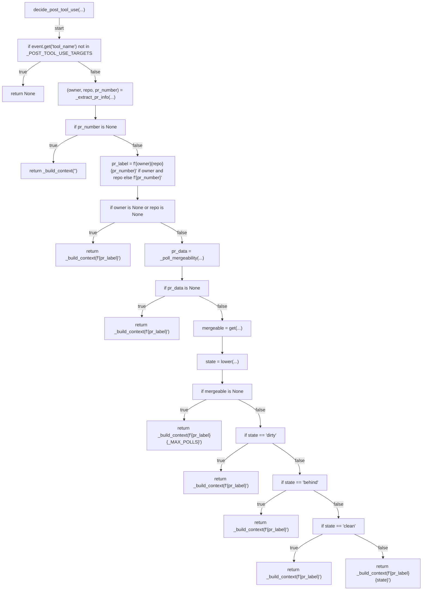

## _list_open_prs(...)

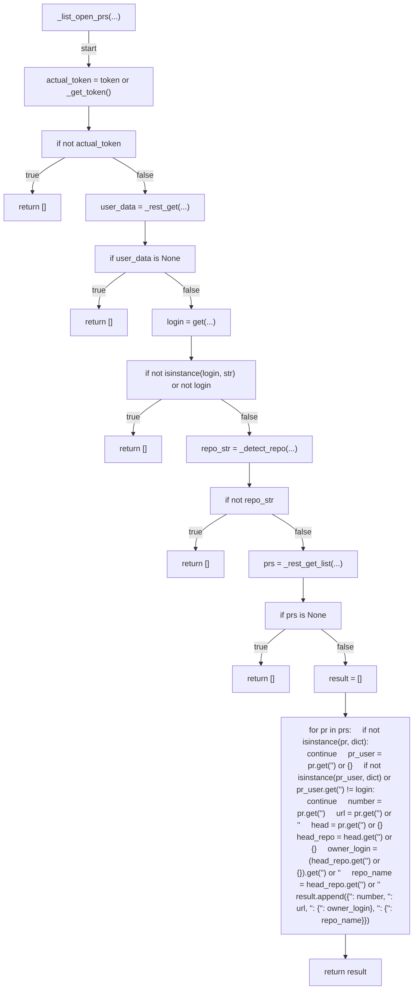

## run_session_start(...)

```mermaid
flowchart TD
    N001["run_session_start(...)"]
    N002["prs = _list_open_prs(...)"]
    N003["if not prs"]
    N004["return"]
    N005["dirty = []"]
    N006["behind = []"]
    N007["for pr in prs:     number = str(pr.get('<str>') or '<str>')     if not number:         continue     owner_obj = pr.get('<str>') or {}     owner = owner_obj.get('<str>') if isinstance(owner_obj, dict) else None     repo_obj = pr.get('<str>') or {}     repo = repo_obj.get('<str>') if isinstance(repo_obj, dict) else None     if not owner or not repo:         continue     pr_data = _poll_mergeability(owner, repo, number, opener=opener, token=token, sleeper=sleeper)     if pr_data is None:         continue     state = str(pr_data.get('<str>') or '<str>').lower()     url = pr.get('<str>') or f'{owner}<str>{repo}<str>{number}'     if state == '<str>':         dirty.append(url)     elif state == '<str>':         behind.append(url)"]
    N008["if dirty"]
    N009["lines = ['<str>']"]
    N010["for url in dirty:     lines.append(f'<str>{url}')"]
    N011["append(...)"]
    N012["print(...)"]
    N013["if behind"]
    N014["lines = ['<str>']"]
    N015["for url in behind:     lines.append(f'<str>{url}')"]
    N016["append(...)"]
    N017["print(...)"]
    N018["end"]
    N001 -->|"start"| N002
    N002 --> N003
    N003 -->|"true"| N004
    N003 -->|"false"| N005
    N005 --> N006
    N006 --> N007
    N007 --> N008
    N008 -->|"true"| N009
    N009 --> N010
    N010 --> N011
    N011 --> N012
    N012 --> N013
    N008 -->|"false"| N013
    N013 -->|"true"| N014
    N014 --> N015
    N015 --> N016
    N016 --> N017
    N017 --> N018
    N013 -->|"false"| N018
```

## main(...)

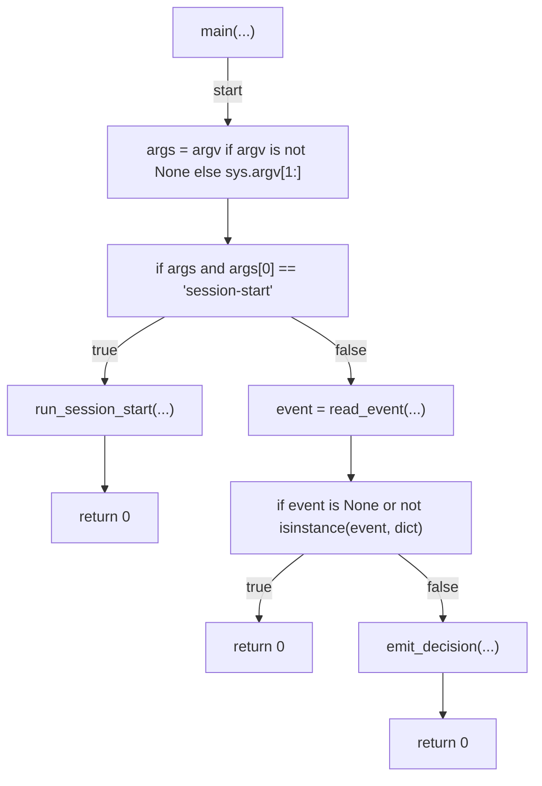
