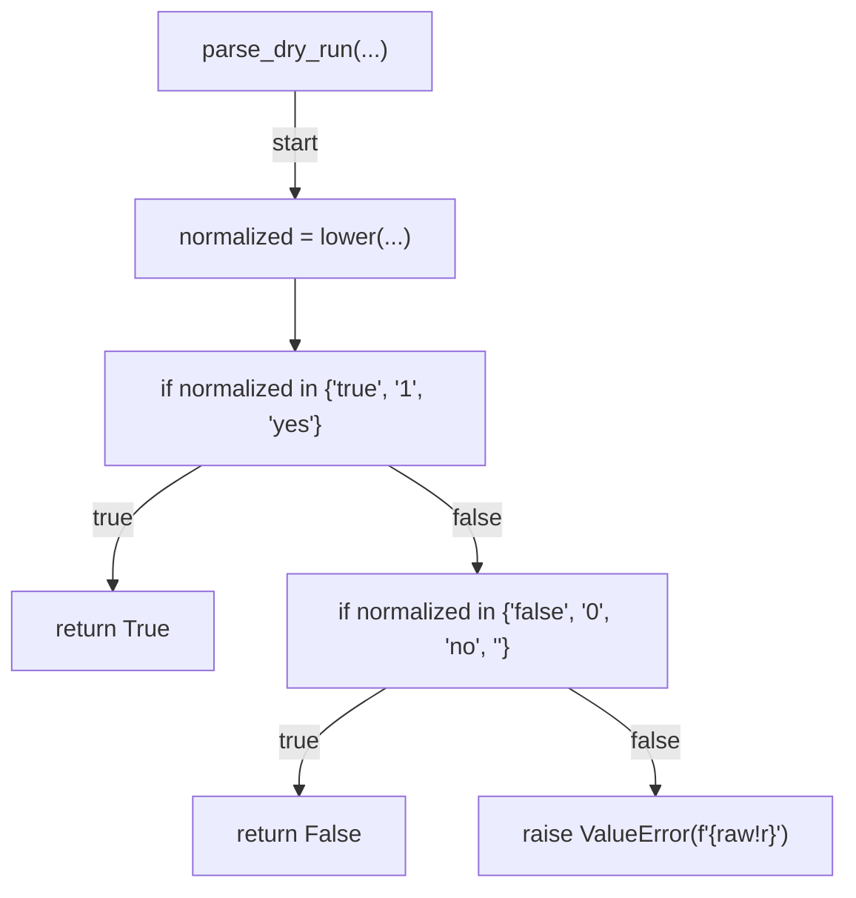
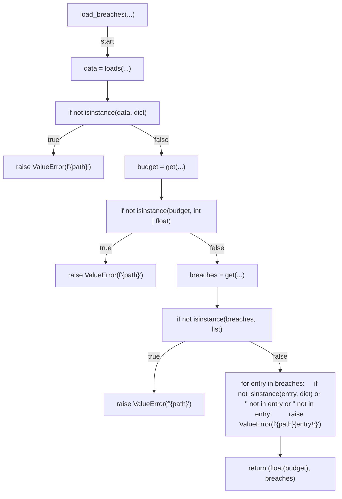
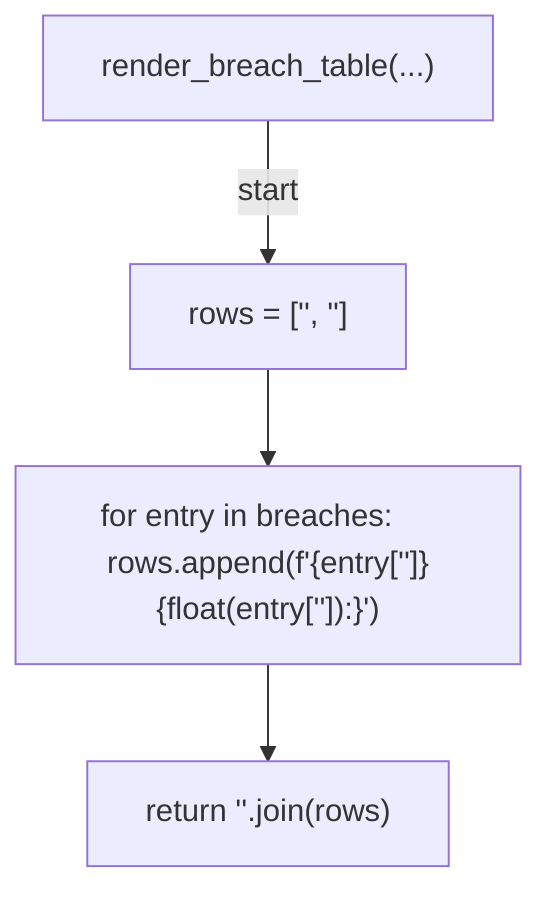
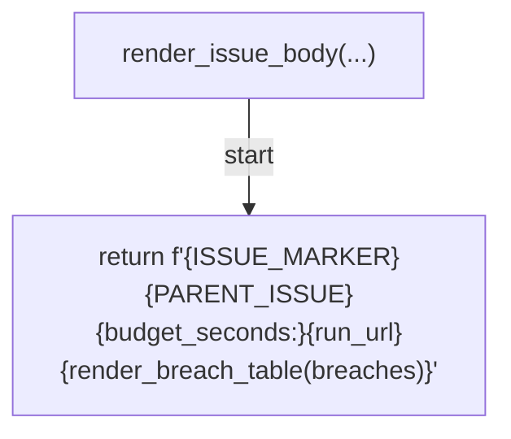
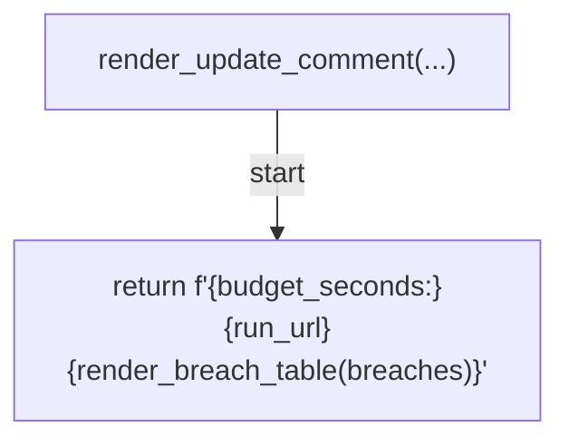
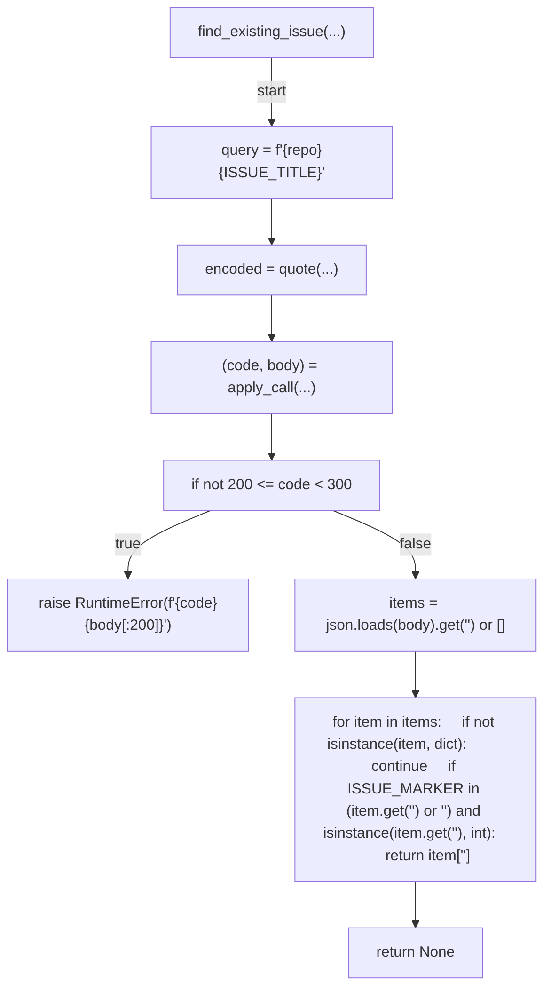
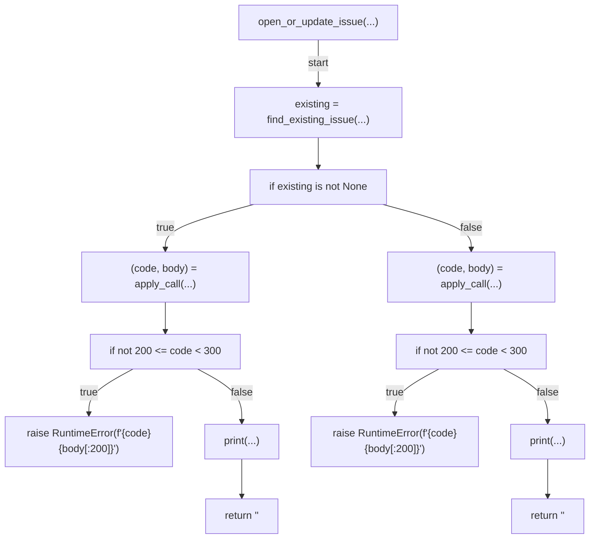
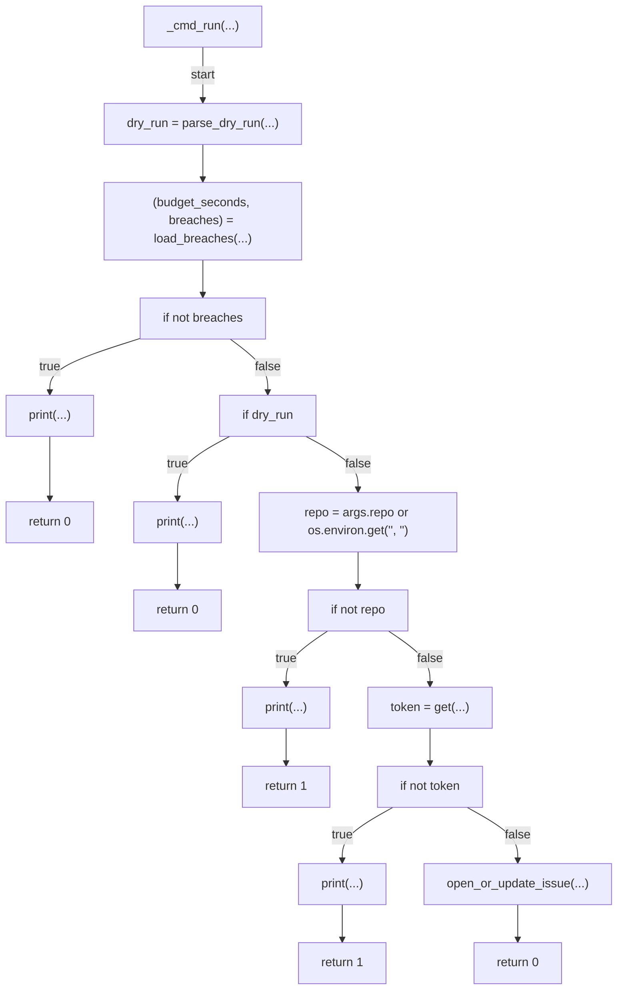
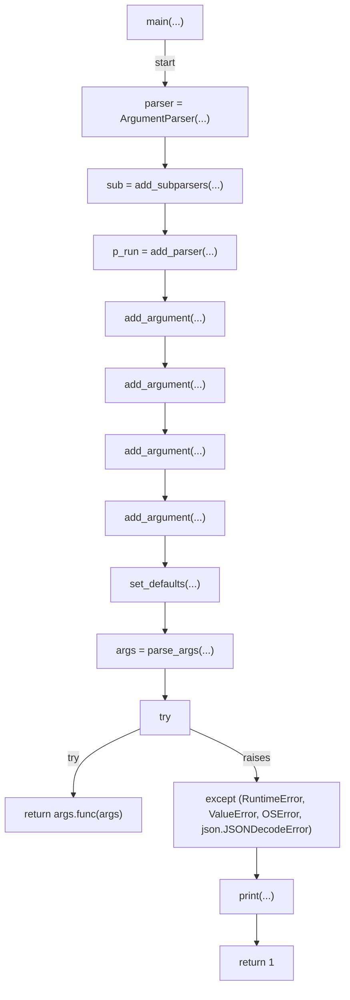

# AST graph: scripts/ci_budget_issue.py

This file is generated from `scripts/ci_budget_issue.py` by `python3 scripts/script_ast_graph.py all-doc`. Do not edit it by hand: content under `docs/generated/scripts/` is owned by the post-merge automation (refs #1540); update the source script instead.

## parse_dry_run(...)

## load_breaches(...)

## render_breach_table(...)

## render_issue_body(...)

## render_update_comment(...)

## find_existing_issue(...)

## open_or_update_issue(...)

## _cmd_run(...)

## main(...)

