# AST graph: scripts/ci_early_status_probe.py

This file is generated from `scripts/ci_early_status_probe.py` by `python3 scripts/script_ast_graph.py all-doc`. Do not edit it by hand: content under `docs/generated/scripts/` is owned by the post-merge automation (refs #1540); update the source script instead.

## _walk_strings(...)

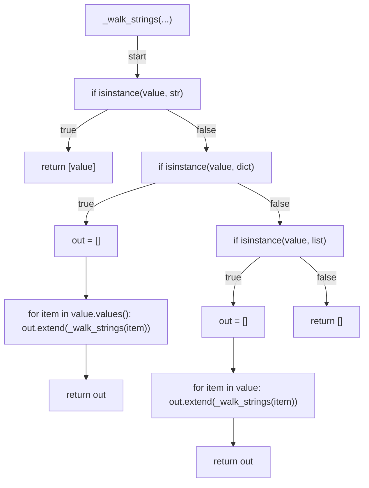

## extract_pr_target(...)

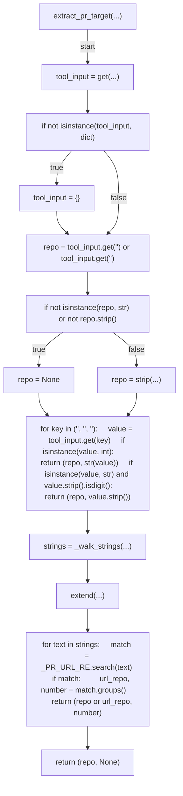

## parse_delay(...)

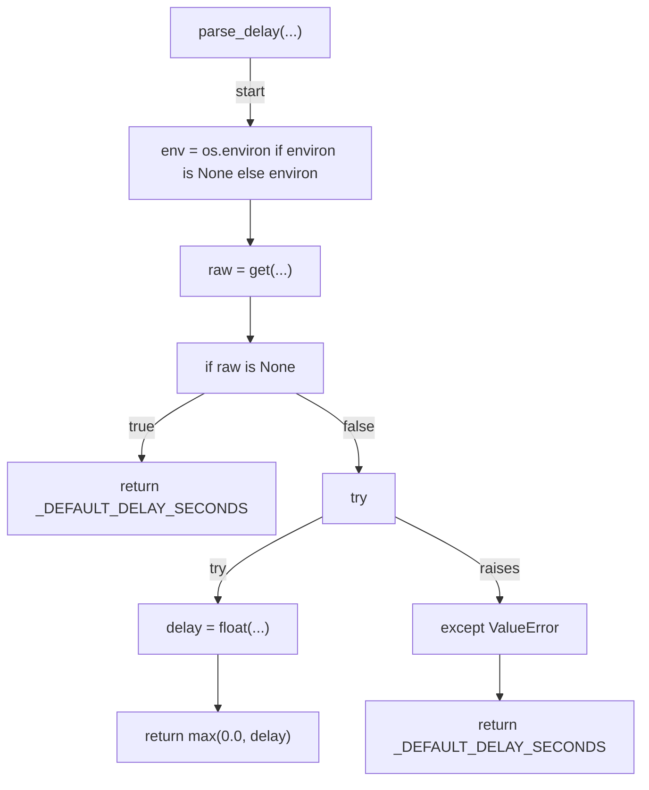

## _rest_get(...)

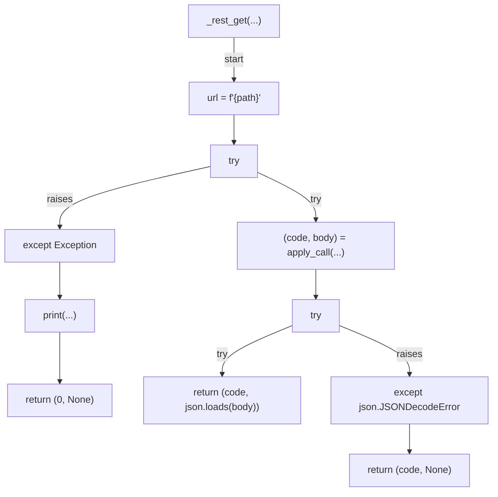

## run_checks(...)

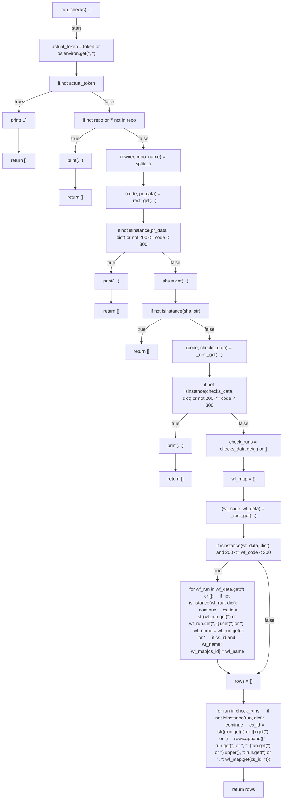

## _load_check_rows(...)

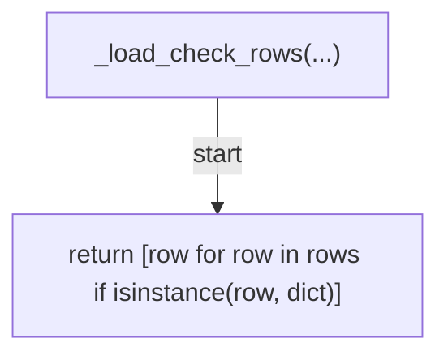

## failed_checks(...)

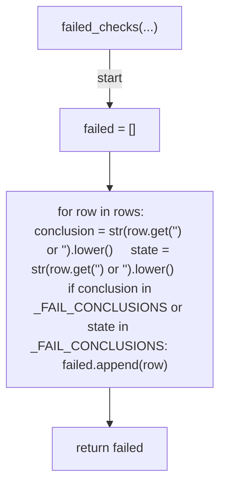

## _check_name(...)

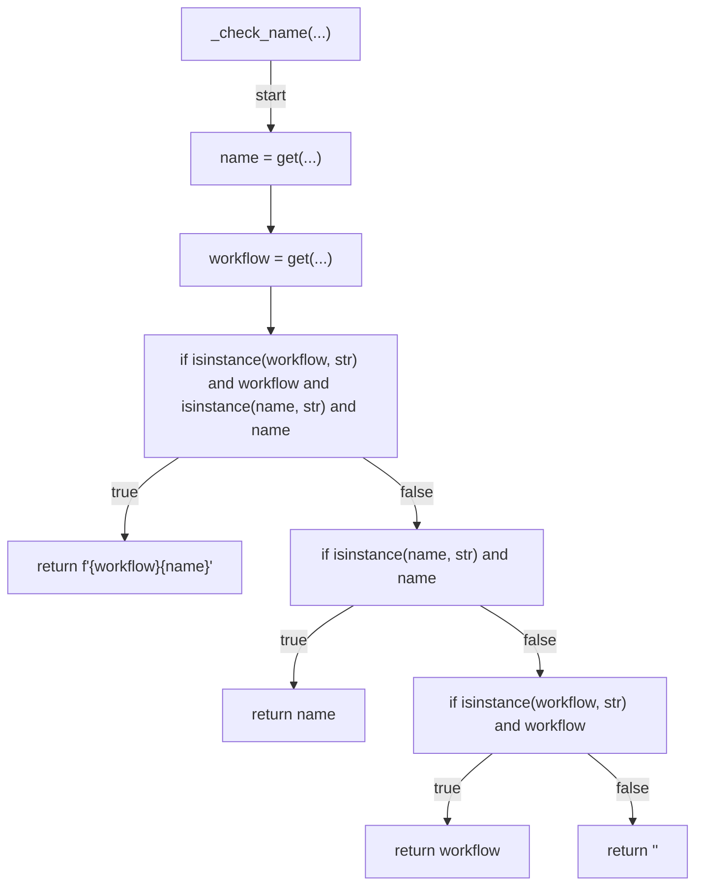

## build_additional_context(...)

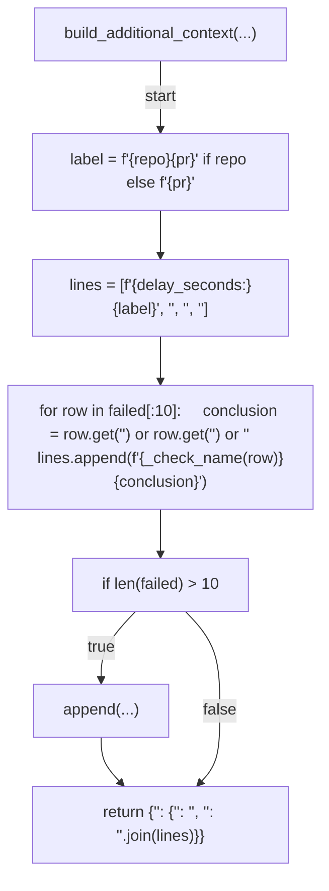

## decide(...)

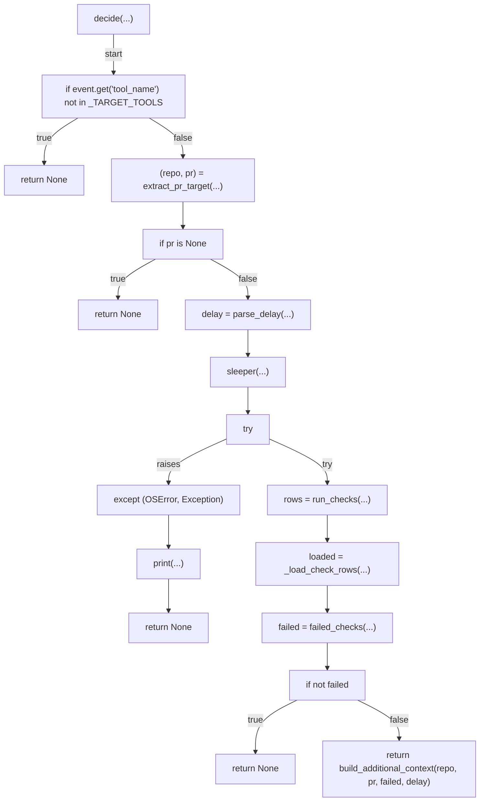

## main(...)

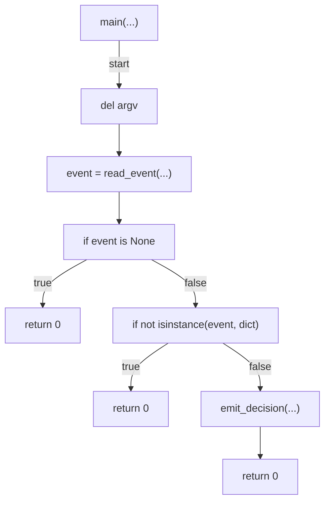
