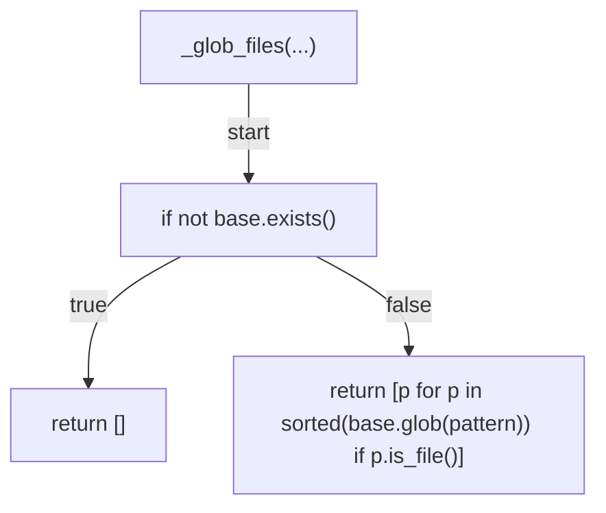
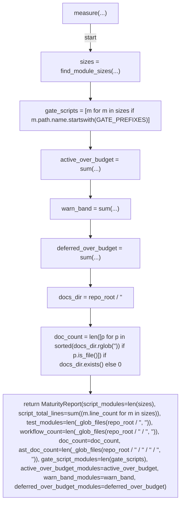
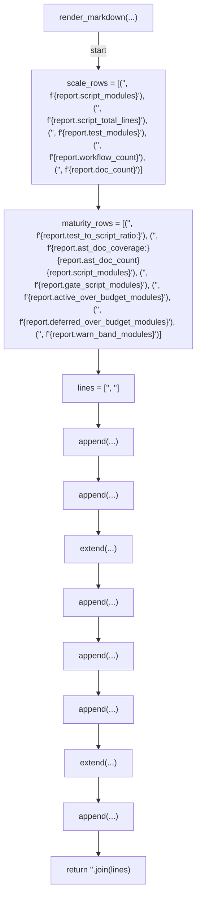
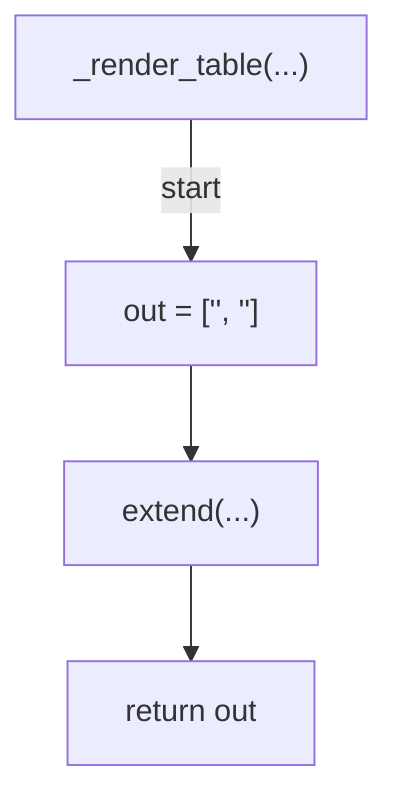
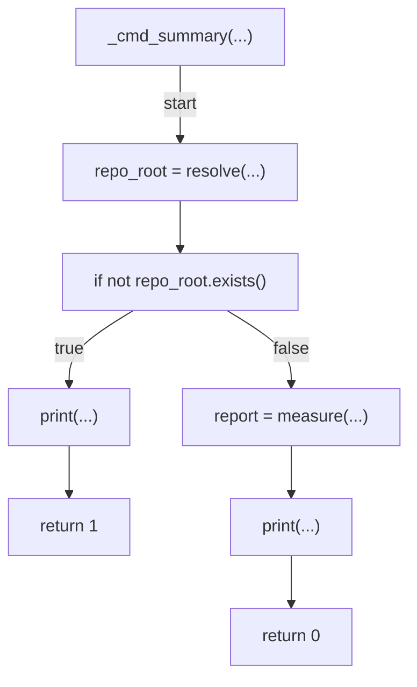
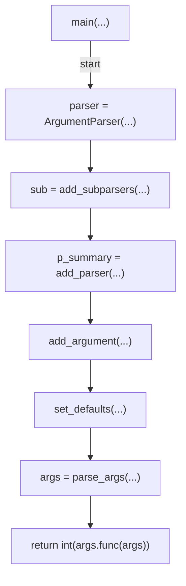

# AST graph: scripts/codebase_maturity_summary.py

This file is generated from `scripts/codebase_maturity_summary.py` by `python3 scripts/script_ast_graph.py all-doc`. Do not edit it by hand: content under `docs/generated/scripts/` is owned by the post-merge automation (refs #1540); update the source script instead.

## _glob_files(...)

## measure(...)

## render_markdown(...)

## _render_table(...)

## _cmd_summary(...)

## main(...)

