# AST graph: scripts/compare_cache_regimes.py

This file is generated from `scripts/compare_cache_regimes.py` by `python3 scripts/script_ast_graph.py all-doc`. Do not edit it by hand: content under `docs/generated/scripts/` is owned by the post-merge automation (refs #1540) -- update the source script instead.

## _as_number(...)

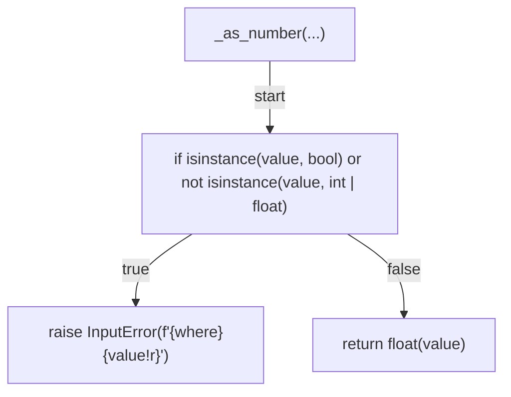

## _resource_section(...)

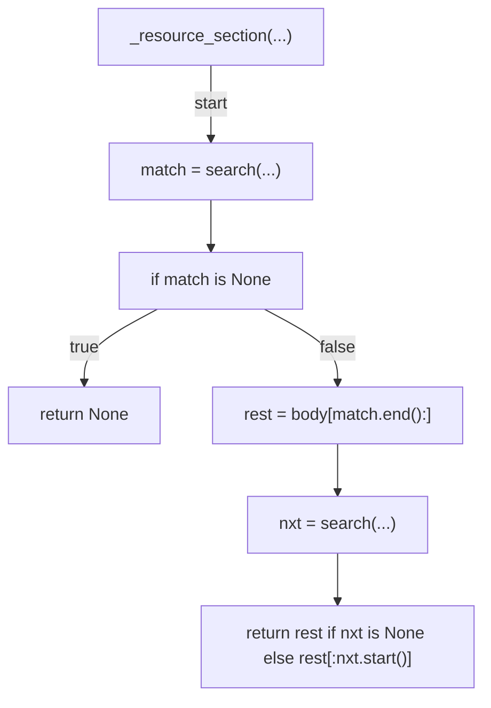

## parse_pr_cost(...)

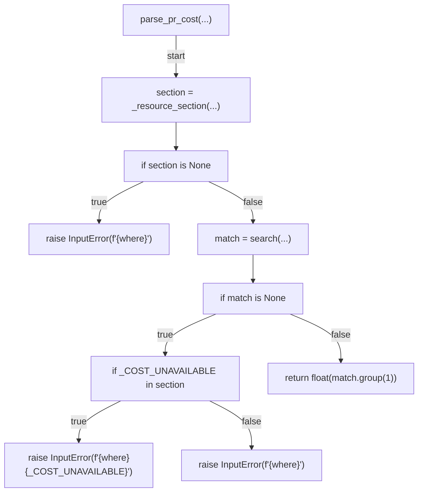

## _first_table_cell(...)

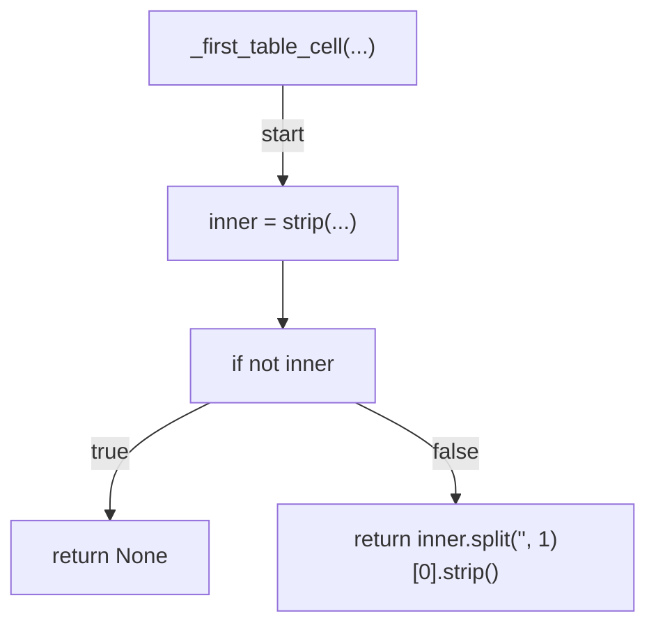

## parse_retro_repairs(...)

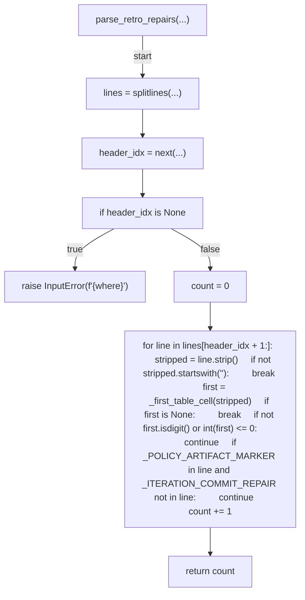

## _resolve_cost(...)

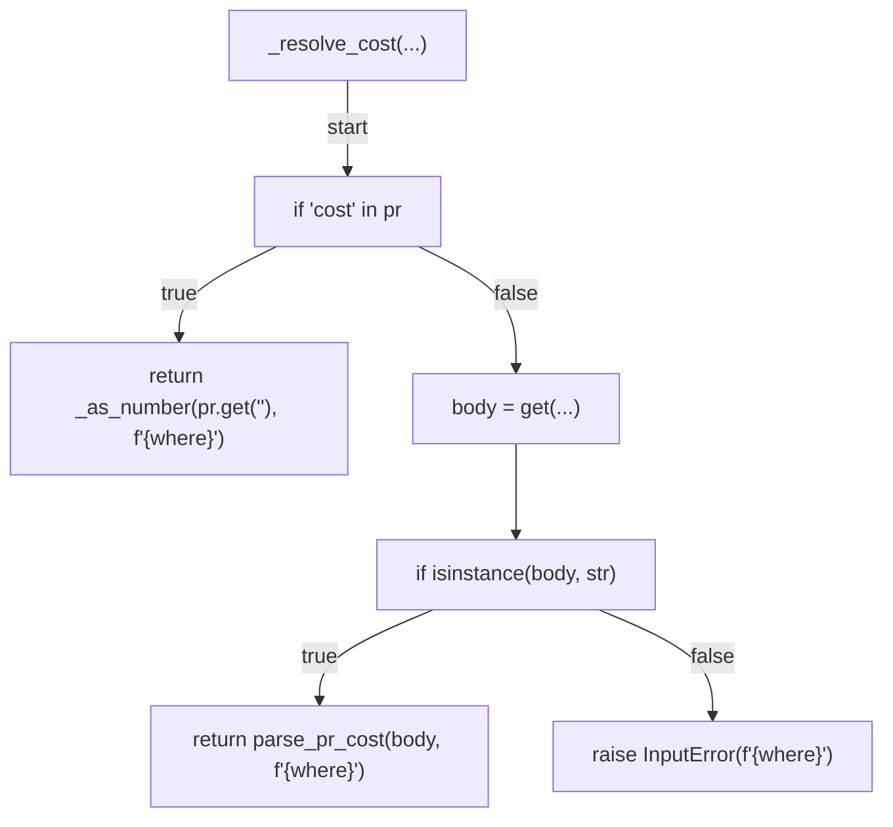

## _resolve_repairs(...)

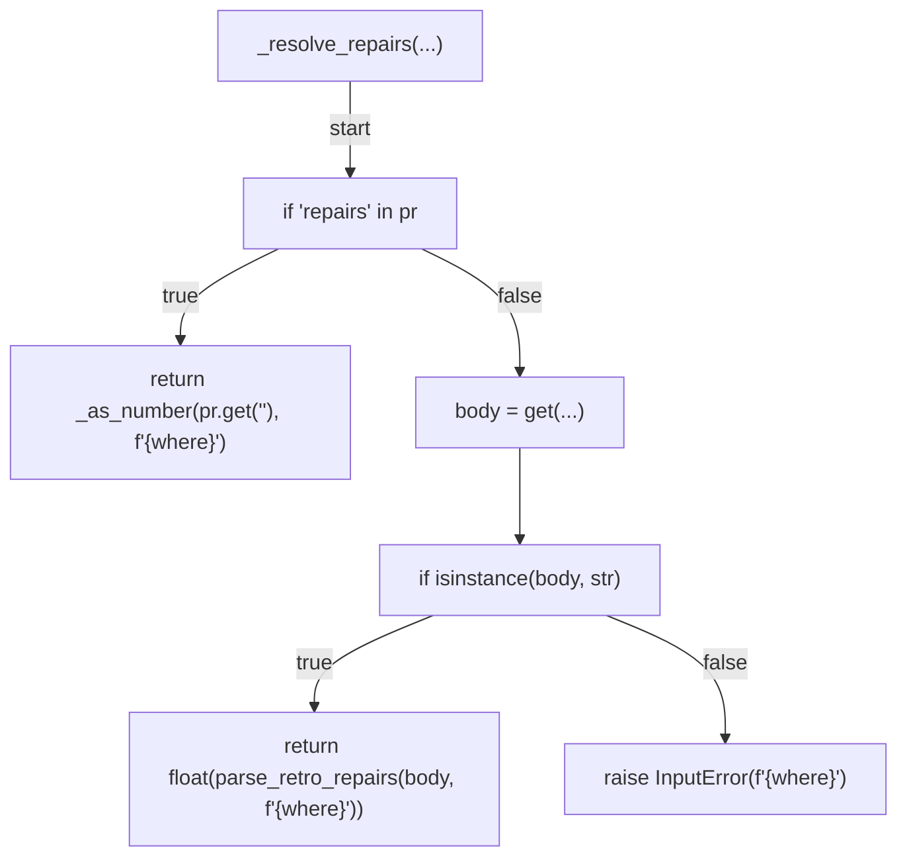

## parse_regimes(...)

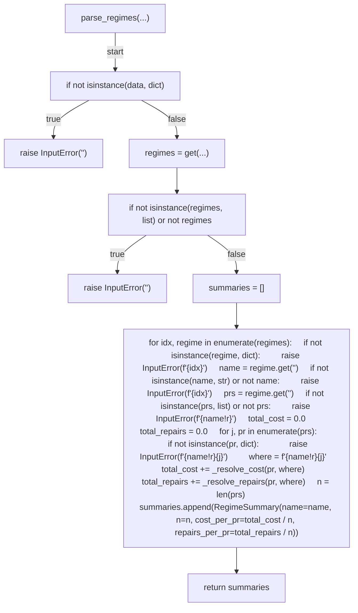

## _delta(...)

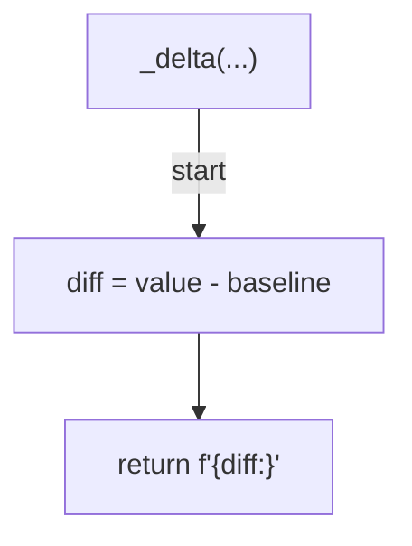

## render_comparison(...)

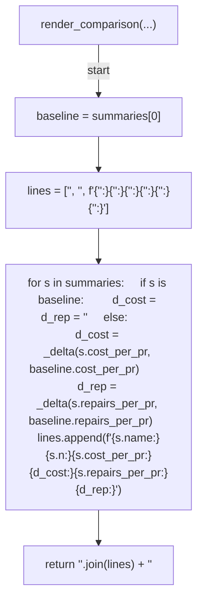

## _load_input(...)

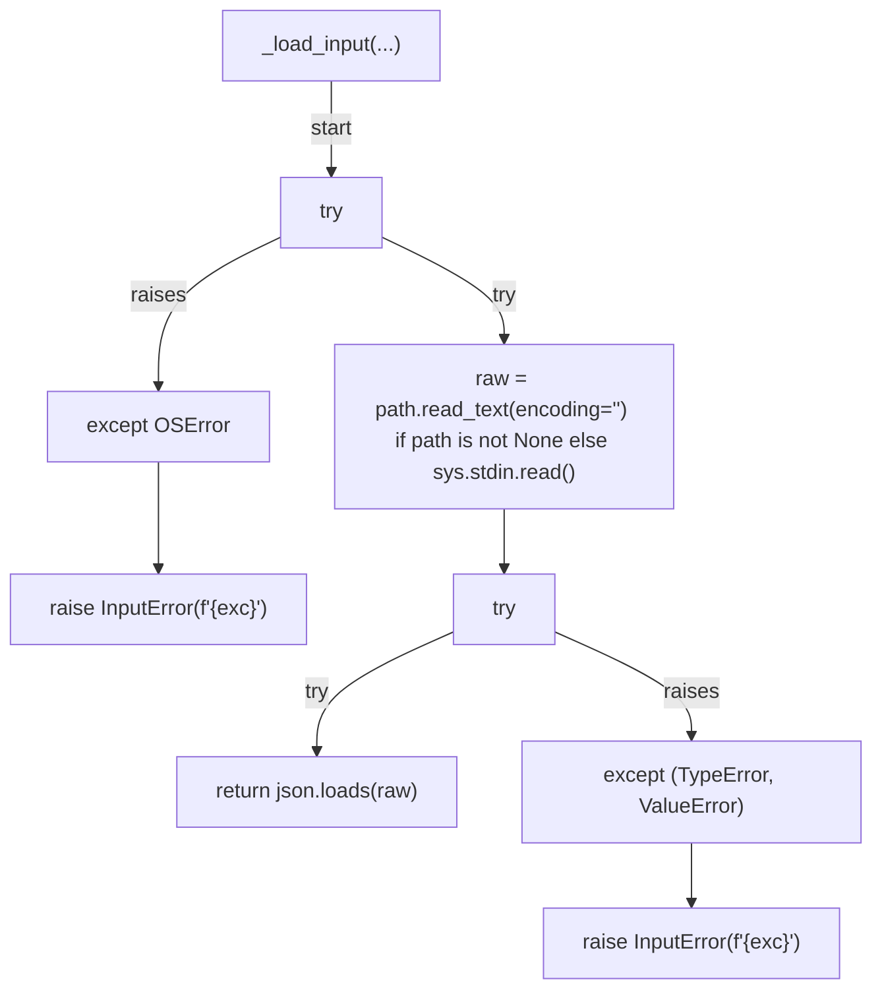

## _parse_args(...)

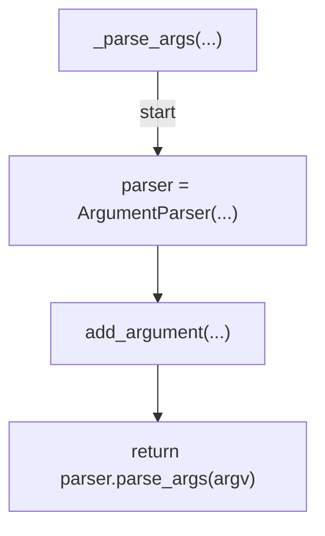

## main(...)

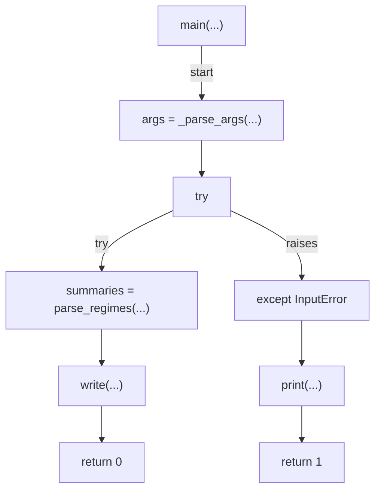
