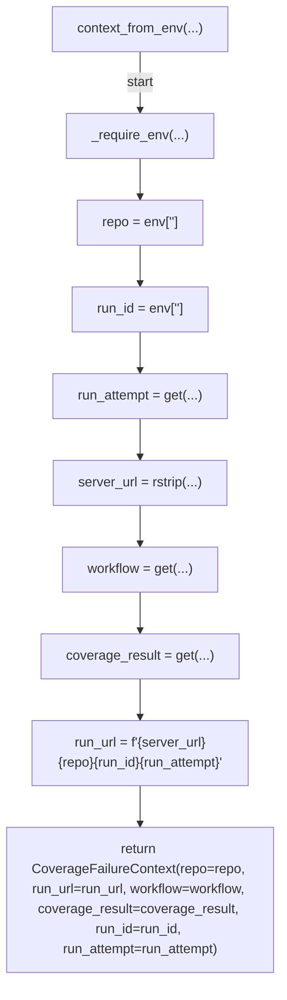
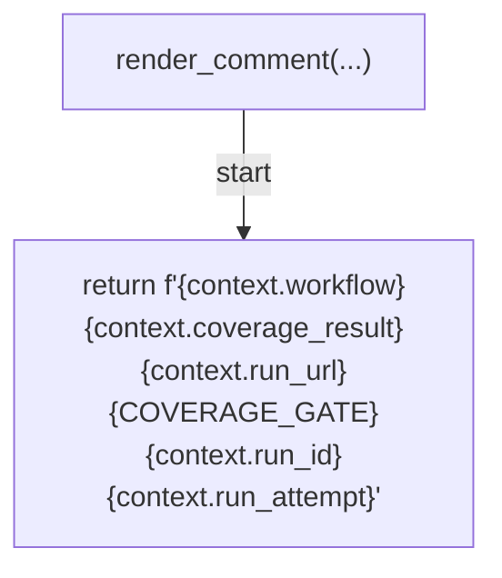
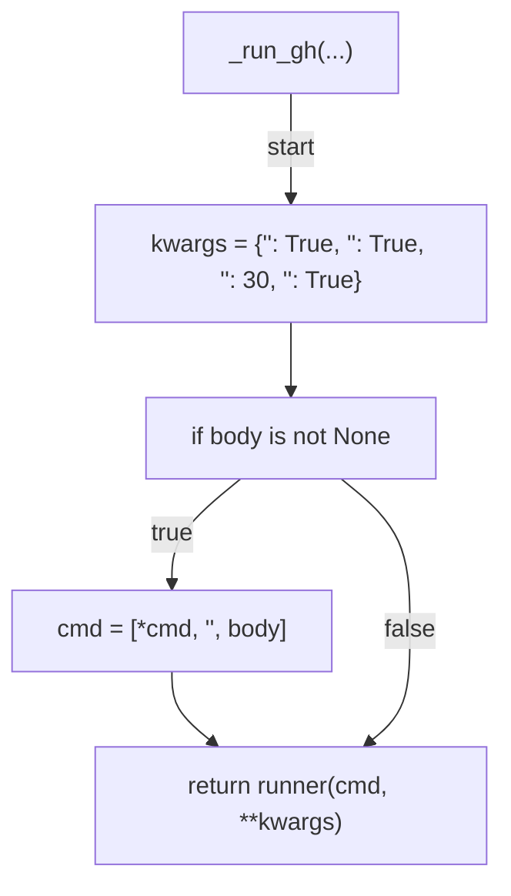
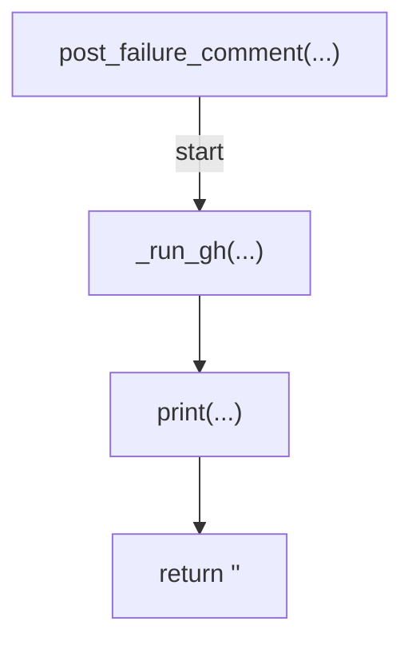
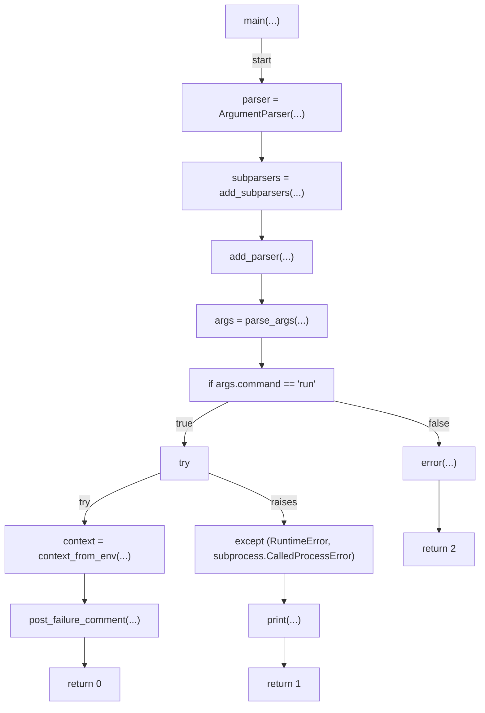

# AST graph: scripts/coverage_failure_issue.py

This file is generated from `scripts/coverage_failure_issue.py` by `python3 scripts/script_ast_graph.py all-doc`. Do not edit it by hand: content under `docs/generated/scripts/` is owned by the post-merge automation (refs #1540) -- update the source script instead.

## _require_env(...)

```mermaid
flowchart TD
    N001["_require_env(...)"]
    N002["missing = [name for name in names if not env.get(name)]"]
    N003["if missing"]
    N004["raise RuntimeError(f\"<str>{'<str>'.join(missing)}\")"]
    N005["end"]
    N001 -->|"start"| N002
    N002 --> N003
    N003 -->|"true"| N004
    N003 -->|"false"| N005
```

## context_from_env(...)



## render_comment(...)



## _run_gh(...)



## post_failure_comment(...)



## main(...)


