# AST graph: scripts/dependabot_automerge.py

This file is generated from `scripts/dependabot_automerge.py` by `python3 scripts/script_ast_graph.py all-doc`. Do not edit it by hand: content under `docs/generated/scripts/` is owned by the post-merge automation (refs #1540) -- update the source script instead.

## classify_update_type(...)

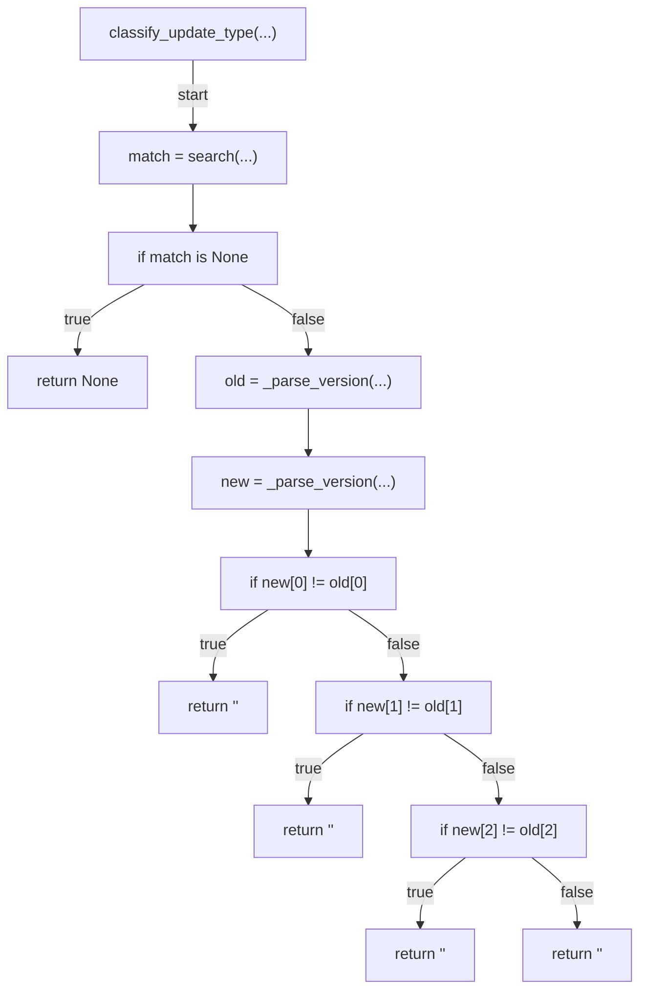

## infer_ecosystem(...)

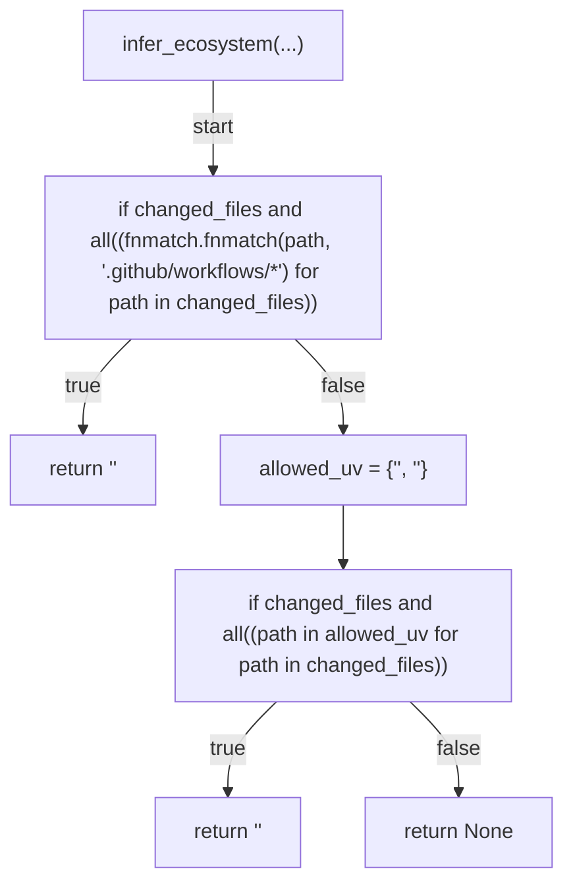

## audit(...)

```mermaid
flowchart TD
    N001["audit(...)"]
    N002["pr = get(...)"]
    N003["if not isinstance(pr, dict)"]
    N004["return AuditResult(False, False, None, None, ['<str>'])"]
    N005["enabled = bool(...)"]
    N006["reasons = []"]
    N007["author = _nested_str(...)"]
    N008["head_ref = _nested_str(...)"]
    N009["raw_title = get(...)"]
    N010["title = raw_title if isinstance(raw_title, str) else '<str>'"]
    N011["labels = _label_names(...)"]
    N012["draft = bool(...)"]
    N013["if author not in _TRUSTED_BOT_LOGINS"]
    N014["append(...)"]
    N015["if not head_ref.startswith('dependabot/')"]
    N016["append(...)"]
    N017["if draft"]
    N018["append(...)"]
    N019["blocked_labels = sorted(...)"]
    N020["if blocked_labels"]
    N021["append(...)"]
    N022["blocked_threat_labels = sorted(...)"]
    N023["if blocked_threat_labels"]
    N024["append(...)"]
    N025["update_type = classify_update_type(...)"]
    N026["if update_type is None"]
    N027["append(...)"]
    N028["ecosystem = infer_ecosystem(...)"]
    N029["if ecosystem is None"]
    N030["append(...)"]
    N031["if update_type is not None and ecosystem is not None"]
    N032["rule = _matching_rule(...)"]
    N033["if rule is None"]
    N034["append(...)"]
    N035["allowed_update_types = set(...)"]
    N036["if update_type not in allowed_update_types"]
    N037["append(...)"]
    N038["allowed_paths = _string_list(...)"]
    N039["unexpected = _unexpected_paths(...)"]
    N040["if unexpected"]
    N041["append(...)"]
    N042["return AuditResult(eligible=not reasons, enabled=enabled, update_type=update_type, ecosystem=ecosystem, reasons=reasons)"]
    N001 -->|"start"| N002
    N002 --> N003
    N003 -->|"true"| N004
    N003 -->|"false"| N005
    N005 --> N006
    N006 --> N007
    N007 --> N008
    N008 --> N009
    N009 --> N010
    N010 --> N011
    N011 --> N012
    N012 --> N013
    N013 -->|"true"| N014
    N014 --> N015
    N013 -->|"false"| N015
    N015 -->|"true"| N016
    N016 --> N017
    N015 -->|"false"| N017
    N017 -->|"true"| N018
    N018 --> N019
    N017 -->|"false"| N019
    N019 --> N020
    N020 -->|"true"| N021
    N021 --> N022
    N020 -->|"false"| N022
    N022 --> N023
    N023 -->|"true"| N024
    N024 --> N025
    N023 -->|"false"| N025
    N025 --> N026
    N026 -->|"true"| N027
    N027 --> N028
    N026 -->|"false"| N028
    N028 --> N029
    N029 -->|"true"| N030
    N030 --> N031
    N029 -->|"false"| N031
    N031 -->|"true"| N032
    N032 --> N033
    N033 -->|"true"| N034
    N033 -->|"false"| N035
    N035 --> N036
    N036 -->|"true"| N037
    N037 --> N038
    N036 -->|"false"| N038
    N038 --> N039
    N039 --> N040
    N040 -->|"true"| N041
    N034 --> N042
    N041 --> N042
    N040 -->|"false"| N042
    N031 -->|"false"| N042
```

## render_markdown(...)

```mermaid
flowchart TD
    N001["render_markdown(...)"]
    N002["lines = ['<str>', '<str>', f'<str>{str(result.enabled).lower()}<str>', f'<str>{str(result.eligible).lower()}<str>', f'<str>{str(result.should_enable).lower()}<str>', f\"<str>{result.ecosystem or '<str>'}<str>\", f\"<str>{result.update_type or '<str>'}<str>\", '<str>']"]
    N003["if result.reasons"]
    N004["append(...)"]
    N005["extend(...)"]
    N006["append(...)"]
    N007["append(...)"]
    N008["return '<str>'.join(lines)"]
    N001 -->|"start"| N002
    N002 --> N003
    N003 -->|"true"| N004
    N004 --> N005
    N003 -->|"false"| N006
    N005 --> N007
    N006 --> N007
    N007 --> N008
```

## _cmd_audit(...)

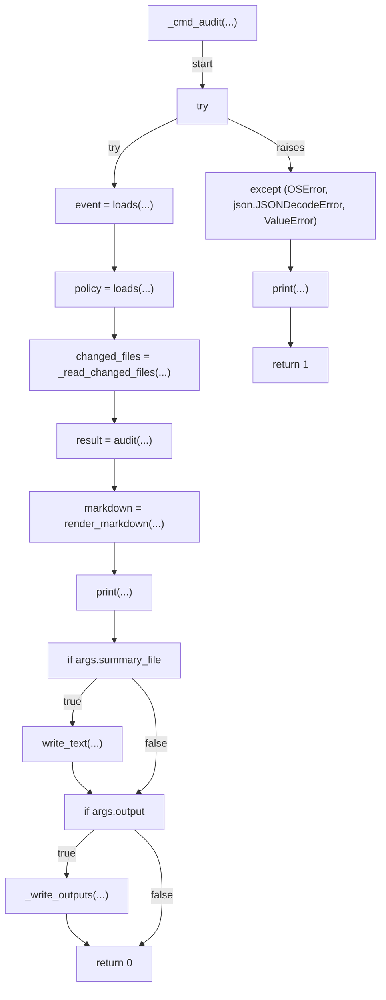

## _parse_version(...)

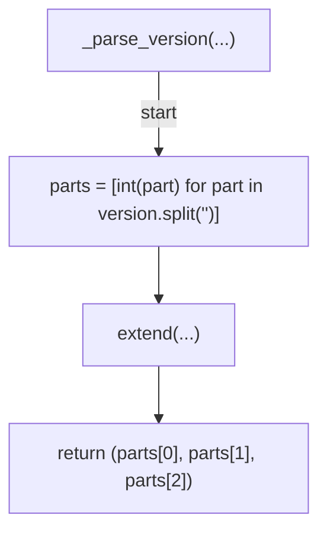

## _nested_str(...)

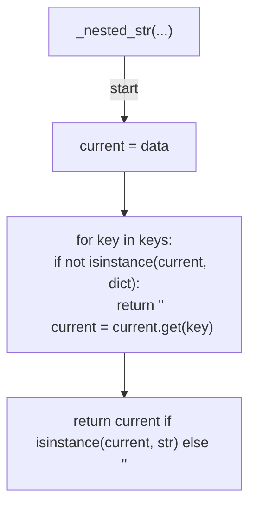

## _label_names(...)

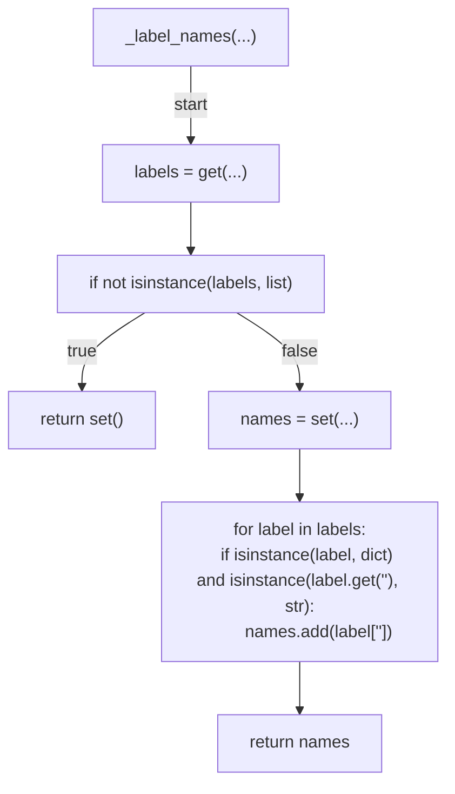

## _matching_rule(...)

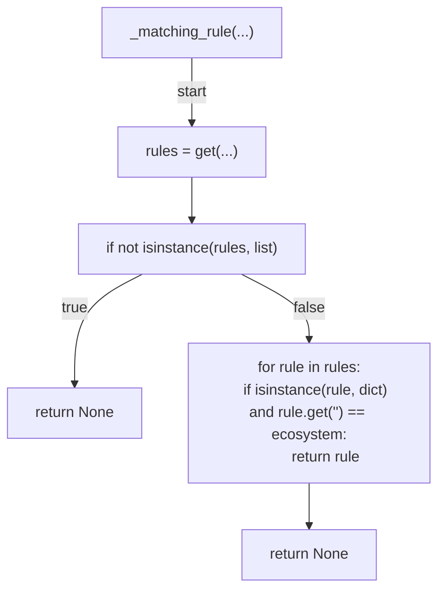

## _string_list(...)

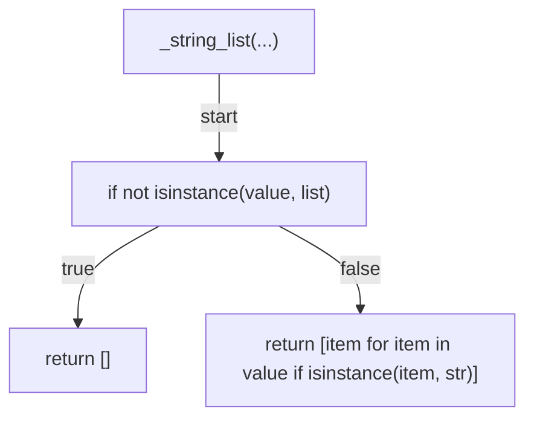

## _unexpected_paths(...)

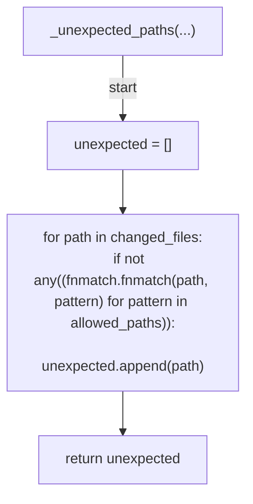

## _read_changed_files(...)

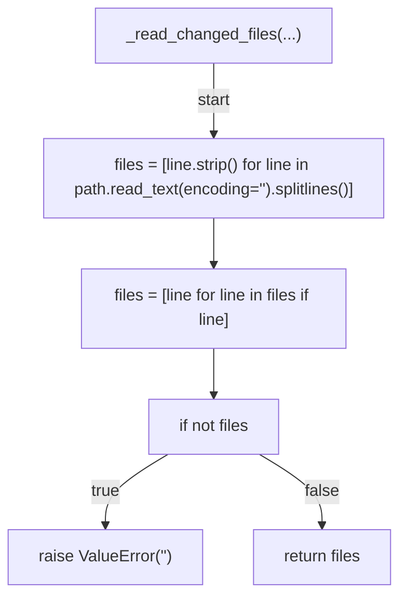

## _write_outputs(...)

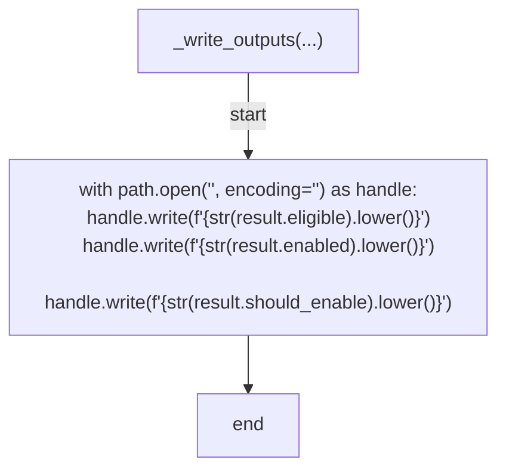

## _list_pr_files(...)

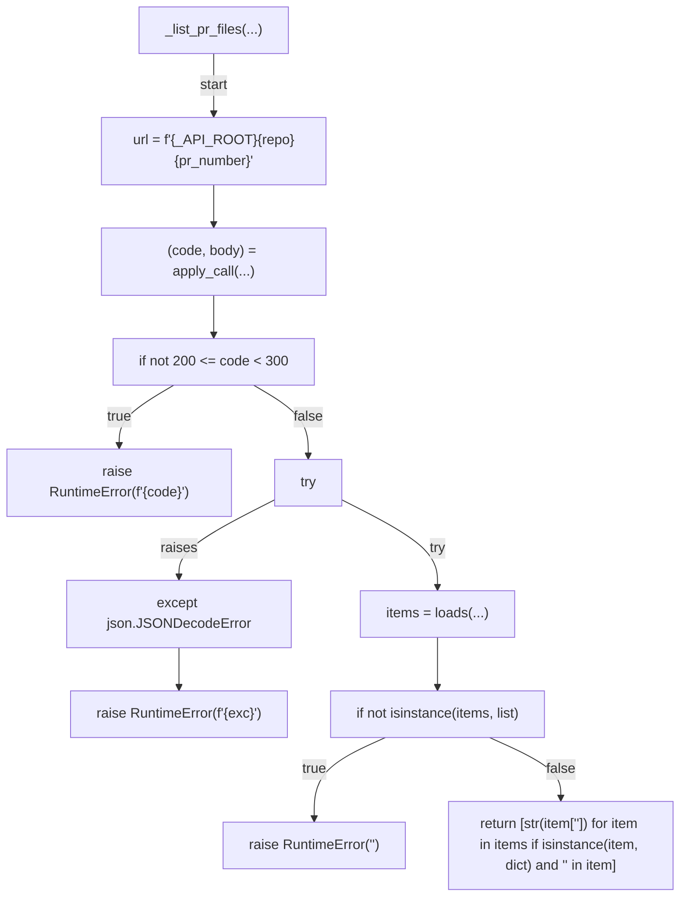

## _enable_auto_merge(...)

```mermaid
flowchart TD
    N001["_enable_auto_merge(...)"]
    N002["url = f'{_API_ROOT}<str>{repo}<str>{pr_number}'"]
    N003["(code, body) = apply_call(...)"]
    N004["if not 200 <= code < 300"]
    N005["raise RuntimeError(f'<str>{code}')"]
    N006["try"]
    N007["pr_data = loads(...)"]
    N008["except json.JSONDecodeError"]
    N009["raise RuntimeError(f'<str>{exc}')"]
    N010["node_id = pr_data.get('<str>') if isinstance(pr_data, dict) else None"]
    N011["if not isinstance(node_id, str) or not node_id"]
    N012["raise RuntimeError('<str>')"]
    N013["(gql_code, response) = graphql_call(...)"]
    N014["if not 200 <= gql_code < 300"]
    N015["raise RuntimeError(f'<str>{gql_code}')"]
    N016["if 'errors' in response"]
    N017["raise RuntimeError(f\"<str>{response['<str>']}\")"]
    N018["end"]
    N001 -->|"start"| N002
    N002 --> N003
    N003 --> N004
    N004 -->|"true"| N005
    N004 -->|"false"| N006
    N006 -->|"try"| N007
    N006 -->|"raises"| N008
    N008 --> N009
    N007 --> N010
    N010 --> N011
    N011 -->|"true"| N012
    N011 -->|"false"| N013
    N013 --> N014
    N014 -->|"true"| N015
    N014 -->|"false"| N016
    N016 -->|"true"| N017
    N016 -->|"false"| N018
```

## _disable_auto_merge(...)

```mermaid
flowchart TD
    N001["_disable_auto_merge(...)"]
    N002["url = f'{_API_ROOT}<str>{repo}<str>{pr_number}'"]
    N003["(code, body) = apply_call(...)"]
    N004["if not 200 <= code < 300"]
    N005["raise RuntimeError(f'<str>{code}')"]
    N006["try"]
    N007["pr_data = loads(...)"]
    N008["except json.JSONDecodeError"]
    N009["raise RuntimeError(f'<str>{exc}')"]
    N010["if not isinstance(pr_data, dict)"]
    N011["raise RuntimeError('<str>')"]
    N012["node_id = get(...)"]
    N013["if not isinstance(node_id, str) or not node_id"]
    N014["raise RuntimeError('<str>')"]
    N015["if pr_data.get('auto_merge') is None"]
    N016["return False"]
    N017["(gql_code, response) = graphql_call(...)"]
    N018["if not 200 <= gql_code < 300"]
    N019["raise RuntimeError(f'<str>{gql_code}')"]
    N020["if 'errors' in response"]
    N021["raise RuntimeError(f\"<str>{response['<str>']}\")"]
    N022["return True"]
    N001 -->|"start"| N002
    N002 --> N003
    N003 --> N004
    N004 -->|"true"| N005
    N004 -->|"false"| N006
    N006 -->|"try"| N007
    N006 -->|"raises"| N008
    N008 --> N009
    N007 --> N010
    N010 -->|"true"| N011
    N010 -->|"false"| N012
    N012 --> N013
    N013 -->|"true"| N014
    N013 -->|"false"| N015
    N015 -->|"true"| N016
    N015 -->|"false"| N017
    N017 --> N018
    N018 -->|"true"| N019
    N018 -->|"false"| N020
    N020 -->|"true"| N021
    N020 -->|"false"| N022
```

## _cmd_list_files(...)

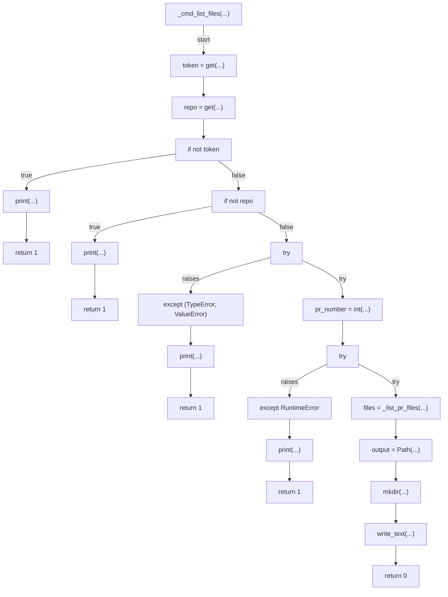

## _cmd_request_automerge(...)

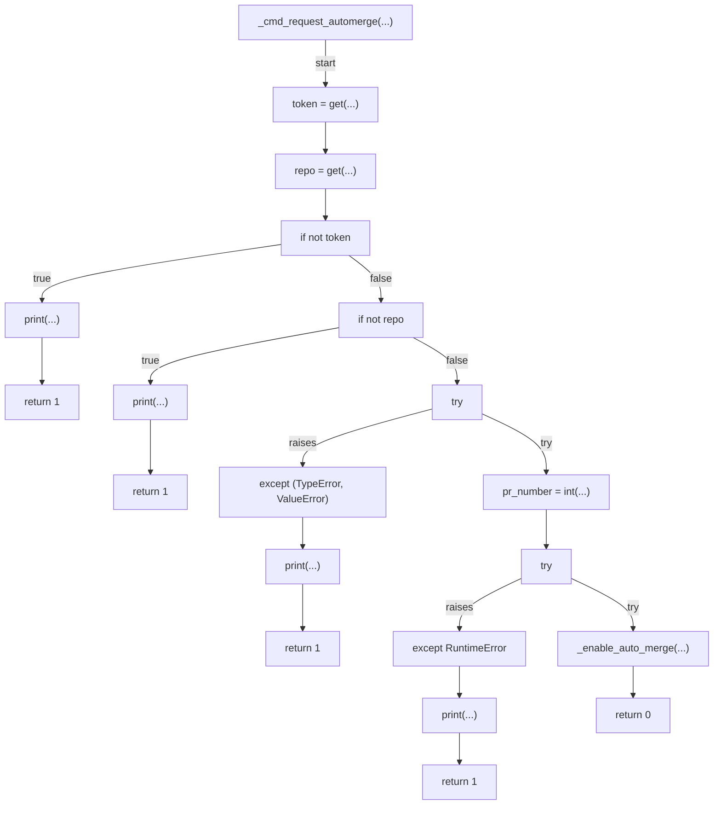

## _cmd_disable_automerge(...)

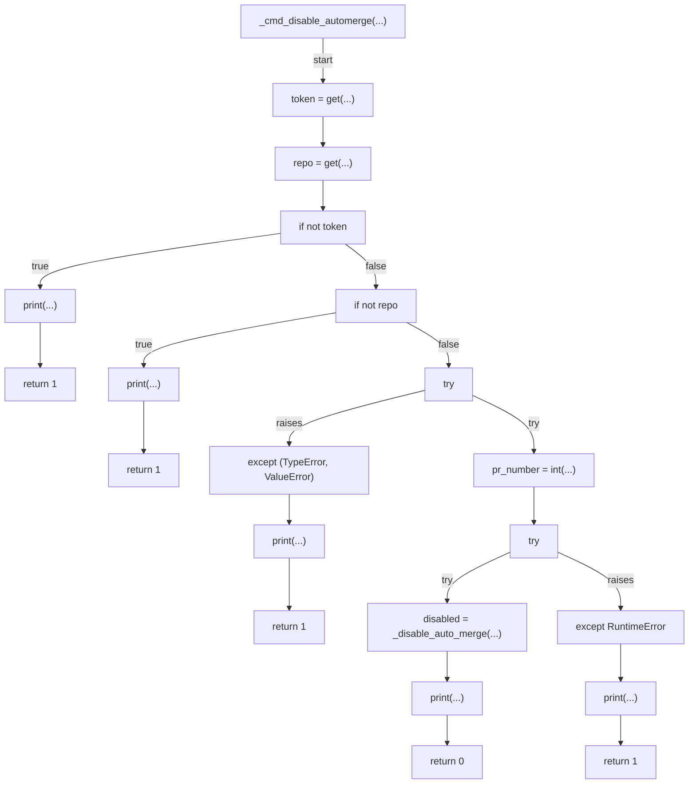

## main(...)

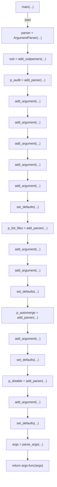
