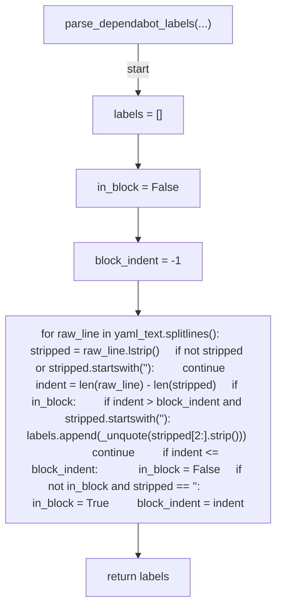
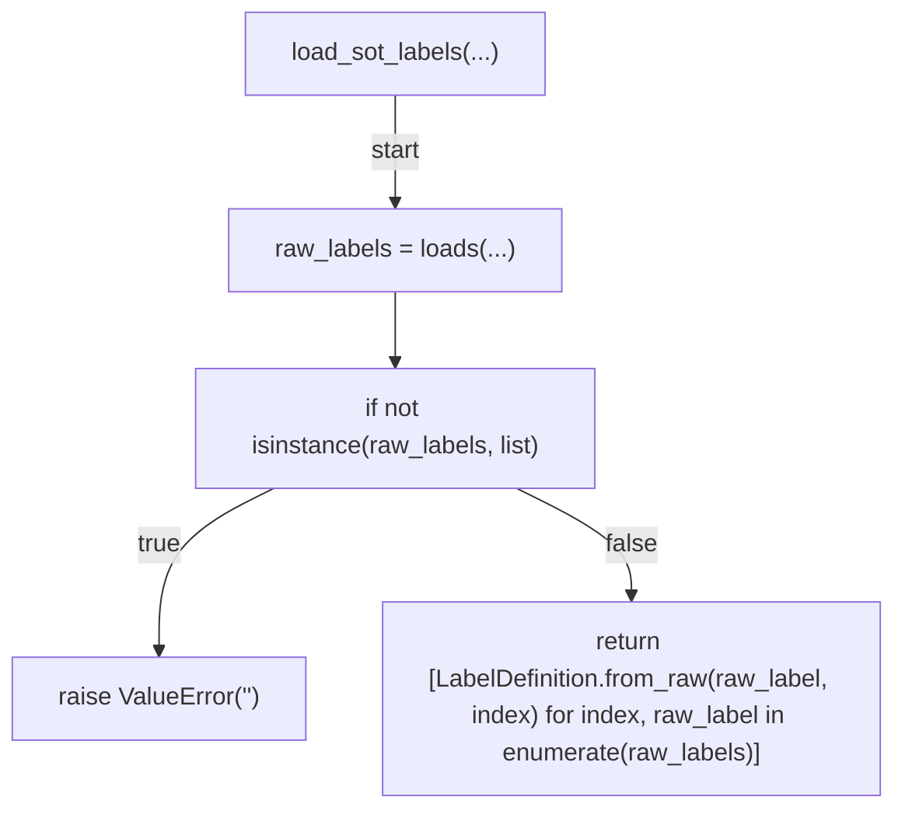
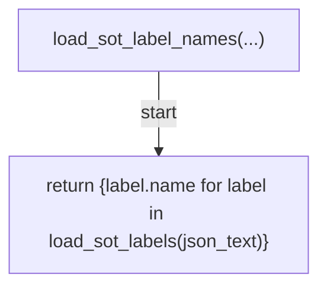
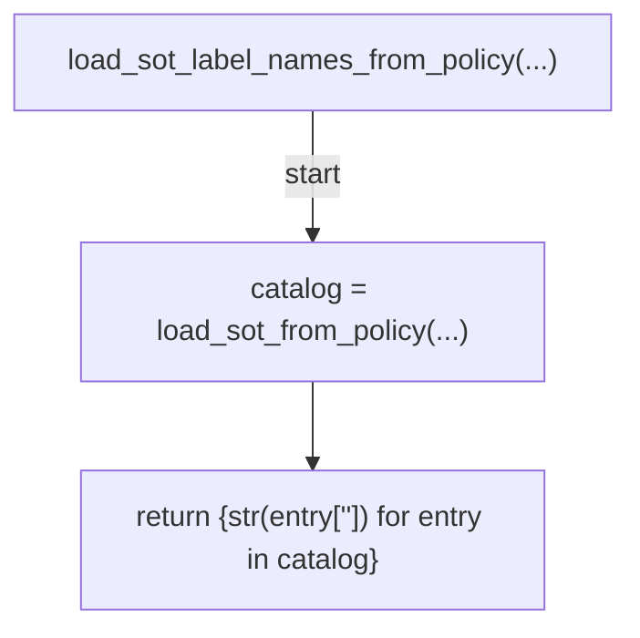
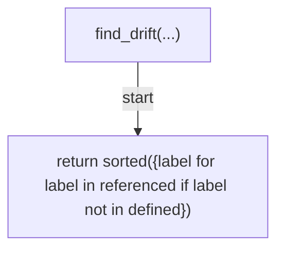
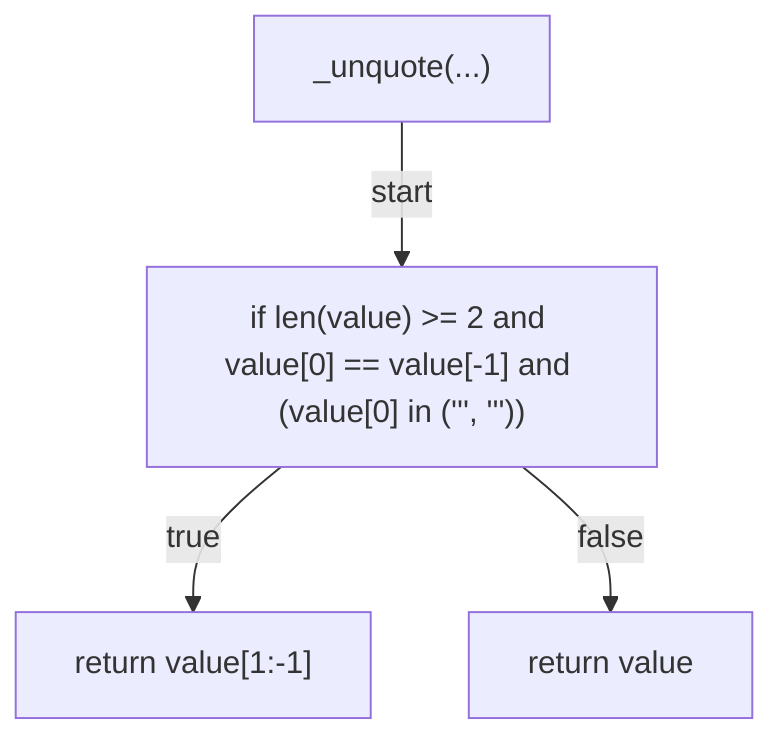
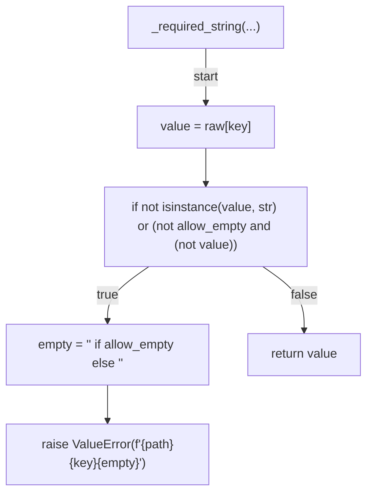
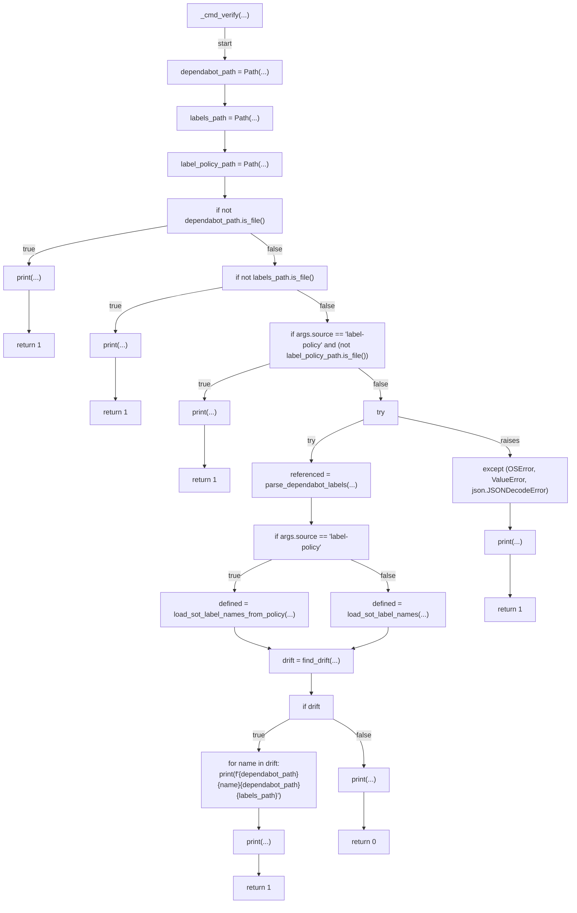
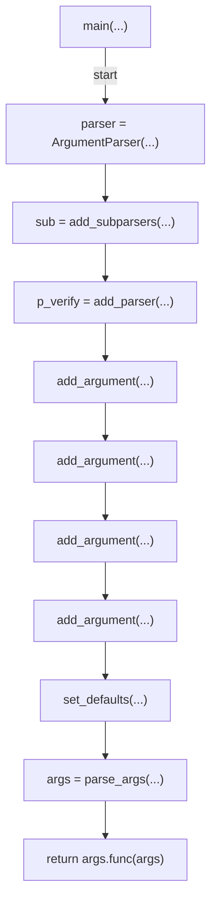

# AST graph: scripts/dependabot_labels.py

This file is generated from `scripts/dependabot_labels.py` by `python3 scripts/script_ast_graph.py all-doc`. Do not edit it by hand: content under `docs/generated/scripts/` is owned by the post-merge automation (refs #1540); update the source script instead.

## parse_dependabot_labels(...)

## load_sot_labels(...)

## load_sot_label_names(...)

## load_sot_label_names_from_policy(...)

## find_drift(...)

## _unquote(...)

## _required_string(...)

## _cmd_verify(...)

## main(...)

