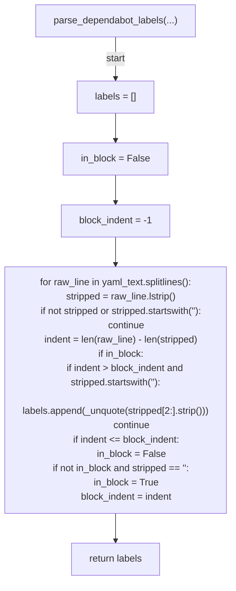
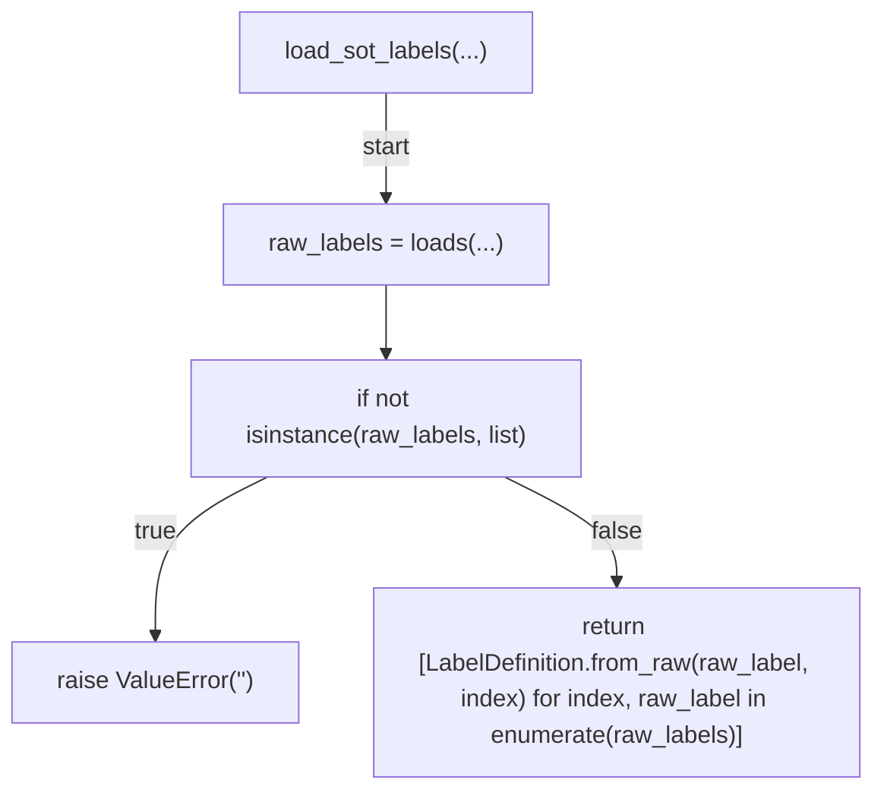
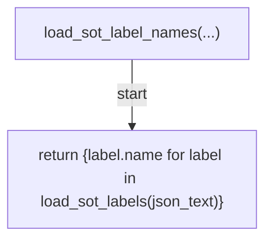
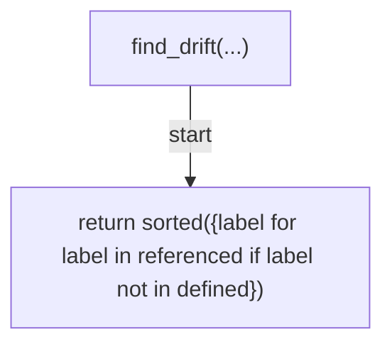
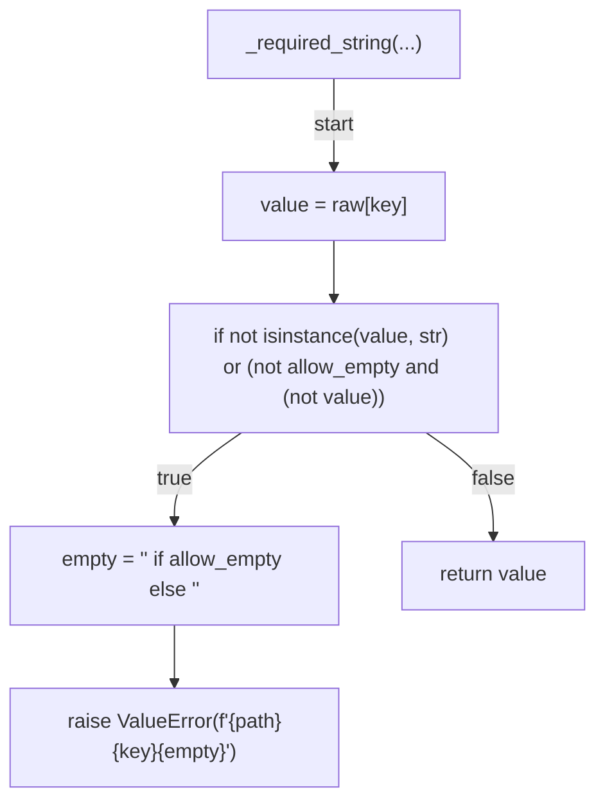
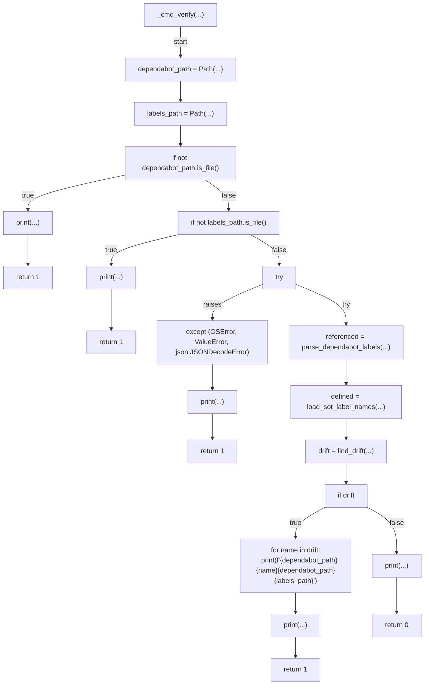
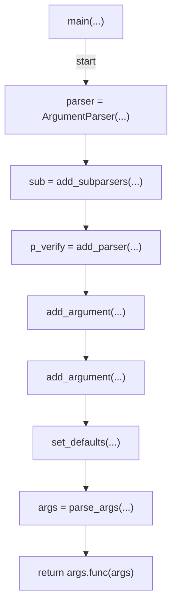

# AST graph: scripts/dependabot_labels.py

This file is generated from `scripts/dependabot_labels.py` by `python3 scripts/script_ast_graph.py all-doc`. Do not edit it by hand: content under `docs/generated/scripts/` is owned by the post-merge automation (refs #1540) -- update the source script instead.

## parse_dependabot_labels(...)



## load_sot_labels(...)



## load_sot_label_names(...)



## find_drift(...)



## _unquote(...)

```mermaid
flowchart TD
    N001["_unquote(...)"]
    N002["if len(value) >= 2 and value[0] == value[-1] and (value[0] in ('\"', \"'\"))"]
    N003["return value[1:-1]"]
    N004["return value"]
    N001 -->|"start"| N002
    N002 -->|"true"| N003
    N002 -->|"false"| N004
```

## _required_string(...)



## _cmd_verify(...)



## main(...)


