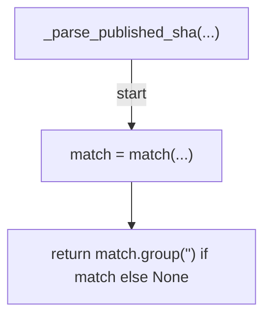
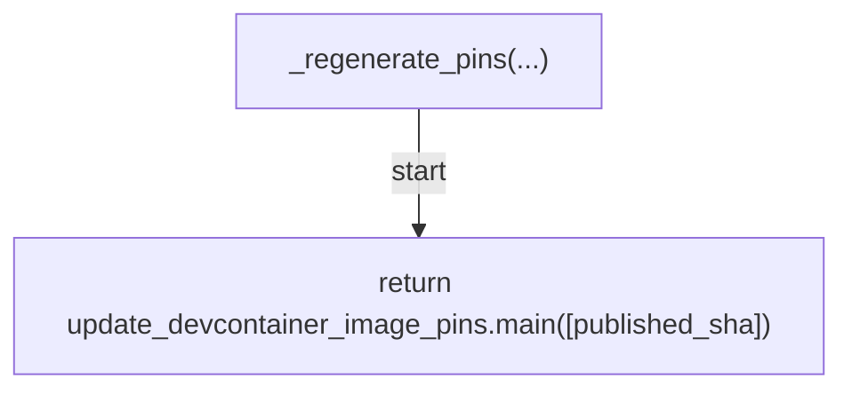
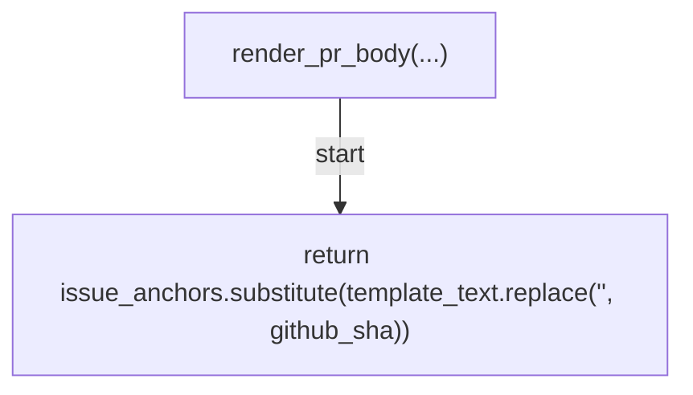
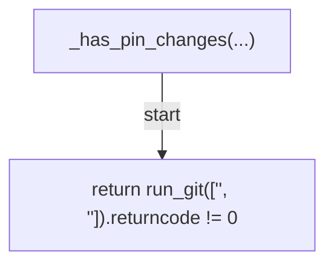
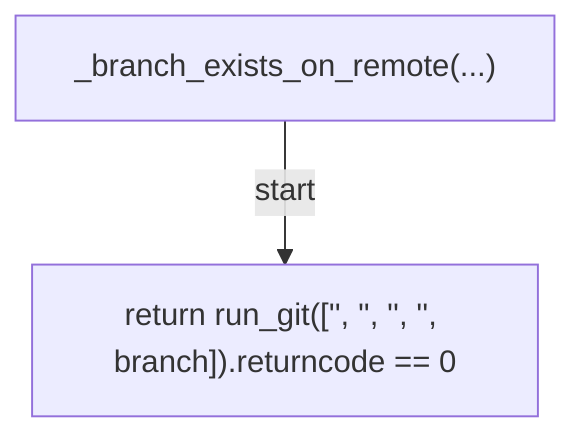
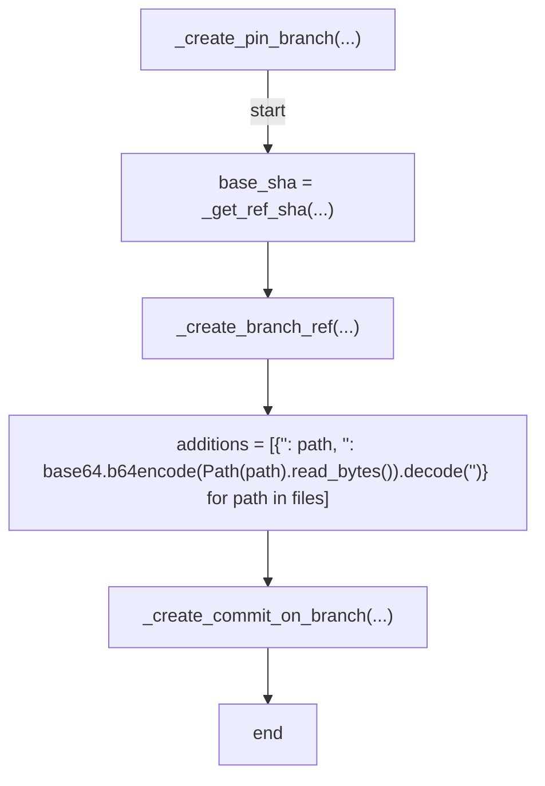
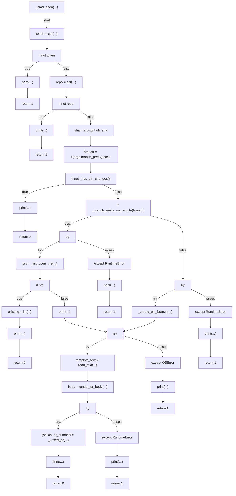
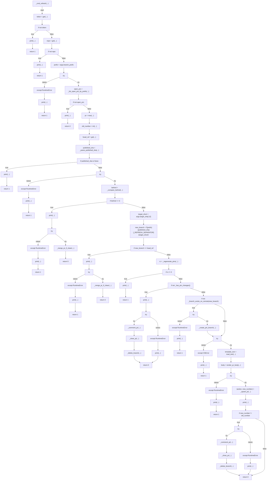
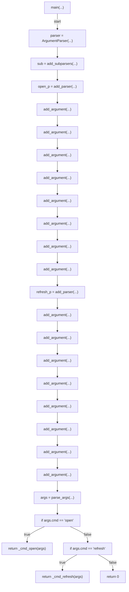

# AST graph: scripts/devcontainer_pin_pr.py

This file is generated from `scripts/devcontainer_pin_pr.py` by `python3 scripts/script_ast_graph.py all-doc`. Do not edit it by hand: content under `docs/generated/scripts/` is owned by the post-merge automation (refs #1540) -- update the source script instead.

## _parse_published_sha(...)

## _regenerate_pins(...)

## render_pr_body(...)

## _has_pin_changes(...)

## _branch_exists_on_remote(...)

## _create_pin_branch(...)

## _cmd_open(...)

## _cmd_refresh(...)

## main(...)

