# AST graph: scripts/flake_pin.py

This file is generated from `scripts/flake_pin.py` by `python3 scripts/script_ast_graph.py all-doc`. Do not edit it by hand: content under `docs/generated/scripts/` is owned by the post-merge automation (refs #1540); update the source script instead.

## tool_spec(...)

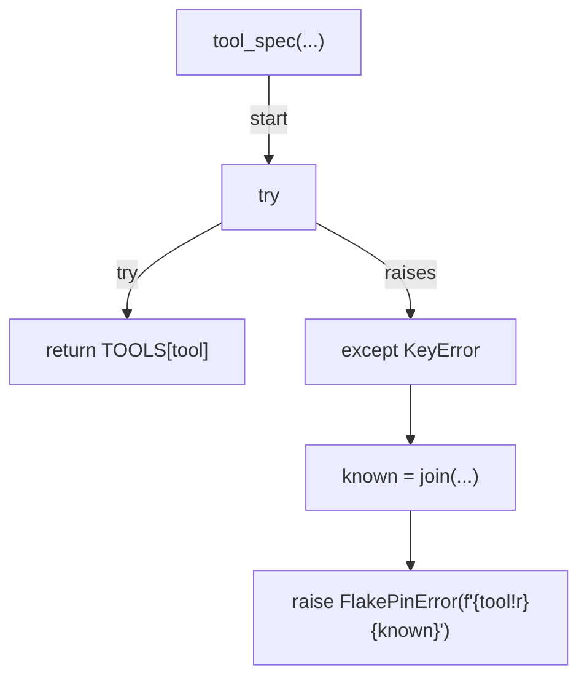
```mermaid
flowchart TD
    N001["tool_spec(...)"]
    N002["try"]
    N003["return TOOLS[tool]"]
    N004["except KeyError"]
    N005["known = join(...)"]
    N006["raise FlakePinError(f'<str>{tool!r}<str>{known}')"]
    N001 -->|"start"| N002
    N002 -->|"try"| N003
    N002 -->|"raises"| N004
    N004 --> N005
    N005 --> N006
```

## _quoted_setter(...)

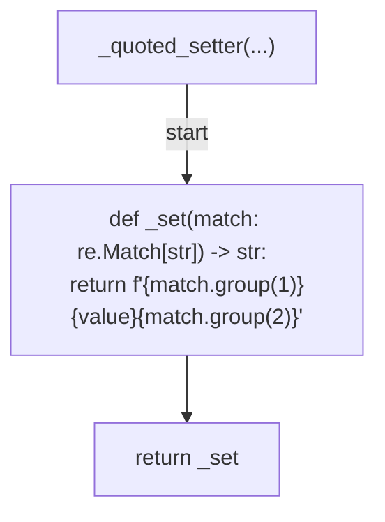
```mermaid
flowchart TD
    N001["_quoted_setter(...)"]
    N002["def _set(match: re.Match[str]) -> str:     return f'{match.group(1)}{value}{match.group(2)}'"]
    N003["return _set"]
    N001 -->|"start"| N002
    N002 --> N003
```

## read_flake_text(...)

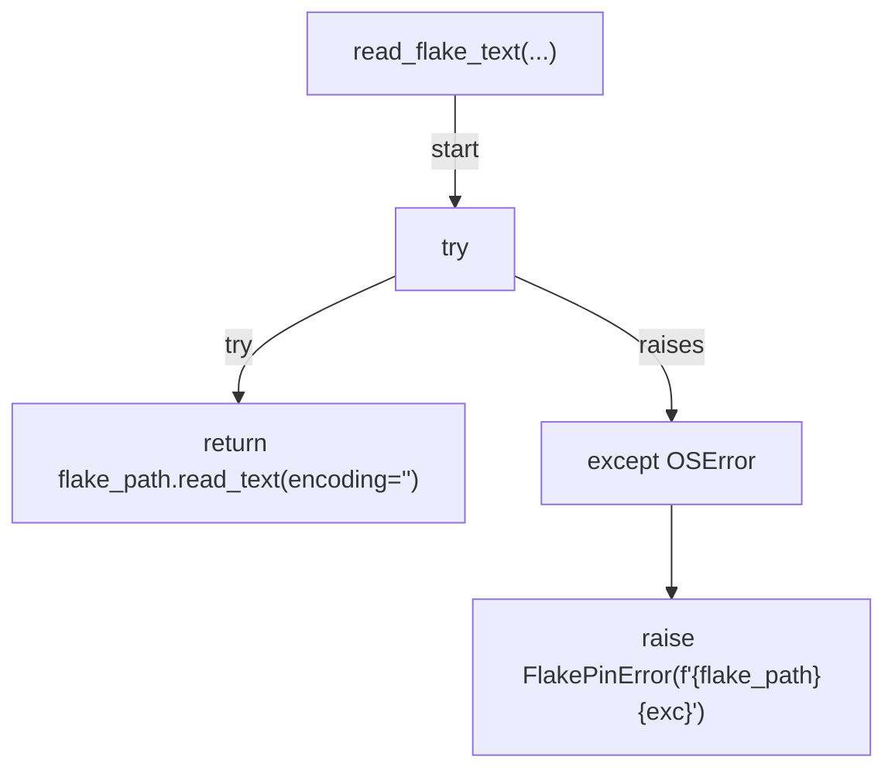
```mermaid
flowchart TD
    N001["read_flake_text(...)"]
    N002["try"]
    N003["return flake_path.read_text(encoding='<str>')"]
    N004["except OSError"]
    N005["raise FlakePinError(f'<str>{flake_path}<str>{exc}')"]
    N001 -->|"start"| N002
    N002 -->|"try"| N003
    N002 -->|"raises"| N004
    N004 --> N005
```

## current_version(...)

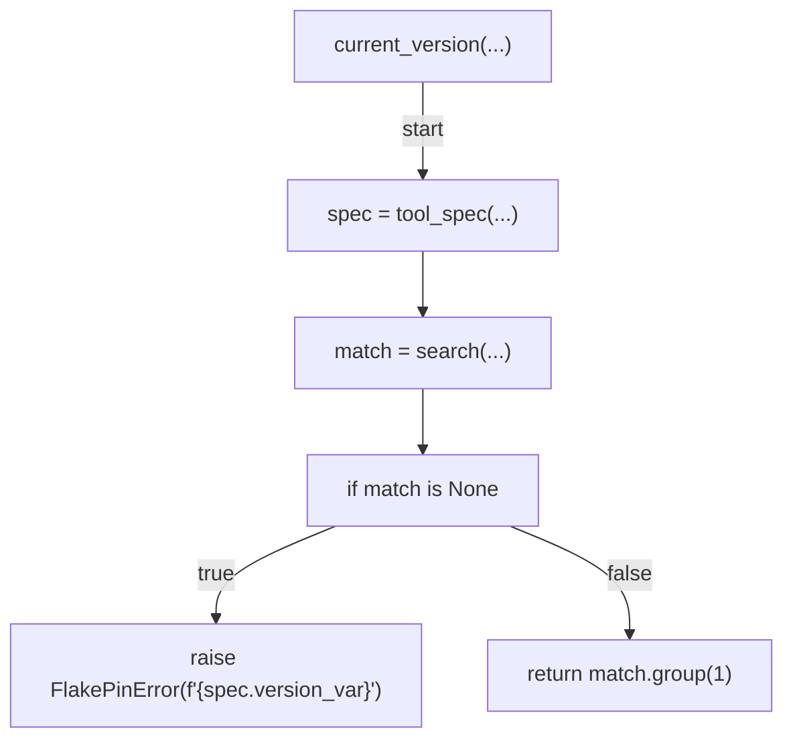
```mermaid
flowchart TD
    N001["current_version(...)"]
    N002["spec = tool_spec(...)"]
    N003["match = search(...)"]
    N004["if match is None"]
    N005["raise FlakePinError(f'{spec.version_var}<str>')"]
    N006["return match.group(1)"]
    N001 -->|"start"| N002
    N002 --> N003
    N003 --> N004
    N004 -->|"true"| N005
    N004 -->|"false"| N006
```

## _native_block(...)

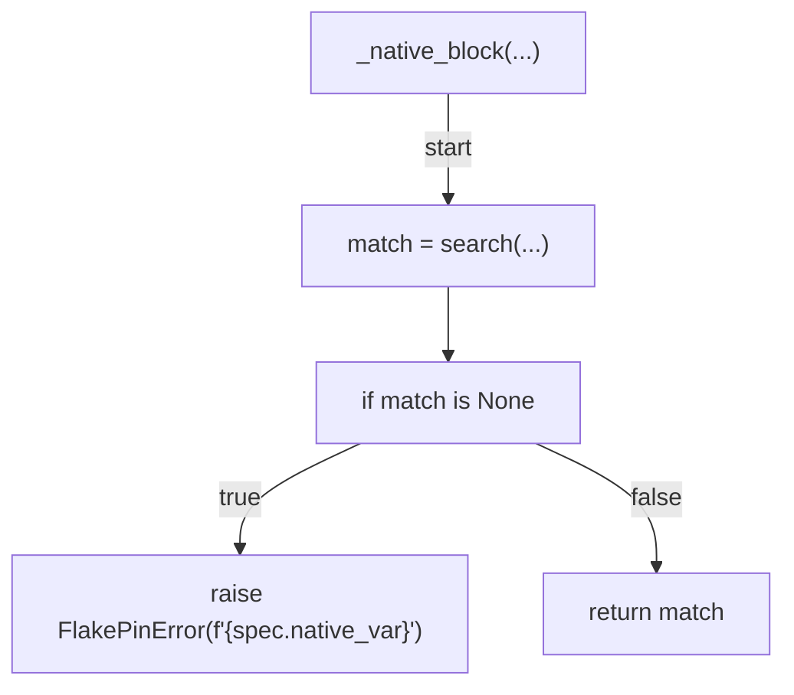
```mermaid
flowchart TD
    N001["_native_block(...)"]
    N002["match = search(...)"]
    N003["if match is None"]
    N004["raise FlakePinError(f'{spec.native_var}<str>')"]
    N005["return match"]
    N001 -->|"start"| N002
    N002 --> N003
    N003 -->|"true"| N004
    N003 -->|"false"| N005
```

## _system_entry(...)

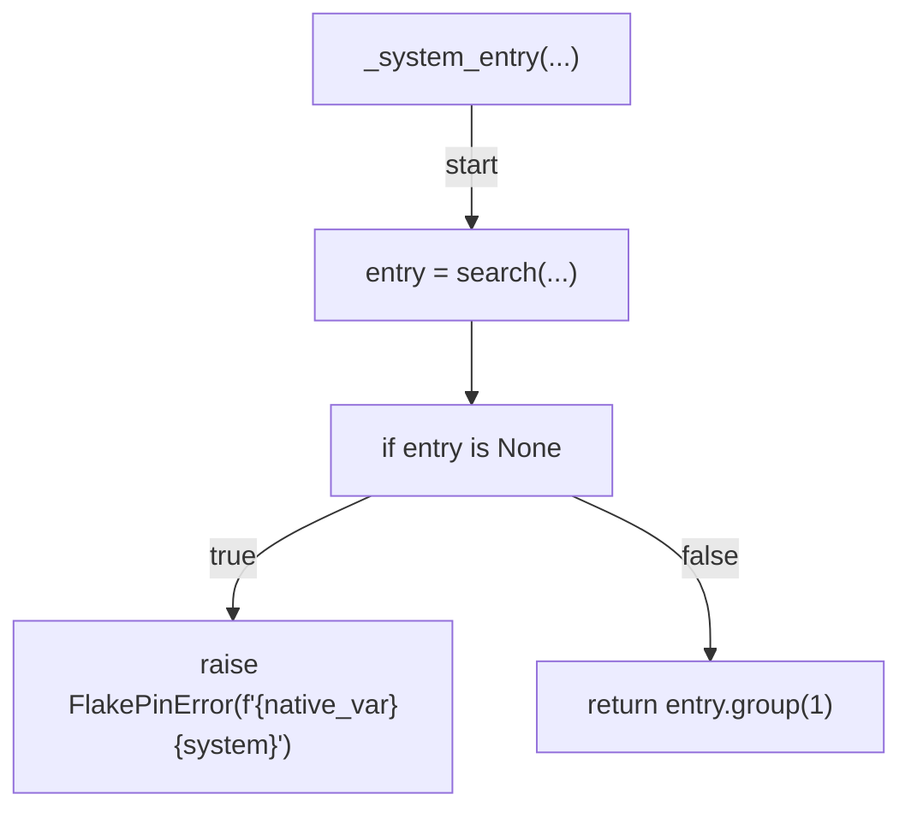
```mermaid
flowchart TD
    N001["_system_entry(...)"]
    N002["entry = search(...)"]
    N003["if entry is None"]
    N004["raise FlakePinError(f'{native_var}<str>{system}<str>')"]
    N005["return entry.group(1)"]
    N001 -->|"start"| N002
    N002 --> N003
    N003 -->|"true"| N004
    N003 -->|"false"| N005
```

## asset_value(...)

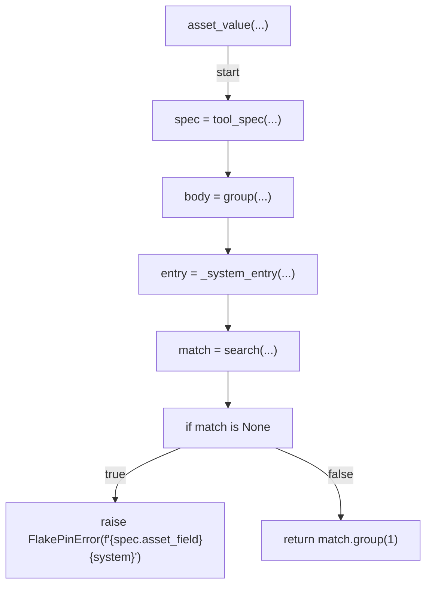
```mermaid
flowchart TD
    N001["asset_value(...)"]
    N002["spec = tool_spec(...)"]
    N003["body = group(...)"]
    N004["entry = _system_entry(...)"]
    N005["match = search(...)"]
    N006["if match is None"]
    N007["raise FlakePinError(f'{spec.asset_field}<str>{system}<str>')"]
    N008["return match.group(1)"]
    N001 -->|"start"| N002
    N002 --> N003
    N003 --> N004
    N004 --> N005
    N005 --> N006
    N006 -->|"true"| N007
    N006 -->|"false"| N008
```

## asset_url(...)

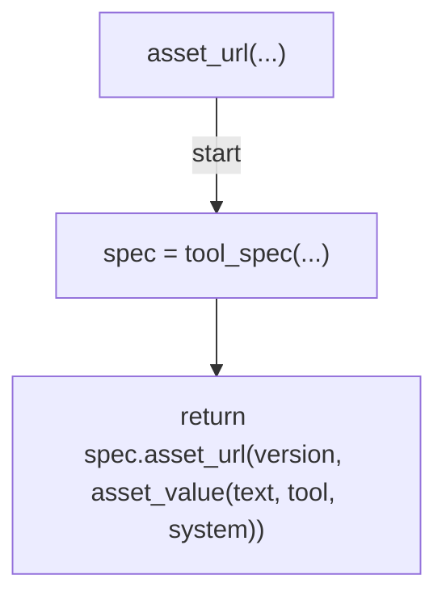
```mermaid
flowchart TD
    N001["asset_url(...)"]
    N002["spec = tool_spec(...)"]
    N003["return spec.asset_url(version, asset_value(text, tool, system))"]
    N001 -->|"start"| N002
    N002 --> N003
```

## hash_value(...)

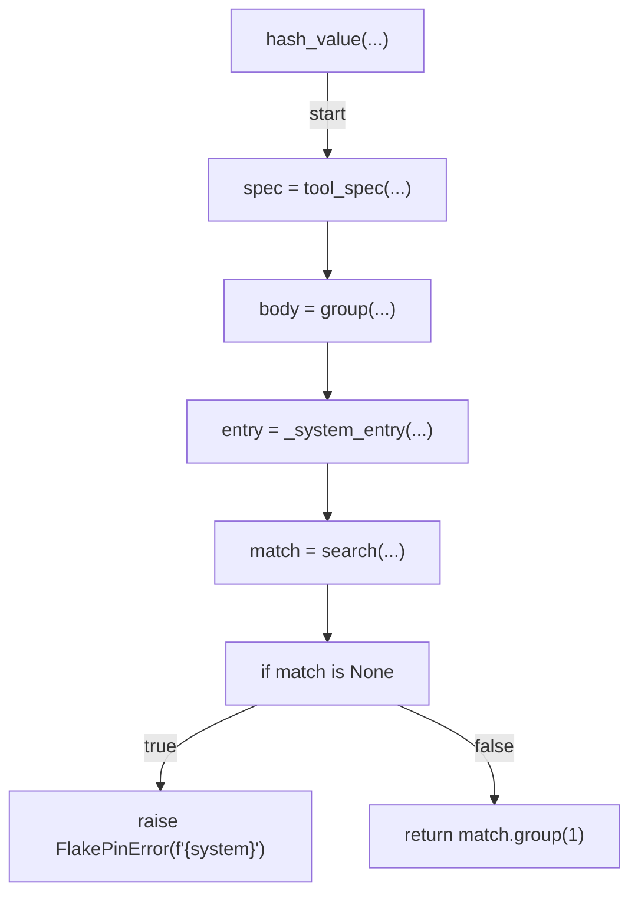
```mermaid
flowchart TD
    N001["hash_value(...)"]
    N002["spec = tool_spec(...)"]
    N003["body = group(...)"]
    N004["entry = _system_entry(...)"]
    N005["match = search(...)"]
    N006["if match is None"]
    N007["raise FlakePinError(f'<str>{system}<str>')"]
    N008["return match.group(1)"]
    N001 -->|"start"| N002
    N002 --> N003
    N003 --> N004
    N004 --> N005
    N005 --> N006
    N006 -->|"true"| N007
    N006 -->|"false"| N008
```

## sri_to_hex(...)

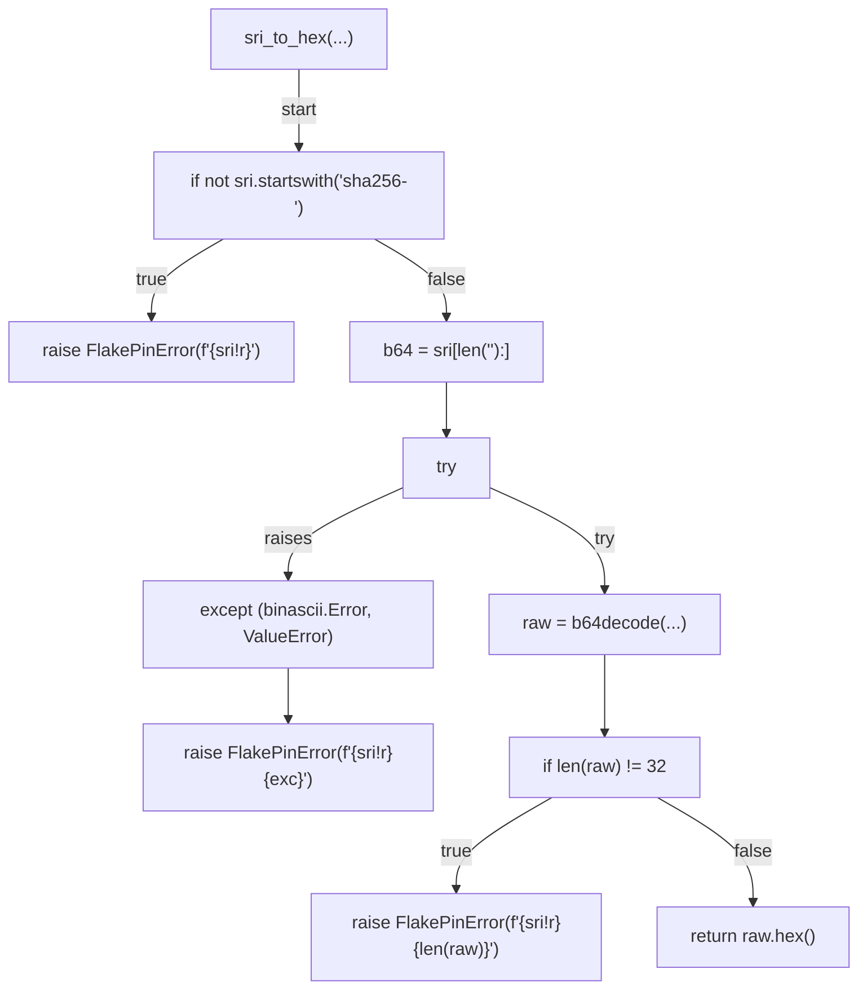
```mermaid
flowchart TD
    N001["sri_to_hex(...)"]
    N002["if not sri.startswith('sha256-')"]
    N003["raise FlakePinError(f'<str>{sri!r}')"]
    N004["b64 = sri[len('<str>'):]"]
    N005["try"]
    N006["raw = b64decode(...)"]
    N007["except (binascii.Error, ValueError)"]
    N008["raise FlakePinError(f'<str>{sri!r}<str>{exc}')"]
    N009["if len(raw) != 32"]
    N010["raise FlakePinError(f'<str>{sri!r}<str>{len(raw)}<str>')"]
    N011["return raw.hex()"]
    N001 -->|"start"| N002
    N002 -->|"true"| N003
    N002 -->|"false"| N004
    N004 --> N005
    N005 -->|"try"| N006
    N005 -->|"raises"| N007
    N007 --> N008
    N006 --> N009
    N009 -->|"true"| N010
    N009 -->|"false"| N011
```

## resolve(...)

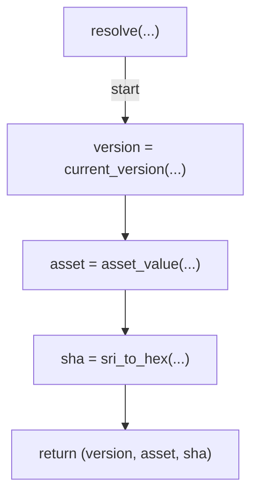
```mermaid
flowchart TD
    N001["resolve(...)"]
    N002["version = current_version(...)"]
    N003["asset = asset_value(...)"]
    N004["sha = sri_to_hex(...)"]
    N005["return (version, asset, sha)"]
    N001 -->|"start"| N002
    N002 --> N003
    N003 --> N004
    N004 --> N005
```

## _replace_hash_in_entry(...)

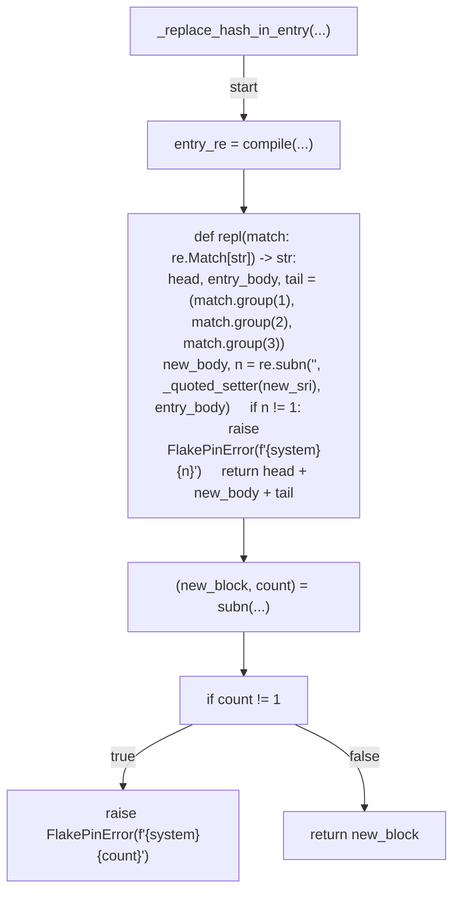
```mermaid
flowchart TD
    N001["_replace_hash_in_entry(...)"]
    N002["entry_re = compile(...)"]
    N003["def repl(match: re.Match[str]) -> str:     head, entry_body, tail = (match.group(1), match.group(2), match.group(3))     new_body, n = re.subn('<str>', _quoted_setter(new_sri), entry_body)     if n != 1:         raise FlakePinError(f'<str>{system}<str>{n}')     return head + new_body + tail"]
    N004["(new_block, count) = subn(...)"]
    N005["if count != 1"]
    N006["raise FlakePinError(f'<str>{system}<str>{count}')"]
    N007["return new_block"]
    N001 -->|"start"| N002
    N002 --> N003
    N003 --> N004
    N004 --> N005
    N005 -->|"true"| N006
    N005 -->|"false"| N007
```

## bump(...)

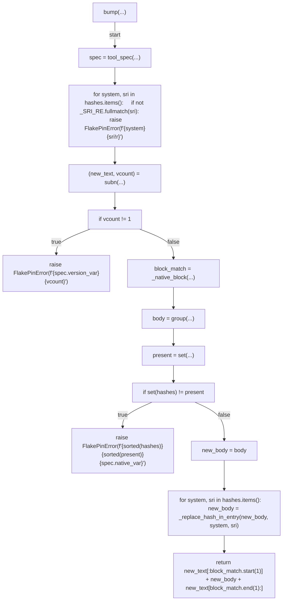
```mermaid
flowchart TD
    N001["bump(...)"]
    N002["spec = tool_spec(...)"]
    N003["for system, sri in hashes.items():     if not _SRI_RE.fullmatch(sri):         raise FlakePinError(f'<str>{system}<str>{sri!r}')"]
    N004["(new_text, vcount) = subn(...)"]
    N005["if vcount != 1"]
    N006["raise FlakePinError(f'<str>{spec.version_var}<str>{vcount}')"]
    N007["block_match = _native_block(...)"]
    N008["body = group(...)"]
    N009["present = set(...)"]
    N010["if set(hashes) != present"]
    N011["raise FlakePinError(f'<str>{sorted(hashes)}<str>{sorted(present)}<str>{spec.native_var}')"]
    N012["new_body = body"]
    N013["for system, sri in hashes.items():     new_body = _replace_hash_in_entry(new_body, system, sri)"]
    N014["return new_text[:block_match.start(1)] + new_body + new_text[block_match.end(1):]"]
    N001 -->|"start"| N002
    N002 --> N003
    N003 --> N004
    N004 --> N005
    N005 -->|"true"| N006
    N005 -->|"false"| N007
    N007 --> N008
    N008 --> N009
    N009 --> N010
    N010 -->|"true"| N011
    N010 -->|"false"| N012
    N012 --> N013
    N013 --> N014
```

## _parse_hash_args(...)

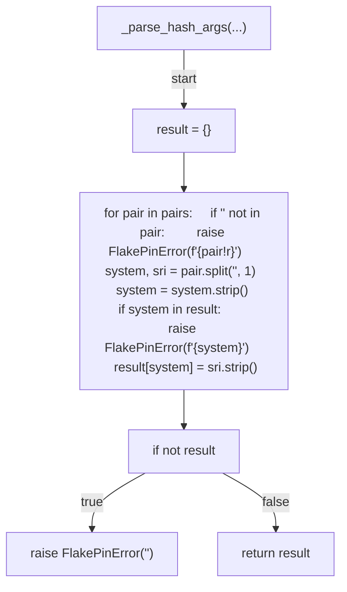
```mermaid
flowchart TD
    N001["_parse_hash_args(...)"]
    N002["result = {}"]
    N003["for pair in pairs:     if '<str>' not in pair:         raise FlakePinError(f'<str>{pair!r}')     system, sri = pair.split('<str>', 1)     system = system.strip()     if system in result:         raise FlakePinError(f'<str>{system}<str>')     result[system] = sri.strip()"]
    N004["if not result"]
    N005["raise FlakePinError('<str>')"]
    N006["return result"]
    N001 -->|"start"| N002
    N002 --> N003
    N003 --> N004
    N004 -->|"true"| N005
    N004 -->|"false"| N006
```

## _cmd_version(...)

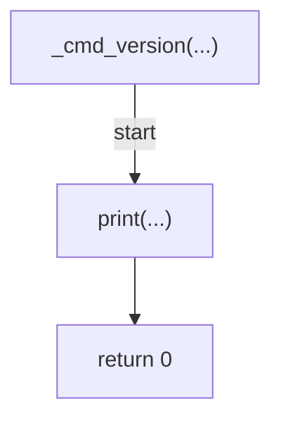
```mermaid
flowchart TD
    N001["_cmd_version(...)"]
    N002["print(...)"]
    N003["return 0"]
    N001 -->|"start"| N002
    N002 --> N003
```

## _cmd_repo(...)

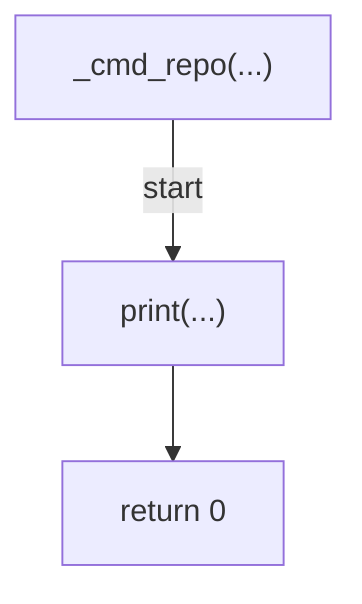
```mermaid
flowchart TD
    N001["_cmd_repo(...)"]
    N002["print(...)"]
    N003["return 0"]
    N001 -->|"start"| N002
    N002 --> N003
```

## _cmd_asset_url(...)

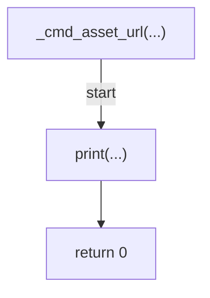
```mermaid
flowchart TD
    N001["_cmd_asset_url(...)"]
    N002["print(...)"]
    N003["return 0"]
    N001 -->|"start"| N002
    N002 --> N003
```

## _cmd_resolve(...)

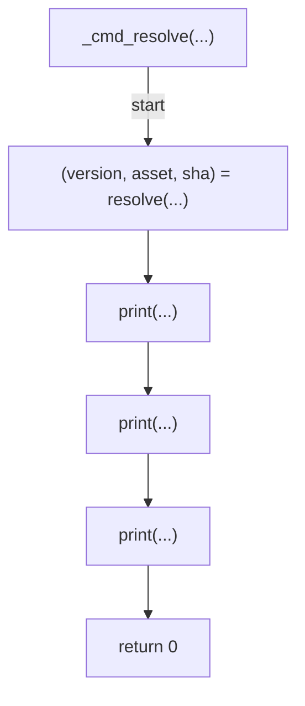
```mermaid
flowchart TD
    N001["_cmd_resolve(...)"]
    N002["(version, asset, sha) = resolve(...)"]
    N003["print(...)"]
    N004["print(...)"]
    N005["print(...)"]
    N006["return 0"]
    N001 -->|"start"| N002
    N002 --> N003
    N003 --> N004
    N004 --> N005
    N005 --> N006
```

## _cmd_bump(...)

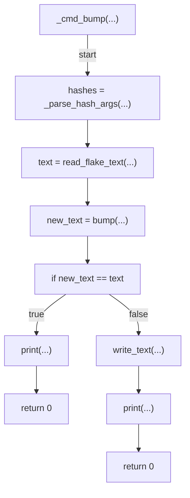
```mermaid
flowchart TD
    N001["_cmd_bump(...)"]
    N002["hashes = _parse_hash_args(...)"]
    N003["text = read_flake_text(...)"]
    N004["new_text = bump(...)"]
    N005["if new_text == text"]
    N006["print(...)"]
    N007["return 0"]
    N008["write_text(...)"]
    N009["print(...)"]
    N010["return 0"]
    N001 -->|"start"| N002
    N002 --> N003
    N003 --> N004
    N004 --> N005
    N005 -->|"true"| N006
    N006 --> N007
    N005 -->|"false"| N008
    N008 --> N009
    N009 --> N010
```

## main(...)

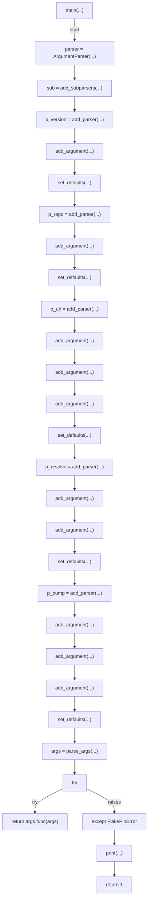
```mermaid
flowchart TD
    N001["main(...)"]
    N002["parser = ArgumentParser(...)"]
    N003["sub = add_subparsers(...)"]
    N004["p_version = add_parser(...)"]
    N005["add_argument(...)"]
    N006["set_defaults(...)"]
    N007["p_repo = add_parser(...)"]
    N008["add_argument(...)"]
    N009["set_defaults(...)"]
    N010["p_url = add_parser(...)"]
    N011["add_argument(...)"]
    N012["add_argument(...)"]
    N013["add_argument(...)"]
    N014["set_defaults(...)"]
    N015["p_resolve = add_parser(...)"]
    N016["add_argument(...)"]
    N017["add_argument(...)"]
    N018["set_defaults(...)"]
    N019["p_bump = add_parser(...)"]
    N020["add_argument(...)"]
    N021["add_argument(...)"]
    N022["add_argument(...)"]
    N023["set_defaults(...)"]
    N024["args = parse_args(...)"]
    N025["try"]
    N026["return args.func(args)"]
    N027["except FlakePinError"]
    N028["print(...)"]
    N029["return 1"]
    N001 -->|"start"| N002
    N002 --> N003
    N003 --> N004
    N004 --> N005
    N005 --> N006
    N006 --> N007
    N007 --> N008
    N008 --> N009
    N009 --> N010
    N010 --> N011
    N011 --> N012
    N012 --> N013
    N013 --> N014
    N014 --> N015
    N015 --> N016
    N016 --> N017
    N017 --> N018
    N018 --> N019
    N019 --> N020
    N020 --> N021
    N021 --> N022
    N022 --> N023
    N023 --> N024
    N024 --> N025
    N025 -->|"try"| N026
    N025 -->|"raises"| N027
    N027 --> N028
    N028 --> N029
```
