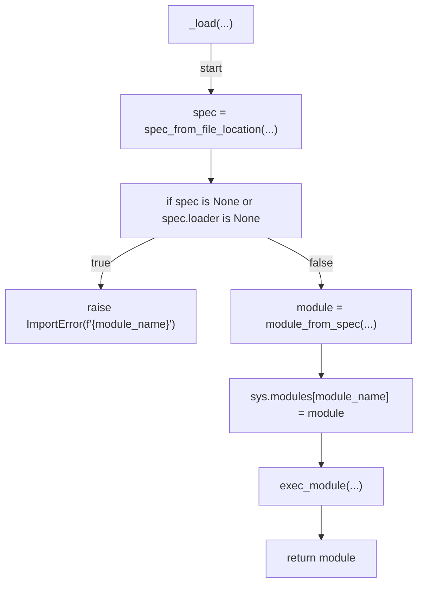
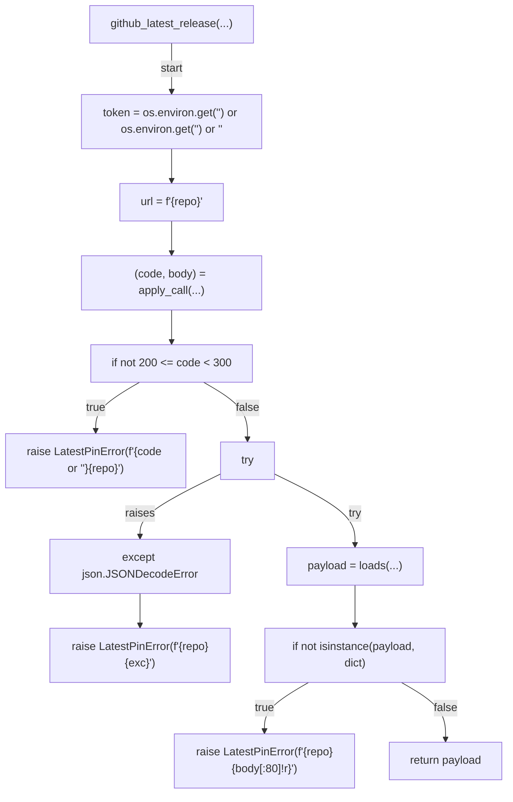
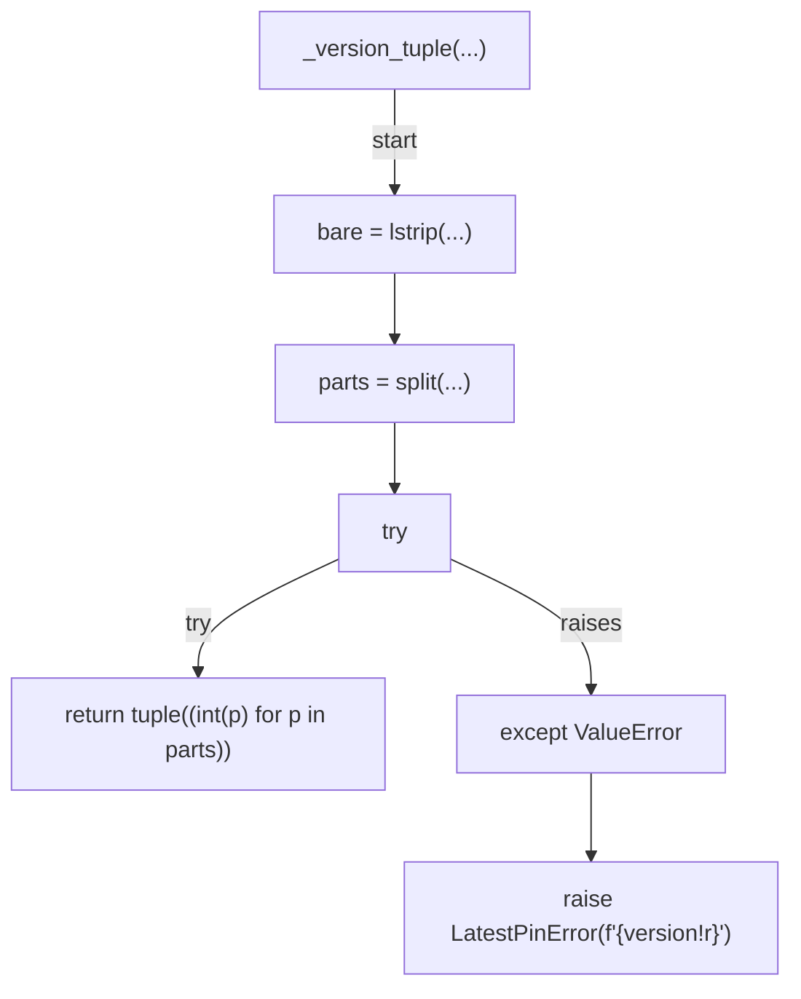
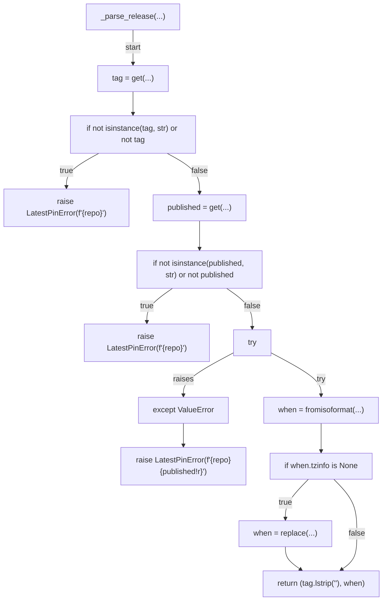
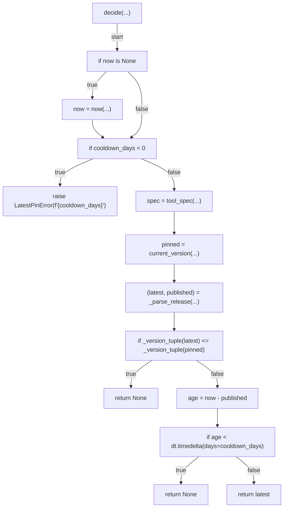
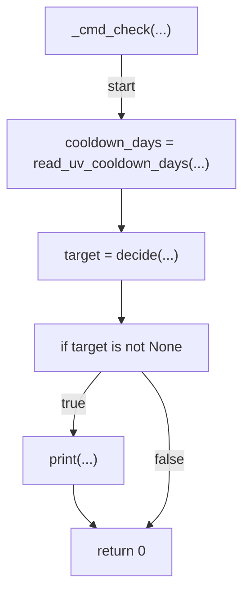
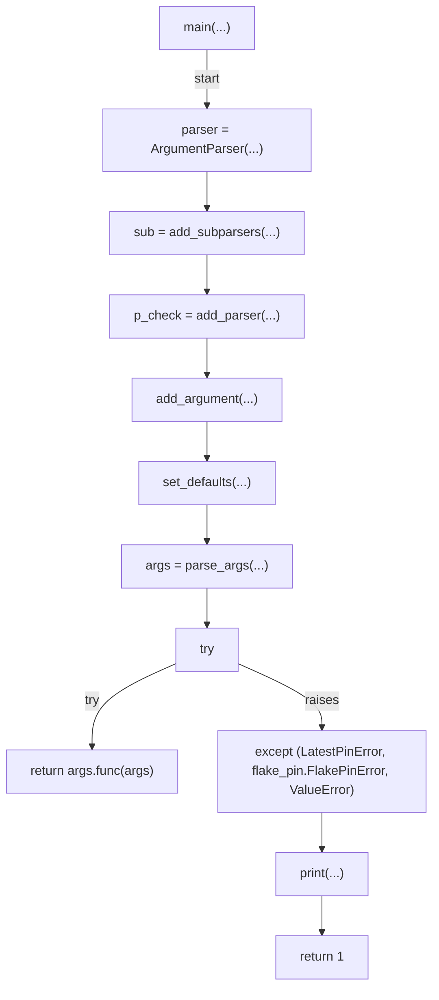

# AST graph: scripts/flake_pin_latest.py

This file is generated from `scripts/flake_pin_latest.py` by `python3 scripts/script_ast_graph.py all-doc`. Do not edit it by hand: content under `docs/generated/scripts/` is owned by the post-merge automation (refs #1540); update the source script instead.

## _load(...)

## github_latest_release(...)

## _version_tuple(...)

## _parse_release(...)

## decide(...)

## _cmd_check(...)

## main(...)

