# AST graph: scripts/gate_agents_skills_edit.py

This file is generated from `scripts/gate_agents_skills_edit.py` by `python3 scripts/script_ast_graph.py all-doc`. Do not edit it by hand: content under `docs/generated/scripts/` is owned by the post-merge automation (refs #1540); update the source script instead.

## _normalize(...)

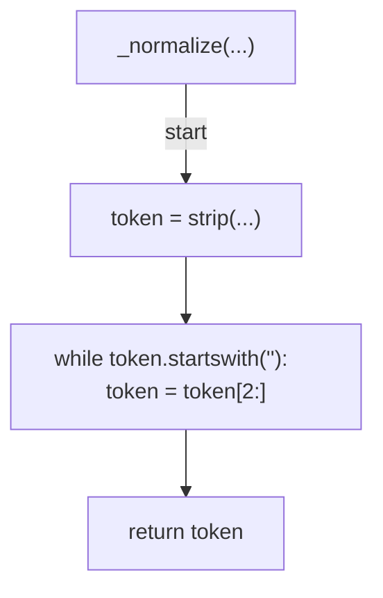

## _match_normalized(...)

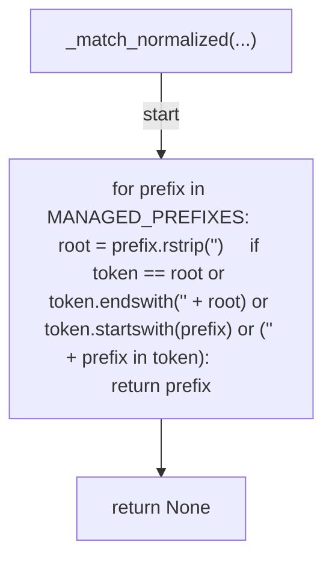

## matched_prefix(...)

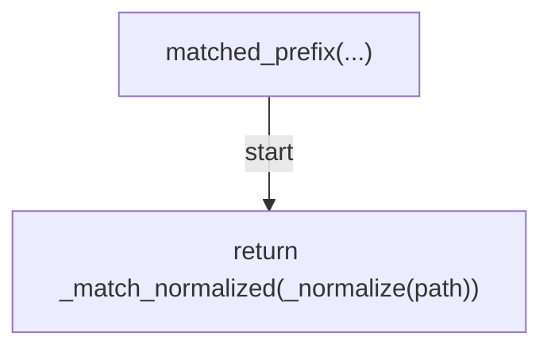

## _managed_target(...)

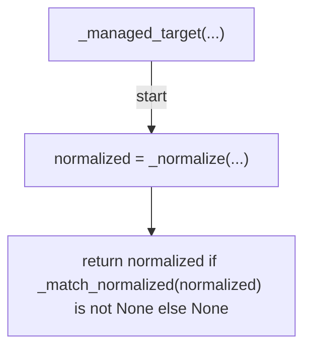

## _tokenize(...)

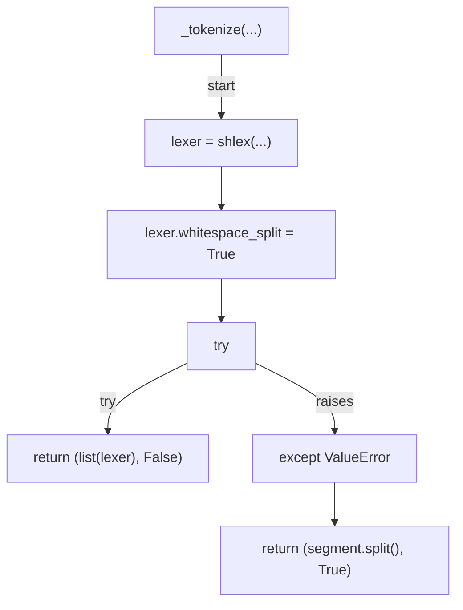

## _leading_command(...)

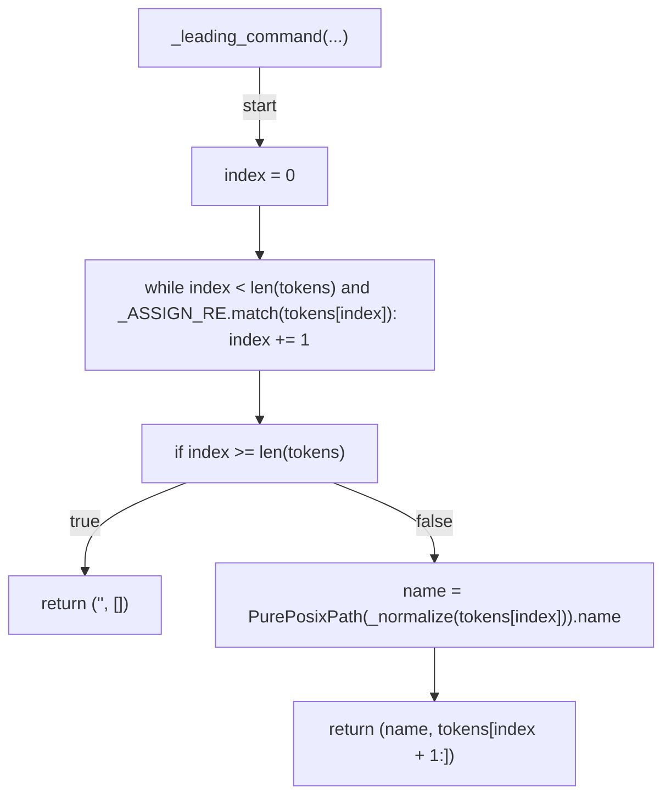

## _segments(...)

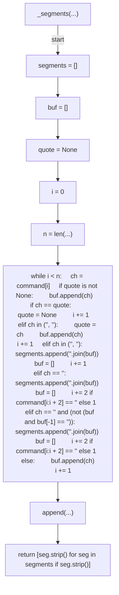

## _is_redirect_op(...)

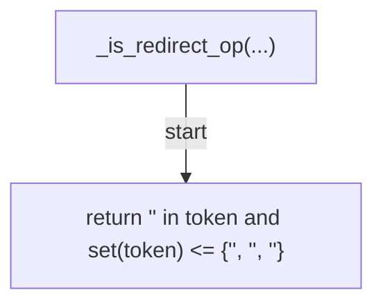

## _redirect_targets(...)

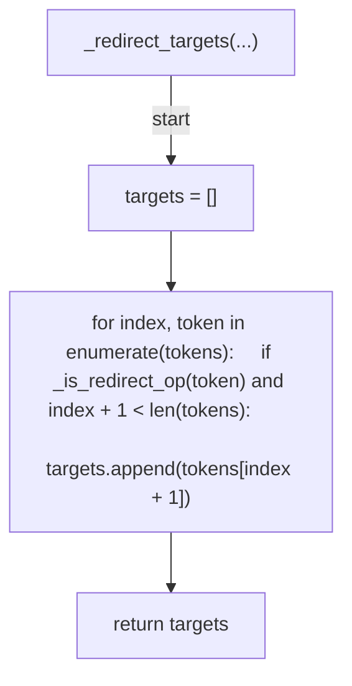

## _fallback_redirect_targets(...)

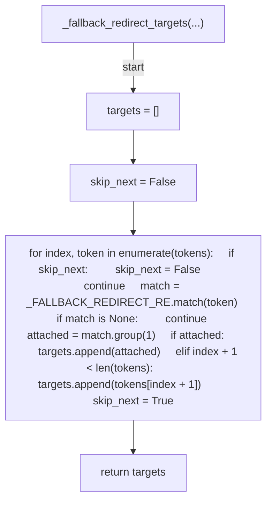

## _mutator_targets(...)

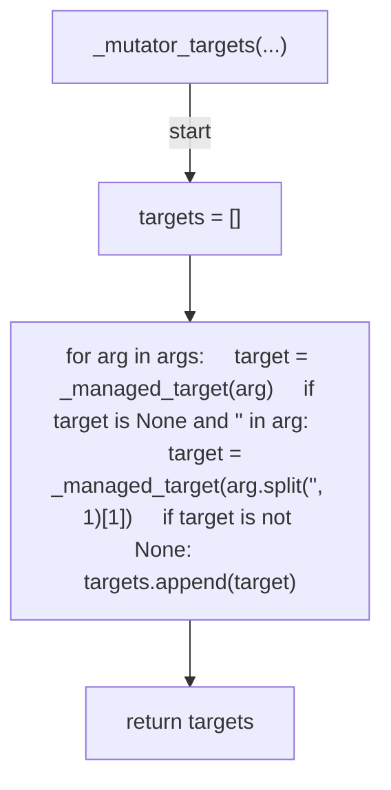

## _dash_c_script(...)

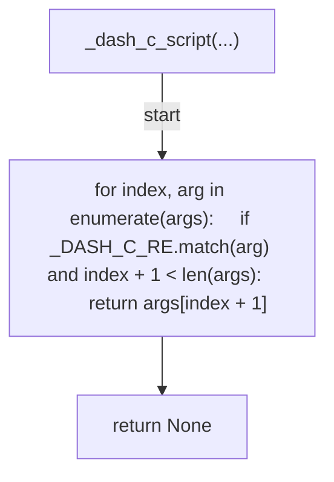

## _segment_write_targets(...)

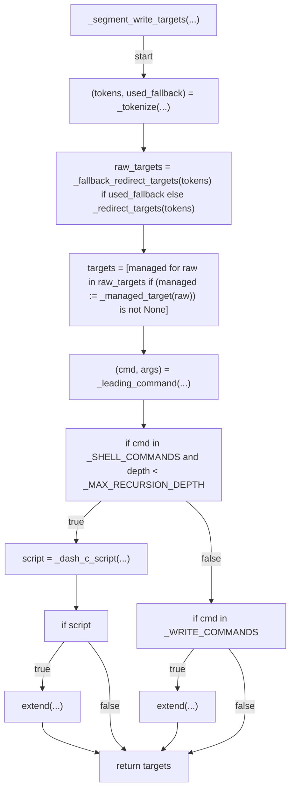

## managed_write_targets(...)

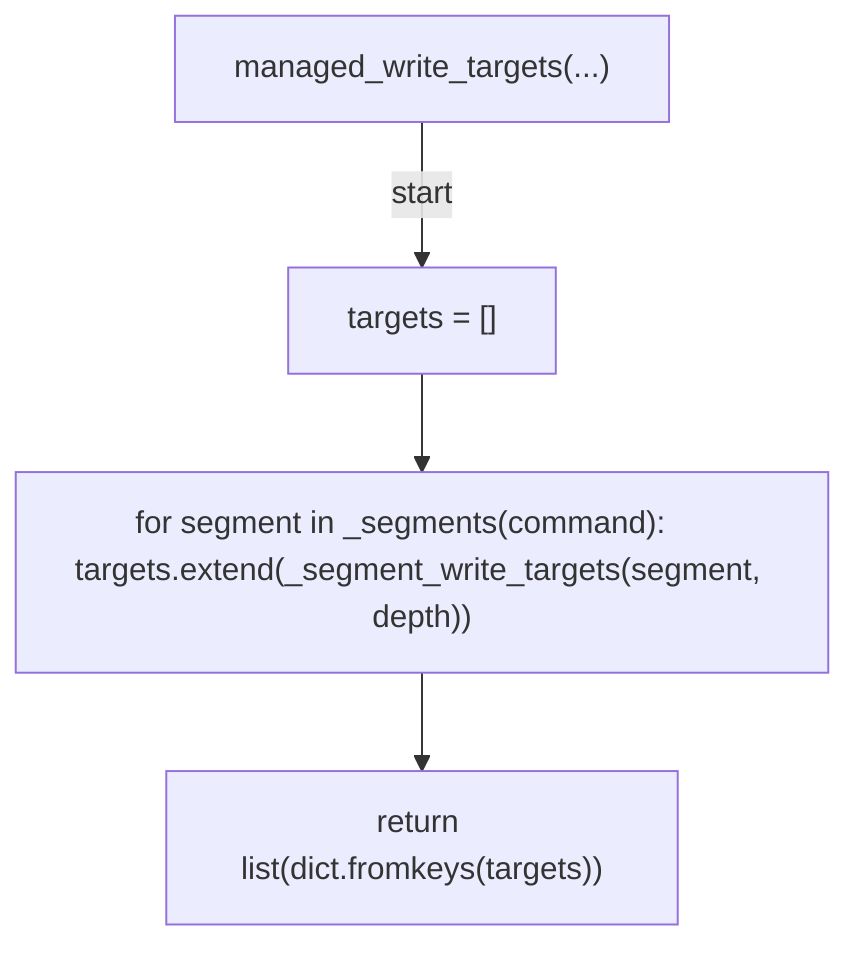

## _change_path_guidance(...)

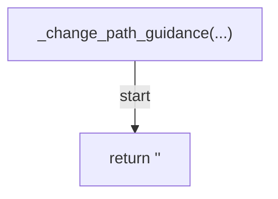

## _deny_edit(...)

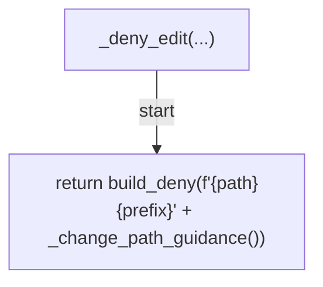

## _deny_bash(...)

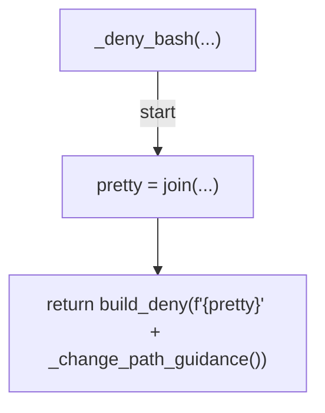

## _decide_edit(...)

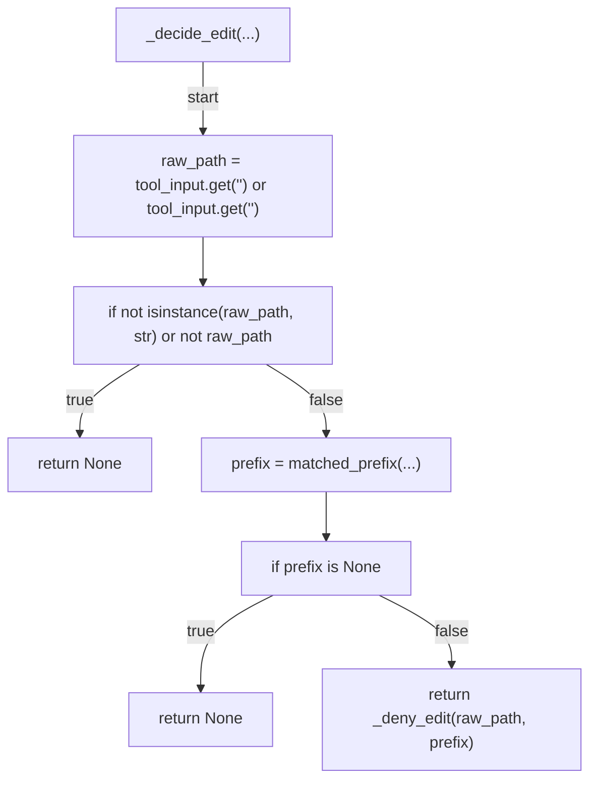

## _decide_bash(...)

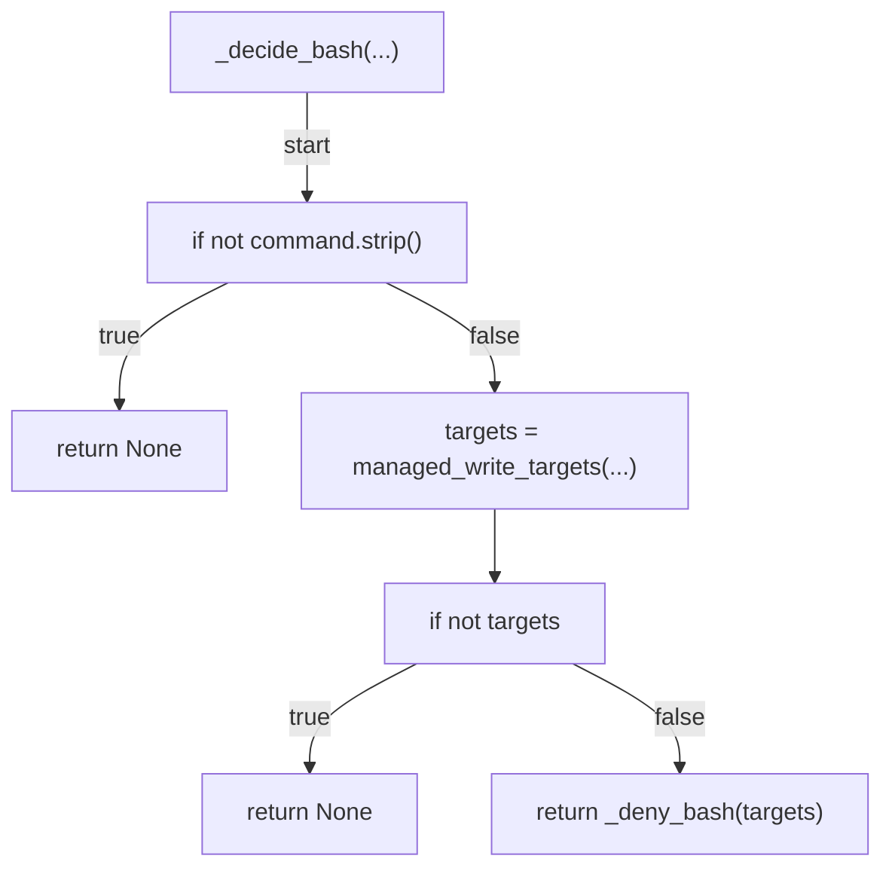

## decide(...)

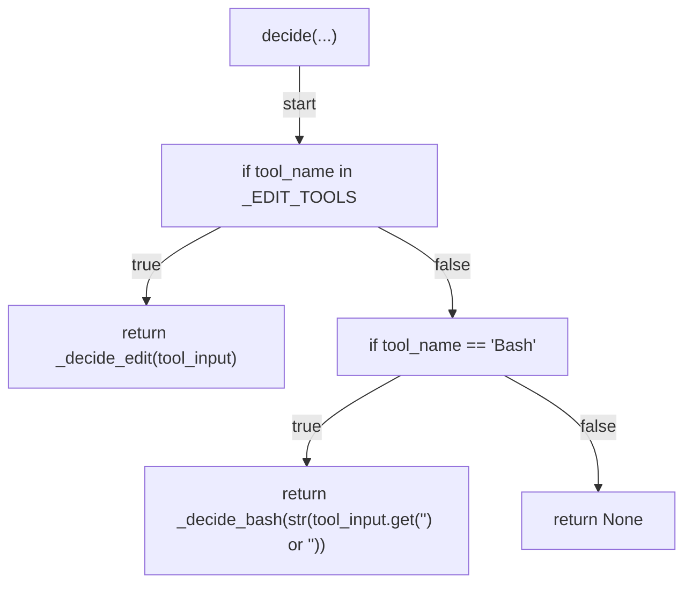

## _resolve_base(...)

```mermaid
flowchart TD
    N001["_resolve_base(...)"]
    N002["explicit = get(...)"]
    N003["if explicit"]
    N004["return explicit"]
    N005["actions_base = get(...)"]
    N006["if actions_base"]
    N007["return f'<str>{actions_base}'"]
    N008["return '<str>'"]
    N001 -->|"start"| N002
    N002 --> N003
    N003 -->|"true"| N004
    N003 -->|"false"| N005
    N005 --> N006
    N006 -->|"true"| N007
    N006 -->|"false"| N008
```

## _changed_files(...)

```mermaid
flowchart TD
    N001["_changed_files(...)"]
    N002["result = runner(...)"]
    N003["return frozenset((line.strip() for line in result.stdout.splitlines() if line.strip()))"]
    N001 -->|"start"| N002
    N002 --> N003
```

## managed_changes(...)

```mermaid
flowchart TD
    N001["managed_changes(...)"]
    N002["return frozenset((path for path in changed if path.startswith(MANAGED_PREFIXES)))"]
    N001 -->|"start"| N002
```

## _superpowers_pin(...)

```mermaid
flowchart TD
    N001["_superpowers_pin(...)"]
    N002["try"]
    N003["result = runner(...)"]
    N004["except (subprocess.CalledProcessError, subprocess.TimeoutExpired, FileNotFoundError)"]
    N005["return None"]
    N006["for line in result.stdout.splitlines():     if line.lstrip().startswith('<str>'):         continue     match = _SUPERPOWERS_PIN_RE.search(line)     if match:         return match.group(1)"]
    N007["return None"]
    N001 -->|"start"| N002
    N002 -->|"try"| N003
    N002 -->|"raises"| N004
    N004 --> N005
    N003 --> N006
    N006 --> N007
```

## evaluate_pr(...)

```mermaid
flowchart TD
    N001["evaluate_pr(...)"]
    N002["if not managed or pin_changed"]
    N003["return (0, [])"]
    N004["pretty = join(...)"]
    N005["return (1, [f'<str>{pretty}<str>{_PIN_FILE}<str>'])"]
    N001 -->|"start"| N002
    N002 -->|"true"| N003
    N002 -->|"false"| N004
    N004 --> N005
```

## _cmd_verify(...)

```mermaid
flowchart TD
    N001["_cmd_verify(...)"]
    N002["base = args.base_ref or _resolve_base()"]
    N003["try"]
    N004["changed = _changed_files(...)"]
    N005["except (subprocess.CalledProcessError, subprocess.TimeoutExpired, FileNotFoundError)"]
    N006["print(...)"]
    N007["return 1"]
    N008["managed = managed_changes(...)"]
    N009["pin_changed = False"]
    N010["if managed"]
    N011["base_pin = _superpowers_pin(...)"]
    N012["head_pin = _superpowers_pin(...)"]
    N013["pin_changed = base_pin is not None and head_pin is not None and (base_pin != head_pin)"]
    N014["(code, errors) = evaluate_pr(...)"]
    N015["if code == 0"]
    N016["if managed"]
    N017["print(...)"]
    N018["print(...)"]
    N019["return 0"]
    N020["for line in errors:     print(line, file=sys.stderr)"]
    N021["return 1"]
    N001 -->|"start"| N002
    N002 --> N003
    N003 -->|"try"| N004
    N003 -->|"raises"| N005
    N005 --> N006
    N006 --> N007
    N004 --> N008
    N008 --> N009
    N009 --> N010
    N010 -->|"true"| N011
    N011 --> N012
    N012 --> N013
    N013 --> N014
    N010 -->|"false"| N014
    N014 --> N015
    N015 -->|"true"| N016
    N016 -->|"true"| N017
    N016 -->|"false"| N018
    N017 --> N019
    N018 --> N019
    N015 -->|"false"| N020
    N020 --> N021
```

## _parse_verify_args(...)

```mermaid
flowchart TD
    N001["_parse_verify_args(...)"]
    N002["parser = ArgumentParser(...)"]
    N003["add_argument(...)"]
    N004["return parser.parse_args(args)"]
    N001 -->|"start"| N002
    N002 --> N003
    N003 --> N004
```

## main(...)

```mermaid
flowchart TD
    N001["main(...)"]
    N002["args = sys.argv[1:] if argv is None else argv"]
    N003["if args and args[0] == 'verify'"]
    N004["return _cmd_verify(_parse_verify_args(args[1:]))"]
    N005["return run_tool_hook('<str>', decide, auditable=False)"]
    N001 -->|"start"| N002
    N002 --> N003
    N003 -->|"true"| N004
    N003 -->|"false"| N005
```
