# AST graph: scripts/gate_agents_skills_edit.py

This file is generated from `scripts/gate_agents_skills_edit.py` by `python3 scripts/script_ast_graph.py all-doc`. Do not edit it by hand: content under `docs/generated/scripts/` is owned by the post-merge automation (refs #1540); update the source script instead.

## _normalize(...)

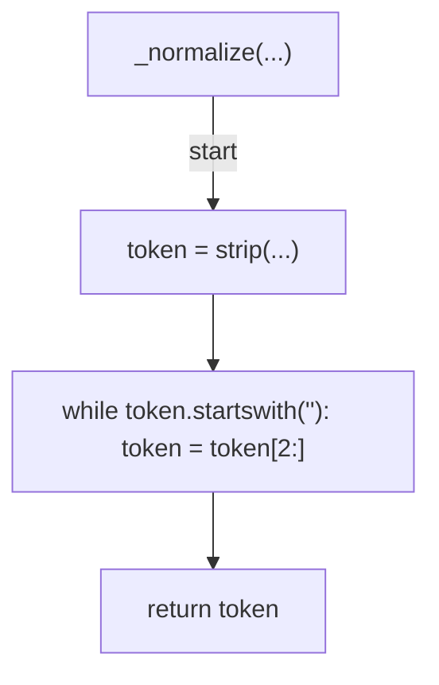

## _match_normalized(...)

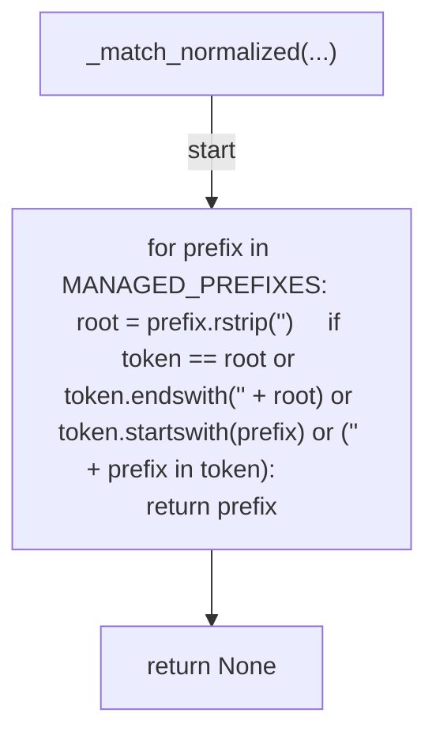

## matched_prefix(...)

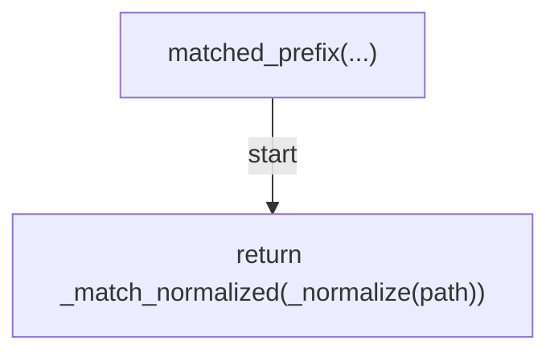

## _managed_target(...)

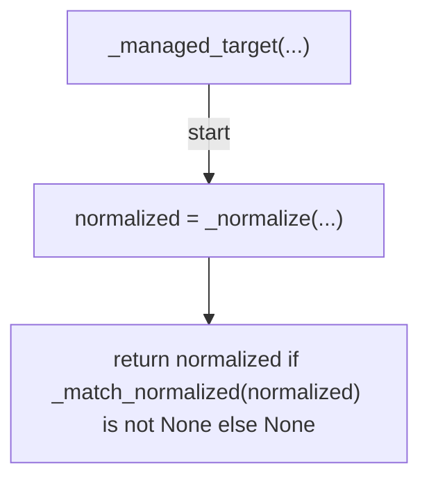

## _tokenize(...)

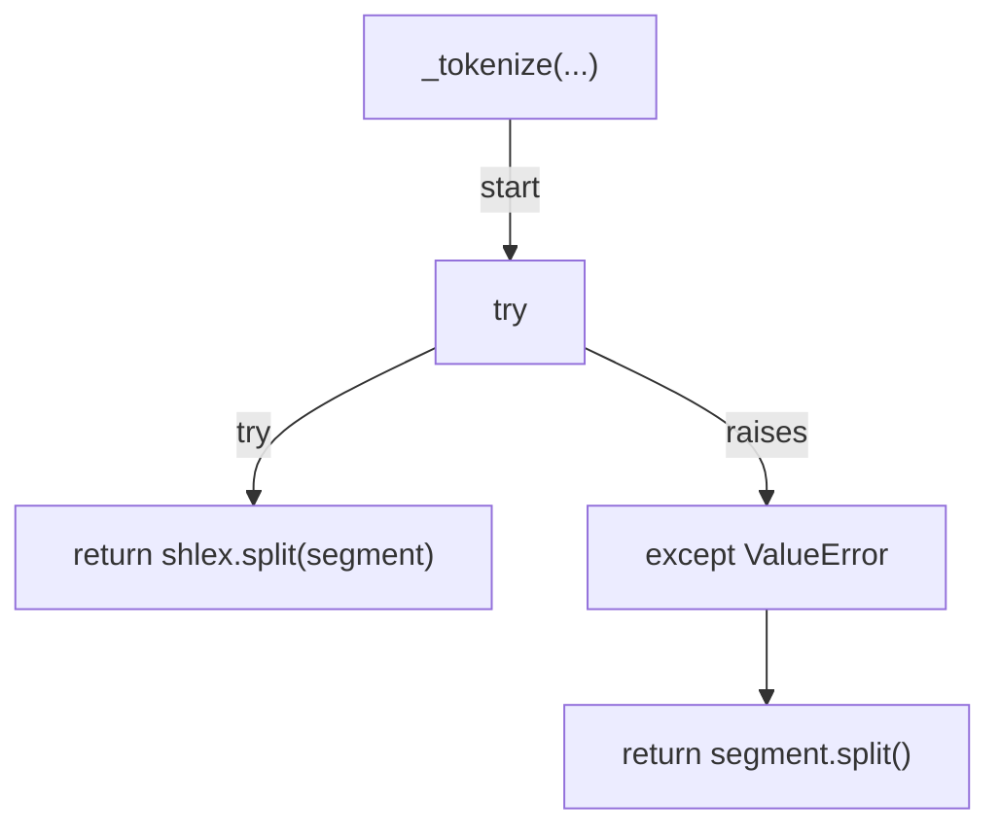

## _leading_command(...)

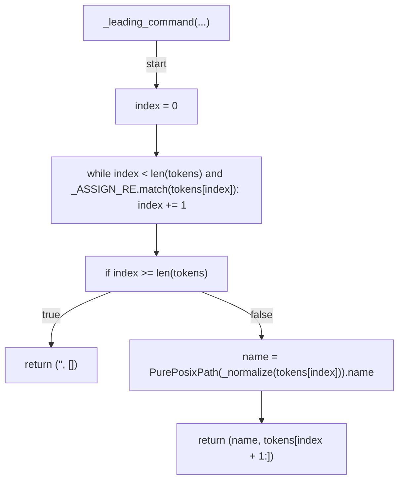

## _segments(...)

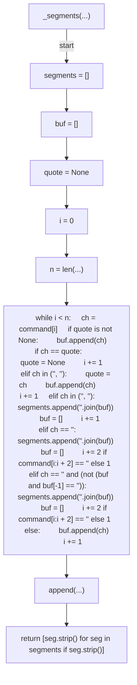

## _redirect_targets(...)

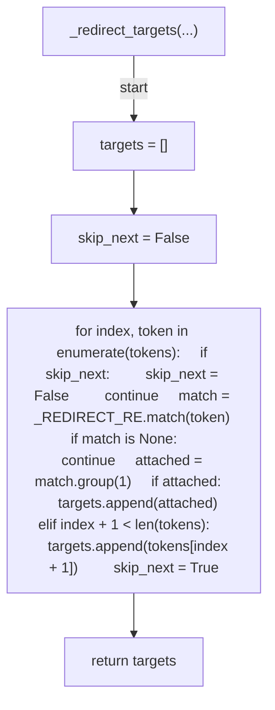

## _mutator_targets(...)

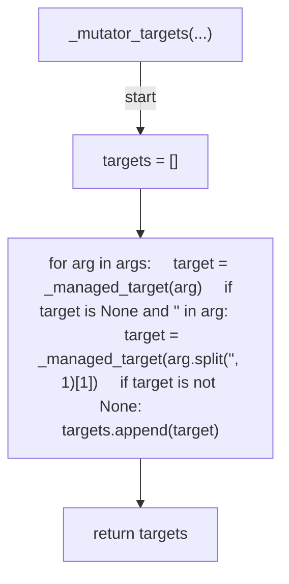

## _dash_c_script(...)

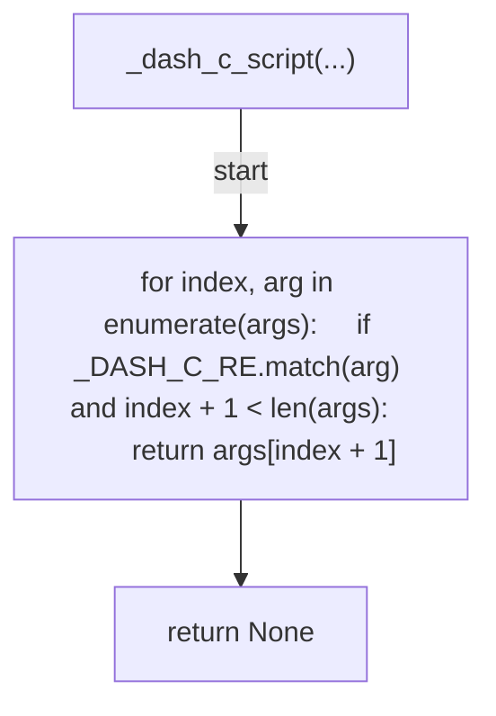

## _segment_write_targets(...)

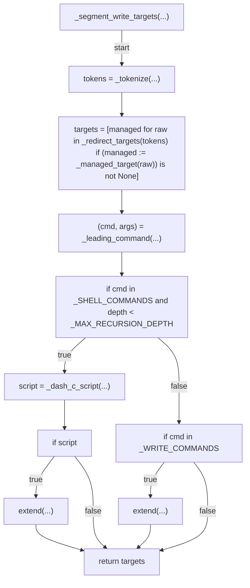

## managed_write_targets(...)

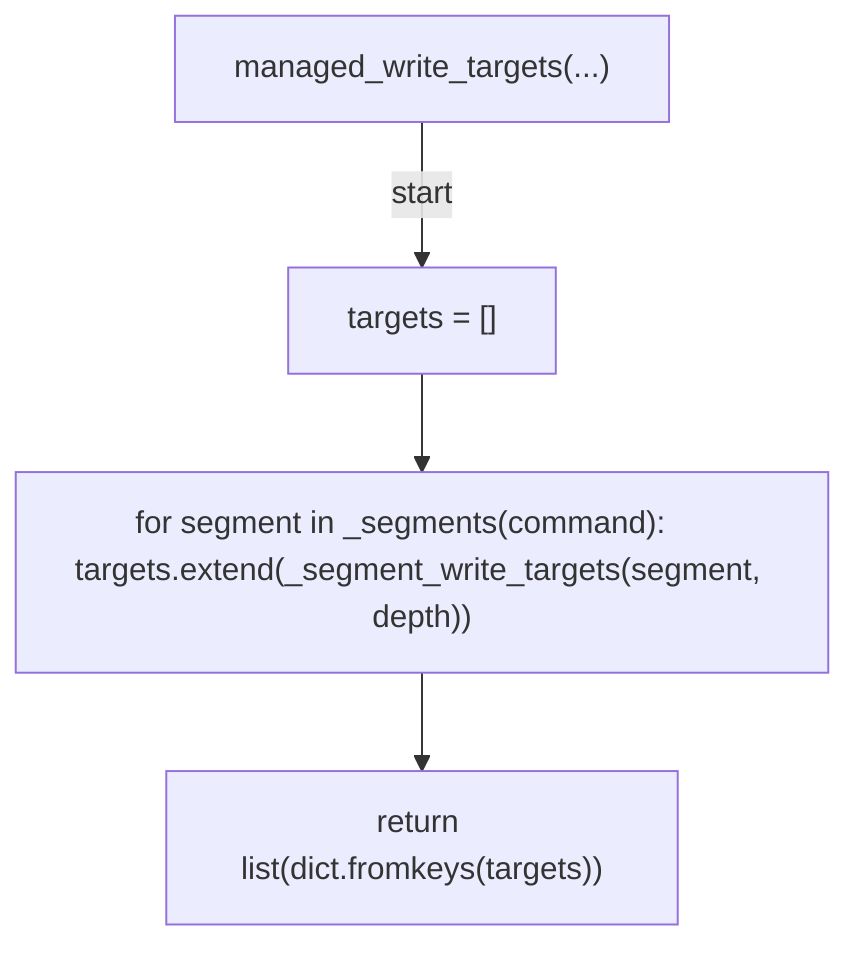

## _change_path_guidance(...)

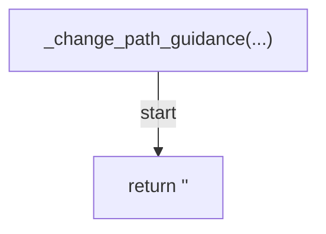

## _deny_edit(...)

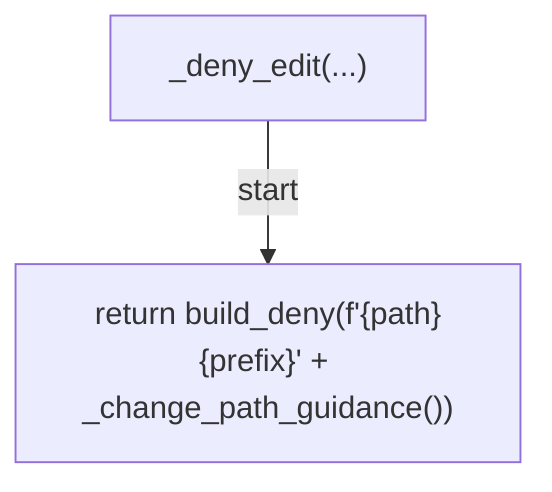

## _deny_bash(...)

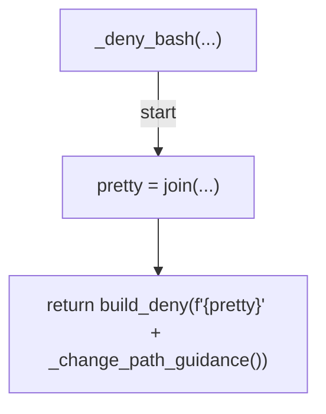

## _decide_edit(...)

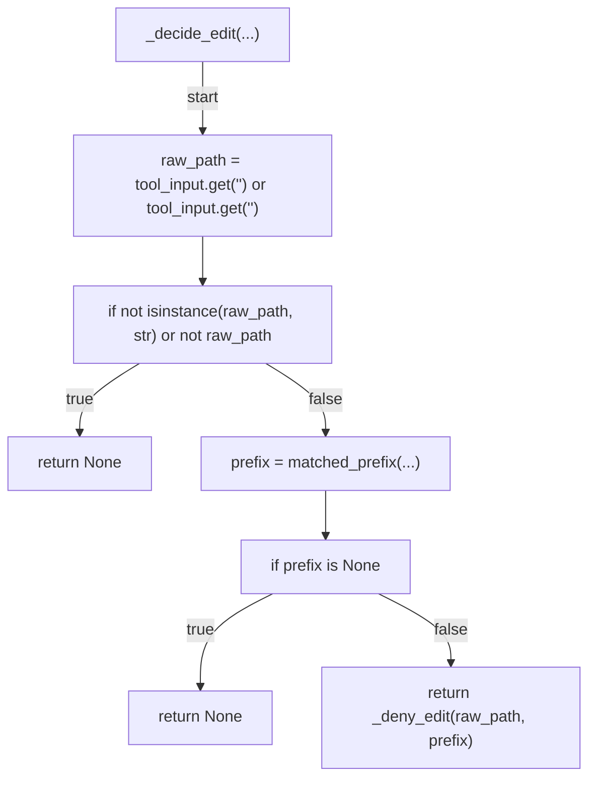

## _decide_bash(...)

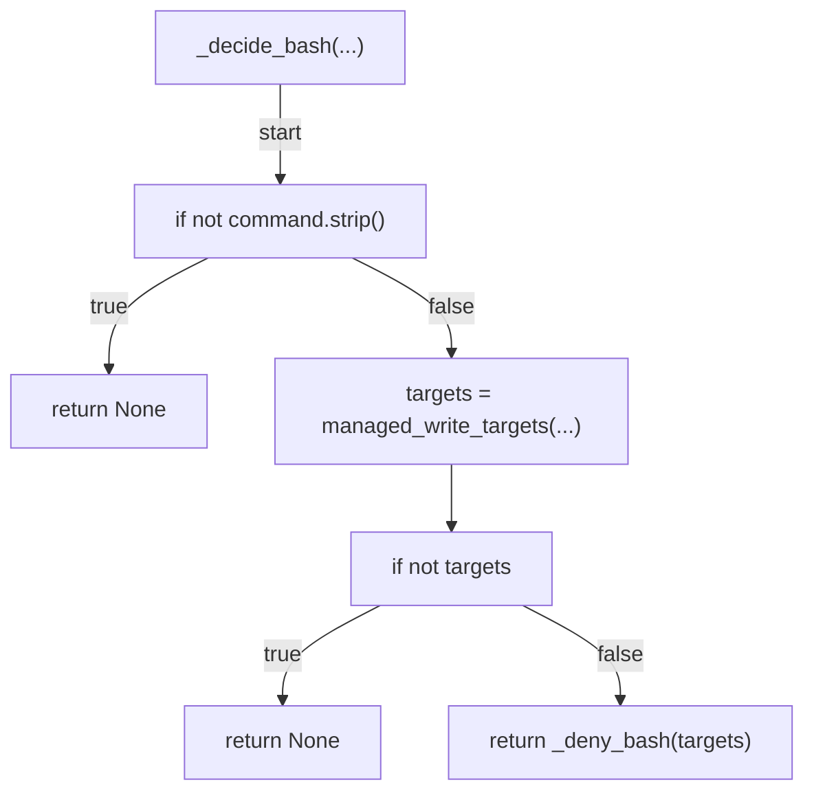

## decide(...)

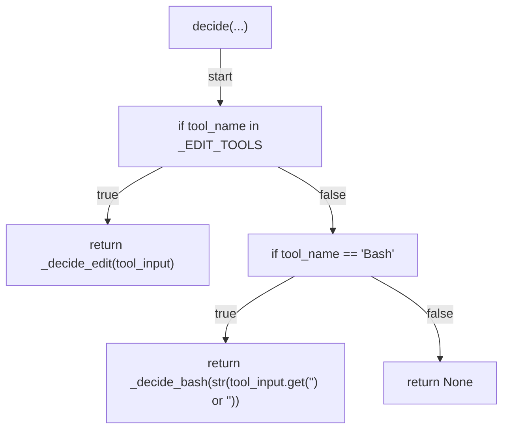

## main(...)

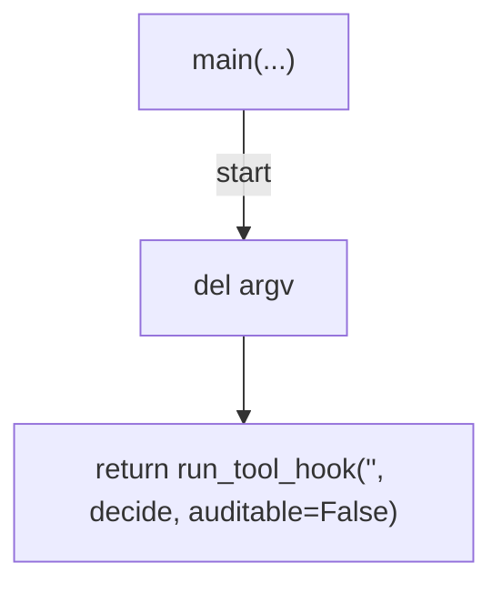
