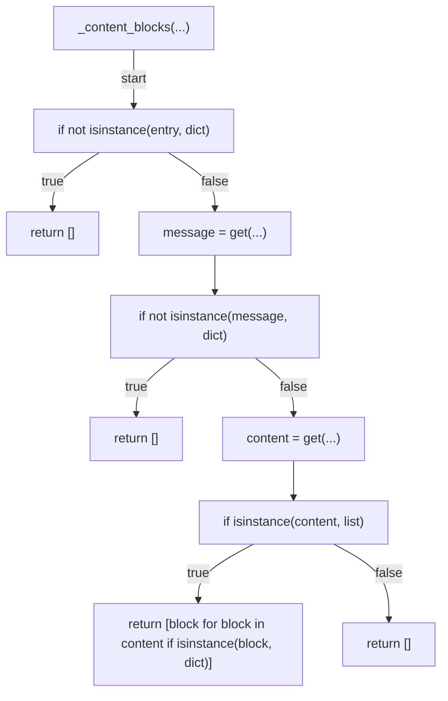
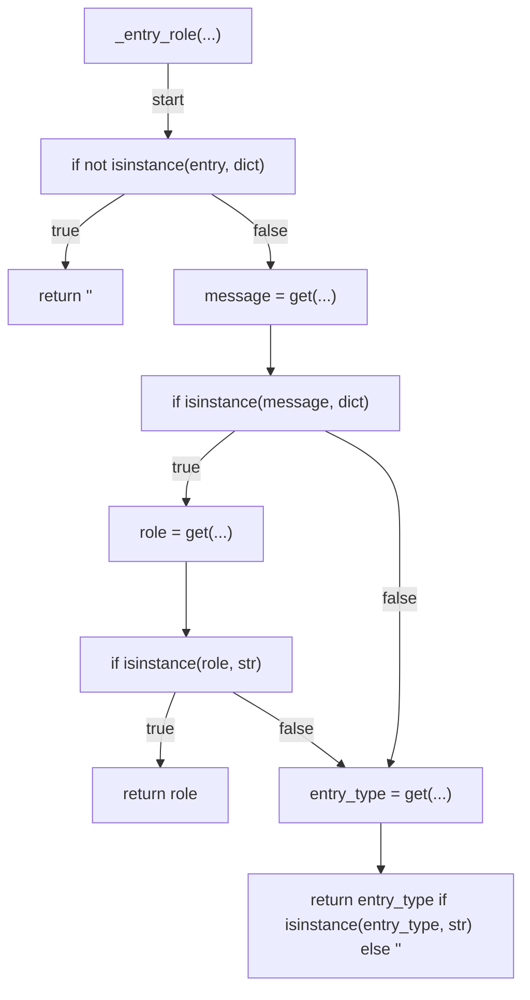
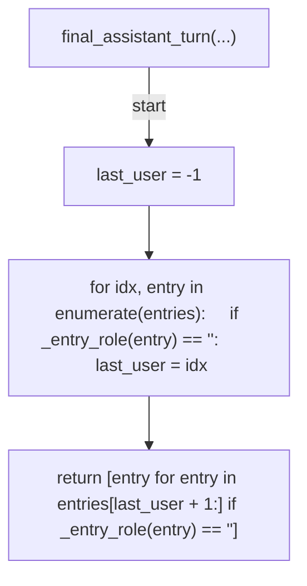
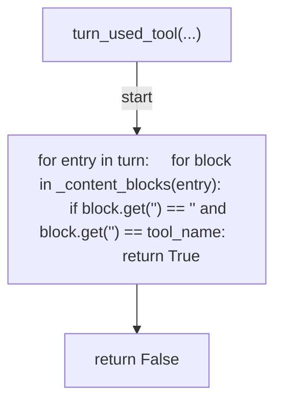
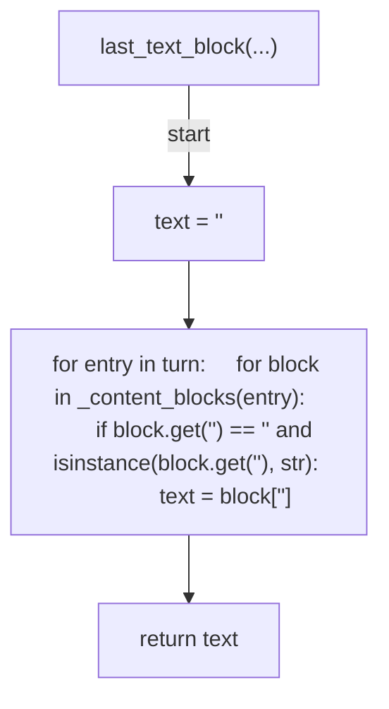
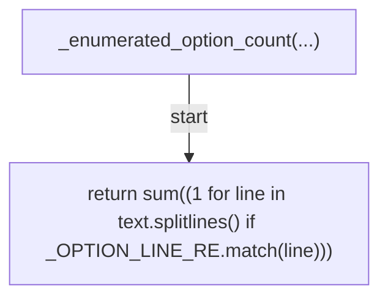
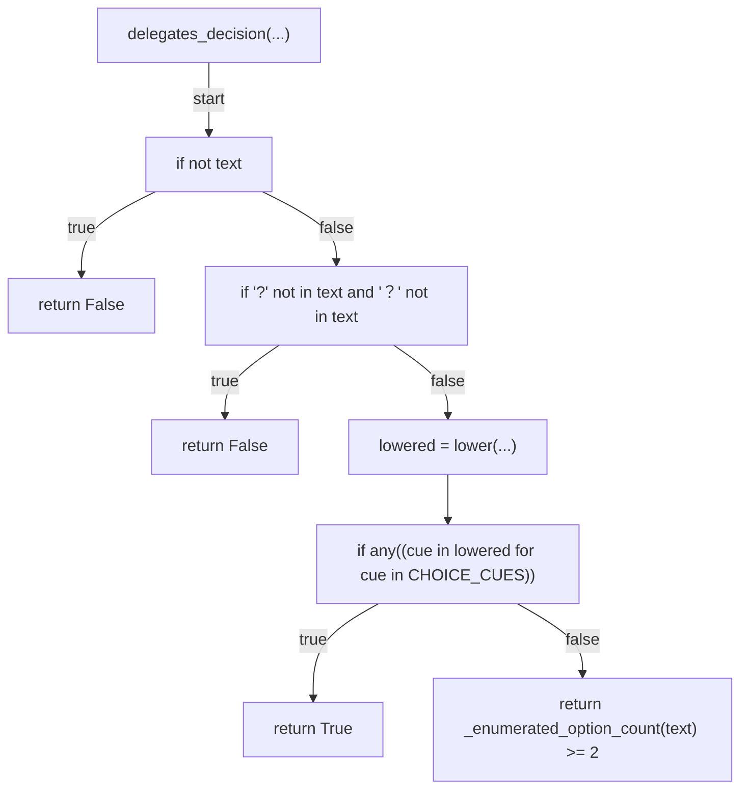
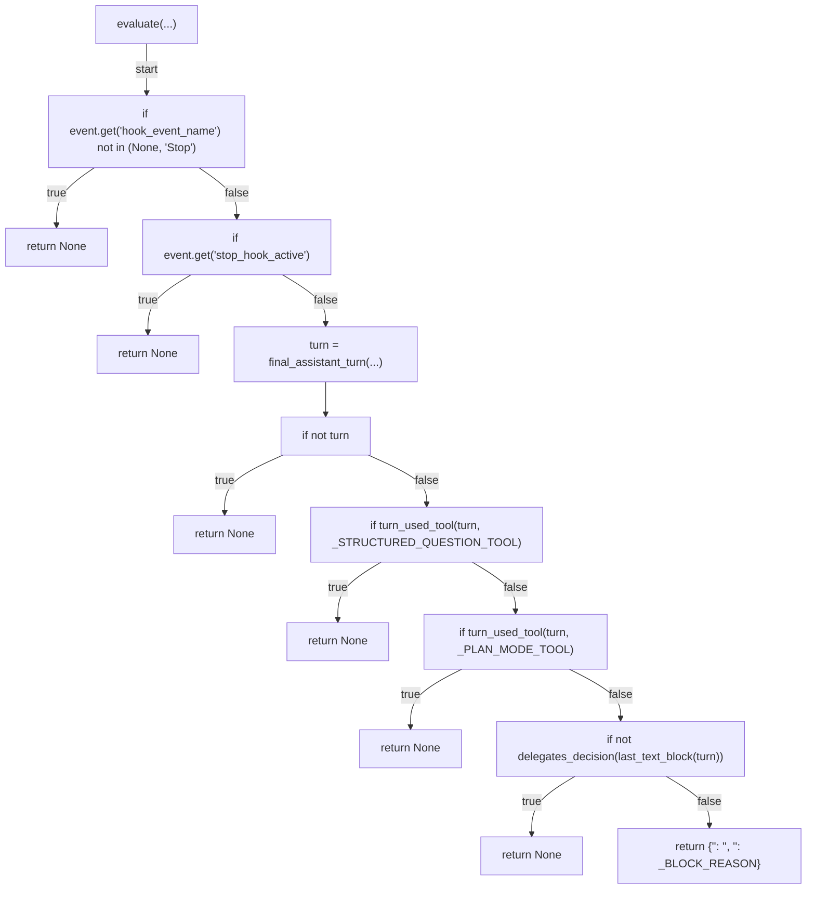
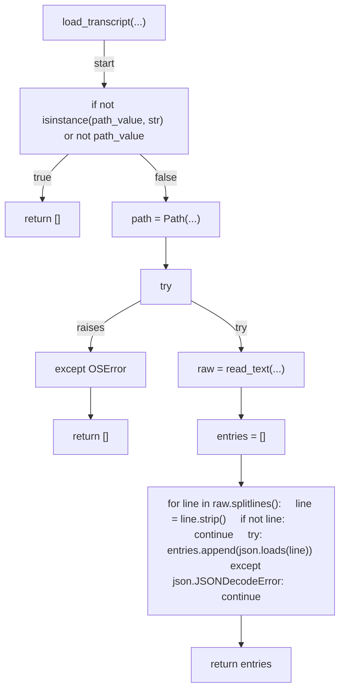
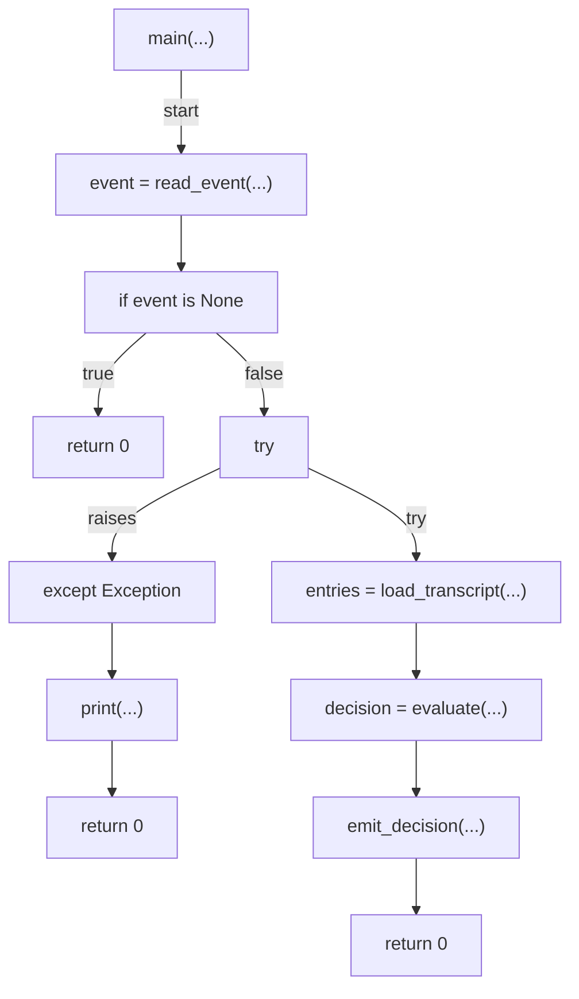

# AST graph: scripts/gate_decision_handoff_askuserquestion.py

This file is generated from `scripts/gate_decision_handoff_askuserquestion.py` by `python3 scripts/script_ast_graph.py all-doc`. Do not edit it by hand: content under `docs/generated/scripts/` is owned by the post-merge automation (refs #1540) -- update the source script instead.

## _content_blocks(...)

## _entry_role(...)

## final_assistant_turn(...)

## turn_used_tool(...)

## last_text_block(...)

## _enumerated_option_count(...)

## delegates_decision(...)

## evaluate(...)

## load_transcript(...)

## main(...)

