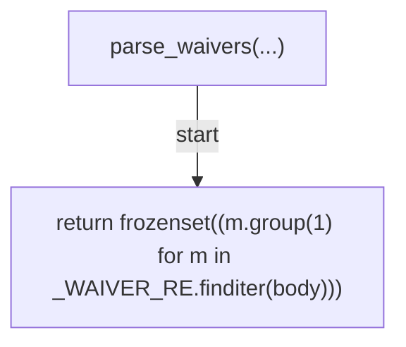
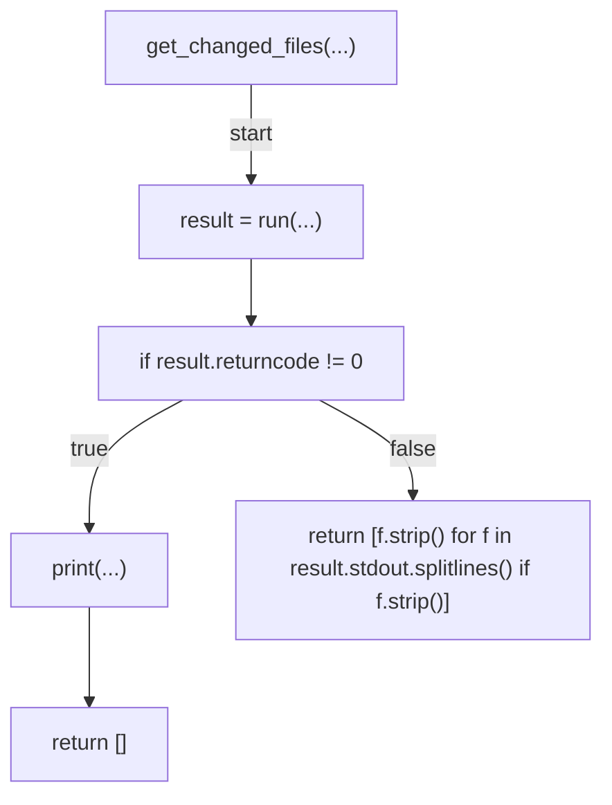
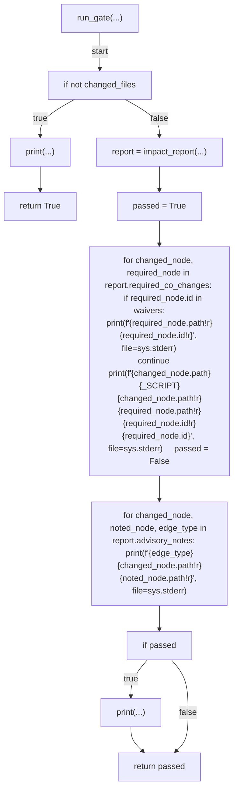
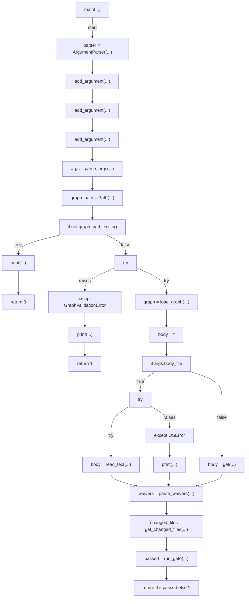

# AST graph: scripts/gate_doc_graph_pr.py

This file is generated from `scripts/gate_doc_graph_pr.py` by `python3 scripts/script_ast_graph.py all-doc`. Do not edit it by hand: content under `docs/generated/scripts/` is owned by the post-merge automation (refs #1540); update the source script instead.

## parse_waivers(...)

## get_changed_files(...)

## run_gate(...)

## main(...)

