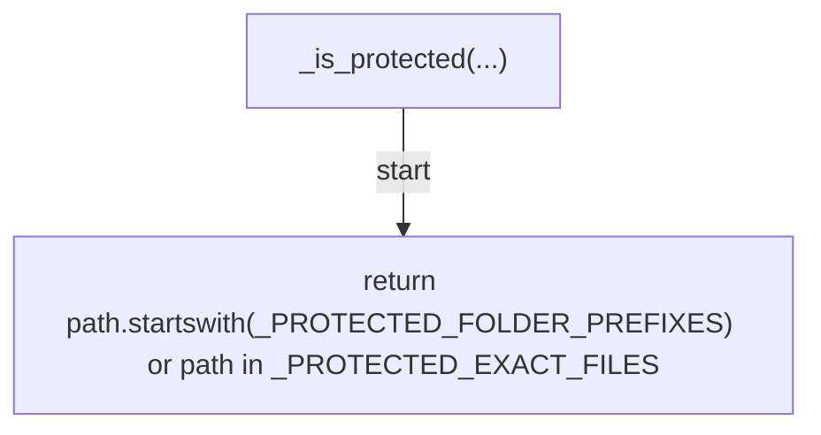
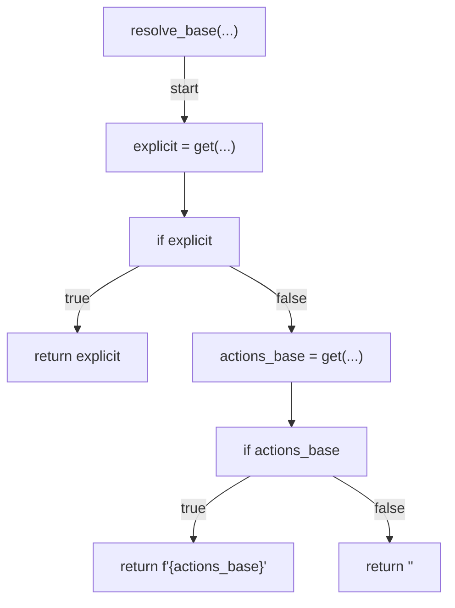
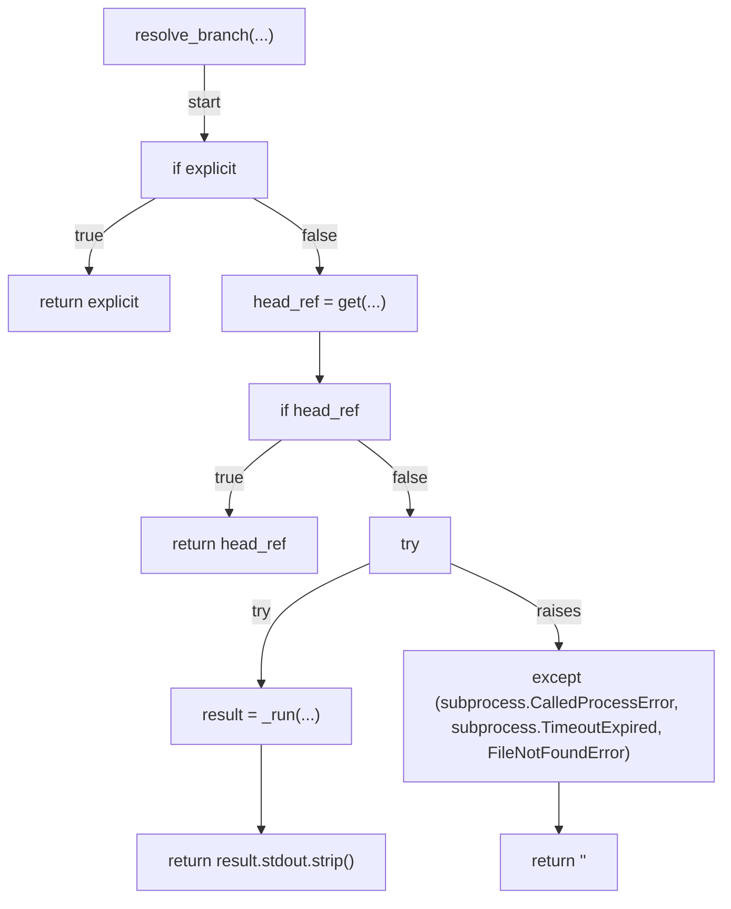
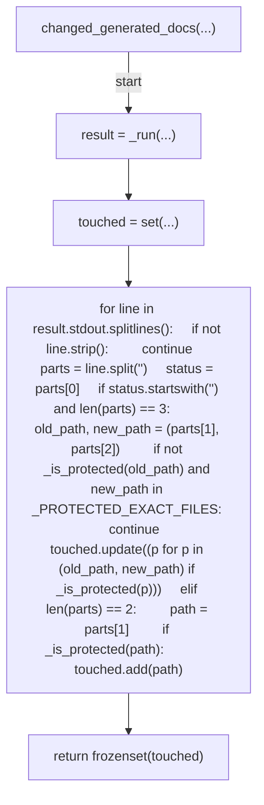
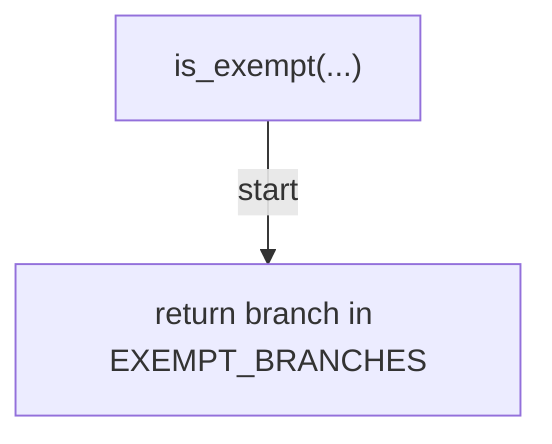
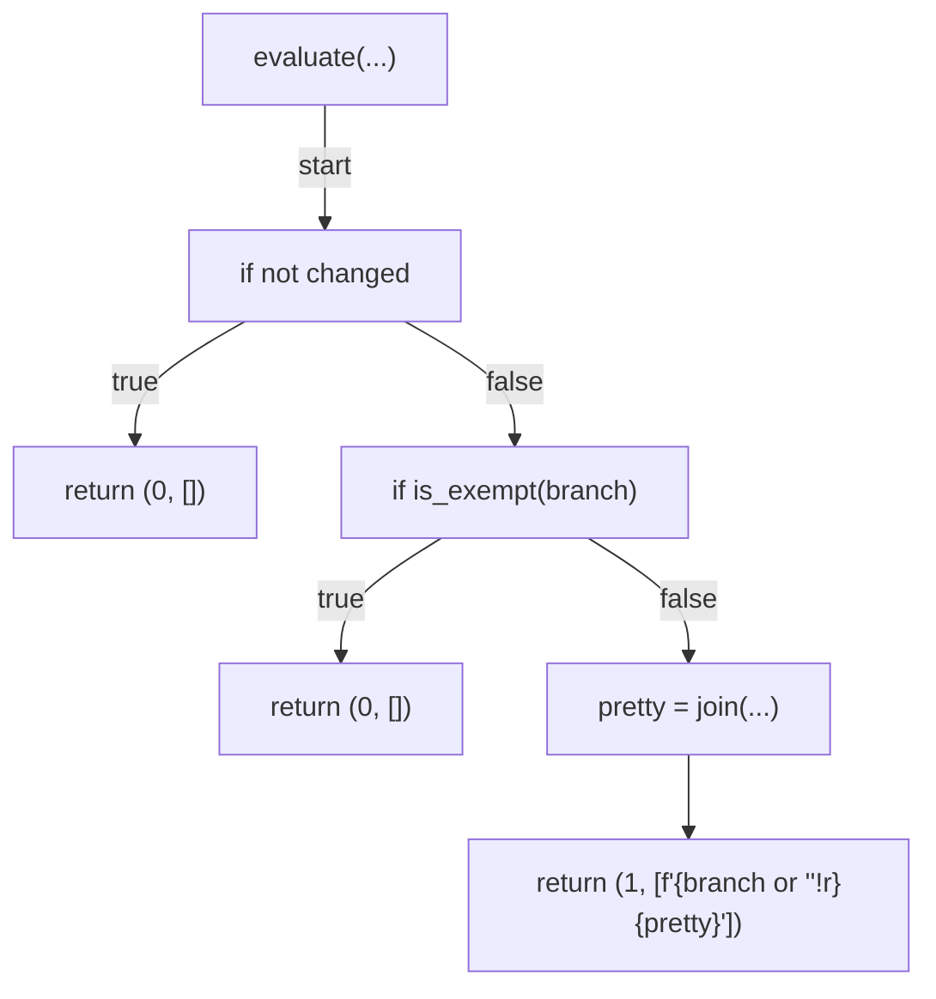
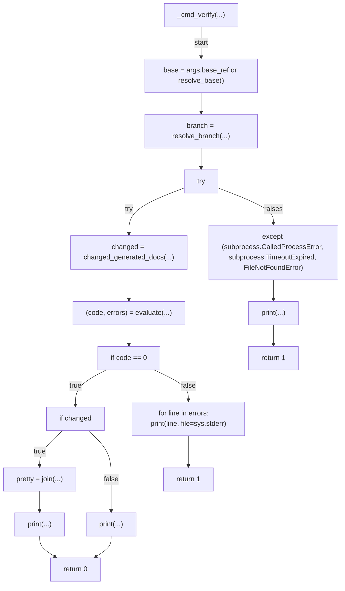
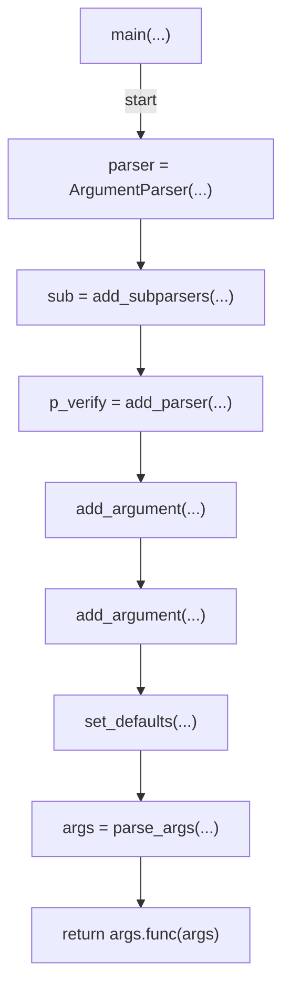
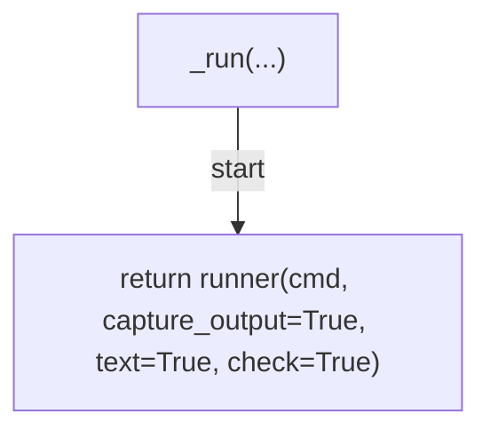

# AST graph: scripts/gate_generated_scripts_manual_edit.py

This file is generated from `scripts/gate_generated_scripts_manual_edit.py` by `python3 scripts/script_ast_graph.py all-doc`. Do not edit it by hand: content under `docs/generated/scripts/` is owned by the post-merge automation (refs #1540); update the source script instead.

## _is_protected(...)

## resolve_base(...)

## resolve_branch(...)

## changed_generated_docs(...)

## is_exempt(...)

## evaluate(...)

## _cmd_verify(...)

## main(...)

## _run(...)

