# AST graph: scripts/gate_handoff_retro_survey_askuserquestion.py

This file is generated from `scripts/gate_handoff_retro_survey_askuserquestion.py` by `python3 scripts/script_ast_graph.py all-doc`. Do not edit it by hand: content under `docs/generated/scripts/` is owned by the post-merge automation (refs #1540); update the source script instead.

## _build_block_reason(...)

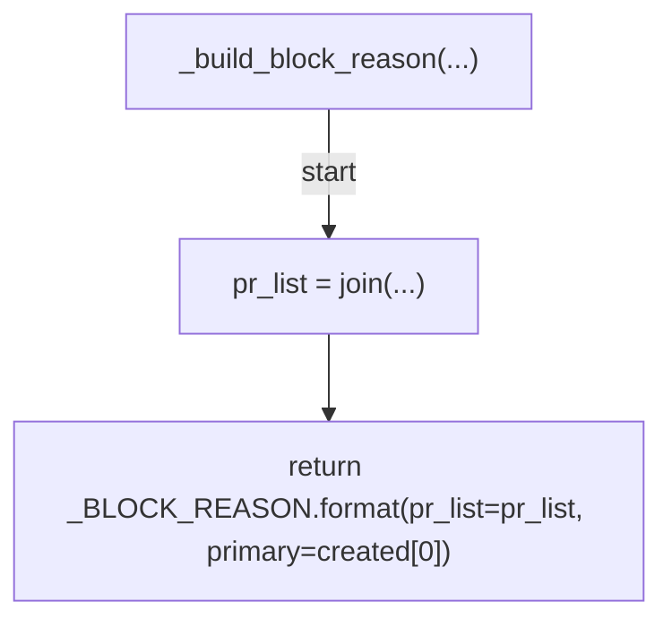

## _marker_path(...)

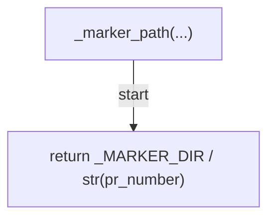

## _coerce_pr_number(...)

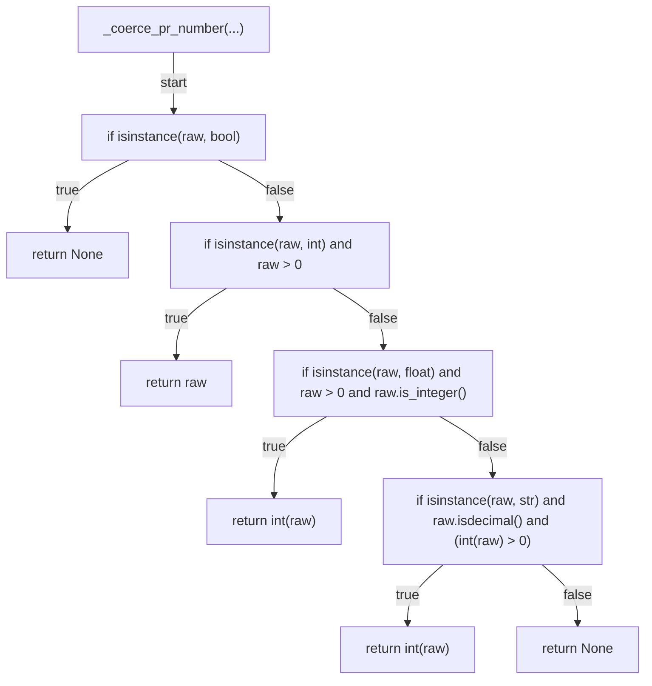

## _coerce_satisfaction(...)

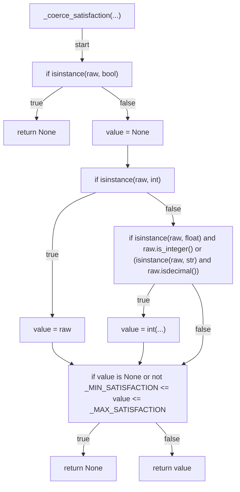

## _content_blocks(...)

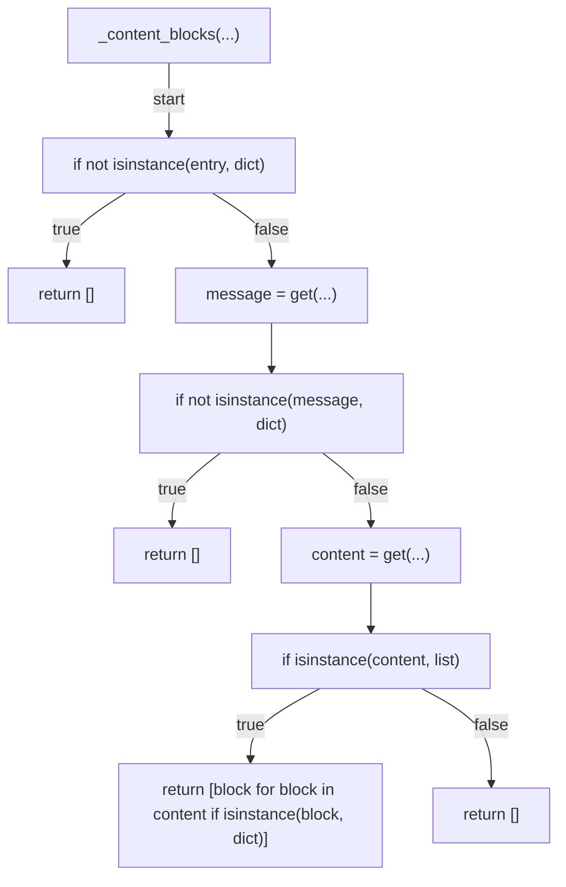

## _result_text(...)

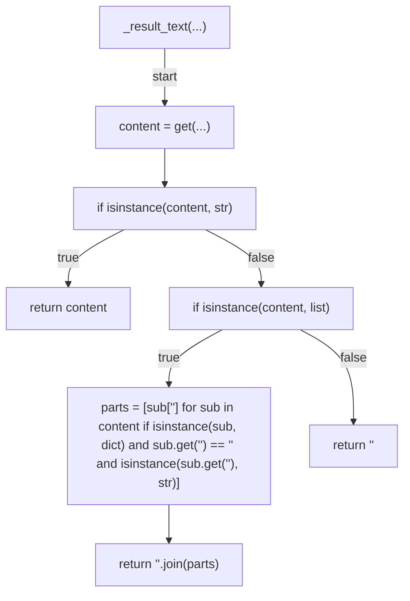

## created_pr_numbers(...)

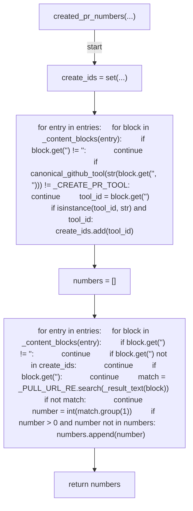

## session_surveyed(...)

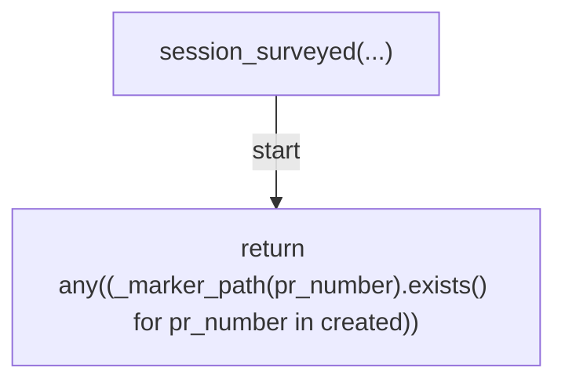

## evaluate(...)

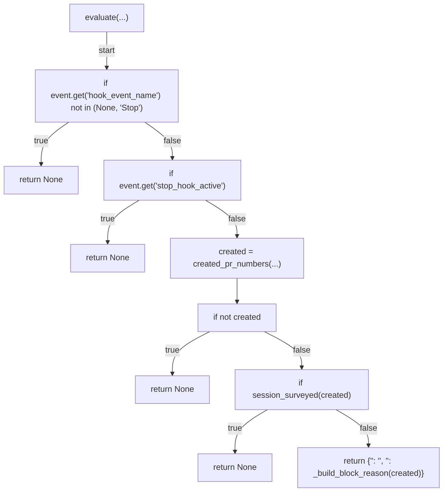

## load_transcript(...)

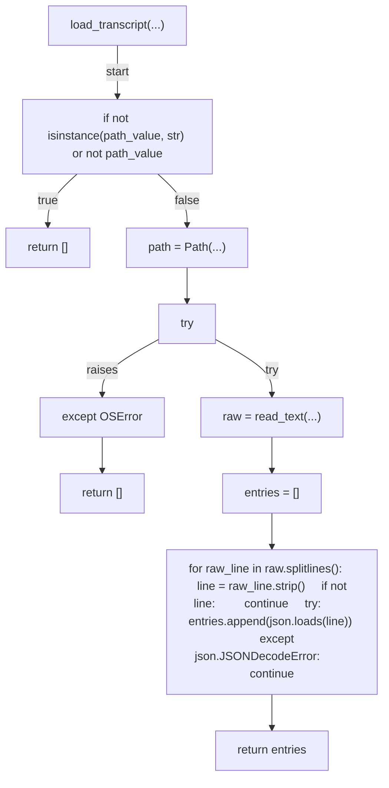

## record(...)

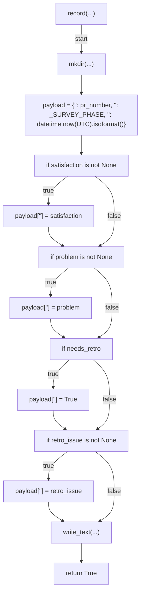

## run_gate(...)

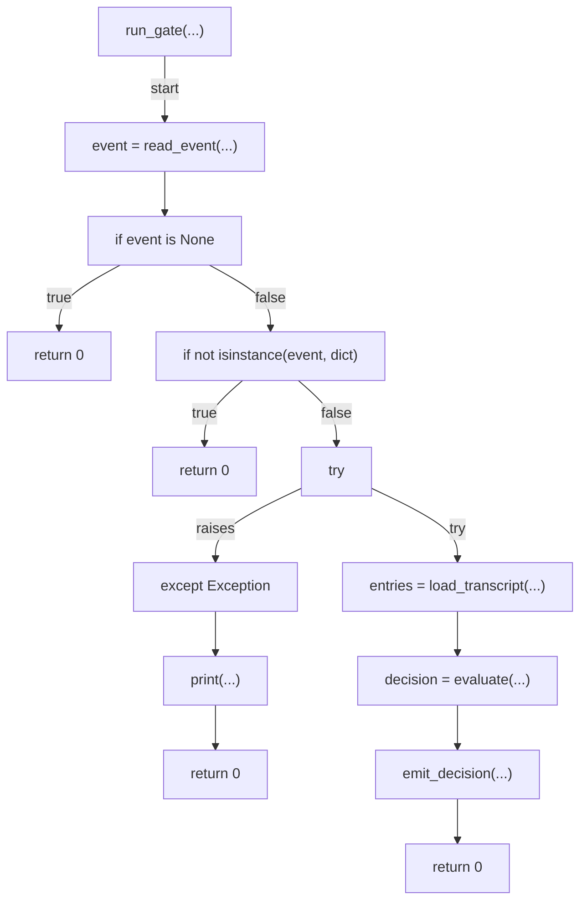

## run_record(...)

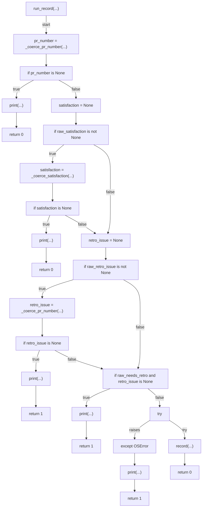

## main(...)

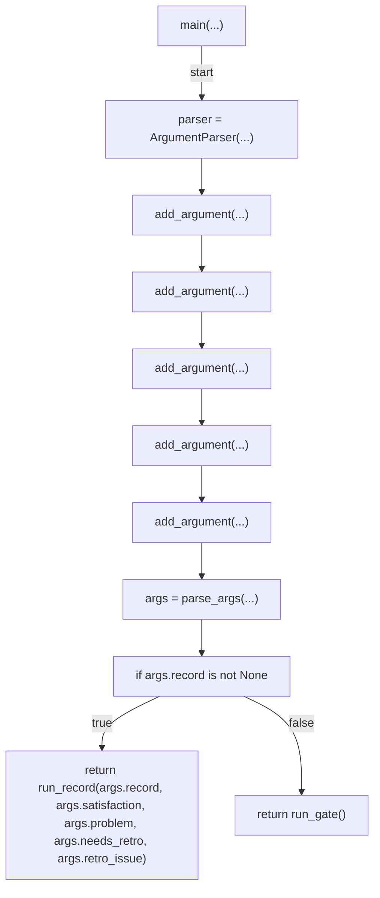
