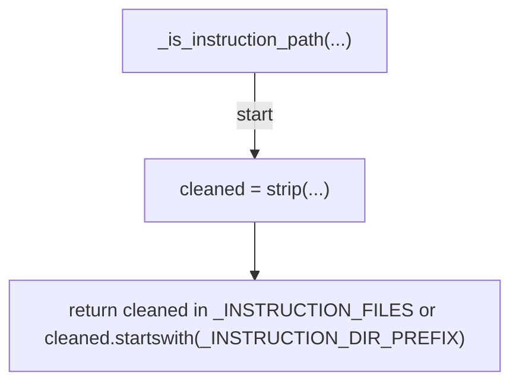
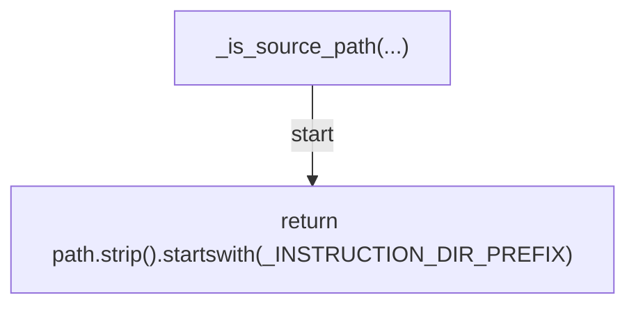
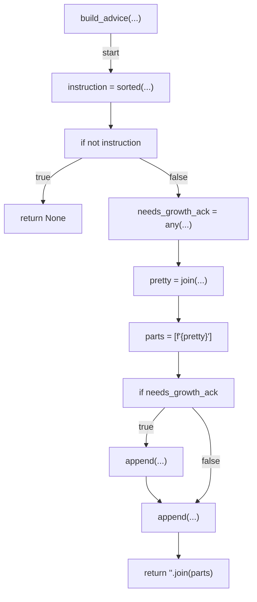
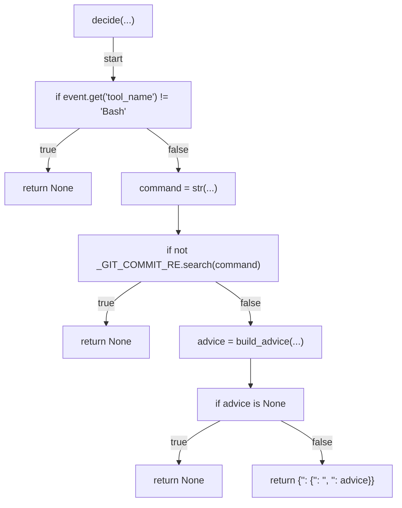
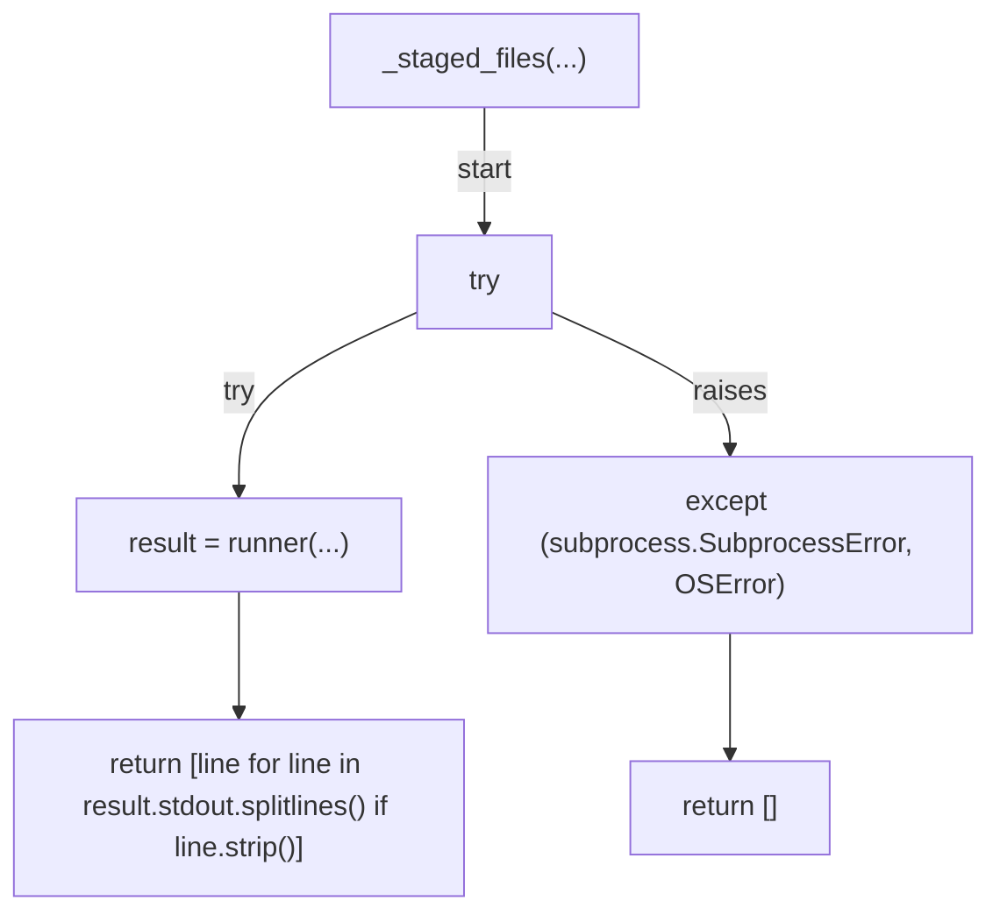
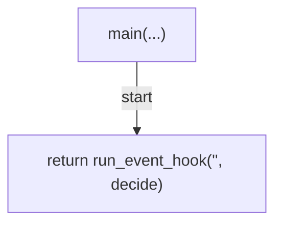

# AST graph: scripts/gate_instruction_body_advisory.py

This file is generated from `scripts/gate_instruction_body_advisory.py` by `python3 scripts/script_ast_graph.py all-doc`. Do not edit it by hand: content under `docs/generated/scripts/` is owned by the post-merge automation (refs #1540) -- update the source script instead.

## _is_instruction_path(...)

## _is_source_path(...)

## build_advice(...)

## decide(...)

## _staged_files(...)

## main(...)

