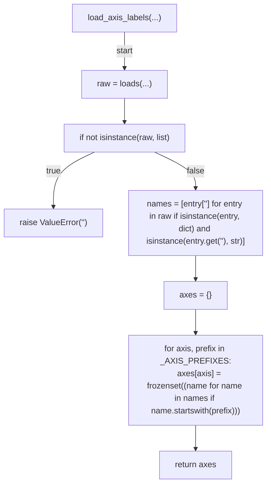
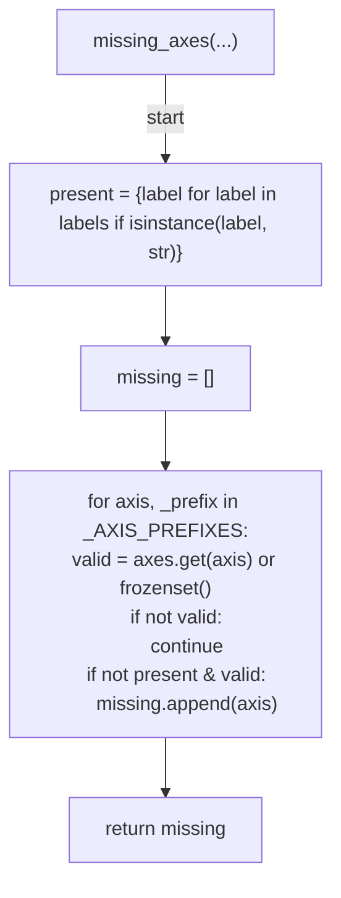
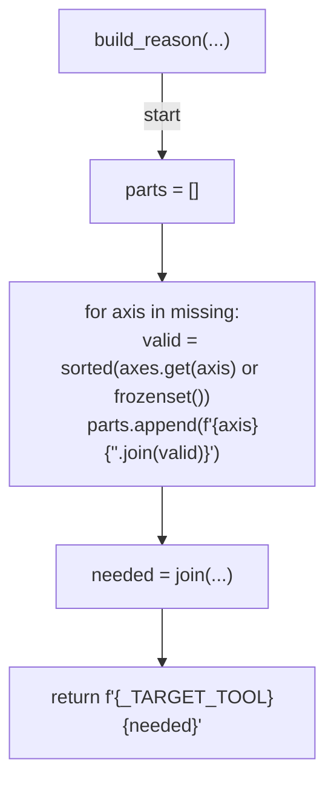
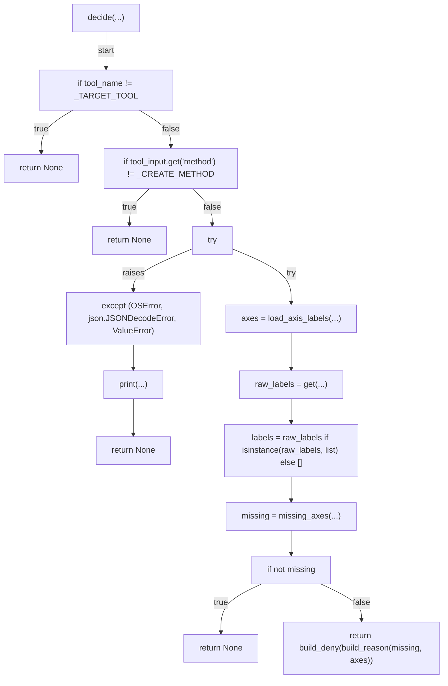
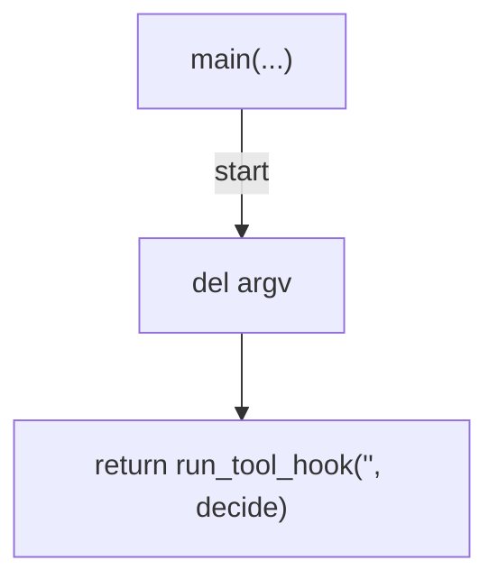

# AST graph: scripts/gate_issue_classification_labels.py

This file is generated from `scripts/gate_issue_classification_labels.py` by `python3 scripts/script_ast_graph.py all-doc`. Do not edit it by hand: content under `docs/generated/scripts/` is owned by the post-merge automation (refs #1540) -- update the source script instead.

## load_axis_labels(...)

## missing_axes(...)

## build_reason(...)

## decide(...)

## main(...)

