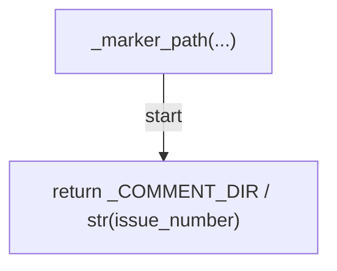
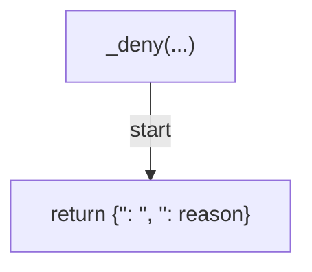
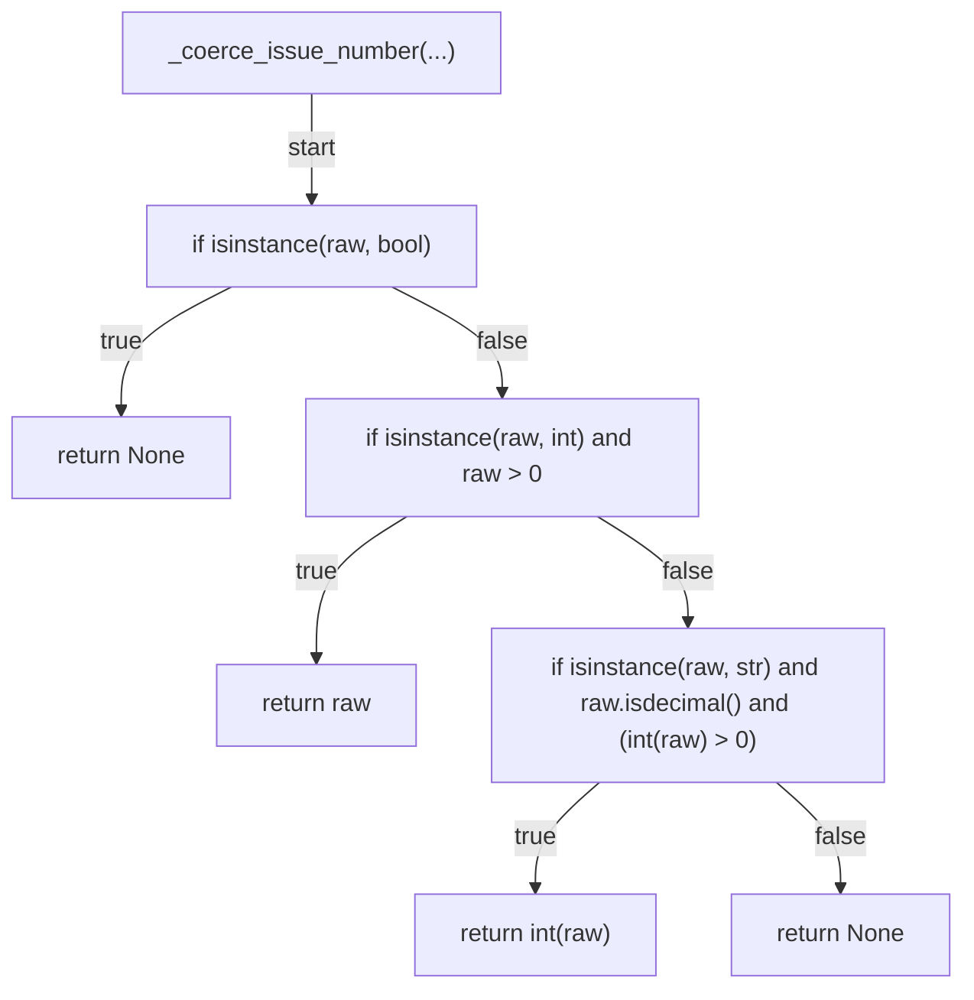
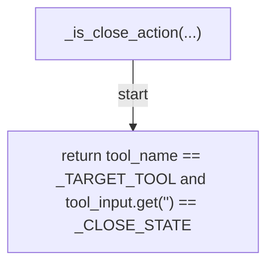
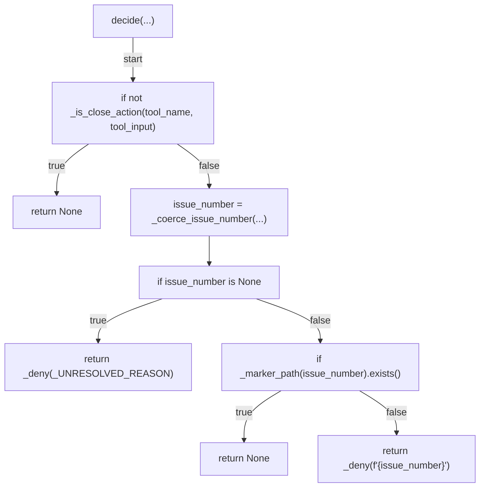
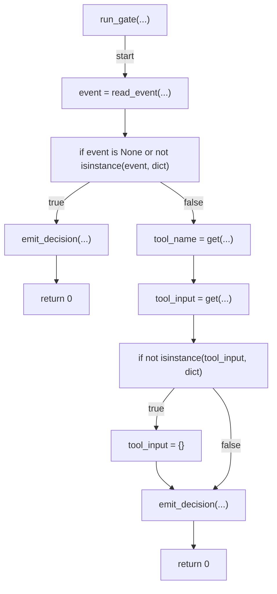
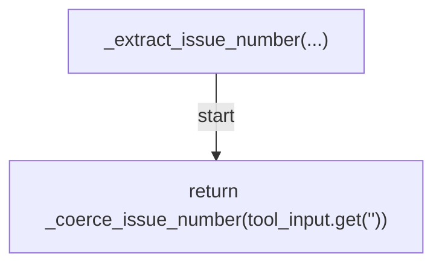
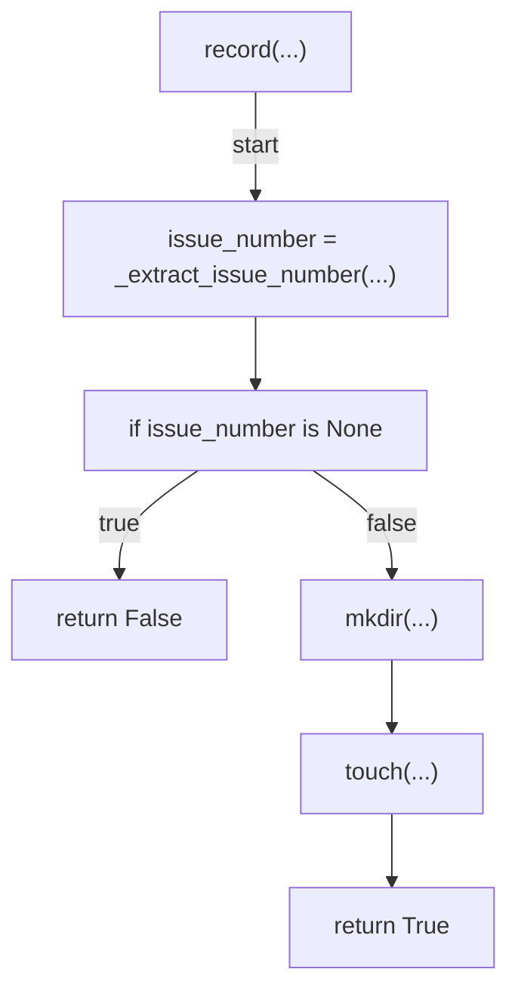
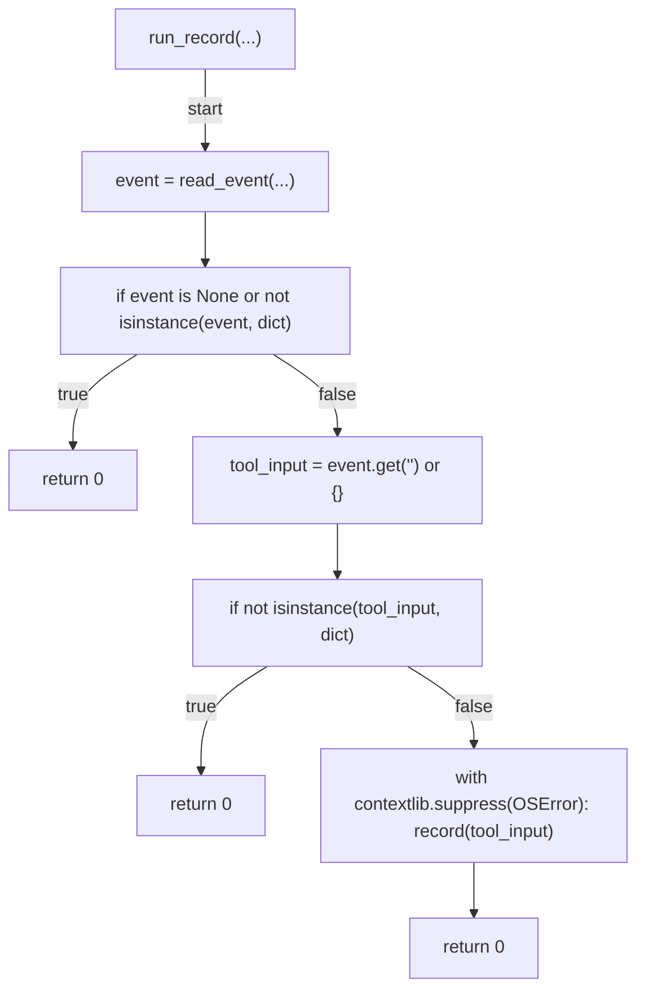
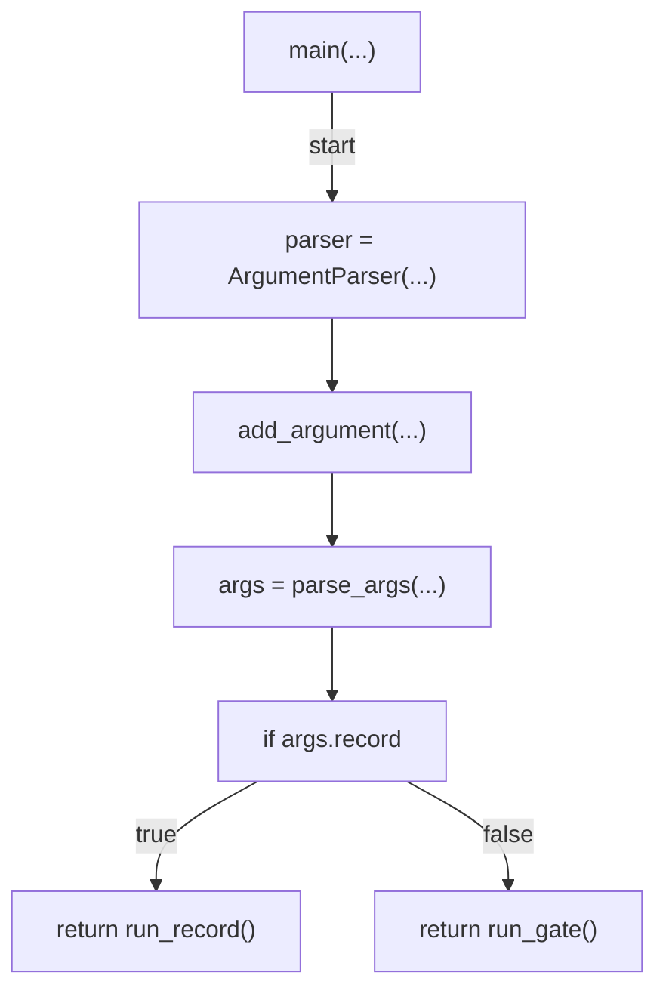

# AST graph: scripts/gate_issue_close_comment.py

This file is generated from `scripts/gate_issue_close_comment.py` by `python3 scripts/script_ast_graph.py all-doc`. Do not edit it by hand: content under `docs/generated/scripts/` is owned by the post-merge automation (refs #1540); update the source script instead.

## _marker_path(...)

## _deny(...)

## _coerce_issue_number(...)

## _is_close_action(...)

## decide(...)

## run_gate(...)

## _extract_issue_number(...)

## record(...)

## run_record(...)

## main(...)

